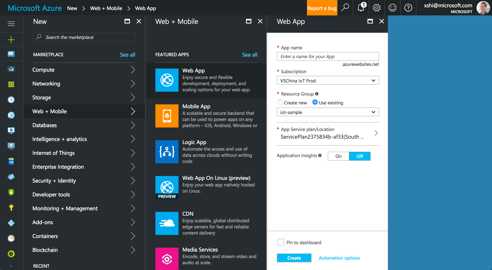
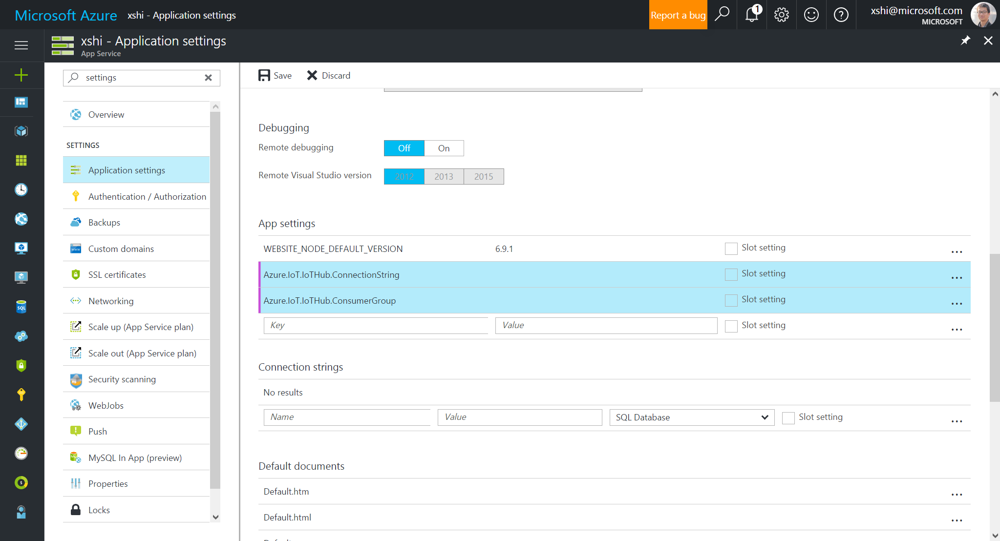
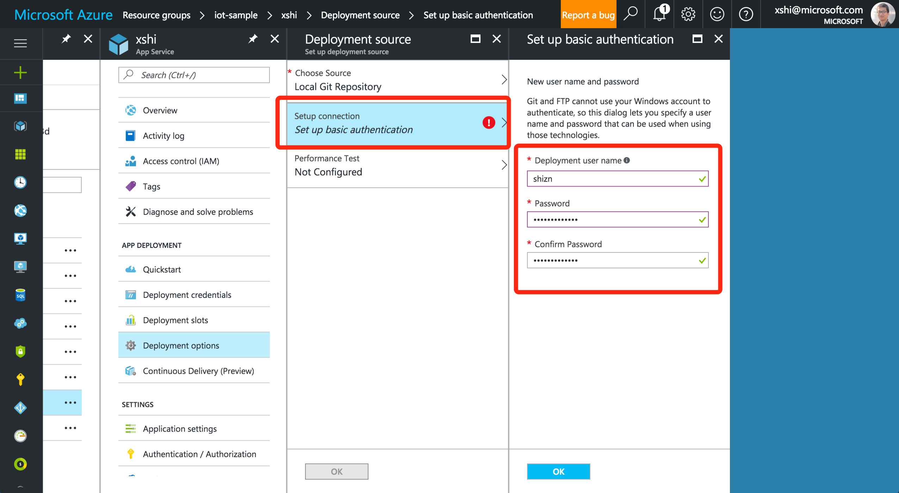
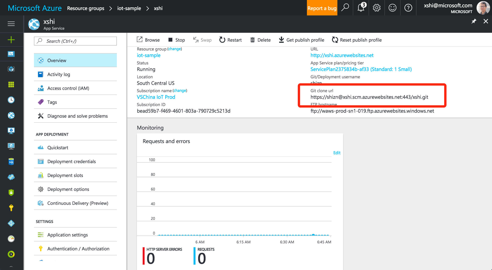
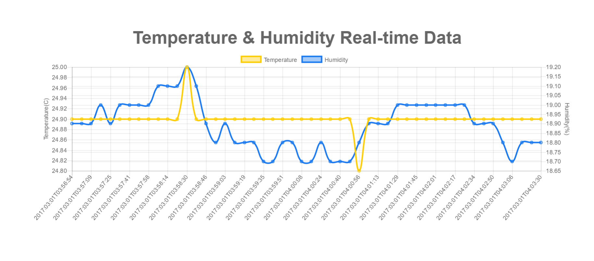

# 使用 Azure Web 应用可视化 Azure IoT 中心的实时传感器数据
<a id="visualize-real-time-sensor-data-from-azure-iot-hub-using-azure-web-apps" class="xliff"></a>


[!INCLUDE [iot-hub-get-started-note](../../includes/iot-hub-get-started-note.md)]

## 学习内容
<a id="what-you-learn" class="xliff"></a>

本课程讲解如何通过运行一个托管在 Azure Web 应用上的 Web 应用程序来可视化 Azure IoT 中心接收的实时传感器数据。 如果你想要尝试使用 Power BI 可视化 IoT 中心的数据，请参阅[使用 Power BI 可视化 Azure IoT 中心的实时传感器数据](iot-hub-live-data-visualization-in-power-bi.md)。

## 准备工作
<a id="what-you-do" class="xliff"></a>

- 在 Azure 门户中创建一个 Azure Web 应用。
- 添加一个使用者组，让 IoT 中心做好数据访问准备。
- 将 Web 应用配置为从 IoT 中心读取传感器数据。
- 上传要在 Web 应用中托管的 Web 应用程序。
- 打开该 Web 应用，查看 IoT 中心的实时温度和湿度数据。

## 需要什么
<a id="what-you-need" class="xliff"></a>

- 已完成教程[设置设备](./iot-hub-raspberry-pi-kit-node-get-started.md)，其中涵盖以下要求：
  - 一个有效的 Azure 订阅。
  - 已在订阅中创建一个 Azure IoT 中心。
  - 一个可向 Azure IoT 中心发送消息的客户端应用程序。
- Git。 （[下载 Git](https://www.git-scm.com/downloads)）。

## 创建 Azure Web 应用
<a id="create-an-azure-web-app" class="xliff"></a>

1. 在 [Azure 门户](https://portal.azure.cn/)中，单击“新建” > “Web + 移动” > “Web 应用”。
1. 输入唯一的作业名称，验证订阅，指定资源组和位置，选择“固定到仪表板”，然后单击“创建”。

   建议选择资源组所在的同一位置。 这有助于加快处理速度，降低数据传输费用。

   

[!INCLUDE [iot-hub-get-started-create-consumer-group](../../includes/iot-hub-get-started-create-consumer-group.md)]

## 将 Web 应用配置为从 IoT 中心读取数据
<a id="configure-the-web-app-to-read-data-from-your-iot-hub" class="xliff"></a>

1. 打开刚刚预配的 Web 应用。
1. 单击“应用程序设置”，然后在“应用设置”下面添加以下键/值对：

   | 键                                   | 值                                                        |
   |---------------------------------------|--------------------------------------------------------------|
   | Azure.IoT.IoTHub.ConnectionString     | 从 iothub-explorer 获取                                |
   | Azure.IoT.IoTHub.DeviceId             | 从 iothub-explorer 获取                                |
   | Azure.IoT.IoTHub.ConsumerGroup        | 添加到 IoT 中心的使用者组的名称  |

   

1. 在“应用程序设置”中的“常规设置”下，切换“Web 套接字”选项。 在移到下一步前，请保存所有更改。

   

## 上传要在 Web 应用中托管的 Web 应用程序
<a id="upload-a-web-application-to-be-hosted-by-the-web-app" class="xliff"></a>

我们在 GitHub 中提供了一个 Web 应用程序，它可以显示 IoT 中心的实时传感器数据。 你只需将 Web 应用配置为使用 Git 存储库，从 GitHub 下载该 Web 应用程序，然后将它上传到 Azure，以便在 Web 应用中托管。

1. 在 Web 应用中，单击“部署选项” > “选择源” > “本地 Git 存储库”。

   

1. 单击“设置连接”，创建用于连接到 Azure 中 Git 存储库的用户名和密码，然后单击“确定”。

   

1. 单击“确定”完成配置。
1. 单击“概述”并记下“Git 克隆 URL”的值。

   

1. 在本地计算机上打开命令提示符或终端窗口。
1. 从 GitHub 下载 Web 应用程序并将它上传到 Azure，以便在 Web 应用中托管。 为此，请运行以下命令：

   ```bash
   git clone https://github.com/Azure-Samples/web-apps-node-iot-hub-data-visualization.git
   cd web-apps-node-iot-hub-data-visualization
   git remote add webapp <Git clone URL>
   git push webapp master:master
   ```

   > [!Note]
   > “Git 克隆 URL”是 Web 应用的“概述”页中显示的 Git 存储库的 URL。\<\>

## 打开该 Web 应用，查看 IoT 中心的实时温度和湿度数据
<a id="open-the-web-app-to-see-real-time-temperature-and-humidity-data-from-your-iot-hub" class="xliff"></a>

在 Web 应用的“概述”页上，单击 URL 打开 Web 应用。


此时应会看到 IoT 中心的实时温度和湿度数据。



## 后续步骤
<a id="next-steps" class="xliff"></a>
现已成功使用 Azure Web 应用将 Azure IoT 中心的实时传感器数据可视化。

还可以通过另一种方法可视化 Azure IoT 中心的数据。 请参阅[使用 Power BI 可视化 Azure IoT 中心的实时传感器数据](./iot-hub-live-data-visualization-in-power-bi.md)。

[!INCLUDE [iot-hub-get-started-next-steps](../../includes/iot-hub-get-started-next-steps.md)]