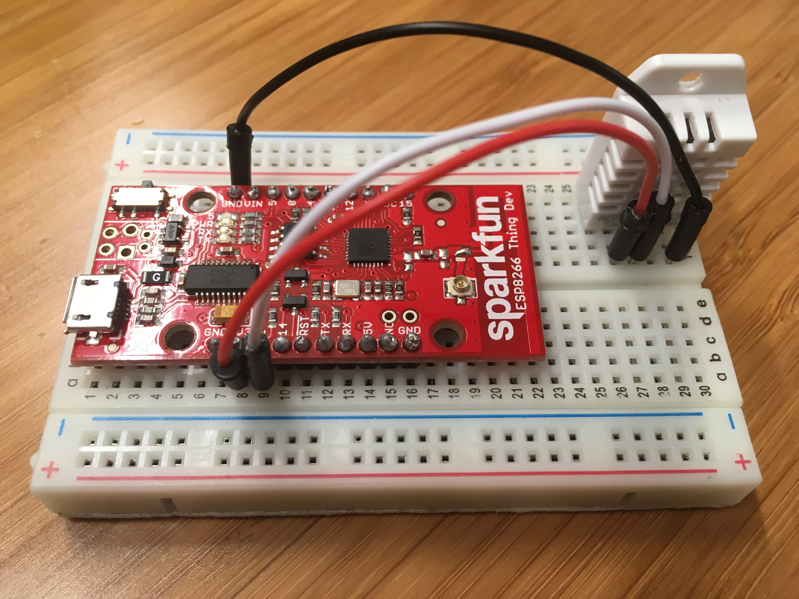
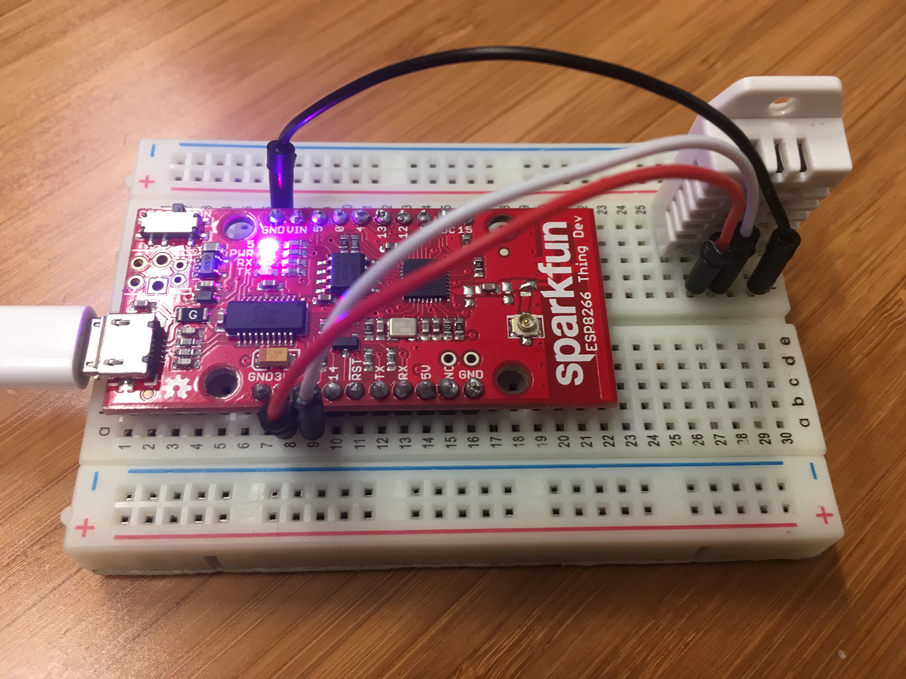
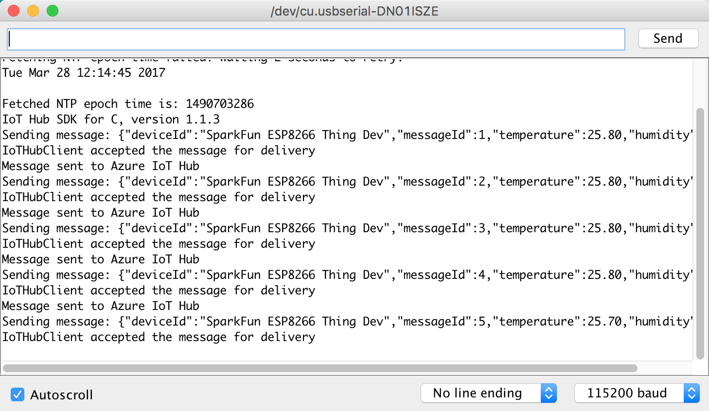

# <a name="connect-sparkfun-esp8266-thing-dev-to-azure-iot-hub-in-the-cloud"></a>将 Sparkfun ESP8266 Thing Dev 连接到云中的 Azure IoT 中心

[!INCLUDE [iot-hub-get-started-device-selector](../../includes/iot-hub-get-started-device-selector.md)]


## <a name="what-you-will-do"></a>执行的操作

将 Sparkfun ESP8266 Thing Dev 连接到要创建的 IoT 中心。 然后，在 ESP8266 上运行一个示例应用程序，用于从 DHT22 传感器收集温度和湿度数据。 最后，将传感器数据发送到 IoT 中心。

> [!NOTE]
> 如果使用其他 ESP8266 开发板，仍可遵循这些步骤将它连接到 IoT 中心。 根据所用的 ESP8266 开发板，可能需要重新配置 `LED_PIN`。 例如，如果使用 AI-Thinker 提供的 ESP8266，可将此参数从 `0` 更改为 `2`。 没有工具包？请单击[此处](https://docs.azure.cn/zh-cn/develop/iot/iot-starter-kits)

## <a name="what-you-will-learn"></a>要学习的知识

* 如何创建 IoT 中心以及注册 Thing Dev 的设备。
* 如何将 Thing Dev 与传感器和计算机相连接。
* 如何在 Thing Dev 上运行示例应用程序来收集传感器数据。
* 如何将传感器数据发送到 IoT 中心。

## <a name="what-you-will-need"></a>所需的项目


若要完成此操作，需要使用 Thing Dev 初学者工具包中的以下部件：

* Sparkfun ESP8266 Thing Dev 开发板。
* Micro USB 转 Type A USB 线缆。

还需要为开发环境做好以下准备：

* 一个有效的 Azure 订阅。 如果没有 Azure 帐户，只需花费几分钟就能[创建一个 Azure 试用帐户](https://www.azure.cn/pricing/1rmb-trial/)。
* 运行 Windows 或 Ubuntu 的 Mac 或 PC。
* Sparkfun ESP8266 Thing Dev 要连接到的无线网络。
* 建立 Internet 连接，以便下载配置工具。
* [Arduino IDE](https://www.arduino.cc/en/main/software) 版本 1.6.8（或更高版本），早期版本不适用于 AzureIoT 库。

如果没有传感器，以下各项是可选的。 也可以使用模拟的传感器数据。

* Adafruit DHT22 温度和湿度传感器。
* 试验板。
* M/M 跳线。

[!INCLUDE [iot-hub-get-started-create-hub-and-device](../../includes/iot-hub-get-started-create-hub-and-device.md)]

## <a name="connect-esp8266-thing-dev-with-the-sensor-and-your-computer"></a>将 ESP8266 Thing Dev 与传感器和计算机相连接

### <a name="connect-a-dht22-temperature-and-humidity-sensor-to-esp8266-thing-dev"></a>将 DHT22 温度和湿度传感器连接到 ESP8266 Thing Dev

按如下所示，使用试验板和跳线建立连接。 如果没有传感器，请跳过本部分，因为可以改用模拟的传感器数据。


我们使用以下传感器引脚连线方式：

| 启动（传感器）           | 结束（开发板）           | 线缆颜色   |
| -----------------------  | ---------------------- | ------------: |
| VDD（引脚 27F）            | 3V（引脚 8A）           | 红线     |
| DATA（引脚 28F）           | GPIO 2（引脚 9A）       | 白线    |
| GND（引脚 30F）            | GND（引脚 7J）          | 黑线   |


- 有关详细信息，请参阅：[DHT22 传感器设置](http://cdn.sparkfun.com/datasheets/Sensors/Weather/RHT03.pdf)和 [Sparkfun ESP8266 Thing Dev 规范](https://www.sparkfun.com/products/13711)

现在，Sparkfun ESP8266 Thing Dev 应已连接到正常工作的传感器。



### <a name="connect-sparkfun-esp8266-thing-dev-to-your-computer"></a>将 Sparkfun ESP8266 Thing Dev 连接到计算机

按如下所示，使用 Micro USB 转 Type A USB 电缆将 Sparkfun ESP8266 Thing Dev 连接到计算机。



### <a name="add-serial-port-permissions--ubuntu-only"></a>添加串行端口权限 - 仅适用于 Ubuntu

如果使用 Ubuntu，请确保普通用户有权在 Sparkfun ESP8266 Thing Dev 的 USB 端口上操作。 若要为普通用户添加串行端口权限，请执行以下步骤：

1. 在终端中运行以下命令：

   ```bash
   ls -l /dev/ttyUSB*
   ls -l /dev/ttyACM*
   ```

   返回以下输出之一：

   * crw-rw---- 1 root uucp xxxxxxxx
   * crw-rw---- 1 root dialout xxxxxxxx

   请注意，在输出中，`uucp` 或 `dialout` 是 USB 端口的组所有者名称。

1. 运行以下命令，将用户添加到该组中：

   ```bash
   sudo usermod -a -G <group-owner-name> <username>
   ```

   `<group-owner-name>` 是在上一步骤中获取的组所有者名称。 `<username>` 是 Ubuntu 用户名。

1. 从 Ubuntu 中注销，并再次登录，使更改生效。

## <a name="collect-sensor-data-and-send-it-to-your-iot-hub"></a>收集传感器数据并将其发送到 IoT 中心

在本部分，会在 Sparkfun ESP8266 Thing Dev 上部署并运行一个示例应用程序。 该示例应用程序会使 Sparkfun ESP8266 Thing Dev 上的 LED 闪烁，并将从 DHT22 传感器收集的温度和湿度数据发送到 IoT 中心。

### <a name="get-the-sample-application-from-github"></a>从 GitHub 获取示例应用程序

该示例应用程序托管在 GitHub 中。 从 GitHub 中克隆包含该示例应用程序的示例存储库。 若要克隆示例存储库，请执行以下步骤：

1. 打开命令提示符或终端窗口。
1. 转到用于存储示例应用程序的文件夹。
1. 运行以下命令：

   ```bash
   git clone https://github.com/Azure-Samples/iot-hub-SparkFun-ThingDev-client-app.git
   ```

在 Arduino IDE 中安装 Sparkfun ESP8266 Thing Dev 的程序包：

1. 打开存储示例应用程序的文件夹。
1. 在 Arduino IDE 中打开 app 文件夹中的 app.ino 文件。

   

1. 在 Arduino IDE 中，单击“File”（文件） > “Preferences”（首选项）。
1. 在“Preferences”（首选项）对话框中，单击“Additional Boards Manager URLs”（其他 Boards Manager URL）文本框旁边的图标。
1. 在弹出窗口中输入以下 URL，然后单击“OK”（确定）。

   `http://arduino.esp8266.com/stable/package_esp8266com_index.json`

   

1. 在“Preference”（首选项）对话框中，单击“OK”（确定）。
1. 单击“Tools”（工具） > “Board”（开发板） > “Boards Manager”，然后搜索 esp8266。
   应安装 2.2.0 或更高版本的 ESP8266。

   

1. 单击“Tools”（工具） > “Board”（开发板） > “Sparkfun ESP8266 Thing Dev”。

### <a name="install-necessary-libraries"></a>安装所需的库

1. 在 Arduino IDE 中，单击“Sketch” > “Include Library”（包含库） > “Manage Libraries”（管理库）。
1. 逐个搜索以下库名称。 对于找到的每个库，单击“Install”（安装）。
   * `AzureIoTHub`
   * `AzureIoTUtility`
   * `AzureIoTProtocol_MQTT`
   * `ArduinoJson`
   * `DHT sensor library`
   * `Adafruit Unified Sensor`

### <a name="dont-have-a-real-dht22-sensor"></a>没有真正的 DHT22 传感器？

如果没有真正的 DHT22 传感器，示例应用程序可以模拟温度和湿度数据。 若要让示例应用程序使用模拟的数据，请执行以下步骤：

1. 打开 `app` 文件夹中的 `config.h` 文件。
1. 找到以下代码行并将值从 `false` 更改为 `true`：
   ```c
   define SIMULATED_DATA true
   ```
   
   
1. 使用 `Control-s` 保存该文件。

### <a name="deploy-the-sample-application-to-sparkfun-esp8266-thing-dev"></a>将示例应用程序部署到 Sparkfun ESP8266 Thing Dev

1. 在 Arduino IDE 中，单击“Tool”（工具） > “Port”（端口），然后单击 Sparkfun ESP8266 Thing Dev 的串行端口。
1. 单击 “Sketch” > “Upload”（上传），生成示例应用程序并将其部署到 Sparkfun ESP8266 Thing Dev。

> [!Note]
> 如果你使用 macOS，那么可能会在上传期间看到以下消息。 `warning: espcomm_sync failed`,`error: espcomm_open failed`. 请打开终端窗口，然后完成以下操作来解决此问题。
> ```bash
> cd /System/Library/Extensions/IOUSBFamily.kext/Contents/PlugIns
> sudo mv AppleUSBFTDI.kext AppleUSBFTDI.disabled
> sudo touch /System/Library/Extensions
> ```

### <a name="enter-your-credentials"></a>输入凭据

上传成功完成后，请执行以下步骤输入凭据：

1. 在 Arduino IDE 中，单击“Tools”（工具） > “Serial Monitor”（串行监视器）。
1. 在串行监视器窗口的右下角，可以看到两个下拉列表。
1. 在左侧下拉列表中选择“No line ending”（无行尾）。
1. 在右侧下拉列表中选择“115200 baud”（115200 波特率）。
1. 在串行监视器窗口顶部的输入框中输入以下信息（如果系统要求提供），并单击“Send”（发送）。
   * Wi-Fi SSID
   * Wi-Fi 密码
   * 设备连接字符串

> [!Note]
> 凭据信息存储在 Sparkfun ESP8266 Thing Dev 的 EEPROM 中。 如果在 Sparkfun ESP8266 Thing Dev 开发板上单击重置按钮，示例应用程序会询问是否要擦除这些信息。 输入 `Y` 可擦除信息，系统会再次要求提供这些信息。

### <a name="verify-the-sample-application-is-running-successfully"></a>验证示例应用程序是否成功运行

如果串行监视器窗口中显示以下输出并且 Sparkfun ESP8266 Thing Dev 上的 LED 闪烁，则表示示例应用程序已成功运行。



## <a name="next-steps"></a>后续步骤

现已成功将 Sparkfun ESP8266 Thing Dev 连接到 IoT 中心，并将捕获的传感器数据发送到了 IoT 中心。 

[!INCLUDE [iot-hub-get-started-next-steps](../../includes/iot-hub-get-started-next-steps.md)]

<!--Update_Description:update meta properties and wording-->