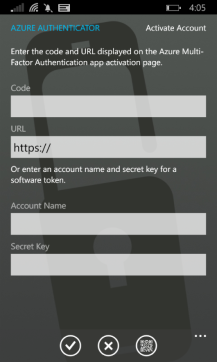
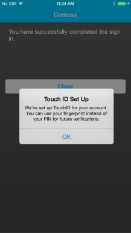

# Microsoft 验证器应用入门
Microsoft Authenticator 应用在 Azure 帐户（例如，bsimon@contoso.partner.onmschina.cn）、本地工作帐户（例如，bsimon@contoso.com）或 Microsoft 帐户（例如，bsimon@outlook.com）中提供附加安全级别。

该应用以下面两种方式之一工作：

- **通知**。 该应用通过将通知推送到智能手机或平板电脑，可帮助防止对帐户进行未经授权的访问，以及停止欺诈性交易。 可以直接查看通知，如果该通知是合法的，则选择“验证” 。 否则，可以选择“拒绝” 。 有关拒绝通知的信息，请参阅“如何针对多重身份验证使用拒绝并报告欺诈功能”。
- **密码及验证码**。 该应用可用作生成 OAuth 验证码所需的软件令牌。 输入用户名和密码后，在登录屏幕中输入该应用提供的代码。 验证码提供了第二种形式的身份验证。

Microsoft 验证器应用将替换 Azure 验证器应用。  可以继续使用 Azure Authenticator 应用，不过，如果决定过渡到新的 Microsoft Authenticator 应用，本文可提供帮助。  

## 安装应用
Microsoft Authenticator 应用可用于 [Windows Phone](http://go.microsoft.com/fwlink/?Linkid=825071)、[Android](http://go.microsoft.com/fwlink/?Linkid=825072) 和 [IOS](http://go.microsoft.com/fwlink/?Linkid=825073)。

## 将帐户添加到应用
对于要添加到 Microsoft Authenticator 应用的每个帐户，使用以下过程之一。

### 将个人 Microsoft 帐户添加到应用

对于个人 Microsoft 帐户（用于登录到 Outlook.com、Xbox、Skype 等的帐户），只需在 Microsoft 验证器应用中登录到你的帐户。

### 使用 QR 码扫描仪将工作或学校帐户添加到应用
1. 转到安全验证设置屏幕。  有关如何访问此屏幕的信息，请参阅[更改安全设置](multi-factor-authentication-end-user-manage-settings.md#where-to-find-the-settings-page)。
2. 选中“Azure 验证器应用”旁边的复选框，然后选择“配置”。

    

    这将显示一个有 QR 码的屏幕。

    
3. 打开 Microsoft Authenticator 应用。 在“帐户”屏幕上，选择 **+**，然后指定要添加工作帐户或学校帐户。
4. 使用相机扫描二维码，然后选择“完成”关闭二维码屏幕。

    如果相机不能正常工作，可以[手动输入 QR 码和 URL](#add-an-account-to-the-app-manually)。

5. 当该应用显示你的帐户名称和其下的六位代码时，你已完成。 

    

### 手动将帐户添加到应用
1. 转到安全验证设置屏幕。  有关如何访问此屏幕的信息，请参阅[更改安全设置](multi-factor-authentication-end-user-manage-settings.md)。
2. 选择“配置” 。

    

    这将显示一个有 QR 码的屏幕。  记下该代码和 URL。

    
3. 打开 Microsoft Authenticator 应用。 在“帐户”屏幕上，选择 **+**，然后指定要添加工作帐户或学校帐户。

4. 在扫描仪中，选择“手动输入代码”。

    
5. 在应用的相应框中输入该代码和 URL，然后选择“完成”。

    

6. 当该应用显示你的帐户名称和其下的六位代码时，你已完成。

    

### 使用 Touch ID 将帐户添加到应用
iOS 上的 Microsoft Authenticator 应用支持 Touch ID。  Azure 多重身份验证允许组织对设备要求提供 PIN。 使用 Touch ID，iOS 用户无需输入 PIN。 而是可以扫描其指纹，然后选择“批准” 。

使用 Microsoft Authenticator 设置 Touch ID 的过程很简单。 已完成使用 PIN 的普通验证问题。 如果设备支持 Touch ID，Microsoft Authenticator 将自动为该帐户设置它。

随后，需要验证登录时，请选择收到的推送通知，并扫描指纹而不是输入 PIN。

