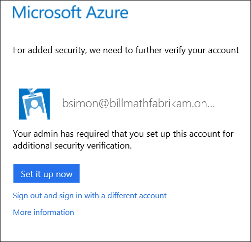
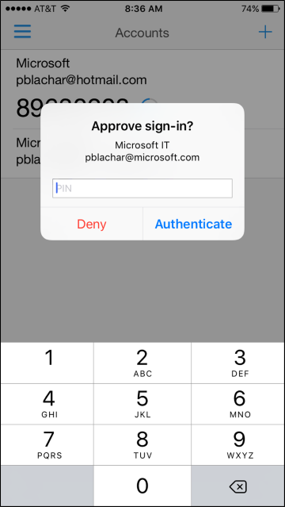

# 将我的帐户设置为使用双重验证
双重验证是一种额外的安全步骤，可使帐户更难被其他人攻破，从而帮助保护帐户。 如果正在阅读本文，可能会收到来自工作或学校管理员的有关多重身份验证的电子邮件。 或者，也许会在尝试登录时收到消息，要求你设置其他安全性验证。 如果是这种情况， **在完成自动注册过程之前将无法登录**。

本文可帮助你设置 **工作或学校帐户**。 如果想为自己的个人 Microsoft 帐户启用双重验证，请参阅 [关于双重验证](https://support.microsoft.com/zh-cn/help/12408/microsoft-account-about-two-step-verification)。

## 确定如何使用多重身份验证
双重验证的工作原理是在登录时提示你输入两条标识。 首先，我们会像往常一样要求你输入用户名和密码。 然后，我们会联系已知的属于你的电话，并确认登录尝试是否合法。  

若要开始设置过程，请尝试按往常的方式登录帐户。 如果管理员已将帐户配置为使用双重验证，系统会提示你开始自动注册过程。 单击“立即设置” 

注册过程中的第一个问题是你希望我们如何与你联系。 查看表中的选项，然后使用相应的链接转到每种方法的设置步骤。

| 联系方法 | 说明 |
| --- | --- |
| [移动应用](#use-a-mobile-app-as-the-contact-method) |- **接收验证通知。** 此选项会将通知推送到智能手机或平板电脑上的验证器应用。 查看通知，如果合法，则在应用中选择“身份验证”。 公司或学校可能要求在身份验证之前，输入 PIN。 - **使用验证码。** 在此模式下，验证器应用生成每隔 30 秒更新一次的验证码。 在登录界面中输入最新验证码。 Microsoft Authenticator 应用可用于 [Windows Phone](http://go.microsoft.com/fwlink/?Linkid=825071)、[Android](http://go.microsoft.com/fwlink/?Linkid=825072) 和 [IOS](http://go.microsoft.com/fwlink/?Linkid=825073)。 |
| [移动电话呼叫或短信](#use-your-mobile-phone-as-the-contact-method) |- **电话呼叫**向已提供的手机号码进行自动语音呼叫。 接听电话，并按电话键盘上的 # 进行身份验证。 - **短信**发送包含验证码的短信。 遵循短信中的提示，回复短信或在登录界面中输入提供的验证码。 |
| [办公电话呼叫](#use-your-office-phone-as-the-contact-method) |向已提供的电话号码进行自动语音呼叫。 接听电话并按电话拨号键盘中的 # 进行身份验证。 |

## 使用移动应用作为联系方法
使用此方法要求在手机或平板电脑上安装验证器应用。 本文中的步骤基于 Microsoft Authenticator 应用，该应用可用于 [Windows Phone](http://go.microsoft.com/fwlink/?Linkid=825071)、[Android](http://go.microsoft.com/fwlink/?Linkid=825072) 和 [IOS](http://go.microsoft.com/fwlink/?Linkid=825073)。

1. 从下拉列表中选择“移动应用”。
2. 选择“接收验证通知”或“使用验证码”，然后选择“设置”。

    
3. 在手机或平板电脑上，打开应用并选择 **+** 来添加帐户。 （在 Android 设备上，选择三个点图标，然后选择“添加帐户”。）
4. 指定要添加工作帐户或学校帐户。 随即会打开手机上的 QR 码扫描程序。 如果相机未正常工作，可以选择手动输入公司信息。 有关详细信息，请参阅 [手动添加帐户](#add-an-account-manually)。  
5. 扫描与用于配置移动应用的屏幕一起显示的 QR 码图片。  选择“完成”关闭 QR 码屏幕  。  

    
6. 在手机上完成激活后，选择“与我联系” 。  此步骤会将通知或验证码发送到手机。 选择“验证” 。  
7. 如果公司需要 PIN 才能批准登录验证，请输入它。

    
8. 完成 PIN 条目后，选择“关闭” 。 此时，验证应已成功。
9. 建议输入手机号码，以免无法访问移动应用。 通过下拉列表指定国家/地区，然后在国家/地区名称旁边的框中输入手机号码。 选择“**下一步**”。
10. 单击“Done”（完成） 。

### 手动添加帐户
如果想要手动将帐户添加到移动应用，请按照下列步骤操作，而不要使用 QR 读取器。

1. 选择“手动输入帐户”  按钮。  
2. 输入显示条形码的同一页面上所提供的代码和 URL。 此信息将填入移动应用上的“代码”和“URL”框中。

    
3. 激活完成后，选择“与我联系” 。 此步骤会将通知或验证码发送到手机。 选择“验证” 。

## 使用移动电话作为联系方法
1. 从下拉列表中选择“身份验证电话”  。  

      
2. 从下拉列表中选择国家/地区，然后输入手机号码。
3. 选择想要使用移动电话的方法 - 短信或呼叫。
4. 选择“与我联系”  以验证电话号码。 根据所选的模式，我们会发送短信或拨打电话。 按照屏幕上提供的说明，选择“验证” 。
5. 单击“Done”（完成） 。

## 使用办公电话作为联系方法
1. 从下拉列表中选择“办公电话”   

      
2. 会使用公司联系人信息自动填充电话号码框。 如果号码错误或丢失，请联系管理员进行更改。
3. 选择“联系我”验证电话号码，我们将拨打该号码。 按照屏幕上提供的说明，选择“验证” 。
4. 单击“Done”（完成） 。

## 后续步骤
- 更改首选项和[管理双重验证设置](multi-factor-authentication-end-user-manage-settings.md)
- 使用 [Microsoft Authenticator 应用](microsoft-authenticator-app-how-to.md)完成快速、安全的身份验证（即使没有手机网络服务）。

