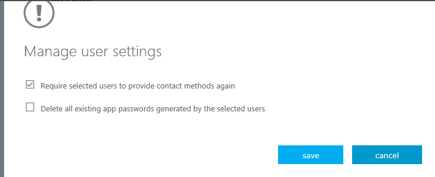
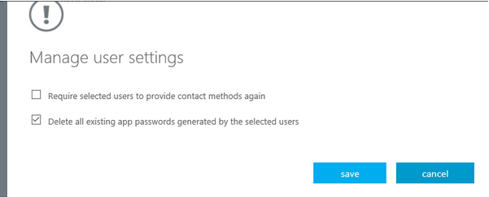

# 管理云中 Azure 多重身份验证的用户设置
作为管理员，可以管理以下用户和设备设置：

- 要求用户再次提供联系方法
- 删除应用密码

## 要求用户再次提供联系方法
此项设置强制用户再次完成注册过程。 如果用户为应用设置了密码，则非浏览器应用将继续工作。  也可以通过选择“删除选定用户生成的所有现有应用密码”删除用户的应用密码。

### 如何要求用户再次提供联系方法
1. 登录到 [Azure 门户](https://portal.azure.cn)。
2. 在左侧，选择“Azure Active Directory” > “用户和组” > “所有用户”。
3. 选择“多重身份验证”。 多重身份验证页面将打开。 
4. 选中要管理的用户或用户旁的框。 右侧将显示快速步骤选项列表。 
5. 选择“管理用户设置”。
6. 选中“要求选定用户重新提供的联系方式”框。
   
7. 单击“保存”。
8. 单击“关闭”。

## 删除用户现有的应用密码
此设置会删除用户创建的所有应用密码。 与这些应用密码关联的非浏览器应用将会停止工作，直到创建新应用密码为止。

### 如何删除用户现有的应用密码
1. 登录到 [Azure 门户](https://portal.azure.cn)。
2. 在左侧，选择“Azure Active Directory” > “用户和组” > “所有用户”。
3. 选择“多重身份验证”。 多重身份验证页面将打开。 
6. 选中要管理的用户或用户旁的框。 右侧将显示快速步骤选项列表。 
7. 选择“管理用户设置”。
8. 选中“删除选定用户生产的所有现有应用密码”框。
   
9. 单击“保存”。
10. 单击“关闭”。

## 后续步骤

- 获取有关如何[配置 Azure 多重身份验证设置](multi-factor-authentication-whats-next.md)的详细信息

- 如果用户需要帮助，可让其参阅[双重验证用户指南](./end-user/multi-factor-authentication-end-user.md)

<!-- Update_Description: wording update -->