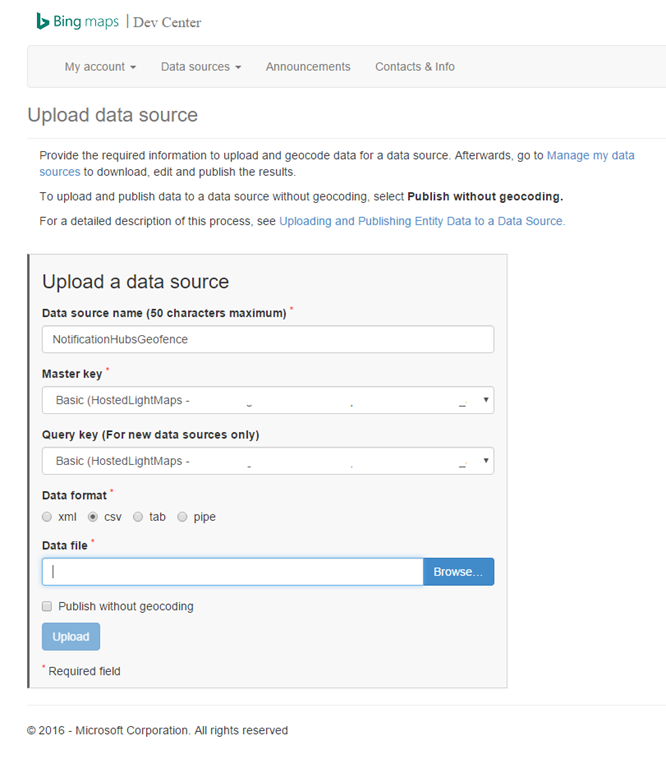
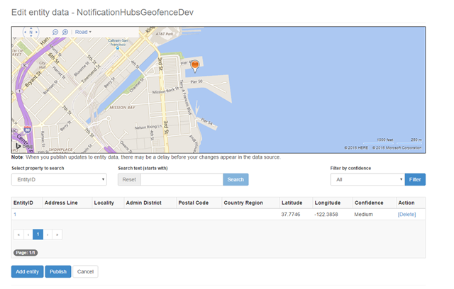
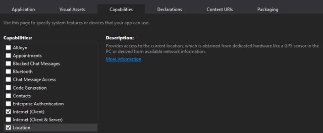
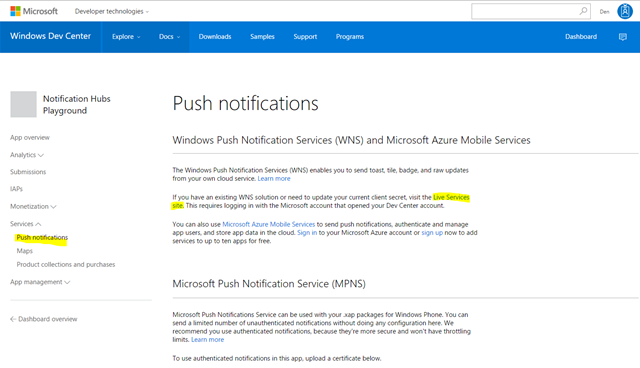
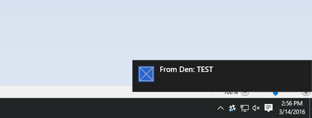

# 使用 Azure 通知中心和必应空间数据发送地域隔离的推送通知

 > [!NOTE]
 > 若要完成本教程，你必须有一个有效的 Azure 帐户。如果你没有帐户，只需花费几分钟就能创建一个试用帐户。有关详细信息，请参阅 [Azure 试用](https://www.azure.cn/pricing/1rmb-trial/?WT.mc_id=A0E0E5C02/)。

在本教程中，你将学习如何从通用 Windows 平台应用程序，使用 Azure 通知中心和必应空间数据来传送基于位置的推送通知。

##先决条件
首先，需要确保满足所有的软件和服务先决条件：

* [Visual Studio 2015 Update 1](https://www.visualstudio.com/zh-cn/downloads/download-visual-studio-vs.aspx) 或更高版本（[Community Edition](https://go.microsoft.com/fwlink/?LinkId=691978&clcid=0x409) 也行）。 
* 最新版本的 [Azure SDK](https://azure.microsoft.com/downloads/)。 
* [必应地图开发人员中心帐户](https://www.bingmapsportal.com/)（你可以免费创建一个帐户并将此帐户与 Microsoft 帐户相关联）。 

##入门

首先，让我们创建项目。在 Visual Studio 中，启动“空白应用(通用 Windows)”类型的新项目。


完成创建项目之后，你应该可以控制应用本身。现在让我们完成地域隔离基础结构所需的各项设置。由于我们要使用必应服务来完成此操作，可以使用公共 REST API 终结点来查询特定的位置框架：

```
http://spatial.virtualearth.net/REST/v1/data/
```

需要指定以下参数才能让终结点正常工作：

* **数据源 ID** 和**数据源名称** – 在必应地图 API 中，数据源包含各种分门别类的元数据，例如营业地点和营业时间。你可以在此了解其相关信息。 
* **实体名称** – 要用作通知参照点的实体。 
* **必应地图 API 密钥** – 这是前面创建必应开发人员中心帐户时获取的密钥。

接下来，让我们深入了解上述各个元素的设置。

##设置数据源

可以在必应地图开发人员中心进行此设置。只需单击顶部导航栏中的“数据源”，然后选择“管理数据源”。


如果你以前未曾用过必应地图 API，里面很可能不会有任何数据源，因此你可以直接单击“将数据上载到数据源”来创建新的数据源。请确保填写所有必填字段：



你可能想要知道什么是数据文件，以及应该上载哪些数据？ 对于本次测试，我们可以直接使用框住旧金山海滨区域的管状示例：

```
Bing Spatial Data Services, 1.0, TestBoundaries
EntityID(Edm.String,primaryKey)|Name(Edm.String)|Longitude(Edm.Double)|Latitude(Edm.Double)|Boundary(Edm.Geography)
1|SanFranciscoPier|||POLYGON ((-122.389825 37.776598,-122.389438 37.773087,-122.381885 37.771849,-122.382186 37.777022,-122.389825 37.776598))
```

上述代码中显示了以下实体：


只需复制上述字符串并粘贴到新文件，将文件另存为 **NotificationHubsGeofence.pipe**，然后将它上载到必应开发人员中心。

>[!NOTE]
>系统可能会提示你为“主密钥”指定不同于“查询密钥”的新密钥。只需通过仪表板创建新密钥，然后刷新数据源上载页。

上载数据文件后，需确保发布数据源。

如前所述转到“管理数据源”，在列表中找到数据源，然后单击“操作”列中的“发布”。片刻之后，你应该能够在“已发布的数据源”选项卡中看到该数据源：


如果你单击“编辑”，即可看到我们在数据源中引入的所有位置：



此时，门户并未显示我们创建的地域隔离区的边界 - 我们只需确认指定的位置位于适当区域内。

现在你已满足数据源的所有要求。若要获取有关 API 调用的请求 URL 的详细信息，请在必应地图开发人员中心单击“数据源”，然后选择“数据源信息”。


在此处，我们要查找的是“查询 URL”。我们可以针对终结点执行查询，以检查设备目前是否在某个位置的边界内。若要执行此检查，只需针对查询 URL 执行 GET 调用并附加以下参数：

```
?spatialFilter=intersects(%27POINT%20LONGITUDE%20LATITUDE)%27)&$format=json&key=QUERY_KEY
```

这样就会指定取自设备的目标位置点，并且必应地图将自动执行计算，以确定设备是否位于地域隔离区内。通过浏览器（或 cURL）执行请求后，你将收到标准的 JSON 响应：


仅当位置点确实位于指定边界内时，才出现此响应。如果不在边界内，你将收到空白的 **results** 桶：


##设置 UWP 应用程序

现在我们已准备好数据源，接下来我们可以开始操作前面引导的 UWP 应用程序。

首先，我们必须启用应用程序的位置服务。为此，请在“解决方案资源管理器”中双击 `Package.appxmanifest` 文件。


在刚刚打开的“包属性”选项卡中单击“功能”，并确保选择“位置”：



由于已声明位置功能，请在解决方案中创建名为 `Core` 的新文件夹，并在其中添加名为 `LocationHelper.cs` 的新文件：


目前，`LocationHelper` 类本身的作用相当简单 - 只是让我们通过系统 API 获取用户位置：

```
using System;
using System.Threading.Tasks;
using Windows.Devices.Geolocation;

namespace NotificationHubs.Geofence.Core
{
    public class LocationHelper
    {
        private static readonly uint AppDesiredAccuracyInMeters = 10;

        public async static Task<Geoposition> GetCurrentLocation()
        {
            var accessStatus = await Geolocator.RequestAccessAsync();
            switch (accessStatus)
            {
                case GeolocationAccessStatus.Allowed:
                    {
                        Geolocator geolocator = new Geolocator { DesiredAccuracyInMeters = AppDesiredAccuracyInMeters };

                        return await geolocator.GetGeopositionAsync();
                    }
                default:
                    {
                        return null;
                    }
            }
        }

    }
}
```

若想详细了解如何在 UWP 应用中获取用户位置，请参阅官方 [MSDN 文档](https://msdn.microsoft.com/zh-cn/library/windows/apps/mt219698.aspx)。

若要检查是否确实能够获取位置，请打开主页的代码端 (`MainPage.xaml.cs`)。在 `MainPage` 构造函数中为 `Loaded` 事件创建新的事件处理程序：

```
public MainPage()
{
    this.InitializeComponent();
    this.Loaded += MainPage_Loaded;
}
```

该事件处理程序的实现如下：

```
private async void MainPage_Loaded(object sender, RoutedEventArgs e)
{
    var location = await LocationHelper.GetCurrentLocation();

    if (location != null)
    {
        Debug.WriteLine(string.Concat(location.Coordinate.Longitude,
            " ", location.Coordinate.Latitude));
    }
}
```

请注意，我们已将处理程序声明为异步，原因是 `GetCurrentLocation` 可等待，因此需要以异步方式执行。此外，由于在某些情况下我们可能会得到 null 位置（例如位置服务已禁用或应用程序访问位置的权限被拒绝），因此我们需要确保使用 null 检查进行适当的处理。

运行应用程序。请确保允许访问位置：


启动应用程序后，你应该可以在“输出”窗口中看到坐标：


现在你已知道能够正常获取位置 - 接下来可以放心删除 Loaded 的测试事件处理程序，因为我们不再会用到它。

下一步是捕获位置更改。为此，让我们返回到 `LocationHelper` 类，并添加 `PositionChanged` 的事件处理程序：

```
geolocator.PositionChanged += Geolocator_PositionChanged;
```

实现将在“输出”窗口中显示位置坐标：

```
private static async void Geolocator_PositionChanged(Geolocator sender, PositionChangedEventArgs args)
{
    await CoreApplication.MainView.CoreWindow.Dispatcher.RunAsync(CoreDispatcherPriority.Normal, () =>
    {
        Debug.WriteLine(string.Concat(args.Position.Coordinate.Longitude, " ", args.Position.Coordinate.Latitude));
    });
}
```

##设置后端

[从 GitHub 下载 .NET 后端示例](https://github.com/Azure/azure-notificationhubs-samples/tree/master/dotnet/NotifyUsers)。下载完成后，打开 `NotifyUsers` 文件夹，然后打开 `NotifyUsers.sln` 文件。

将 `AppBackend` 项目设置为“启始项目”并将它启动。


项目已配置为将推送通知发送到目标设备，因此我们只需要做两件事：换出通知中心的适当连接字符串，并添加边界标识以便仅当用户位于地域隔离区内时才发送通知。

若要配置连接字符串，请打开 `Models` 文件夹中的 `Notifications.cs`。`NotificationHubClient.CreateClientFromConnectionString` 函数应该包含可在 [Azure 门户](https://portal.azure.cn)中获取的通知中心的相关信息（查看“设置”中的“访问策略”边栏选项卡）。保存更新的配置文件。

现在，我们需要为必应地图 API 结果创建模型。执行此操作的最简单方法是右键单击 `Models` 文件夹，然后选择“添加”>“类”。将它命名为 `GeofenceBoundary.cs`。完成后，通过我们在第一部分中所述的 API 响应复制 JSON，然后在 Visual Studio 中使用“编辑”>“选择性粘贴”>“将 JSON 粘贴为类”。

这样，我们就能确保对象将完全按预期反序列化。生成的类集应类似于下面：

```
namespace AppBackend.Models
{
    public class Rootobject
    {
        public D d { get; set; }
    }

    public class D
    {
        public string __copyright { get; set; }
        public Result[] results { get; set; }
    }

    public class Result
    {
        public __Metadata __metadata { get; set; }
        public string EntityID { get; set; }
        public string Name { get; set; }
        public float Longitude { get; set; }
        public float Latitude { get; set; }
        public string Boundary { get; set; }
        public string Confidence { get; set; }
        public string Locality { get; set; }
        public string AddressLine { get; set; }
        public string AdminDistrict { get; set; }
        public string CountryRegion { get; set; }
        public string PostalCode { get; set; }
    }

    public class __Metadata
    {
        public string uri { get; set; }
    }
}
```

接下来，打开 `Controllers` > `NotificationsController.cs`。我们需要调整 Post 调用以说明目标经度和纬度。为此，只需将以下两个字符串添加到函数签名：`latitude` 和 `longitude`。

```
public async Task<HttpResponseMessage> Post(string pns, [FromBody]string message, string to_tag, string latitude, string longitude)
```

在名为 `ApiHelper.cs` 的项目中创建一个新类，我们将使用它来连接到必应，以检查位置点边界的交叉点。按如下所示实现 `IsPointWithinBounds` 函数：

```
public class ApiHelper
{
    public static readonly string ApiEndpoint = "{YOUR_QUERY_ENDPOINT}?spatialFilter=intersects(%27POINT%20({0}%20{1})%27)&$format=json&key={2}";
    public static readonly string ApiKey = "{YOUR_API_KEY}";

    public static bool IsPointWithinBounds(string longitude,string latitude)
    {
        var json = new WebClient().DownloadString(string.Format(ApiEndpoint, longitude, latitude, ApiKey));
        var result = JsonConvert.DeserializeObject<Rootobject>(json);
        if (result.d.results != null && result.d.results.Count() > 0)
        {
            return true;
        }
        else
        {
            return false;
        }
    }
}
```

>[!NOTE]
> 请务必将 API 终结点替换为前面从必应开发人员中心获取的查询 URL（这一点同样适用于 API 密钥）。

如果查询返回了结果，则表示指定位置点位于地域隔离边界内，因此返回 `true`。如果未返回结果，必应将告诉我们位置点位于查找框架外部，因此返回 `false`。

回到 `NotificationsController.cs`，在 switch 语句前面创建检查：

```
if (ApiHelper.IsPointWithinBounds(longitude, latitude))
{
    switch (pns.ToLower())
    {
        case "wns":
            //// Windows 8.1 / Windows Phone 8.1
            var toast = @"<toast><visual><binding template=""ToastText01""><text id=""1"">" +
                        "From " + user + ": " + message + "</text></binding></visual></toast>";
            outcome = await Notifications.Instance.Hub.SendWindowsNativeNotificationAsync(toast, userTag);

            // Windows 10 specific Action Center support
            toast = @"<toast><visual><binding template=""ToastGeneric""><text id=""1"">" +
                        "From " + user + ": " + message + "</text></binding></visual></toast>";
            outcome = await Notifications.Instance.Hub.SendWindowsNativeNotificationAsync(toast, userTag);

            break;
    }
}
```

这样，仅当位置点位于边界内时才发送通知。

##在 UWP 应用中测试推送通知

回到 UWP 应用，现在我们应该可以测试通知。在 `LocationHelper` 类中创建新函数 `SendLocationToBackend`：

```
public static async Task SendLocationToBackend(string pns, string userTag, string message, string latitude, string longitude)
{
    var POST_URL = "http://localhost:8741/api/notifications?pns=" +
        pns + "&to_tag=" + userTag + "&latitude=" + latitude + "&longitude=" + longitude;

    using (var httpClient = new HttpClient())
    {
        try
        {
            await httpClient.PostAsync(POST_URL, new StringContent(""" + message + """,
                System.Text.Encoding.UTF8, "application/json"));
        }
        catch (Exception ex)
        {
            Debug.WriteLine(ex.Message);
        }
    }
}
```

>[!NOTE]
> 将 `POST_URL` 切换为我们在上一部分创建的已部署 Web 应用程序的位置。现在，可以在本地运行该应用，但是由于你要着手部署公共版本，因此需要使用一个外部提供程序来托管该应用。

现在，请确保注册 UWP 应用以发送推送通知。在 Visual Studio 中，单击“项目”>“应用商店”>“将应用与应用商店关联”。


登录到你的开发人员帐户后，请务必选择现有应用或创建新应用，并让包与它相关联。

转到开发人员中心，然后打开刚刚创建的应用。单击“服务”>“推送通知”>“Live 服务站点”。



单击“保存”。

在“解决方案资源管理器”中右键单击“引用”，然后选择“管理 NuGet 包”。我们需要添加对 **Azure 服务总线托管库**的引用 - 只需搜索 `WindowsAzure.Messaging.Managed` 并将它添加到项目即可。


为了进行测试，我们可以再次创建 `MainPage_Loaded` 事件处理程序，并在其中添加以下代码段：

```
var channel = await PushNotificationChannelManager.CreatePushNotificationChannelForApplicationAsync();

var hub = new NotificationHub("HUB_NAME", "HUB_LISTEN_CONNECTION_STRING");
var result = await hub.RegisterNativeAsync(channel.Uri);

// Displays the registration ID so you know it was successful
if (result.RegistrationId != null)
{
    Debug.WriteLine("Reg successful.");
}
```

上述代码会将应用注册到通知中心。一切准备就绪！

在 `LocationHelper` 的 `Geolocator_PositionChanged` 处理程序中，可以添加一段测试代码以强制将位置放入地域隔离区：

```
await LocationHelper.SendLocationToBackend("wns", "TEST_USER", "TEST", "37.7746", "-122.3858");
```

由于我们不传递实际坐标（目前可能不在边界内），而是使用预定义的测试值，因此在更新时你看到通知：



##接下来要做什么？

除了上述步骤外，你可能还需要遵循几个步骤来确保解决方案可用于生产环境。

首先，你可能需要确保地域隔离区是动态的。需要对必应 API 进行一些额外的处理，才能在现有数据源内上载新边界。有关该主题的详细信息，请参阅[必应空间数据服务 API 文档](https://msdn.microsoft.com/zh-cn/library/ff701734.aspx)。

其次，由于你要确保向正确的参与者执行传送，因此可以通过[标记](./notification-hubs-tags-segment-push-message.md)来锁定这些人。

上面所示的解决方案描述了一种方案，其中可能有各种不同的目标平台，因此我们并未限制只有系统特定的功能才能使用地域隔离。也就是说，通用 Windows 平台可以提供现成的[地域隔离区检测](https://msdn.microsoft.com/windows/uwp/maps-and-location/set-up-a-geofence)功能。

有关通知中心功能的详细信息，请访问我们的[文档门户](./index.md)。

<!---HONumber=Mooncake_Quality_Review_0104_2017-->