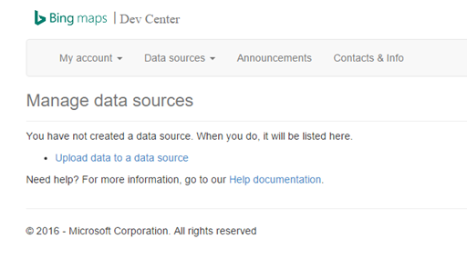
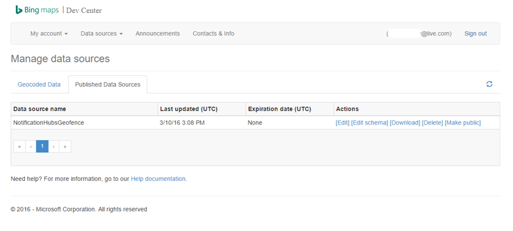
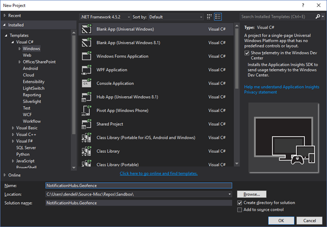
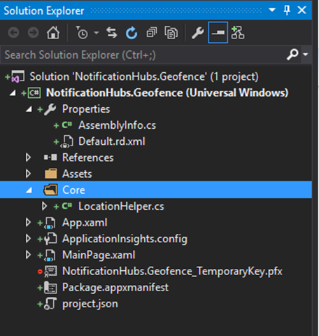
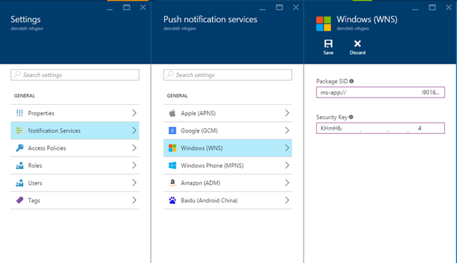

# <a name="tutorial-push-location-based-notifications-with-azure-notification-hubs-and-bing-spatial-data"></a>教程：使用 Azure 通知中心和必应空间数据推送基于位置的通知
本教程介绍如何使用 Azure 通知中心和必应空间数据来传送基于位置的推送通知。 

在本教程中，我们将执行以下步骤：

> [!div class="checklist"]
> * 设置数据源
> * 设置 UWP 应用程序
> * 设置后端
> * 在通用 Windows 平台 (UWP) 应用中测试推送通知


## <a name="prerequisites"></a>先决条件

- **Azure 订阅**。 如果没有 Azure 订阅，请在开始前创建一个[试用帐户](https://www.azure.cn/pricing/1rmb-trial/)。
- [Visual Studio 2015 Update 1](https://www.visualstudio.com/downloads/download-visual-studio-vs.aspx) 或更高版本 ([Community Edition](https://go.microsoft.com/fwlink/?LinkId=691978&clcid=0x409))。 
- 最新版本的 [Azure SDK](/downloads/)。 
- [必应地图开发人员中心帐户](https://www.bingmapsportal.com/)（你可以免费创建一个帐户并将此帐户与 Microsoft 帐户相关联）。 

## <a name="set-up-the-data-source"></a>设置数据源

1. 登录到[必应地图开发人员中心](https://www.bingmapsportal.com/)。 
2. 在顶部导航栏中选择“数据源”，然后选择“管理数据源”。 

    
3. 如果你没有数据源，会看到用于创建数据源的链接。 选择“将数据作为数据源上传”。 也可以使用“数据源” > “上传数据”菜单。 

    

4. 在硬盘驱动器上创建包含以下内容的文件 **NotificationHubsGeofence.pipe**：本教程使用基于管道的示例文件框住旧金山海滨区域：

    ```
    Bing Spatial Data Services, 1.0, TestBoundaries
    EntityID(Edm.String,primaryKey)|Name(Edm.String)|Longitude(Edm.Double)|Latitude(Edm.Double)|Boundary(Edm.Geography)
    1|SanFranciscoPier|||POLYGON ((-122.389825 37.776598,-122.389438 37.773087,-122.381885 37.771849,-122.382186 37.777022,-122.389825 37.776598))
    ```

    管道文件表示以下实体：
    
    
5. 在“上传数据源”页中执行以下操作：
   1. 为“数据格式”选择“管道”。
   2. 浏览到在上一步骤中创建的 **NotificationHubGeofence.pipe** 文件并将其选中。 
   3. 选择“上传”按钮。 
    
      > [!NOTE]
      > 系统可能会提示你为“主密钥”指定不同于“查询密钥”的新密钥。 只需通过仪表板创建新密钥，然后刷新数据源上传页。
6. 上传数据文件后，需确保发布数据源。 像前面一样，选择“数据源” -> “管理数据源”。 
7. 在列表中选择自己的数据源，然后在“操作”列中选择“发布”。 

    
8. 切换到“发布数据源”选项卡，确认列表中显示了该数据源。

    

9. 选择“编辑”。 随后会看到数据中引入的位置（概览）。

    

    此时，门户并未显示所创建的地理围栏的边界 - 你只需确认指定的位置位于适当的邻近范围内。
10. 现在你已满足数据源的所有要求。 要获取有关 API 调用的请求 URL 的详细信息，请在必应地图开发人员中心内依次选择“数据源”、“数据源信息”。

     

     “查询 URL”是可对其执行查询的终结点，用于检查设备目前是否在某个位置的边界内。 若要执行此检查，只需针对查询 URL 执行 GET 调用并追加以下参数：

     ```
     ?spatialFilter=intersects(%27POINT%20LONGITUDE%20LATITUDE)%27)&$format=json&key=QUERY_KEY
     ```

     必应地图自动执行计算，以确定设备是否位于地域隔离区内。 通过浏览器（或 cURL）执行请求后，将收到标准 JSON 响应：

     

     仅当位置点确实位于指定边界内时，才出现此响应。 如果不在边界内，将收到空白的 **results** 桶：

     

## <a name="set-up-the-uwp-application"></a>设置 UWP 应用程序

1. 在 Visual Studio 中，启动“空白应用(通用 Windows)”类型的新项目。

    

    完成创建项目之后，应该可以控制应用本身。 现在让我们完成地域隔离基础结构所需的各项设置。 由于我们要使用必应服务来运行此解决方案，因此可以使用公共 REST API 终结点来查询特定的位置框架：

    http://spatial.virtualearth.net/REST/v1/data/

    指定以下参数，使终结点正常工作：

   - **数据源 ID** 和**数据源名称** – 在必应地图 API 中，数据源包含各种分门别类的元数据，例如营业地点和营业时间。  
   - **实体名称** - 要用作通知引用点的实体。 
   - **必应地图 API 密钥** - 前面在创建必应开发人员中心帐户时获取的密钥。

     现在我们已准备好数据源，接下来可以开始操作 UWP 应用程序。
2. 启用应用程序的位置服务。 在“解决方案资源管理器”中打开 `Package.appxmanifest` 文件。

    
3. 在刚刚打开的“包属性”选项卡中切换到“功能”选项卡，然后选择“位置”。

    

4. 在解决方案中创建名为 `Core` 的新文件夹，并在其中添加名为 `LocationHelper.cs` 的新文件：

    

    `LocationHelper` 类包含用于通过系统 API 获取用户位置的代码：

    ```csharp
    using System;
    using System.Threading.Tasks;
    using Windows.Devices.Geolocation;

    namespace NotificationHubs.Geofence.Core
    {
        public class LocationHelper
        {
            private static readonly uint AppDesiredAccuracyInMeters = 10;

            public async static Task<Geoposition> GetCurrentLocation()
            {
                var accessStatus = await Geolocator.RequestAccessAsync();
                switch (accessStatus)
                {
                    case GeolocationAccessStatus.Allowed:
                        {
                            Geolocator geolocator = new Geolocator { DesiredAccuracyInMeters = AppDesiredAccuracyInMeters };

                            return await geolocator.GetGeopositionAsync();
                        }
                    default:
                        {
                            return null;
                        }
                }
            }

        }
    }
    ```

    若想详细了解如何在 UWP 应用中获取用户的位置，请参阅[获取用户的位置](https://msdn.microsoft.com/library/windows/apps/mt219698.aspx)。

5. 若要检查是否确实能够获取位置，请打开主页的代码端 (`MainPage.xaml.cs`)。 在 `MainPage` 构造函数中为 `Loaded` 事件创建新的事件处理程序。

    ```csharp
    public MainPage()
    {
        this.InitializeComponent();
        this.Loaded += MainPage_Loaded;
    }
    ```

    该事件处理程序的实现如下：

    ```csharp
    private async void MainPage_Loaded(object sender, RoutedEventArgs e)
    {
        var location = await LocationHelper.GetCurrentLocation();

        if (location != null)
        {
            Debug.WriteLine(string.Concat(location.Coordinate.Longitude,
                " ", location.Coordinate.Latitude));
        }
    }
    ```
6. 运行应用程序，并允许它访问你的位置。

    
7. 启动应用程序后，应该可以在“输出”窗口中看到坐标：

    

    现在我们已经知道如何获取位置；如果不再需要使用 Loaded 事件处理程序，可将其删除。
8. 下一步是捕获位置更改。 在 `LocationHelper` 类中，添加 `PositionChanged` 的事件处理程序：

    ```csharp
    geolocator.PositionChanged += Geolocator_PositionChanged;
    ```

    实现会在“输出”窗口中显示位置坐标：

    ```csharp
    private static async void Geolocator_PositionChanged(Geolocator sender, PositionChangedEventArgs args)
    {
        await CoreApplication.MainView.CoreWindow.Dispatcher.RunAsync(CoreDispatcherPriority.Normal, () =>
        {
            Debug.WriteLine(string.Concat(args.Position.Coordinate.Longitude, " ", args.Position.Coordinate.Latitude));
        });
    }
    ```

## <a name="set-up-the-backend"></a>设置后端
1. [从 GitHub 下载 .NET 后端示例](https://github.com/Azure/azure-notificationhubs-samples/tree/master/dotnet/NotifyUsers)。 
2. 下载完成后，打开 `NotifyUsers` 文件夹，然后在 Visual Studio 中打开 `NotifyUsers.sln` 文件。 
3. 将 `AppBackend` 项目设置为“启始项目”并将它启动。

    

    项目已配置为将推送通知发送到目标设备，因此你只需做两件事 - 指定通知中心的适当连接字符串并添加边界标识，仅当用户位于地理围栏内时才发送通知。
4. 若要配置连接字符串，请打开 `Models` 文件夹中的 `Notifications.cs`。 `NotificationHubClient.CreateClientFromConnectionString` 函数应该包含可在 [Azure 门户](https://portal.azure.cn)中获取的通知中心的相关信息（查看“设置”中的“访问策略”页）。 保存更新的配置文件。
5. 为必应地图 API 结果创建模型。 执行此操作的最简单方法是打开 `Models` 文件夹，并选择“添加” > “类”。 将它命名为 `GeofenceBoundary.cs`。 完成后，从第一部分获取的 API 响应中复制 JSON。 在 Visual Studio 中使用“编辑” > “选择性粘贴” > “将 JSON 粘贴为类”。 

    这样，就能确保对象完全按预期反序列化。 生成的类集应类似于以下类：

    ```csharp
    namespace AppBackend.Models
    {
        public class Rootobject
        {
            public D d { get; set; }
        }

        public class D
        {
            public string __copyright { get; set; }
            public Result[] results { get; set; }
        }

        public class Result
        {
            public __Metadata __metadata { get; set; }
            public string EntityID { get; set; }
            public string Name { get; set; }
            public float Longitude { get; set; }
            public float Latitude { get; set; }
            public string Boundary { get; set; }
            public string Confidence { get; set; }
            public string Locality { get; set; }
            public string AddressLine { get; set; }
            public string AdminDistrict { get; set; }
            public string CountryRegion { get; set; }
            public string PostalCode { get; set; }
        }

        public class __Metadata
        {
            public string uri { get; set; }
        }
    }
    ```
6. 接下来，打开 `Controllers` > `NotificationsController.cs`。 更新 Post 调用以考虑目标经度和纬度。 为此，只需将以下两个字符串添加到函数签名：`latitude` 和 `longitude`。

    ```csharp
    public async Task<HttpResponseMessage> Post(string pns, [FromBody]string message, string to_tag, string latitude, string longitude)
    ```
7. 在名为 `ApiHelper.cs` 的项目中创建一个新类 - 使用它连接到必应，以检查位置点边界的交叉点。 如以下代码中所示实现 `IsPointWithinBounds` 函数：

    ```csharp
    public class ApiHelper
    {
        public static readonly string ApiEndpoint = "{YOUR_QUERY_ENDPOINT}?spatialFilter=intersects(%27POINT%20({0}%20{1})%27)&$format=json&key={2}";
        public static readonly string ApiKey = "{YOUR_API_KEY}";

        public static bool IsPointWithinBounds(string longitude,string latitude)
        {
            var json = new WebClient().DownloadString(string.Format(ApiEndpoint, longitude, latitude, ApiKey));
            var result = JsonConvert.DeserializeObject<Rootobject>(json);
            if (result.d.results != null && result.d.results.Count() > 0)
            {
                return true;
            }
            else
            {
                return false;
            }
        }
    }
    ```

    > [!IMPORTANT]
    > 请务必将 API 终结点替换为前面从必应开发人员中心获取的查询 URL（这一点同样适用于 API 密钥）。 

    如果查询返回了结果，则表示指定位置点位于地域隔离边界内，因此函数返回了 `true`。 如果未返回结果，必应将告知位置点位于查找框架外部，因此函数返回了 `false`。
8. 在 `NotificationsController.cs` 中的 switch 语句前面创建检查：

    ```csharp
    if (ApiHelper.IsPointWithinBounds(longitude, latitude))
    {
        switch (pns.ToLower())
        {
            case "wns":
                //// Windows 8.1 / Windows Phone 8.1
                var toast = @"<toast><visual><binding template=""ToastText01""><text id=""1"">" +
                            "From " + user + ": " + message + "</text></binding></visual></toast>";
                outcome = await Notifications.Instance.Hub.SendWindowsNativeNotificationAsync(toast, userTag);

                // Windows 10 specific Action Center support
                toast = @"<toast><visual><binding template=""ToastGeneric""><text id=""1"">" +
                            "From " + user + ": " + message + "</text></binding></visual></toast>";
                outcome = await Notifications.Instance.Hub.SendWindowsNativeNotificationAsync(toast, userTag);

                break;
        }
    }
    ```

## <a name="test-push-notifications-in-the-uwp-app"></a>在 UWP 应用中测试推送通知

1. 在 UWP 应用中，现在应该可以测试通知。 在 `LocationHelper` 类中创建一个新函数 - `SendLocationToBackend`：

    ```csharp
    public static async Task SendLocationToBackend(string pns, string userTag, string message, string latitude, string longitude)
    {
        var POST_URL = "http://localhost:8741/api/notifications?pns=" +
            pns + "&to_tag=" + userTag + "&latitude=" + latitude + "&longitude=" + longitude;

        using (var httpClient = new HttpClient())
        {
            try
            {
                await httpClient.PostAsync(POST_URL, new StringContent("\"" + message + "\"",
                    System.Text.Encoding.UTF8, "application/json"));
            }
            catch (Exception ex)
            {
                Debug.WriteLine(ex.Message);
            }
        }
    }
    ```

    > [!NOTE]
    > 将 `POST_URL` 设置为已部署的 Web 应用程序的位置。 现在，可以在本地运行该应用，但是由于要着手部署公共版本，因此需要使用一个外部提供程序来托管该应用。
1. 为推送通知注册 UWP 应用。 在 Visual Studio 中，选择“项目” > “应用商店” > “将应用与应用商店关联”。

    
3. 登录到开发人员帐户后，请务必选择现有应用或创建新应用，并让包与它相关联。 
4. 转到开发人员中心，打开创建的应用。 选择“服务” > “推送通知” > “Live 服务站点”。

    
5. 记下站点上的“应用程序密钥”和“包 SID”。 在 Azure 门户中需要用到这两项信息 - 打开通知中心，选择“设置” > “Notification Services” > “Windows (WNS)”，并在必填字段中输入信息。

    
6. 选择“保存”。
7. 在“解决方案资源管理器”中打开“引用”，并选择“管理 NuGet 包”。 添加对 **Azure 服务总线托管库**的引用 - 只需搜索 `WindowsAzure.Messaging.Managed` 并将它添加到项目即可。

    

7. 为了进行测试，可以再次创建 `MainPage_Loaded` 事件处理程序，并在其中添加以下代码片段：

    ```csharp
    var channel = await PushNotificationChannelManager.CreatePushNotificationChannelForApplicationAsync();

    var hub = new NotificationHub("HUB_NAME", "HUB_LISTEN_CONNECTION_STRING");
    var result = await hub.RegisterNativeAsync(channel.Uri);

    // Displays the registration ID so you know it was successful
    if (result.RegistrationId != null)
    {
        Debug.WriteLine("Reg successful.");
    }
    ```

    该代码会将应用注册到通知中心。 一切准备就绪！ 
8. 在 `LocationHelper` 的 `Geolocator_PositionChanged` 处理程序中，可以添加一段测试代码以强制将位置放入地域隔离区：

    ```csharp
    await LocationHelper.SendLocationToBackend("wns", "TEST_USER", "TEST", "37.7746", "-122.3858");
    ```

9. 由于我们未传递实际坐标（目前这可能不在边界内），并且使用的是预定义测试值，因此更新时会看到显示的通知：

    

## <a name="next-steps"></a>后续步骤
可能还需要执行几个步骤才能使解决方案可用于生产。

1. 首先，需要确保地域隔离区是动态的。 需要对必应 API 进行一些额外的处理，才能在现有数据源内上传新边界。 有关详细信息，请参阅[必应空间数据服务 API 文档](https://msdn.microsoft.com/library/ff701734.aspx)。
2. 其次，由于要确保向正确的参与者执行传送，因此可以通过 [标记](notification-hubs-tags-segment-push-message.md)来锁定这些人。

本教程中所示的解决方案描述了一种场景，其中可能有各种不同的目标平台，因此未限制只有系统特定的功能才能使用地域隔离。 也就是说，通用 Windows 平台可以提供现成的 [地域隔离区检测](https://msdn.microsoft.com/windows/uwp/maps-and-location/set-up-a-geofence)功能。


<!--Update_Description: wording update-->
