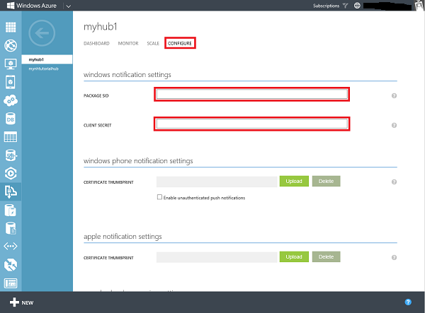

# <a name="tutorial-send-notifications-to-universal-windows-platform-apps-by-using-azure-notification-hubs"></a>教程：使用 Azure 通知中心向通用 Windows 平台应用发送通知

[!INCLUDE [notification-hubs-selector-get-started](../../includes/notification-hubs-selector-get-started.md)]

本教程介绍如何创建通知中心，以便将推送通知发送到通用 Windows 平台 (UWP) 应用。 创建一个空白 Windows 应用商店应用，以便使用 Windows 推送通知服务 (WNS) 接收推送通知。 然后即可使用通知中心将推送通知广播到运行应用的所有设备。

> [!NOTE]
> 可以在 [GitHub](https://github.com/Azure/azure-notificationhubs-dotnet/tree/master/Samples/UwpSample) 上找到本教程的已完成代码。

执行以下步骤：

> [!div class="checklist"]
> * 在 Windows 应用商店中创建应用
> * 创建通知中心
> * 创建示例 Windows 应用
> * 发送测试通知

## <a name="prerequisites"></a>必备条件

- **Azure 订阅**。 如果没有 Azure 订阅，请在开始前[创建一个试用 Azure 帐户](https://www.azure.cn/pricing/1rmb-trial/)。
- Microsoft Visual Studio 2017 或更高版本。 本教程中的示例使用 [Visual Studio 2019](https://www.visualstudio.com/products)。
- [已安装 UWP 应用开发工具](https://msdn.microsoft.com/windows/uwp/get-started/get-set-up)
- 有效的 Windows 应用商店帐户
- 确认已启用“从应用和其他发送方获取通知”  设置。 
    - 在计算机上启动“设置”  窗口。
    - 选择“系统”  磁贴。
    - 从左侧菜单中选择“通知和操作”  。 
    - 确认已启用“从应用和其他发送方获取通知”  设置。 如果未启用，请启用它。

完成本教程是学习有关 UWP 应用的所有其他通知中心教程的先决条件。

## <a name="create-an-app-in-windows-store"></a>在 Windows 应用商店中创建应用

要将推送通知发送到 UWP 应用，请将应用关联到 Windows 应用商店。 然后将通知中心配置为与 WNS 集成。

1. 导航到 [Windows 开发人员中心](https://partner.microsoft.com/dashboard/windows/first-run-experience)，使用 Microsoft 帐户登录，然后选择“新建应用”。 

    
2. 键入应用的名称，然后选择“保留产品名称”。  这将为应用创建一个新的 Windows 应用商店注册。

    
3. 展开“产品管理”，然后依次选择“WNS/MPNS”、“Live 服务站点”。    登录 Microsoft 帐户。 应用程序注册页会在新选项卡中打开。也可直接导航到[我的应用程序](https://apps.dev.microsoft.com)页，然后选择应用程序名称以访问该页。

    
4. 记下“应用程序机密”密码和“包安全标识符(SID)”。  

    >[!WARNING]
    >应用程序密钥和程序包 SID 是重要的安全凭据。 请勿将这些值告知任何人或随应用程序分发它们。

## <a name="create-a-notification-hub"></a>创建通知中心

[!INCLUDE [notification-hubs-portal-create-new-hub](../../includes/notification-hubs-portal-create-new-hub.md)]

### <a name="configure-wns-settings-for-the-hub"></a>配置中心的 WNS 设置

1. 在“通知设置”类别中选择“Windows (WNS)”。  
2. 输入在前一部分记下的“包 SID”和“安全密钥”的值。  
3. 单击工具栏上的“保存”  。

    

通知中心现在已配置为使用 WNS。 你有了用于注册应用和发送通知的连接字符串。

## <a name="create-a-sample-windows-app"></a>创建示例 Windows 应用

1. 在 Visual Studio 中打开“文件”  菜单，选择“新建”  ，然后选择“项目”  。
2. 在“创建新项目”对话框中完成以下步骤： 

    1. 在顶部的搜索框中，键入“Windows 通用”。 
    2. 在搜索结果中选择“空白应用(通用 Windows)”，然后选择“下一步”。  

       

    3. 在“配置新项目”对话框中输入**项目名称**，并指定项目文件的**位置**。 
    4. 选择“创建”  。

3. 接受**目标**和**最低**平台版本的默认值，然后选择“确定”。 
4. 在“解决方案资源管理器”中，右键单击 Windows Store 应用项目，选择“发布”，然后选择“将应用与 Store 相关联”。   此时会显示“将应用与 Windows 应用商店关联”向导  。
5. 在向导中，使用 Microsoft 帐户登录。
6. 选择在第 2 步中注册的应用，选择“下一步”，然后选择“关联”   。 这会将所需的 Windows 应用商店注册信息添加到应用程序清单中。
7. 在 Visual Studio 中，右键单击该解决方案，并选择“管理 NuGet 包”。  此时会打开“管理 NuGet 包”  窗口。
8. 在搜索框中，输入 **WindowsAzure.Messaging.Managed**，选择“安装”  ，并接受使用条款。

    ![“管理 NuGet 包”窗口][20]

    此操作使用 [Microsoft.Azure.NotificationHubs NuGet 包](https://www.nuget.org/packages/Microsoft.Azure.NotificationHubs)下载、安装并添加对 Azure 通知中心库的引用。
9. 打开 `App.xaml.cs` 项目文件并添加以下语句：

    ```csharp
    using Windows.Networking.PushNotifications;
    using Microsoft.WindowsAzure.Messaging;
    using Windows.UI.Popups;
    ```

10. 在项目的 `App.xaml.cs` 文件中，找到 `App` 类并添加以下 `InitNotificationsAsync` 方法定义。 将 `<your hub name>` 替换为在 Azure 门户中创建的通知中心的名称，将 `<Your DefaultListenSharedAccessSignature connection string>` 替换为通知中心的“访问策略”页中提供的 `DefaultListenSharedAccessSignature` 连接字符串： 

    ```csharp
    private async void InitNotificationsAsync()
    {
        var channel = await PushNotificationChannelManager.CreatePushNotificationChannelForApplicationAsync();

        var hub = new NotificationHub("<your hub name>", "<Your DefaultListenSharedAccessSignature connection string>");
        var result = await hub.RegisterNativeAsync(channel.Uri);

        // Displays the registration ID so you know it was successful
        if (result.RegistrationId != null)
        {
            var dialog = new MessageDialog("Registration successful: " + result.RegistrationId);
            dialog.Commands.Add(new UICommand("OK"));
            await dialog.ShowAsync();
        }
    }
    ```

    此代码从 WNS 检索应用的通道 URI，并将该通道 URI 注册到用户的通知中心。

    >[!NOTE]
    > 将 `hub name` 占位符替换为出现在 Azure 门户中的通知中心的名称。 另外，使用在之前部分中从通知中心的“访问策略”页获取的 `DefaultListenSharedAccessSignature` 连接字符串替换连接字符串占位符  。

11. 在 `App.xaml.cs` 中 `OnLaunched` 事件处理程序的上方，添加对新 `InitNotificationsAsync` 方法的以下调用：

    ```csharp
    InitNotificationsAsync();
    ```

    此操作保证每次启动应用程序时都在通知中心注册通道 URI。

12. 若要运行应用，请按键盘的 **F5** 键。 此时会显示包含注册密钥的对话框。 若要关闭对话框，请单击“确定”。 

    

应用现在已能够接收 toast 通知。

## <a name="send-test-notifications"></a>发送测试通知

可以通过在 [Azure 门户](https://portal.azure.cn/)中发送通知来快速测试在应用中接收通知。 

1. 在 Azure 门户中切换到“概览”选项卡，然后在工具栏上选择“测试性发送”。 

    
2. 在“测试性发送”窗口中执行以下操作： 
    1. 对于“平台”，请选择“Windows”  。 
    2. 对于“通知类型”，请选择“Toast”。  
    3. 选择“发送”。 

        
3. 请在窗口底部的“结果”列表中查看“发送”操作的结果。  此外还会看到一条警报消息。

    
4. 可看到通知消息：在桌面上**测试消息**。

    

## <a name="next-steps"></a>后续步骤
使用门户或控制台应用将广播通知发送到所有 Windows 设备。 若要了解如何向特定的设备推送通知，请转到以下教程：

> [!div class="nextstepaction"]
>[向特定设备推送通知](
notification-hubs-windows-notification-dotnet-push-xplat-segmented-wns.md)

<!-- Images. -->
[13]: ./media/notification-hubs-windows-store-dotnet-get-started/notification-hub-create-console-app.png
[14]: ./media/notification-hubs-windows-store-dotnet-get-started/notification-hub-windows-toast.png
[19]: ./media/notification-hubs-windows-store-dotnet-get-started/notification-hub-windows-reg.png
[20]: ./media/notification-hubs-windows-store-dotnet-get-started/notification-hub-windows-universal-app-install-package.png

<!-- URLs. -->
[Use Notification Hubs to push notifications to users]: notification-hubs-aspnet-backend-windows-dotnet-wns-notification.md
[Use Notification Hubs to send breaking news]: notification-hubs-windows-notification-dotnet-push-xplat-segmented-wns.md
[toast catalog]: https://msdn.microsoft.com/library/windows/apps/hh761494.aspx
[tile catalog]: https://msdn.microsoft.com/library/windows/apps/hh761491.aspx
[badge overview]: https://msdn.microsoft.com/library/windows/apps/hh779719.aspx
