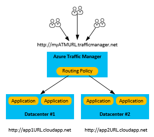
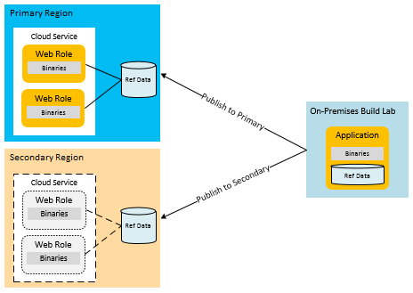
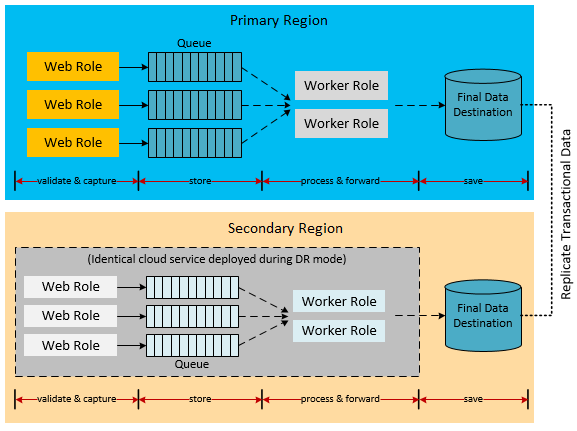
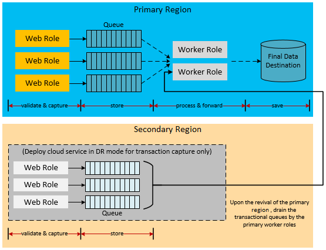
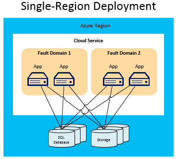
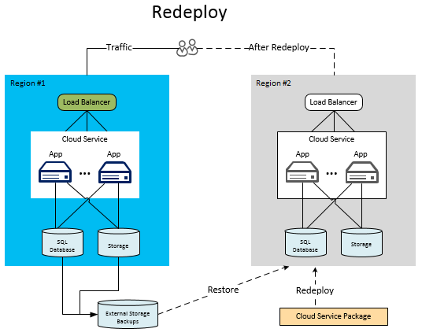
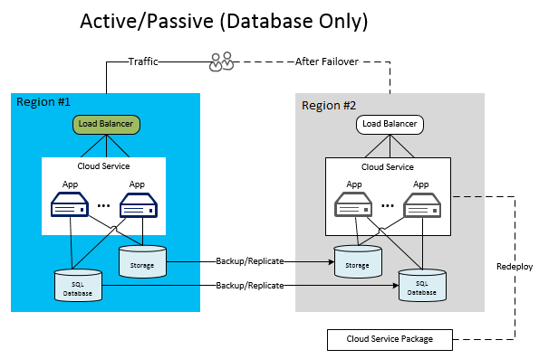
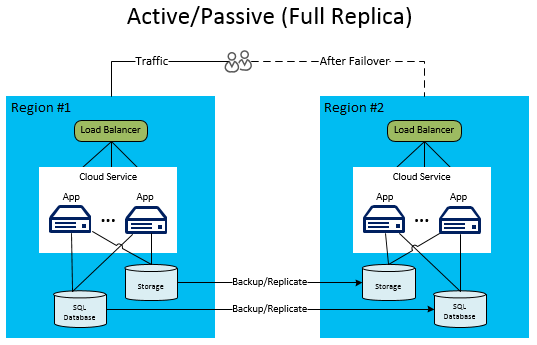
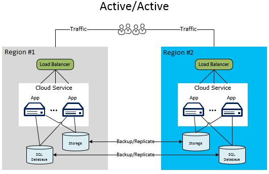

<!-- Remove Channel9 -->

---
title: Azure 应用程序灾难恢复 | Azure
description: 有关在 Azure 上设计应用程序以实现灾难恢复的技术概述和深入信息。
services: ''
documentationcenter: na
author: adamglick
manager: saladki
editor: ''

ms.assetid: f9e0cbdc-ec82-46dc-bee6-558b35518252
ms.service: resiliency
ms.devlang: na
ms.topic: article
ms.tgt_pltfrm: na
ms.workload: na
ms.date: 08/18/2016
wacn.date: 02/20/2017
ms.author: aglick
---

# 构建在 Azure 基础之上的应用程序灾难恢复

高可用性与临时故障管理有关，而灾难恢复 (DR) 与应用程序功能因发生灾难而丧失有关。例如，设想出现了区域服务中断的情况。在这种情况下，需要制定在 Azure 区域之外运行应用程序或访问数据的计划。执行此计划主要关注的是人员、流程以及使系统可正常运转的支持性应用程序。定义系统灾难运作模式的业务和技术所有者负责确定发生灾难期间服务的功能级别。功能级别表现为各种形式：完全不可用、部分可用（功能减弱或延迟处理），或完全可用。

## Azure 灾难恢复功能

与可用性注意事项一样，Azure 提供了旨在支持灾难恢复的 [resiliency technical guidance](./resiliency-technical-guidance.md)（复原技术指南）。Azure 的某些可用性功能与灾难恢复之间还存在某种关系。例如，跨容错域管理角色可提高应用程序的可用性。如果没有此项管理，则未经处理的硬件故障将会演变为“灾难”情形。因此，应将正确地应用许多可用性功能和策略视为应用程序防灾的重要部分。但是，本文不仅介绍一般的可用性问题，还涉及到严重（且罕见）的灾难事件。

## 多个数据中心区域

Azure 在中国不同的区域保留了数据中心。此基础结构支持多种灾难恢复方案，如系统提供的将 Azure 存储空间异地复制到次要区域。这也意味着可以轻松而经济地将云服务部署到中国多个位置。将此与在多个区域运行自己的数据中心的成本和困难程度相比，高下立见。将数据和服务部署到多个数据中心可保护应用程序不会在单个区域中发生重大中断。

## Azure 流量管理器

发生数据中心特有的故障后，必须将流量重定向到另一区域中的服务或部署。可手动进行此路由过程，使用自动过程更加高效。Azure 流量管理器专为完成此任务而设计。使用它可在主要区域发生故障时管理将用户流量故障转移到另一区域的过程。由于流量管理是整体策略的重要组成部分，因此了解流量管理器的基本知识很重要。

在下图中，用户连接到为流量管理器指定的 URL (**http://myATMURL.trafficmanager.cn**)，后者对真实的站点 URL（**http://app1URL.chinacloudapp.cn** 和 **http://app2URL.chinacloudapp.cn**）进行了抽象化。当策略发出指令时，将根据配置何时路由用户的条件，将用户发送到正确的真实站点。策略选项为轮循机制、性能或故障转移。在本文中，我们只讨论故障转移选项。

配置流量管理器时，将提供新的流量管理器DNS 前缀。将向用户提供该 URL 前缀以访问你的服务。流量管理器当前将负载均衡向上提升了一个级别，而不处于区域级别。对于流量管理器管理的所有部署，其 DNS 均映射到某个 CNAME。

在流量管理器内，你指定在发生故障时将用户路由到的部署的优先级。流量管理器会监视部署的终结点，并注意主部署何时发生故障。如果发生故障，流量管理器将分析按优先顺序排列的部署列表，然后将用户路由到列表中的下一个部署。

虽然流量管理器决定在故障转移时前往何方，但在不处于故障转移模式时，你可以决定故障转移域是处于休眠还是活动状态。该功能与 Azure 流量管理器无关。如果流量管理器在主站点中检测到故障，它会转移到故障转移站点。无论该站点当前是否在为用户提供服务，流量管理器都会这样做。

有关 Azure 流量管理器工作原理的详细信息，请参阅：

* [流量管理器概述](../traffic-manager/traffic-manager-overview.md)
* [配置故障转移路由方法](../traffic-manager/traffic-manager-configure-failover-routing-method.md)

## Azure 灾难情况

以下部分涵盖多种不同类型的灾难情况。区域范围的服务中断不是应用程序范围内发生故障的唯一原因。设计不良或管理错误也会导致中断。请在恢复计划的设计和测试阶段设想可能导致故障的原因，这样做很重要。一个好的计划可充分利用 Azure 功能，并通过应用程序特有的策略强化这些功能。由应用程序的重要性、恢复点目标 (RPO) 和恢复时间目标 (RTO) 规定所选的响应。

### 应用程序故障

如前所述，Azure 流量管理器会自动处理因主机虚拟机中的底层硬件或操作系统软件引起的故障。Azure 会在正常运行的服务器上创建新的角色实例，然后将其添加到负载均衡器轮换中。如果角色实例数大于一，Azure 会将处理过程切换到其他正在运行的角色实例，同时替换发生故障的节点。

但是，还会发生与任何硬件或操作系统故障无关的严重应用程序错误。应用程序可能因逻辑错误或数据完整性问题导致的灾难性异常而发生故障。必须在代码中加入足够的遥测，以使监视系统可检测到故障情况并通知应用程序管理员。完全了解灾难恢复过程的管理员可决定调用故障转移过程，或者可以简单接受可用性中断以解决关键性错误。

### 数据损坏

Azure 自动将你的 Azure SQL 数据库和 Azure 存储空间数据在同一区域中的不同容错域内冗余地存储三次。如果使用异地复制，则再将这些数据在另一个区域内存储三次。但是，如果用户或应用程序损坏了主副本中的数据，则会将损坏情况迅速复制到其他副本。不幸的是，这将产生三份损坏的数据。

若要应对可能的数据损坏，你可以采用两种做法。首先，你可以管理自定义备份策略。你可以将备份存储在 Azure 中或存储在本地，具体取决于你的业务需求或治理监管。另一种做法是使用新的时间点还原选项来恢复 SQL 数据库。有关详细信息，请参阅[灾难恢复的数据策略](#data-strategies-for-disaster-recovery)部分。

### 网络中断

当 Azure 网络的某些部分中断时，你可能无法访问应用程序或数据。如果一个或多个角色实例因网络问题而不可用，则 Azure 将利用应用程序剩余的可用实例。如果应用程序因 Azure 网络中断而无法访问其数据，可能可以使用缓存数据在本地以降级模式运行。需要在应用程序中为在降级模式下运行制定灾难恢复策略。某些应用程序可能做不到这一点。

另一个选项是将数据存储在备用位置，直到连接恢复。如果降级模式不是好办法，则剩余的选项为产生应用程序停机时间或故障转移到备用区域。设计在降级模式下运行应用程序多出于业务决策而非技术决策。[应用程序功能降级](#degraded-application-functionality)部分深入讨论了这一问题。

### 从属服务故障

Azure 提供的许多服务可能会定期停机。以 [Azure Redis 缓存](https://www.azure.cn/home/features/redis-cache/)为例。这项多租户服务向应用程序提供缓存功能。设想如果从属服务不可用，应用程序中将发生什么，这样做很重要。此方案在许多方面与网络中断方案类似。但是，单独考量每一项服务有望改进整个计划。

例如，Azure Redis 缓存从云服务部署内部为应用程序提供缓存，从而提供灾难恢复的优势。首先，服务现在运行在你的部署本地的角色上。因此，在云服务的总体管理过程中，可更好地监视和管理缓存的状态。但是，这种类型的缓存也公开了新功能。其中一个新功能是缓存数据的高可用性。此功能通过在其他节点上保留重复的副本，帮助在一个节点发生故障时保留缓存数据。

请注意，高可用性会降低吞吐量并增大延迟，因为需要在写入时更新辅助副本。它还会将每项使用的内存量加倍，因此要为此做好规划。这个具体的示例表明，每项从属服务都可能具有提高总体可用性和帮助抵御灾难性故障的能力。

通过每个从属服务，应够可以了解服务中断造成的影响。在缓存示例中，或许可以直接从数据库访问数据，直到还原缓存为止。在性能方面，这将是降级模式，但可提供数据方面的完整功能。

### 区域范围的服务中断

以前的故障主要还是可在同一 Azure 区域内应对的故障。但是，还必须为整个区域发生服务中断的可能性做好准备。发生区域范围的服务中断时，数据的本地冗余副本不可用。如果启用了异地复制，则在异地区域内另有 Blob 和表的三个副本。如果 Azure.cn 声明区域发生故障，Azure 会将所有 DNS 条目将重新映射到异地复制的区域。

> [!NOTE]
> 注意，你对此过程无任何控制权，并且仅对区域范围的服务中断进行此过程。因此，还必须依靠应用程序特有的其他备份方法才能达到最高级别的可用性。有关详细信息，请参阅[灾难恢复的数据策略](#data-strategies-for-disaster-recovery)部分。
> 
> 

### Azure 范围的服务中断

在灾难规划中，必须考虑到所有可能发生的灾难情况。最严重的一个故障将同时涉及所有 Azure 区域。如同任何其他故障一样，你可能决定在这种情况下甘冒停机时间的风险。跨越多个区域的广泛服务中断应比涉及从属服务或单个区域的孤立服务中断少见得多。

但是，对某些任务关键型应用程序而言，你可能决定还必须为此方案制定备份计划。针对此事件的计划可能包括故障转移到[备用云](#alternative-cloud)或[混合本地和云解决方案](#hybrid-on-premises-and-cloud-solution)中的服务。

### 应用程序功能降级

设计良好的应用程序通常使用一组模块，这些模块通过实现松散耦合的信息互换模式相互通信。适合 DR 的应用程序尤其需要在模块级别分离任务。这可以防止从属服务中断导致整个应用程序停止运行。例如，以 Y 公司的电子商务应用程序为例，该应用程序可能由以下模块构成：

* **产品目录**：便于用户浏览产品。
* **购物车**：便于用户在其购物车中添加/删除产品。
* **订单状态**：显示用户订单的发货状态。
* **订单提交**：通过提交订单并付款，完成购物过程。
* **订单处理**：验证订单的数据完整性并执行数量可用性检查。

当此应用程序中某个模块的依赖项停止运行时，在该部件恢复之前，此模块如何运行？ 设计良好的系统将通过在设计时和运行时分离任务来实施隔离边界。可以将每个故障分类为可恢复和不可恢复。不可恢复的错误会使模块停止运行，但可以通过备选项来规避可恢复错误。如高可用性部分中所述，可以通过处理故障并采取备用措施，使用户察觉不到某些问题。在更严重的服务中断期间，应用程序可能完全不可用。但是，还有第三个选项，即在降级模式下继续为用户提供服务。

例如，如果托管订单的数据库停运，则“订单处理”模块无法处理销售事务。根据体系结构的不同，该应用程序的“订单提交”和“订单处理”部分可能难以或无法继续。如果该应用程序未设计成处理这种情况，则整个应用程序可能脱机。

但是，在这同一情况下，可将产品数据存储在其他位置。在这种情况下，仍可使用“产品目录”模块查看产品。在降级模式下，用户可继续使用该应用程序的可用功能，如查看产品目录。但是，该应用程序的其他部分不可用，如下订单或库存查询。

降级方式的另一种变化形式重点在于性能而非功能。例如，设想一种情况，其中通过 Azure Redis 缓存来缓存产品目录。如果缓存变得不可用，该应用程序可以直接转到服务器存储以检索产品目录信息。但此访问的速度比缓存版本慢。因此，应用程序性能下降，直到缓存服务完全恢复为止。

对于该应用程序中有多少功能将继续在降级模式下运行，这既是一个业务决策，也是一个技术决策。该应用程序还必须决定如何向用户通知临时问题。在本例中，该应用程序可允许查看产品，甚至可将这些产品添加到购物车。但是，当用户尝试进行购买时，该应用程序向用户通知销售模块暂时不可访问。对于客户来说，这不是理想状态，但这样确实可防止应用程序范围的服务中断。

## 灾难恢复的数据策略

正确处理数据是任何灾难恢复计划中最难以安排妥当的部分。还原数据也是恢复过程中通常占用最多时间的部分。在发生故障之后，在降级模式下做出的不同选择使数据的故障恢复和一致性面临严峻挑战。

其中一个因素是需要还原或维护应用程序数据的副本。此数据将在辅助站点用于参考和事务目的。本地设置需要一个成本高昂且耗时漫长的规划过程才能实施多区域灾难恢复策略。方便的是，包括 Azure 在内的大多数云提供商均已允许将应用程序部署到多个区域。这些区域分散在各地，因此应该极少发生多个区域同时服务中断的情况。能够跨区域处理数据的策略是任何灾难恢复计划成功的决定性因素之一。

以下部分讨论与数据备份、引用数据和事务数据相关的灾难恢复方法。

### 备份和还原

定期备份应用程序数据可为某些灾难恢复方案提供支持。不同的存储资源需要使用不同的方法。

对于基本、标准和高级 SQL 数据库层，可以利用时间点还原来恢复数据库。有关详细信息，请参阅 [Overview: Cloud business continuity and database disaster recovery with SQL Database](../sql-database/sql-database-business-continuity.md)（概述：云业务连续性与使用 SQL 数据库进行数据库灾难恢复）。另一种做法是对 SQL 数据库使用活动异地复制。这会自动将数据库更改复制到相同甚至不同 Azure 区域中的辅助数据库。这提供了一些本文介绍的手动程度更高的数据同步技术的潜在替代方法。有关详细信息，请参阅 [Overview: SQL Database Active Geo-Replication](../sql-database/sql-database-geo-replication-overview.md)（概述：SQL 数据库活动异地复制）。

还可以使用手动程度更高的方法进行备份和还原。使用 DATABASE COPY 命令创建数据库的副本。必须使用此命令才能获得在事务上一致的备份。还可以利用 Azure SQL 数据库的导入/导出服务。这样支持将数据库导出到存储在 Azure Blob 存储中的 BACPAC 文件。

Azure 存储空间内置的冗余性在同一区域中创建备份文件的两个副本。但是，由运行备份过程的频率决定 RPO，即可能在灾难情况下丢失的数据量。例如，假设你在整点执行备份，而灾难发生在整点的两分钟前。那么，你会丢失在执行上次备份之后产生的 58 分钟的数据。此外，为了应对区域范围的服务中断，应将 BACPAC 文件复制到备用区域。然后，可还原备用区域内的那些备份。有关更多详细信息，请参阅 [Overview: Cloud business continuity and database disaster recovery with SQL Database](../sql-database/sql-database-business-continuity.md)（概述：云业务连续性与使用 SQL 数据库进行数据库灾难恢复）。

对于 Azure 存储空间，可制定你自己的自定义备份过程，也可使用许多第三方备份工具。请注意，在大多数应用程序设计中，还有许多其他的复杂情况，其中存储资源互相引用对方。例如，设想一个 SQL 数据库，其中一列链接到 Azure 存储空间中的 Blob。如果未能同步进行备份，则数据库可能会提供一个指针，指向在发生故障之前未备份的 Blob。应用程序或灾难恢复计划必须实现在恢复后处理这种不一致性的过程。

### 灾难恢复的引用数据模式

引用数据是支持应用程序功能的只读数据。这些数据通常不经常更改。尽管备份和还原是处理区域范围的服务中断的一种方法，但 RTO 耗时相对较长。将应用程序部署到次要区域后，有一些策略可改进引用数据的 RTO。

由于引用数据不经常更改，因此可通过在次要区域内保留引用数据的永久副本，缩短 RTO。这样可消除发生灾难时还原备份所需的时间。若要满足多区域灾难恢复要求，必须将应用程序和引用数据一起部署到多个区域。如 [Reference data pattern for high availability](./resiliency-high-availability-azure-applications.md#reference-data-pattern-for-high-availability)（高可用性的引用数据模式）中所述，可以将引用数据部署到角色本身、外部存储或这两者的组合。

计算节点内引用数据部署模型还隐式满足了灾难恢复要求。将引用数据部署到 SQL 数据库需要将引用数据的副本部署到每个区域。同样的策略也适用于 Azure 存储空间。必须将存储在 Azure 存储空间中的任何引用数据副本部署到主要区域和次要区域。

必须对所有数据（包括引用数据）实现你自己的应用程序特有的备份例程。仅在整个区域范围的服务中断时，使用跨区域的异地复制副本。为了防止出现长时间的停机，应将应用程序任务关键部分的数据部署到次要区域。有关此拓扑的示例，请参阅[主动-被动模型](#active-passive)。

###  灾难恢复的事务数据模式

实施功能完备的灾难模式策略需要将事务数据异步复制到次要区域。可进行复制的实际时间范围将决定应用程序的 RPO 特征。你仍然可以从主要区域恢复在复制期间丢失的数据。以后还可以与次要区域合并。

以下体系结构示例介绍在故障转移情况下处理事务数据的几种不同方式。这些示例并未尽列，注意到这一点很重要。例如，可将中间存储位置（如队列）替换为 Azure SQL 数据库。队列自身可以是 Azure 存储或 Azure 服务总线队列（请参阅 [Azure queues and Service Bus queues--compared and contrasted](../service-bus-messaging/service-bus-azure-and-service-bus-queues-compared-contrasted.md)（Azure 队列和服务总线队列 - 比较与对照））。服务器存储目标也可能有所不同，如使用 Azure 表而不是 SQL 数据库。此外，在不同步骤中，还可插入辅助角色作为中介。重要的不在于精确地模仿这些体系结构，而是在恢复事务数据和相关模块时考虑各种备选方法。

#### 复制事务数据以准备灾难恢复

设想一个应用程序，其中使用 Azure 存储队列保存事务数据。这允许辅助角色在去耦体系结构中处理事务数据并将其放入服务器数据库。如果前端角色要求立即查询这些数据，则这要求事务使用某种形式的临时缓存。根据数据丢失承受程度的不同，可以选择复制队列、数据库或所有存储资源。如果只是复制数据库，则当主要区域停机后，你仍然可以在主要区域恢复时恢复队列中的数据。

下图显示一种体系结构，其中跨区域同步了服务器数据库。

实现这种体系结构的最大难题是区域之间的复制策略。Azure SQL 数据同步服务可以实现这种类型的复制。但是，该服务仍为预览版，建议不要将其用于生产环境。有关详细信息，请参阅 [Overview: Cloud business continuity and database disaster recovery with SQL Database](../sql-database/sql-database-business-continuity.md)（概述：云业务连续性与使用 SQL 数据库进行数据库灾难恢复）。对于生产应用程序，必须投资购入第三方解决方案或在代码中创建自己的复制逻辑。根据体系结构的不同，可能会进行双向复制，而这也更加复杂。

一种可能的实现方法是在上述示例中使用中间队列。处理数据并将其放入最终存储目标的辅助角色可以同时在主要区域和次要区域内做出更改。这些任务并非不重要，而有关复制代码的完整指导超出本文的范畴。关键是应投入大量时间并重点测试如何将数据复制到次要区域。应进行其他处理和测试，以确保故障转移和恢复过程正确处理任何可能发生的数据不一致情况或复制事务。

> [!NOTE]
> 本文侧重于平台即服务 (PaaS)。但是，使用 Azure 虚拟机的混合应用程序仍具有其他复制和可用性选项。这些混合应用程序使用基础结构即服务 (IaaS) 在 Azure 中的虚拟机上托管 SQL Server。因此，可在 SQL Server 中使用传统的可用性方法，如 AlwaysOn 可用性组或日志传送。某些方法（如 AlwaysOn）只能在本地 SQL Server 与 Azure 虚拟机之间发挥作用。有关详细信息，请参阅 [High availability and disaster recovery for SQL Server in Azure Virtual Machines](../virtual-machines/windows/sql/virtual-machines-windows-sql-high-availability-dr.md)（Azure 虚拟机中 SQL Server 的高可用性和灾难恢复）。
> 
> 

#### 用于事务捕获的降级应用程序模式

另外设想一个在降级模式下运行的体系结构。次要区域上的应用程序会停用所有功能，如报告、商业智能 (BI) 或清空队列。它仅接受业务要求定义的事务工作流的最重要类型。系统将捕获事务并将其写入队列。在服务中断的初始阶段，系统可以推迟数据处理。如果主要区域内的系统在预期的时间范围内重新激活，则主要区域内的辅助角色可能会清空队列。此过程不需要合并数据库。如果主要区域的服务中断超出可承受的范围，则应用程序可开始处理队列。

这此方案中，次要区域内的数据库包含增量事务数据，一旦主要区域重新激活，就必须合并此类数据。下图展示了此策略，用于临时存储事务数据，直到还原主要区域。

<!-- 有关具有复原功能的 Azure 应用程序的数据管理方法的更多讨论，请参阅[防故障：弹性云体系结构指南](https://channel9.msdn.com/Series/FailSafe)。 -->

## 灾难恢复的部署拓扑

必须对任务关键型应用程序做好准备，以防止发生区域范围的服务中断。可以通过将多区域部署策略合并到运营规划中来实现这一目标。

多区域部署可能需要 IT 专业人员在经历灾难后将应用程序数据和引用数据发布到次要区域。如果应用程序要求立即进行故障转移，则部署过程可能涉及主动/被动或主动/主动设置。这种类型的部署具有在备用区域内运行应用程序的现有实例。Azure 流量管理器等路由工具会在 DNS 级别提供负载均衡服务。此类工具可检测到服务中断，并在需要时将用户路由到其他区域。

如果从一开始就在解决方案中加入 Azure 灾难恢复，它就成功了一部分。云提供了其他可用于在灾难期间从故障中恢复的选项，而传统的托管提供商无法提供此类选项。具体来说，你可以动态而迅速地为另一区域分配资源。因此，不必为闲置资源花费大量资金却坐等故障发生。

以下部分涵盖灾难恢复的不同部署拓扑。通常，在提高可用性时，需要在增加成本或复杂性之间取得平衡。

### 单区域部署

单区域部署实际上不是一种灾难恢复拓扑，而是旨在与其他体系结构进行对比。单区域部署对于 Azure 中的应用程序较为常见。但这种类型的部署不是灾难恢复计划的有力竞争对手。

下图演示了在单个 Azure 区域内运行的应用程序。Azure 流量管理器以及使用容错域和升级域可提高区域内应用程序的可用性。

此处，数据库显然是单点故障。即使 Azure 跨越不同的容错域将数据复制到内部副本，也都是在同一区域内进行。应用程序无法承受灾难性故障。如果区域发生故障，则所有容错域均发生故障，其中包括所有服务实例和存储资源。

对于所有应用程序（最不重要的除外），必须制定计划以将应用程序部署到不同区域中的多个区域内。在考虑要使用哪种部署拓扑时，还应考虑 RTO 和成本的限制。

现在，来看看支持在不同区域内进行故障转移的特定模式。以下示例都使用两个区域说明该过程。

### 重新部署到次要 Azure 区域

在重新部署到次要区域的模式中，只有主要区域有应用程序和数据库在运行。次要区域未设置为自动故障转移。因此，在发生灾难时，必须启动新区域内服务的所有部分。其中包括将云服务上载到 Azure、部署云服务、还原数据和更改 DNS 以重新路由流量。

虽然这是最实惠的多区域选项，但其 RTO 特征最差。在此模型中，服务包和数据库备份存储在本地或次要区域的 Azure Blob 存储中。但必须先部署新服务并还原数据，然后才能继续操作。即使完全自动从备份存储中传输数据，使新数据库环境正常运转仍然会花费大量时间。将数据从备份磁盘存储移至次要区域内的空数据库是还原过程中成本最高的部分，但必须这样做才能使新数据库进入正常运行状态，因为并未复制该数据库。

最佳方法是将服务包存储在次要区域内的 Blob 存储中。这样不必将包上载到 Azure，而从本地的开发计算机进行部署时就要这样做。可以使用 PowerShell 脚本，迅速将服务包从 Blob 存储部署到新云服务中。

此选项仅适用于可承受高 RTO 的非关键应用程序。例如，此选项可能适用于可关闭数小时，但应在 24 小时内再次运行的应用程序。

### 主动-被动

许多公司倾向于选择主动-被动模式。与重新部署模式相比，这种模式增加相对较少的成本即可提高 RTO。在此方案中，同样存在主辅 Azure 区域。所有流量均流向主要区域内的主动部署。次要区域为灾难恢复所做的准备更充分，因为两个区域内均运行有数据库。而且，它们之间还建立了同步机制。这种备用方法可能涉及两种变化形式：仅数据库方法或在次要区域内进行完全部署的方法。

#### 仅数据库

在主动-被动模式的第一种变化形式中，只有主要区域部署了云服务应用程序。但是，与重新部署模式不同，这两个区域与数据库内容进行同步。（有关详细信息，请参阅[灾难恢复的事务数据模式](#transactional-data-pattern-for-disaster-recovery)部分。） 发生灾难时，激活要求会更低。你启动次要区域内的应用程序，将连接字符串更改为新数据库，然后更改 DNS 条目以重新路由流量。

与重新部署模式一样，服务包应已存储在次要区域内的 Azure Blob 存储中，以便更快进行部署。与重新部署模式不同的是，数据库还原操作所需的大部分开销并非由用户产生。数据库已就绪并在运行。这样可节省大量时间，因此是一种经济型 DR 模式。此外，它也是最流行的 DR 模式。

#### 完整副本

在主动-被动模式的第二种变化形式中，主要区域和次要区域均为完全部署。这种部署包括云服务和同步数据库。但是，只有主要区域在主动处理来自用户的网络请求。只有当主要区域出现服务中断时，次要区域才会激活。在这种情况下，会将所有新网络请求路由到次要区域。Azure 流量管理器可自动管理此故障转移。

由于已部署相关服务，因此故障转移的速度比仅数据库变化形式更快。此模式的 RTO 非常短。在主要区域发生故障时，次要故障转移区域必须能够立即投入使用。

除了响应更快之外，此模式还具有预先分配和部署备份服务的优点。不必担心区域没有空间可在发生灾难时分配新实例。如果辅助 Azure 区域接近最大容量，则这一点很重要。无法保证立即可在任何区域内部署大量新的云服务（服务级别协议）。

为了尽量缩短此模型的响应时间，主要区域和次要区域的规模（角色实例数）必须相近。尽管存在一些优点，但由于为未使用的计算实例付费的成本高昂，通常这不是最明智的财务选择。因此，更常见的做法是在次要区域内使用规模略有缩减的云服务版本。然后，可在必要时迅速进行故障转移和横向扩展辅助部署。你应当自动完成故障转移过程，以便一旦主要区域发生故障，即根据负载激活其他实例。这可能涉及某种类型的自动缩放机制，如[虚拟机规模集](../virtual-machine-scale-sets/virtual-machine-scale-sets-overview.md)。

下图展示了一种模型，其中主要区域和次要区域均包含处于主动-被动模式的完全部署的云服务。

### 主动-主动

现在，应该已明了这些模式的演变过程：降低 RTO 会提高成本和复杂程度。主动-主动解决方案实际上打破在成本方面的这种倾向。

在主动-主动模式下，云服务和数据库在这两个区域内均部署齐全。与主动-被动模型不同的是，两个区域都会接收用户流量。此选项产生的恢复时间最快。相关服务已经过扩展，以在每个区域处理一部分负载。已启用 DNS，便于使用次要区域。在确定如何将用户路由到相应的区域的过程中，还有其他复杂因素。可以采用轮循机制计划。很可能某些用户会使用其数据的主副本所在的特定区域。

在故障转移时，只需禁止 DNS 访问主要区域。这可以将所有流量路由到次要区域。

即使在此模型中，也有一些变化形式。例如，下图展示了一种模型，其中主要区域拥有数据库的主控副本。两个区域内的云服务均写入该主数据库。辅助部署可从主数据库或复制的数据库进行读取。本例中的复制为单向进行。

上图中的主动-主动体系结构有一个缺点。第二个区域必须访问第一个区域内的数据库，因为主控副本存放在那里。从区域外部访问数据时，性能大幅下降。在跨区域调用数据库时，应考虑使用某种类型的批处理方法以提高这些调用的性能。有关详细信息，请参阅 [How to use batching to improve SQL Database application performance](../sql-database/sql-database-use-batching-to-improve-performance.md)（如何使用批处理来改善 SQL 数据库应用程序的性能）。

另一种备选体系结构可能要求每个区域直接访问其数据库。在该模型中，将需要进行某种类型的双向复制以同步每个区域内的数据库。

在主动-主动模式中，主要区域内需要的实例数量可能不像主动-被动模式那么多。如果主动-被动体系结构的主要区域内有 10 个实例，则在每个主动-主动体系结构的区域内可能只需要 5 个实例。现在两个区域分担负载。如果在被动区域内将 10 个实例保持在热备用状态以等待故障转移，则这样做可能比主动-被动模式更为节省成本。

如果直到主要区域还原后才意识到这一点，则次要区域的新用户可能会突然间猛增。如果在主要区域发生服务中断时每个服务器上有 10,000 个用户，则次要区域现在突然间必须处理 20,000 个用户。针对次要区域的监视规则必须检测到这种增长情况，并将次要区域内的实例增加一倍。有关详细信息，请参阅[故障检测](#failure-detection)部分。

##  混合本地和云解决方案

另一个灾难恢复策略是设计一个同时在本地和云中运行的混合应用程序。根据应用程序的不同，主要区域可能在任一位置。以前面的体系结构为例，并假设主要区域和次要区域均位于本地。

这些混合体系结构中有一些难题。首先，本文大部分内容处理的是 PaaS 体系结构模式。Azure 中的典型 PaaS 应用程序依赖 Azure 特有的构件，如角色、云服务和流量管理器。为此类型的 PaaS 应用程序创建本地解决方案所需的体系结构显著不同。就管理或成本角度而言，这一点可能不可行。

但是，对直接移至云中的传统体系结构来说，混合灾难恢复解决方案面临的挑战更少。对于使用 IaaS 的体系结构就是这样。IaaS 应用程序使用云中的虚拟机，这些虚拟机在本地具有直接等效项。使用虚拟网络还可将云中的虚拟机与本地网络资源相连。这样就产生了多种仅 PaaS 应用程序所不具备的可能性。例如，SQL Server 可利用灾难恢复解决方案，如 AlwaysOn 可用性组和数据库镜像。有关详细信息，请参阅 [High availability and disaster recovery for SQL Server in Azure virtual machines](../virtual-machines/windows/sql/virtual-machines-windows-sql-high-availability-dr.md)（Azure 虚拟机中 SQL Server 的高可用性和灾难恢复）。

IaaS 解决方案还为本地应用程序使用 Azure 作为故障转移选项提供一个更方便的途径。可能在现有的本地区域内具有完全正常运行的应用程序。但如果缺少资源，无法维护分散在各地的区域以进行故障转移，该怎么办呢？ 你可能决定使用虚拟机和虚拟网络在 Azure 中运行应用程序。在这种情况下，可以定义将数据同步到云的过程。然后，Azure 部署成为用于故障转移的次要区域。主要区域仍为本地应用程序。有关 IaaS 体系结构和功能的详细信息，请参阅[虚拟机文档](../virtual-machines/index.md)。

## 备用云

有时，即使 Azure.cn 云这样可靠的服务也无法满足你的组织提出的内部规则或政策合规性要求。如果云服务提供商发生国内性的服务中断，即使是最完善的准备和设计也无法在发生灾难时实施备份系统。

需要将可用性要求与提高可用性所需的成本和复杂程度进行比较。执行风险分析，然后为解决方案定义 RTO 和 RPO。如果应用程序无法承受任何停机，则可能需要考虑使用其他云解决方案。除非整个 Internet 同时瘫痪，否则在 Azure 发生国内性的访问故障时，其他云解决方案仍将正常运转。

和混合方案一样，其他云解决方案中也可存在以前灾难恢复体系结构中的故障转移部署。备用云 DR 站点应仅用于那些 RTO 只允许极短停机时间（如有）的解决方案。请注意，使用 Azure 以外 DR 站点的解决方案将需要在配置、开发、部署和维护方面做更多工作。此外，在跨云的体系结构中实施最佳实践也更加困难。尽管云平台的高级概念相似，但 API 和体系结构各有不同。

如果决定将 DR 分散在不同平台上，则在解决方案的设计中加入抽象层会有一定意义。如果这样做，就不必为不同云平台开发和维护同一应用程序的两个不同版本来应对灾难。和混合方案一样，在这些情况下使用 Azure 虚拟机或 Azure 容器服务可能比云特定的 PaaS 设计更加方便。

## 自动化

我们刚刚讨论的某些模式需要迅速激活脱机部署以及还原系统的特定部分。通过自动化或脚本处理，可按需激活资源以及迅速部署解决方案。在本文中，与 DR 相关的自动化等同于 [Azure PowerShell](https://msdn.microsoft.com/zh-cn/library/azure/jj156055.aspx)，但也可以选择[服务管理 REST API](https://msdn.microsoft.com/zh-cn/library/azure/ee460799.aspx)。

开发脚本可帮助管理 Azure 无法透明地处理的 DR 部分。这样做的优点是每次产生的结果均保持一致，因而使人为出错的几率降至最低。预先定义 DR 脚本还可缩短在灾难中途重建系统及其组成部分的时间。用户不想尝试自己解决如何在停机时还原站点的问题，因为分分秒秒都在损失金钱。

创建脚本后，应自始至终不断测试这些脚本。验证这些脚本的基本功能后，请确保在[灾难模拟](#disaster-simulation)中测试它们。这样有助于揭示脚本或过程中的缺陷。

自动化的最佳实践是为 Azure 灾难恢复创建 PowerShell 脚本或命令行接口 (CLI) 的存储库。请明确标注这些脚本并对它们分类，以便于查找。指派一个人管理脚本的存储库和版本控制。请通过参数解释和脚本使用示例，妥善记录这些脚本。另外请确保将此文档与 Azure 部署保持同步。这样强调让一个人管理存储库的所有部分的意图所在。

## 故障检测

若要正确地处理可用性和灾难恢复的问题，必须可检测和诊断故障。应对服务器和部署进行高级监视，以使你可在系统或其部分突然停运时迅速了解情况。检查云服务及其依赖项的总体运行状况的监视工具可完成这其中的一部分工作。一个 Microsoft 工具是 [System Center 2016](https://www.microsoft.com/zh-cn/server-cloud/products/system-center-2016/)。第三方工具也可提供监视功能。大多数监视解决方案跟踪关键的性能计数器和服务可用性。

尽管这些工具很重要，但仍需要为云服务中的故障检测和报告进行规划。必须规划以正确使用 Azure 诊断。自定义性能计数器或事件日志条目也可成为总体策略的一部分。这样可在故障期间提供更多数据以迅速诊断问题并恢复所有功能。它还为监视工具提供其他指标，用于确定应用程序的运行状况。有关详细信息，请参阅 [Enabling Azure Diagnostics in Azure Cloud Services（在 Azure 云服务中启用 Azure 诊断）](../cloud-services/cloud-services-dotnet-diagnostics.md)。<!-- 有关如何规划总体“运行状况模型”的讨论，请参阅[防故障：弹性云体系结构指南](https://channel9.msdn.com/Series/FailSafe)。 -->

## 灾难模拟

模拟测试涉及在真实工作环境下营造小规模的真实情形，以观察团队成员的反应。模拟还会展示在恢复计划中概述的解决方案的效果。执行模拟的方式应以所营造的情景不会中断实际业务，仍感觉像真实情况为准。

设想在应用程序中设计某种类型的“开关面板”以手动模拟可用性问题。例如，通过软开关，使订购模块发生故障，从而触发该模块的数据库访问异常。可将类似的轻型方法用于网络接口级别的其他模块。

将在模拟期间重点关注任何未充分解决的问题。模拟的方案必须完全可控。也就是说，即便恢复计划似乎会失败，也可以使情况恢复正常，而不会导致任何重大损害。通知高级管理人员将执行模拟练习的时间和方式，这一点也很重要。此计划应包括有关在运行模拟测试时可能无法用于生产的时间或资源的信息。使灾难恢复计划经受测试时，还要定义将如何衡量成功，这一点也很重要。

还有多种其他方法可用于测试灾难恢复计划。但是，其中大多数只是这些基本方法的修改版。此测试背后的主要动机是评估恢复计划的合理程度和可行程度。灾难恢复测试侧重于详细信息以发现基本还原计划中的漏洞。

## 后续步骤

本文是着重介绍[构建在 Azure 基础之上的应用程序灾难恢复和高可用性](./resiliency-disaster-recovery-high-availability-azure-applications.md)的系列教程的一部分。本系列教程的前一篇文章为[构建在 Azure 基础之上的应用程序高可用性](./resiliency-high-availability-azure-applications.md)。

<!---HONumber=Mooncake_0213_2017-->
<!-- Update_Description: update meta properties; wording update -->