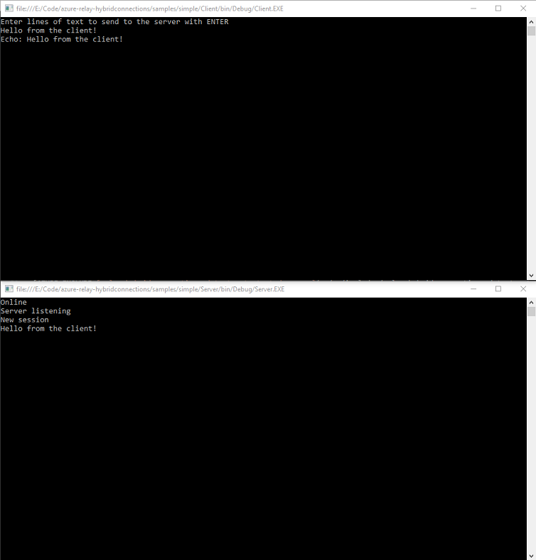

# 开始在 .NET 中使用中继混合连接 WebSocket
[!INCLUDE [relay-selector-hybrid-connections](../../includes/relay-selector-hybrid-connections.md)]

在本快速入门中，请创建 .NET 发送者和接收者应用程序，以便在 Azure 中继中通过混合连接 WebSocket 发送和接收消息。 若要了解 Azure 中继的常规信息，请参阅 [Azure 中继](relay-what-is-it.md)。 

在本快速入门中，你将执行以下步骤：

1. 使用 Azure 门户创建中继命名空间。
2. 使用 Azure 门户在该命名空间中创建混合连接。
3. 编写服务器（侦听器）控制台应用程序，用于接收消息。
4. 编写客户端（发送方）控制台应用程序，用于发送消息。
5. 运行应用程序。 

## 必备条件

若要完成本教程，需要满足以下先决条件：

* [Visual Studio 2015 或更高版本](https://www.visualstudio.com)。 本教程中的示例使用 Visual Studio 2017。
* Azure 订阅。 如果没有订阅，请在开始之前[创建一个试用帐户](https://www.azure.cn/pricing/1rmb-trial/)。

## 创建命名空间
[!INCLUDE [relay-create-namespace-portal](../../includes/relay-create-namespace-portal.md)]

## 创建混合连接
[!INCLUDE [relay-create-hybrid-connection-portal](../../includes/relay-create-hybrid-connection-portal.md)]

##  3.创建服务器应用程序（侦听程序）
在 Visual Studio 中编写可侦听和接收来自中继的消息的 C# 控制台应用程序。

[!INCLUDE [relay-hybrid-connections-dotnet-get-started-server](../../includes/relay-hybrid-connections-dotnet-get-started-server.md)]

## 创建客户端应用程序（发送程序）
在 Visual Studio 中编写可将消息发送到中继的 C# 控制台应用程序。

[!INCLUDE [relay-hybrid-connections-dotnet-get-started-client](../../includes/relay-hybrid-connections-dotnet-get-started-client.md)]

## 运行应用程序
1. 运行服务器应用程序。
2. 运行客户端应用程序并输入一些文本。
3. 确保服务器应用程序控制台显示了客户端应用程序中输入的文本。

    

祝贺你，你已创建了一个完整的混合连接应用程序！

## 后续步骤
在本快速入门中，你创建了 .NET 客户端和服务器应用程序，此类程序使用 WebSocket 来发送和接收消息。 Azure 中继的混合连接功能也支持使用 HTTP 发送和接收消息。 若要了解如何将 HTTP 与 Azure 中继混合连接配合使用，请参阅 [HTTP 快速入门](relay-hybrid-connections-http-requests-dotnet-get-started.md)。

在本快速入门中，你使用了 .NET Framework 来创建客户端和服务器应用程序。 若要了解如何使用 Node.js 编写客户端和服务器应用程序，请参阅 [Node.js WebSocket 快速入门](relay-hybrid-connections-node-get-started.md)或 [Node.js HTTP 快速入门](relay-hybrid-connections-http-requests-dotnet-get-started.md)。
<!--Update_Description:update meta properties only-->
