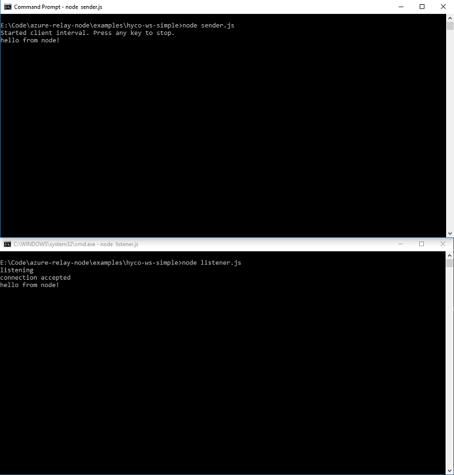

# 中继混合连接入门
[!INCLUDE [relay-selector-hybrid-connections](../../includes/relay-selector-hybrid-connections.md)]

## 将要完成的任务
由于混合连接要求客户端和服务器组件，我们将在本教程中创建两个控制台应用程序。 下面是相关步骤：

1. 使用 Azure 门户创建中继命名空间。
2. 使用 Azure 门户创建混合连接。
3. 编写服务器控制台应用程序用于接收消息。
4. 编写客户端控制台应用程序用于发送消息。

## 先决条件
1. [Node.js](https://nodejs.org/en/)（此示例使用节点 7.0）。
2. Azure 订阅。

[!INCLUDE [create-account-note](../../includes/create-account-note.md)]

## 1.使用 Azure 门户创建命名空间
如果已创建中继命名空间，请跳转到[使用 Azure 门户创建混合连接](#2-create-a-hybrid-connection-using-the-azure-portal)部分。

[!INCLUDE [relay-create-namespace-portal](../../includes/relay-create-namespace-portal.md)]

## 2.使用 Azure 门户创建混合连接
如果已创建混合连接，请跳转到[创建服务器应用程序](#3-create-a-server-application-listener)部分。

[!INCLUDE [relay-create-hybrid-connection-portal](../../includes/relay-create-hybrid-connection-portal.md)]

## 3.创建服务器应用程序（侦听程序）
若要侦听和接收来自中继的消息，需编写 Node.js 控制台应用程序。

[!INCLUDE [relay-hybrid-connections-dotnet-get-started-server](../../includes/relay-hybrid-connections-node-get-started-server.md)]

## 4.创建客户端应用程序（发送程序）
若要将消息发送到中继，需编写 Node.js 控制台应用程序。

[!INCLUDE [relay-hybrid-connections-dotnet-get-started-client](../../includes/relay-hybrid-connections-node-get-started-client.md)]

## 5.运行应用程序
1. 运行服务器应用程序。
2. 运行客户端应用程序并输入一些文本。
3. 确保服务器应用程序控制台输出了客户端应用程序中输入的文本。

祝贺你，现已创建端到端混合连接应用程序。

## 后续步骤：
* [中继常见问题](./relay-faq.md)
* [创建命名空间](./relay-create-namespace-portal.md)
* [.NET 入门](./relay-hybrid-connections-dotnet-get-started.md)
* [节点入门](./relay-hybrid-connections-node-get-started.md)

