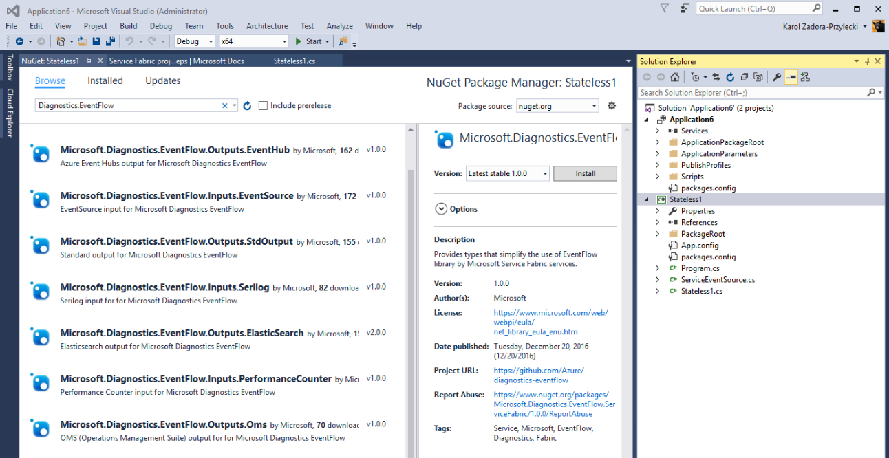

# <a name="event-aggregation-and-collection-using-eventflow"></a>使用 EventFlow 聚合和收集事件

[Microsoft 诊断 EventFlow](https://github.com/Azure/diagnostics-eventflow) 可将事件从某个节点路由到一个或多个监视目标。 由于它以 NuGet 包的形式包含在服务项目中，EventFlow 代码和配置可以连同服务一起传播，消除了前面所述的需要在 Azure 诊断中为每个节点完成配置的问题。 EventFlow 在服务进程中运行，直接连接到配置的输出。 由于这种直接连接，EventFlow 适用于 Azure、容器和本地服务部署。 在容器等高密度方案中运行 EventFlow 时请保持谨慎，因为每个 EventFlow 管道会建立外部连接。 因此如若托管多个进程，会获得多个出站连接！ 这对于 Service Fabric 应用程序而言并不是一个大问题，因为 `ServiceType` 的所有副本在同一个进程中运行，限制了出站连接数。 EventFlow 还提供事件筛选，以便只发送与指定的筛选器匹配的事件。

## <a name="set-up-eventflow"></a>设置 EventFlow

EventFlow 二进制文件以一组 NuGet 包的形式提供。 如果要将 EventFlow 添加到某个 Service Fabric 服务项目，请在解决方案资源管理器中右键单击该项目，并选择“管理 NuGet 包”。 切换到“浏览”选项卡并搜索“`Diagnostics.EventFlow`”：



将显示一个不同包的列表，带有“输入”和“输出”标记。 EventFlow 支持不同日志提供程序和分析器。 托管 EventFlow 的服务应该根据应用程序日志的源和目标包含相应的包。 除核心 ServiceFabric 包外，至少还需配置一个输入和输出。 例如，可添加下列包将 EventSource 事件发送到 Application Insights：

* `Microsoft.Diagnostics.EventFlow.Inputs.EventSource`（从该服务的 EventSource 类和标准 EventSource 捕获数据，例如 *Microsoft-ServiceFabric-Services* 和 *Microsoft-ServiceFabric-Actors*）
* `Microsoft.Diagnostics.EventFlow.Outputs.ApplicationInsights`（我们会将日志发送到 Azure Application Insights 资源）
* `Microsoft.Diagnostics.EventFlow.ServiceFabric`（允许初始化来自 Service Fabric 服务配置的 EventFlow 管道，并以 Service Fabric 运行状况报表的形式报告发送诊断数据的任何相关问题）

>[!NOTE]
>`Microsoft.Diagnostics.EventFlow.Inputs.EventSource` 包要求服务项目面向 .NET Framework 4.6 或更高版本。 在安装此包之前，请确保在项目属性中设置相应的目标框架。

安装所有包后，下一步是在服务中配置和启用 EventFlow。

## <a name="configure-and-enable-log-collection"></a>配置和启用日志收集
EventFlow 管道（负责发送日志）根据配置文件中存储的规范创建。 `Microsoft.Diagnostics.EventFlow.ServiceFabric` 包在 `PackageRoot\Config` 解决方案文件夹下安装名为 `eventFlowConfig.json` 的起始 EventFlow 配置文件。 需要对此配置文件进行修改，以从默认服务 `EventSource` 类和其他任何希望配置的输入中捕获数据，并将数据发送到适当位置。

>[!NOTE]
>如果项目文件具有 VisualStudio 2017 格式，则不会自动添加 `eventFlowConfig.json` 文件。 要修复此问题，请在 `Config` 文件夹中创建该文件，并将生成操作设置为`Copy if newer`。 

以下是基于上文提到的 NuGet 包的 *eventFlowConfig.json* 示例：
```json
{
  "inputs": [
    {
      "type": "EventSource",
      "sources": [
        { "providerName": "Microsoft-ServiceFabric-Services" },
        { "providerName": "Microsoft-ServiceFabric-Actors" },
        // (replace the following value with your service's ServiceEventSource name)
        { "providerName": "your-service-EventSource-name" }
      ]
    }
  ],
  "filters": [
    {
      "type": "drop",
      "include": "Level == Verbose"
    }
  ],
  "outputs": [
    {
      "type": "ApplicationInsights",
      // (replace the following value with your AI resource's instrumentation key)
      "instrumentationKey": "00000000-0000-0000-0000-000000000000"
    }
  ],
  "schemaVersion": "2016-08-11"
}
```

服务的 ServiceEventSource 名称是应用于 ServiceEventSource 类的 `EventSourceAttribute` 的 Name 属性值。 这些元素全都在 `ServiceEventSource.cs` 文件中指定，是服务代码的一部分。 例如，在以下代码片段中，ServiceEventSource 的名称为 *MyCompany-Application1-Stateless1*：

```csharp
[EventSource(Name = "MyCompany-Application1-Stateless1")]
internal sealed class ServiceEventSource : EventSource
{
    // (rest of ServiceEventSource implementation)
}
```

请注意， `eventFlowConfig.json` 文件是服务配置包的一部分。 对此文件的更改可以包含在服务的完全升级或仅配置的升级中，并且会接受 Service Fabric 升级运行状况检查和自动回退（如果升级失败）。 有关详细信息，请参阅 [Service Fabric 应用程序升级](service-fabric-application-upgrade.md)。

通过配置的 *filters* 节可进一步自定义将通过 EventFlow 管道到达输出的信息，使你能够删除或包含某些信息，或更改事件数据的结构。 有关筛选的详细信息，请参阅 [EventFlow 筛选器](https://github.com/Azure/diagnostics-eventflow#filters)。

最后一步是在服务的启动代码中（位于 `Program.cs` 文件）实例化 EventFlow 管道：

```csharp
using System;
using System.Diagnostics;
using System.Threading;
using Microsoft.ServiceFabric;
using Microsoft.ServiceFabric.Services.Runtime;

// **** EventFlow namespace
using Microsoft.Diagnostics.EventFlow.ServiceFabric;

namespace Stateless1
{
    internal static class Program
    {
        /// <summary>
        /// This is the entry point of the service host process.
        /// </summary>
        private static void Main()
        {
            try
            {
                // **** Instantiate log collection via EventFlow
                using (var diagnosticsPipeline = ServiceFabricDiagnosticPipelineFactory.CreatePipeline("MyApplication-MyService-DiagnosticsPipeline"))
                {

                    ServiceRuntime.RegisterServiceAsync("Stateless1Type",
                    context => new Stateless1(context)).GetAwaiter().GetResult();

                    ServiceEventSource.Current.ServiceTypeRegistered(Process.GetCurrentProcess().Id, typeof(Stateless1).Name);

                    Thread.Sleep(Timeout.Infinite);
                }
            }
            catch (Exception e)
            {
                ServiceEventSource.Current.ServiceHostInitializationFailed(e.ToString());
                throw;
            }
        }
    }
}
```

作为 `ServiceFabricDiagnosticsPipelineFactory` 中 `CreatePipeline` 方法的参数传递的名称是表示 EventFlow 日志收集管道的运行状况实体的名称。 如果 EventFlow 遇到错误并通过 Service Fabric 运行状况子系统报告此错误，则使用此名称。

### <a name="use-service-fabric-settings-and-application-parameters-in-eventflowconfig"></a>在 eventFlowConfig 中使用 Service Fabric 设置和应用程序参数

EventFlow 支持使用 Service Fabric 设置和应用程序参数来配置 EventFlow 设置。 可使用此特殊语法来引用 Service Fabric 设置参数的值：

```json
servicefabric:/<section-name>/<setting-name>
```

`<section-name>` 是 Service Fabric 配置节的名称；而 `<setting-name>` 是配置设置，提供用于配置 EventFlow 设置的值。 若要深入了解如何执行此操作，请转到 [Service Fabric 和应用程序参数支持](https://github.com/Azure/diagnostics-eventflow#support-for-service-fabric-settings-and-application-parameters)。

## <a name="verification"></a>验证

在 Visual Studio 中启动服务并观察“调试”输出窗口。 该服务启动后，应开始看到服务正向已配置输出发送记录的证据。 导航到事件分析和可视化平台，并确认日志已开始显示（可能需要几分钟时间）。

## <a name="next-steps"></a>后续步骤

<!-- Not Available on * * [Event Analysis and Visualization with Application Insights](service-fabric-diagnostics-event-analysis-appinsights.md) -->
<!-- Not Available on * [Event Analysis and Visualization with Log Analytics](service-fabric-diagnostics-event-analysis-oms.md) -->
* [EventFlow 文档](https://github.com/Azure/diagnostics-eventflow)

<!--Update_Description: update meta properties  -->