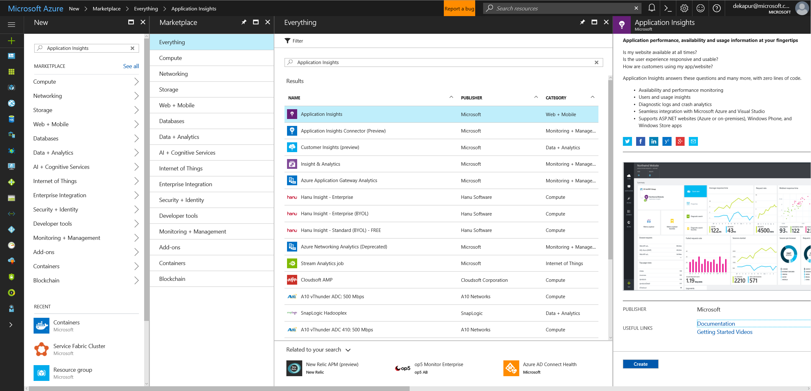

# <a name="event-analysis-and-visualization-with-application-insights"></a>使用 Application Insights 分析和可视化事件

Azure Application Insights 是用于应用程序监视和诊断的可扩展平台。 它包含强大的分析和查询工具、可自定义的仪表板和可视化效果，以及自动警报等其他选项。 建议使用该平台对 Service Fabric 应用程序和服务进行监视与诊断。

## <a name="setting-up-application-insights"></a>设置 Application Insights

### <a name="creating-an-ai-resource"></a>创建 AI 资源

若要创建 AI 资源，请转到 Azure 应用商店并搜索“Application Insights”。 “Application Insights”应会显示为第一个解决方案（在“Web + 移动”类别下面）。 找到适当的资源后，请单击“创建”（确认路径与下图相符）。



需要填写一些信息才能正确预配资源。 若要使用 Service Fabric 的任何编程模型或者要将 .NET 应用程序发布到群集，请在“应用程序类型”字段中使用“ASP.NET Web 应用程序”。 若要部署来宾可执行文件和容器，请使用“常规”。 一般情况下，可按默认使用“ASP.NET Web 应用程序”，以便将来可以更改选项。 名称可以任意指定，部署资源后，可以更改资源组和订阅。 我们建议将 AI 资源放在群集所在的同一资源组中。
<!-- Not Available [Create an Application Insights resource](../application-insights/app-insights-create-new-resource.md) -->

需要使用 AI 检测密钥通过事件聚合工具来配置 AI。 设置 AI 资源（验证部署后花费几分钟时间完成此过程）后，请导航到该资源，并在左侧导航栏中找到“属性”部分。 此时将打开一个新的边栏选项卡，其中显示了“检测密钥”。 如果需要更改资源的订阅或资源组，也可以在此处更改。

### <a name="configuring-ai-with-wad"></a>使用 WAD 配置 AI

可采用两种主要方式将来自 WAD 的数据发送到 Azure AI，这是通过在 WAD 配置中添加 AI 接收器实现的。
<!-- Not Available [this article](../monitoring-and-diagnostics/azure-diagnostics-configure-application-insights.md). -->

#### <a name="add-an-ai-instrumentation-key-when-creating-a-cluster-in-azure-portal"></a>在 Azure 门户中创建群集时添加 AI 检测密钥


创建群集时，如果“已启用”诊断，则会显示一个可选字段，可在其中输入 Application Insights 检测密钥。 如果在此处粘贴 AI IKey，用于部署群集的 Resource Manager 模板中会自动配置 AI 接收器。

#### <a name="add-the-ai-sink-to-the-resource-manager-template"></a>将 AI 接收器添加到 Resource Manager 模板

在 Resource Manager 模板的“WadCfg”中，通过包含以下两项更改来添加“接收器”：

1. 添加接收器配置：

    ```json
    "SinksConfig": {
        "Sink": [
            {
                "name": "applicationInsights",
                "ApplicationInsights": "***ADD INSTRUMENTATION KEY HERE***"
            }
        ]
    }

    ```

2. 通过在“WadCfg”的“DiagnosticMonitorConfiguration”中添加以下行，在 DiagnosticMonitorConfiguration 中包含接收器：

    ```json
    "sinks": "applicationInsights"
    ```

在上面两个代码片段中，名称“applicationInsights”用于描述接收器。 不一定非要使用此名称；只要将接收器包含在“sinks”中，就可以将名称设置为任何字符串。

目前，来自群集的日志将以跟踪的形式显示在 AI 的日志查看器中。 由于来自基础结构级别的大多数跟踪的类型为“信息”，因此，你也可以考虑将接收器配置更改为只发送“关键”或“错误”类型的日志。
<!-- Not Available [this article](../monitoring-and-diagnostics/azure-diagnostics-configure-application-insights.md). -->

>[!NOTE]
>如果在门户或 Resource Manager 模板中使用错误的 AI IKey，则必须手动更改密钥，然后更新群集/重新部署群集。 

### <a name="configuring-ai-with-eventflow"></a>使用 EventFlow 配置 AI

如果使用 EventFlow 来聚合事件，请务必导入 `Microsoft.Diagnostics.EventFlow.Output.ApplicationInsights` NuGet 包。 必须在 *eventFlowConfig.json* 的 *outputs* 节中包含以下内容：

```json
"outputs": [
    {
        "type": "ApplicationInsights",
        // (replace the following value with your AI resource's instrumentation key)
        "instrumentationKey": "00000000-0000-0000-0000-000000000000"
    }
]
```

请务必在筛选器中进行所需的更改，并包含其他任何输入（及其相应的 NuGet 包）。

## <a name="aisdk"></a>AI.SDK

我们通常建议使用 EventFlow 和 WAD 作为聚合解决方案，因为它们允许使用模块化程度更高的方法进行诊断和监视。例如，如果要从 EventFlow 更改输出，则不需要对实际检测进行任何更改，而只需对配置文件进行简单的修改。 但是，如果你决定投资采购 Application Insights，并且不太可能会改用其他平台，则应考虑使用 AI 的新 SDK 来聚合事件并将其发送到 AI。 这意味着，不再需要将 EventFlow 配置为向 AI 发送数据，而是改为安装 ApplicationInsight 的 Service Fabric NuGet 包。 [此文](https://github.com/Microsoft/ApplicationInsights-ServiceFabric)提供了有关该包的详细信息。

[微服务和容器的 Application Insights 支持](https://azure.microsoft.com/app-insights-microservices/)介绍了我们当前正在开发的一些新功能（目前仍处于测试阶段），借助这些功能可在 AI 中现成地使用更丰富的监视选项。 这些功能包括依赖项跟踪（生成群集中所有服务和应用程序的 AppMap 以及在这些服务与应用程序之间通信时使用），以及更好地关联来自服务的跟踪（有助于更轻松地查明应用或服务的工作流中的问题）。

如果你正在使用 .NET 进行开发，同时，可能会使用 Service Fabric 的某些编程模型并且愿意将 AI 用作可视化和分析事件与日志数据的平台，则我们建议通过 AI SDK 路由实施监视和诊断工作流。
<!-- Not Available [this](../application-insights/app-insights-asp-net-more.md) -->
<!-- Not Available [this](../application-insights/app-insights-asp-net-trace-logs.md) -->
## <a name="navigating-the-ai-resource-in-azure-portal"></a>在 Azure 门户中浏览 AI 资源

将 AI 配置为事件和日志的输出后的几分钟时间内，AI 资源中应会开始显示信息。 请导航到 AI 资源，随即将会转到 AI 资源仪表板。 在 AI 任务栏中单击“搜索”可查看和筛选 AI 收到的最新跟踪。

“指标资源管理器”是一个有用的工具，可根据应用程序、服务和群集可以报告的指标创建自定义仪表板。
<!-- Not Available [Exploring Metrics in Application Insights](../application-insights/app-insights-metrics-explorer.md) -->

单击“分析”会转到 Application Insights Analytics 门户，可在其中以更大的范围和可选性查询事件与跟踪。
<!-- Not Available [Analytics in Application Insights](../application-insights/app-insights-analytics.md). -->

## <a name="next-steps"></a>后续步骤

<!-- Not Available * [Set up Alerts in AI](../application-insights/app-insights-alerts.md) to be notified about changes in performance or usage -->
<!-- Not Available * [Smart Detection in Application Insights](../application-insights/app-insights-proactive-diagnostics.md) performs a proactive analysis of the telemetry being sent to AI to warn you of potential performance problems -->