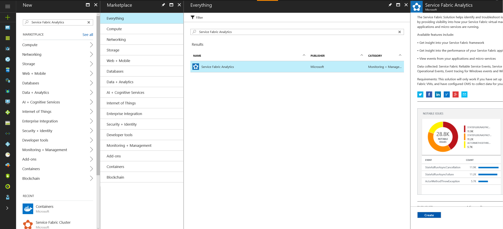
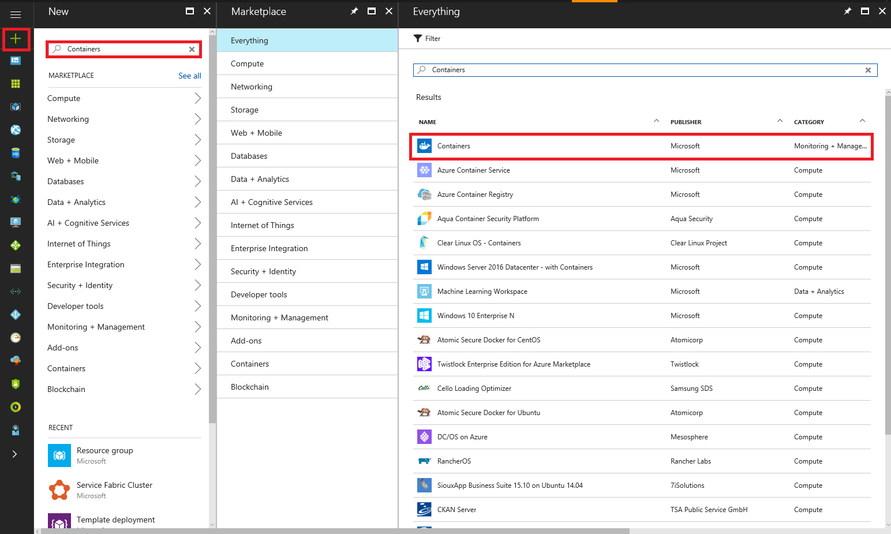

# 使用 OMS 进行事件分析和可视化

Operations Management Suite (OMS) 集中了管理服务，有助于监视和诊断云中托管的应用程序和服务。
<!-- Not Available [What is OMS?](../operations-management-suite/operations-management-suite-overview.md) -->

## Log Analytics 和 OMS 工作区

Log Analytics 从托管资源（包括 Azure 存储表或代理）收集数据，并在中央存储库中对其进行维护。 之后这些数据可用于分析、报警和可视化，或者用于进一步导出。 Log Analytics 支持事件、性能数据或其他任何自定义数据。

配置 OMS 后，即可访问特定的 OMS 工作区，在其中通过仪表板查询或可视化数据。

在 Log Analytics 收到数据后，OMS 就能够通过多个可根据不同情形自定义的预打包管理解决方案来监视传入数据。 这其中包括 Service Fabric 分析解决方案和容器解决方案。使用 Service Fabric 群集时，这两种解决方案与诊断和监视最为相关。 还包括其他几个值得探索的解决方案。此外，OMS 允许创建自定义解决方案。 所选用于群集的每个解决方案将在同一 OMS 工作区中与 Log Analytics 一起配置。 工作区允许使用自定义仪表板和数据可视化，以及对要收集、处理和分析的数据进行修改。
<!-- Not Available [here](/operations-management-suite/operations-management-suite-solutions). -->

## 使用 Service Fabric 解决方案设置 OMS 工作区

建议将 Service Fabric 解决方案添加到 OMS 工作区中，因为它提供有用的仪表板，可显示来自平台和应用程序级别的各种传入日志通道，并能查询 Service Fabric 特定日志。 相对简单的 Service Fabric 解决方案如下所示，群集上部署了一个应用程序：

可使用两种方法预配和配置 OMS 工作区：一种是使用 Resource Manager 模板，另一种是直接使用 Azure 应用商店。 若要部署群集，请使用第一种方法；若已部署群集并启用了诊断，则使用第二种方法。

### 使用 Resource Manager 模板部署 OMS

这适用于群集创建阶段 - 使用 Resource Manager 模板部署群集时，该模板还会创建新的 OMS 工作区，向其添加 Service Fabric 解决方案，并将其配置为从适当的存储表中读取数据。

>[!NOTE]
>为此，必须启用诊断，以便 OMS/Log Analytics 从存在的 Azure 存储表读取信息。

[此处](https://github.com/Azure/azure-quickstart-templates/tree/master/service-fabric-oms/)是示例模板，可根据需求使用和修改，以便执行上述操作。 如果想要更多选择，可在 [Service Fabric 和 OMS 模板](https://github.com/Azure/azure-quickstart-templates/?term=service+fabric+OMS)中查看更多模板，这些模板会根据你在设置 OMS 工作区时所处的阶段为你提供不同的选项。

### 通过 Azure 应用商店部署 OMS

若要在部署群集之后添加 OMS 工作区，请转到 Azure 应用商店，查找“Service Fabric 分析”。 结果中应该只有一个资源，显示在“监视 + 管理”类别中，如下所示：

单击“创建”后，系统会提示你创建 OMS 工作区。 单击“选择工作区”，然后单击“新建工作区”。 填写必需的条目，此处仅要求 Service Fabric 群集和 OMS 工作区的订阅相同。 验证条目后，OMS 工作区会在数分钟内部署。 部署结束后，仍可创建 Service Fabric 解决方案边栏选项卡。 请确保相同工作区在 OMS 工作区下显示，点击底部的“创建”按钮，将 Service Fabric 解决方案添加到该工作区。

## 使用 OMS 代理

建议使用 EventFlow 和 WAD 作为聚合解决方案，因为它们允许使用更加模块化的方法，方便诊断和监视。 例如，若要更改 EventFlow 的输出，不需更改实际检测，只需对配置文件进行简单修改。 然而，如果你决定投资 OMS 的使用（不需要是所使用的唯一平台，但至少要是所使用的平台之一），且愿意继续使用它进行事件分析，建议尝试设置 OMS 代理。
<!-- Not Available [OMS agent](/log-analytics/log-analytics-windows-agents) -->

执行此操作的过程相对容易，只需在 Resource Manager 模板中添加代理作为虚拟机规模集扩展，确保其安装在每个节点上。 可以为运行 [Windows](https://github.com/ChackDan/Service-Fabric/tree/master/ARM%20Templates/SF%20OMS%20Samples/Windows) 或 [Linux](https://github.com/ChackDan/Service-Fabric/tree/master/ARM%20Templates/SF%20OMS%20Samples/Linux) 的群集找到使用 Service Fabric 解决方案（如上所述）部署 OMS 工作区并将代理添加到节点的示例资源管理器模板。

这样做的好处有：

* 性能计数器和指标端的数据更丰富
* 易于配置收集自群集的数据和对其进行更改而不需重新部署应用程序或群集，因为更改代理设置可在 OMS 工作区完成，且会自动重置该代理。 若要配置 OMS 代理以选取特定性能计数器，请转到工作区的“主页”>“设置”>“数据”>“Windows 性能计数器”，选取想要收集的数据
* 相较于在 OMS/Log Analytics 提取数据前不得不存储数据的情况，数据显示得更快
* 监视容器则更加简单，因为它可以提取 Docker 日志（stdout、stderror）和统计信息（容器性能指标和节点级别）

此处最主要的考虑因素是，因其为代理，必须与所有应用程序一同部署到群集，因此会稍微影响群集上应用程序的性能。

## 监视容器

将容器部署到 Service Fabric 群集前，建议同时设置群集与 OMS 代理，并将容器解决方案添加到 OMS 工作区进行监视和诊断。 容器解决方案在工作区中看似这样：

代理可收集数个特定于容器的日志，这些日志可在 OMS 中进行查询或用于直观的性能指示器。 收集的日志类型：

* ContainerInventory：显示有关容器位置、名称和图像的信息
* ContainerImageInventory：有关已部署映像的信息，包括 ID 或大小
* ContainerLog：特定的错误日志、stdout 等 docker 日志和其他条目
* ContainerServiceLog：已运行的 docker 守护程序命令
* Perf：性能计数器，包括容器 CPU、内存、网络流量、磁盘 I/O 和主机的自定义指标

本文介绍为群集设置容器监视所需的步骤。
<!-- Not Available [documentation](../log-analytics/log-analytics-containers.md) -->

若要在工作区中设置容器解决方案，请确保已遵循上文所述步骤在群集结点上部署 OMS 代理。 群集准备就绪后，请在其上部署一个容器。 请记住，首次将容器映像部署到群集时，需要几分钟才能下载映像，具体时间取决于映像大小。

在 Azure 应用商店中，搜索“容器”并创建容器资源（位于“监视 + 管理”类别下）。

创建过程中，需使用 OMS 工作区。 选择使用上述部署创建的工作区。 此步骤在 OMS 工作区中添加容器解决方案，并由模板部署的 OMS 代理进行自动检测。 代理开始在群集中收集容器进程的数据，大约 15 分钟内即可看到带数据的解决方案亮起，如上方仪表板图像所示。

<!-- Not Available ## Next steps -->

<!-- Not Available Explore the following OMS tools and options to customize a workspace to your needs: -->

<!-- Not Available * For on-premise clusters, OMS offers a Gateway (HTTP Forward Proxy) that can be used to send data to OMS. Read more about that in [Connecting computers without Internet access to OMS using the OMS Gateway](../log-analytics/log-analytics-oms-gateway.md) -->
<!-- Not Available * Configure OMS to set up [automated alerting](../log-analytics/log-analytics-alerts.md) to aid in detecting and diagnostics -->
<!-- Not Available * Get familiarized with the [log search and querying](../log-analytics/log-analytics-log-searches.md) features offered as part of Log Analytics -->

<!--Update_Description: update meta properties, wording update, update reference link-->