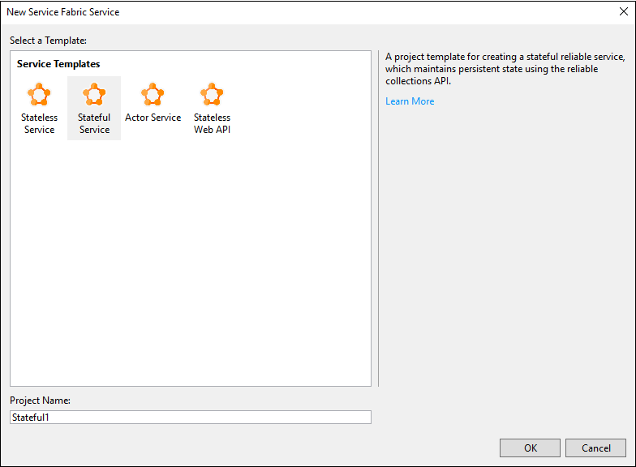
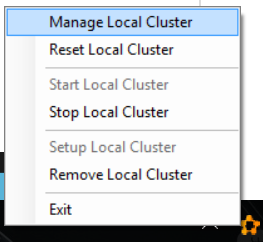
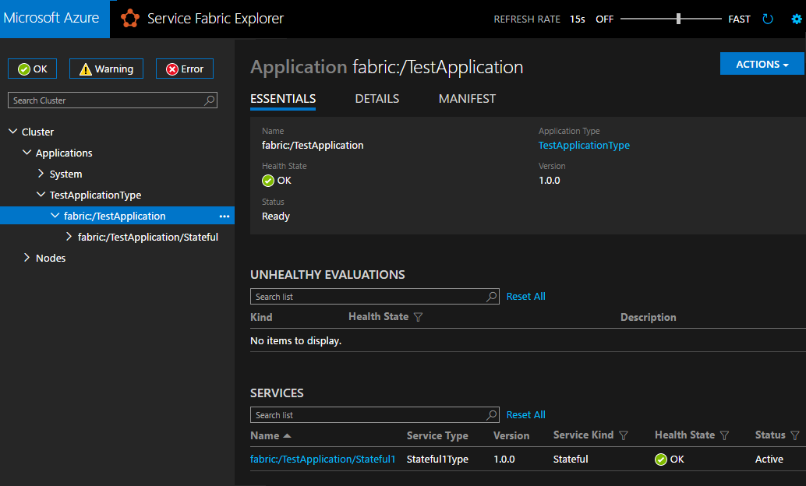
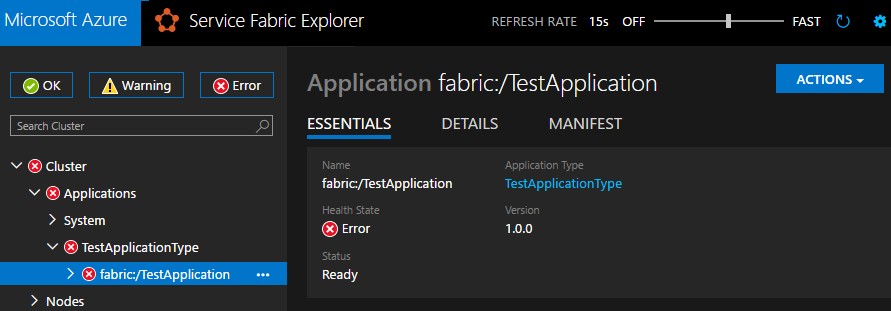

# <a name="report-and-check-service-health"></a>报告和检查服务运行状况
服务发生问题时，必须能够快速检测问题，才能响应并修复所有事件和中断。 如果从服务代码向 Azure Service Fabric 运行状况管理器报告问题和失败，可使用 Service Fabric 提供的标准运行状况监视工具来检查运行状况。

可通过三种方式报告服务的运行状况：

* 使用 [Partition](https://docs.azure.cn/zh-cn/dotnet/api/system.fabric.istatefulservicepartition?view=azure-dotnet) 或 [CodePackageActivationContext](https://docs.azure.cn/zh-cn/dotnet/api/system.fabric.codepackageactivationcontext?view=azure-dotnet) 对象。  
  可以使用 `Partition` 和 `CodePackageActivationContext` 对象在属于当前上下文一部分的项目中报告运行状况。 例如，作为副本一部分运行的代码只能报告该副本、其所属的分区，以及其所属应用程序的运行状况。
* 使用 `FabricClient`。   
  如果群集不[安全](service-fabric-cluster-security.md)或者使用管理员权限运行服务，则可以使用 `FabricClient` 从服务代码中报告运行状况。 大多数实际情况下都要求使用安全群集，或提供管理员权限。 可以使用 `FabricClient`报告任何属于群集一部分的实体的运行状况。 但是，在理想情况下，服务代码应该只发送与其本身运行状况相关的报告。
* 在群集、应用程序、部署的应用程序、服务、服务包、分区、副本或节点级别上使用 REST API。 可以在容器中用来报告运行状况。

本文将引导完成从服务代码报告运行状况的示例。 本示例还演示如何使用 Service Fabric 提供的工具检查运行状况。 本文旨在快速介绍 Service Fabric 中的运行状况监视功能。 有关详细信息，可以从本文末尾的链接开始，阅读一系列有关运行状况的深入文章。

## <a name="prerequisites"></a>先决条件
必须已安装以下软件：

* Visual Studio 2015 或 Visual Studio 2019
* Service Fabric SDK

## <a name="to-create-a-local-secure-dev-cluster"></a>创建本地安全开发人员群集
* 以管理员权限打开 PowerShell 并运行以下命令：


## <a name="to-deploy-an-application-and-check-its-health"></a>部署应用程序并检查其运行状况
1. 以管理员的身份打开 Visual Studio。
1. 使用 **有状态服务** 模板创建一个项目。

    
1. 按 **F5** 以调试模式运行应用程序。 应用程序将部署到本地群集。
1. 应用程序运行之后，在通知区域中的本地群集管理员图标上单击右键，然后从快捷菜单中选择“管理本地群集”  打开 Service Fabric Explorer。

    
1. 应用程序运行状况应如下图所示。 此时，应用程序应该状况良好而没有任何错误。

    
1. 也可以使用 PowerShell 来检查运行状况。 可以使用 ```Get-ServiceFabricApplicationHealth``` 检查应用程序的运行状况，并可以使用 ```Get-ServiceFabricServiceHealth``` 来检查服务的运行状况。 PowerShell 中针对同一应用程序的运行状况报告如下图所示。

    

## <a name="to-add-custom-health-events-to-your-service-code"></a>将自定义运行状况事件添加到服务代码
Visual Studio 中的 Service Fabric 项目模板包含示例代码。 以下步骤说明如何从服务代码报告自定义运行状况事件。 此类报告会自动显示在 Service Fabric 提供的标准运行状况监视工具中，例如 Service Fabric Explorer、Azure 门户运行状况视图以及 PowerShell。

1. 在 Visual Studio 中重新打开前面创建的应用程序，或者使用**有状态服务** Visual Studio 模板创建新应用程序。
1. 打开 Stateful1.cs 文件并在 `RunAsync` 方法中找到 `myDictionary.TryGetValueAsync` 调用。 可以看到，此方法返回保存当前计数器值的 `result` ，因为此应用程序中的关键逻辑是使计数保持运行。 如果此应用程序是一个实际的应用程序，并且缺少结果即意味着失败，那么，可以标记该事件。
1. 若要在缺少结果代表失败时报告运行状况事件，请添加以下步骤。

    a. 将 `System.Fabric.Health` 命名空间添加到 Stateful1.cs 文件。

    ```csharp
    using System.Fabric.Health;
    ```

    b. 在 `myDictionary.TryGetValueAsync` 调用的后面添加以下代码

    ```csharp
    if (!result.HasValue)
    {
        HealthInformation healthInformation = new HealthInformation("ServiceCode", "StateDictionary", HealthState.Error);
        this.Partition.ReportReplicaHealth(healthInformation);
    }
    ```
    我们将报告副本运行状况，由于它是从有状态服务报告的。 `HealthInformation` 参数存储所要报告的运行状况问题的相关信息。

    如果创建了无状态服务，请使用以下代码

    ```csharp
    if (!result.HasValue)
    {
        HealthInformation healthInformation = new HealthInformation("ServiceCode", "StateDictionary", HealthState.Error);
        this.Partition.ReportInstanceHealth(healthInformation);
    }
    ```
1. 如果使用管理员权限运行服务，或者群集不[安全](service-fabric-cluster-security.md)，则也可以使用 `FabricClient` 来报告运行状况，如以下步骤中所示。  

    a. 在 `var myDictionary` 声明后面创建 `FabricClient`。

    ```csharp
    var fabricClient = new FabricClient(new FabricClientSettings() { HealthReportSendInterval = TimeSpan.FromSeconds(0) });
    ```

    b. 在 `myDictionary.TryGetValueAsync` 调用的后面添加以下代码。

    ```csharp
    if (!result.HasValue)
    {
       var replicaHealthReport = new StatefulServiceReplicaHealthReport(
            this.Context.PartitionId,
            this.Context.ReplicaId,
            new HealthInformation("ServiceCode", "StateDictionary", HealthState.Error));
        fabricClient.HealthManager.ReportHealth(replicaHealthReport);
    }
    ```
1. 让我们模拟这种失败并看看它如何显示在运行状况监视工具中。 若要模拟这种失败，请注释掉之前添加的运行状况报告代码中的第一行。 注释掉第一行之后，代码将如以下示例所示。

    ```csharp
    //if(!result.HasValue)
    {
        HealthInformation healthInformation = new HealthInformation("ServiceCode", "StateDictionary", HealthState.Error);
        this.Partition.ReportReplicaHealth(healthInformation);
    }
    ```
    每当执行 `RunAsync` 时，此代码就会触发此运行状况报告。 完成更改后，按 **F5** 运行应用程序。
1. 运行应用程序后，打开 Service Fabric Explorer 检查应用程序的运行状况。 这一次，Service Fabric Explorer 显示应用程序状况不正常。 应用程序之所以显示为运行不正常是因为我们之前添加的代码报告了错误。

    
1. 如果在 Service Fabric 资源管理器的树视图中选择主副本，会看到 **运行状况** 也显示为出错。 Service Fabric Explorer 还显示已添加到代码中 `HealthInformation` 参数的运行状况报告详细信息。 可在 PowerShell 和 Azure 门户中查看相同的运行状况报告。

    

此报告将保留在运行状况管理器中，直到被另一份报告替换或此副本被删除。 由于我们未在 `HealthInformation` 对象中设置此运行状况报告的 `TimeToLive`，因此报告永不过期。

我们建议在最细微的级别（在本例中为副本）报告运行状况。 也可以报告 `Partition` 的运行状况。

```csharp
HealthInformation healthInformation = new HealthInformation("ServiceCode", "StateDictionary", HealthState.Error);
this.Partition.ReportPartitionHealth(healthInformation);
```

若要报告 `Application`、`DeployedApplication` 和 `DeployedServicePackage` 的运行状况，请使用 `CodePackageActivationContext`。

```csharp
HealthInformation healthInformation = new HealthInformation("ServiceCode", "StateDictionary", HealthState.Error);
var activationContext = FabricRuntime.GetActivationContext();
activationContext.ReportApplicationHealth(healthInformation);
```

## <a name="next-steps"></a>后续步骤
* [深入了解 Service Fabric 运行状况](service-fabric-health-introduction.md)
* [用于报告服务运行状况的 REST API](https://docs.microsoft.com/rest/api/servicefabric/report-the-health-of-a-service)
* [用于报告应用程序运行状况的 REST API](https://docs.microsoft.com/rest/api/servicefabric/report-the-health-of-an-application)

<!--Update_Description: update meta properties, wording update  -->