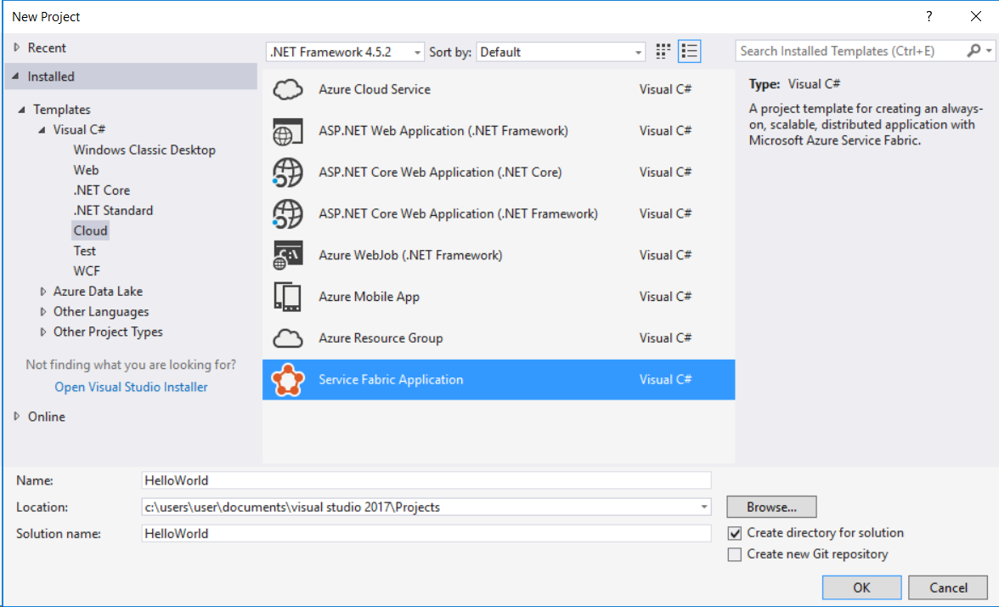
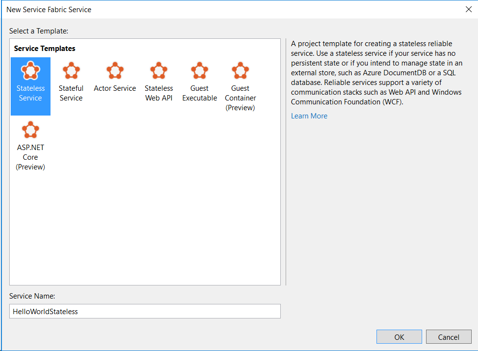
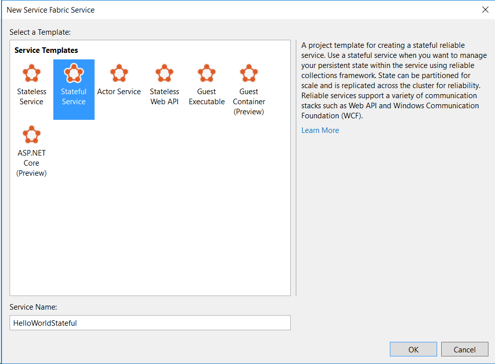

# <a name="get-started-with-reliable-services"></a>Reliable Services 入门
> [!div class="op_single_selector"]
> * [Windows 上的 C#](service-fabric-reliable-services-quick-start.md)
> * [Linux 上的 Java](service-fabric-reliable-services-quick-start-java.md)
> 
> 

Azure Service Fabric 应用程序包含运行你的代码的一个或多个服务。 本指南说明如何使用 [Reliable Services](service-fabric-reliable-services-introduction.md) 同时创建无状态与有状态的 Service Fabric 应用程序。  此微软虚拟学院视频还说明如何创建无状态可靠服务： <center><a target="_blank" href="https://mva.microsoft.com/en-US/training-courses/building-microservices-applications-on-azure-service-fabric-16747?l=s39AO76yC_7206218965">  
  
</a></center>

## <a name="basic-concepts"></a>基本概念
了解几个基本概念，即可开始使用 Reliable Services：

* **服务类型**：这是服务实现。 它由你编写的可扩展 `StatelessService` 的类、其中使用的任何其他代码或依赖项以及名称和版本号定义。
* **命名服务实例**：若要运行服务，需要创建服务类型的命名实例，就像创建类类型的对象实例一样。 服务实例具有使用“fabric:/”方案（如“fabric:/MyApp/MyService”）的 URI 形式的名称。
* **服务主机**：创建的命名服务实例需要在主机进程内运行。 服务宿主是可以运行服务实例的进程。
* **服务注册**：通过注册可将所有对象融合在一起。 只有在服务宿主中将服务类型注册 Service Fabric 运行时，Service Fabric 才能创建该类型的可运行实例。  

## <a name="create-a-stateless-service"></a>创建无状态服务
无状态服务目前是云应用程序的常规服务类型。 服务之所以被视为无状态，是因为它本身不包含需要可靠存储或高度可用的数据。 如果无状态服务的实例关闭，其所有内部状态都会丢失。 在这种类型的服务中，必须将状态保存到外部存储（如 Azure 表或 SQL 数据库），才能实现高可用性和可靠性。

以管理员身份启动 Visual Studio 2015 或 Visual Studio 2017，并新建一个名为 *HelloWorld* 的 Service Fabric 应用程序项目：



然后，创建一个名为 *HelloWorldStateless*的无状态服务项目：



解决方案现在包含两个项目：

* *HelloWorld*。 这是包含*服务*的*应用程序*项目。 它还包含应用程序清单，用于描述该应用程序以及一些帮助你部署应用程序的 PowerShell 脚本。
* *HelloWorldStateless*。 这是服务项目。 其中包含无状态服务实现。

## <a name="implement-the-service"></a>实现服务
打开服务项目中的 **HelloWorldStateless.cs** 文件。 在 Service Fabric 中，服务可以运行任一业务逻辑。 服务 API 为代码提供两个入口点：

* 名为 *RunAsync* 的开放式入口点方法，可在其中开始执行任何工作负荷，包括长时间运行的计算工作负荷。

```csharp
protected override async Task RunAsync(CancellationToken cancellationToken)
{
    ...
}
```

* 一个通信入口点，可在其中插入所选的通信堆栈，例如 ASP.NET Core。 这就是你可以开始接收来自用户和其他服务请求的位置。

```csharp
protected override IEnumerable<ServiceInstanceListener> CreateServiceInstanceListeners()
{
    ...
}
```

在本教程中，我们将重点放在 `RunAsync()` 入口点方法上。 可在其中立即开始运行代码。
项目模板包括 `RunAsync()` 的示例实现，该实现递增滚动计数。

> [!NOTE]
> 有关如何使用通信堆栈的详细信息，请参阅 [Service Fabric Web API 服务与 OWIN 自托管](service-fabric-reliable-services-communication-webapi.md)
> 
> 

### <a name="runasync"></a>RunAsync
```csharp
protected override async Task RunAsync(CancellationToken cancellationToken)
{
    // TODO: Replace the following sample code with your own logic
    //       or remove this RunAsync override if it's not needed in your service.

    long iterations = 0;

    while (true)
    {
        cancellationToken.ThrowIfCancellationRequested();

        ServiceEventSource.Current.ServiceMessage(this, "Working-{0}", ++iterations);

        await Task.Delay(TimeSpan.FromSeconds(1), cancellationToken);
    }
}
```

当服务实例已放置并且可以执行时，平台将调用此方法。 对于无状态服务，这就意味着打开服务实例。 需要关闭服务实例时，将提供取消标记进行协调。 在 Service Fabric 中，服务的整个生存期内可能多次出现服务实例的这一打开-关闭循环。 发生这种情况的原因多种多样，包括：

* 系统可能会移动服务实例以实现资源平衡。
* 代码中发生错误。
* 应用程序或系统升级。
* 基础硬件遇到中断。

系统将管理此业务流程，以便保持服务的高度可用和适当平衡。

`RunAsync()` 不应阻止同步。 RunAsync 实现应返回 Task，或等待任意长时间运行或阻止的操作以允许运行时继续。 请注意，上一示例中的 `while(true)` 循环中使用了返回 Task 的 `await Task.Delay()`。 如果必须同步阻止工作负荷，应使用 `RunAsync` 实现中的 `Task.Run()` 安排新的 Task。

取消工作负荷是一项由所提供的取消标记协调的协同操作。 系统会等待任务结束后（成功完成、取消或出现故障）再执行下一步操作。 当系统请求取消时，请务必接受取消标记，完成所有任务，然后尽快退出 `RunAsync()`。

在此无状态服务示例中，计数存储在本地变量中。 不过，由于这是无状态服务，因此，所存储的值仅在其所在服务实例的当前生命周期中存在。 当服务移动或重新启动时，值就会丢失。

## <a name="create-a-stateful-service"></a>创建有状态服务
Service Fabric 引入了一种新的有状态服务。 有状态服务能够可靠地在服务本身内部保持状态，并与使用它的代码共置。 Service Fabric 无需将状态保存到外部存储，便可实现状态的高可用性。

若要将计数器值从无状态转换为即使在服务移动或重新启动时仍高度可用并持久存在，你需要有状态服务。

在同一个 *HelloWorld* 应用程序中，通过右键单击应用程序项目中的服务引用并选择“**添加”->“新建 Service Fabric 服务**”，可以添加一个新的服务。


选择“**有状态服务**”并将其命名为 *HelloWorldStateful*。 单击 **“确定”**。



应用程序现在应该有两个服务：无状态服务 *HelloWorldStateless* 和有状态服务 *HelloWorldStateful*。

有状态服务具有与无状态服务相同的入口点。 主要差异在于可以可靠地存储状态的 *状态提供程序* 的可用性。 Service Fabric 附带名为 [Reliable Collections](service-fabric-reliable-services-reliable-collections.md) 的状态提供程序实现调用，可让你通过可靠状态管理器创建复制的数据结构。 有状态可靠服务默认使用此状态提供程序。

打开 **HelloWorldStateful** 中的 *HelloWorldStateful.cs*，该文件包含以下 RunAsync 方法：

```csharp
protected override async Task RunAsync(CancellationToken cancellationToken)
{
    // TODO: Replace the following sample code with your own logic
    //       or remove this RunAsync override if it's not needed in your service.

    var myDictionary = await this.StateManager.GetOrAddAsync<IReliableDictionary<string, long>>("myDictionary");

    while (true)
    {
        cancellationToken.ThrowIfCancellationRequested();

        using (var tx = this.StateManager.CreateTransaction())
        {
            var result = await myDictionary.TryGetValueAsync(tx, "Counter");

            ServiceEventSource.Current.ServiceMessage(this, "Current Counter Value: {0}",
                result.HasValue ? result.Value.ToString() : "Value does not exist.");

            await myDictionary.AddOrUpdateAsync(tx, "Counter", 0, (key, value) => ++value);

            // If an exception is thrown before calling CommitAsync, the transaction aborts, all changes are
            // discarded, and nothing is saved to the secondary replicas.
            await tx.CommitAsync();
        }

        await Task.Delay(TimeSpan.FromSeconds(1), cancellationToken);
    }
```

### <a name="runasync"></a>RunAsync
`RunAsync()` 在有状态服务和无状态服务中的运行方式类似。 只不过在有状态服务中，平台将先代表你执行额外的工作，然后再执行 `RunAsync()`。 这项工作可能包括确保可靠状态管理器和可靠集合随时可供使用。

### <a name="reliable-collections-and-the-reliable-state-manager"></a>可靠集合与可靠状态管理器
```csharp
var myDictionary = await this.StateManager.GetOrAddAsync<IReliableDictionary<string, long>>("myDictionary");
```

[IReliableDictionary](https://msdn.microsoft.com/library/dn971511.aspx) 是一种字典实现，可用于将状态可靠地存储在服务中。 利用 Service Fabric 和可靠集合，可以将数据直接存储在服务中而无需外部持久性存储。 可靠集合可让数据具备高可用性。 Service Fabric 通过创建和管理服务的多个 *副本* 来实现此目的。 它还提供一个抽象 API，消除了管理这些副本及其状态转换所存在的复杂性。

可靠集合可以存储任何 .NET 类型（包括自定义类型），但需要注意以下几点：

* Service Fabric 通过跨节点 *复制* 状态，使状态具备高可用性；而可靠集合会将数据存储到每个副本上的本地磁盘中。 这意味着可靠集合中存储的所有内容都必须*可序列化*。 默认情况下，可靠集合使用 [DataContract](https://msdn.microsoft.com/library/system.runtime.serialization.datacontractattribute%28v=vs.110%29.aspx) 进行序列化，因此，在使用默认序列化程序时，务必确保类型[受数据协定序列化程序的支持](https://msdn.microsoft.com/library/ms731923%28v=vs.110%29.aspx)。
* 当你在可靠集合上提交事务时，将复制对象以实现高可用性。 存储在可靠集合中的对象保留在服务的本地内存中。 这意味着对对象进行本地引用。
  
   切勿转变这些对象的本地实例而不在事务中的可靠集合上执行更新操作。 这是因为对对象的本地实例的更改将不会自动复制。 必须将对象重新插回字典中，或在字典上使用其中一个 *更新* 方法。

可靠状态管理器将代为管理可靠集合。 在服务中，可随时随地向可靠状态管理器按名称请求可靠集合。 可靠状态管理器可确保你能取回引用。 不建议将对可靠集合实例的引用存储在类成员变量或属性中。 请特别小心，确保在服务生命周期中始终将引用设置为某个实例。 可靠状态管理器将代为处理此工作，且已针对重复访问对其进行优化。

### <a name="transactional-and-asynchronous-operations"></a>事务和异步操作
```C#
using (ITransaction tx = this.StateManager.CreateTransaction())
{
    var result = await myDictionary.TryGetValueAsync(tx, "Counter-1");

    await myDictionary.AddOrUpdateAsync(tx, "Counter-1", 0, (k, v) => ++v);

    await tx.CommitAsync();
}
```

可靠集合具有许多与其 `System.Collections.Generic` 和 `System.Collections.Concurrent` 对应项相同的操作，LINQ 除外。 可靠集合上的操作是异步的。 这是因为可靠集合的写入操作执行 I/O 操作，以将数据复制并保存到磁盘。

可靠集合操作是 *事务性的*，因此可以跨多个可靠集合和操作保持状态的一致。 例如，可以在单个事务中，将工作项从 Reliable Queue 取消排队、对其执行操作并将结果保存在 Reliable Dictionary 中。 事务被视为基本操作，它可以保证整个操作要么成功，要么回滚。 如果将项取消排队之后、保存结果之前发生错误，则会回滚整个事务，并将该项保留在队列中待处理。

## <a name="run-the-application"></a>运行应用程序
现在，我们返回到 *HelloWorld* 应用程序。 现可生成并部署你的服务。 按 **F5** 即可生成应用程序并部署到本地群集。

服务开始运行之后，可以在“**诊断事件**”窗口中查看生成的 Windows 事件跟踪 (ETW) 事件。 请注意，应用程序中会同时显示无状态服务和有状态服务的事件。 可以通过单击“**暂停**”按钮来暂停流。 然后，可以通过展开该消息来检查消息的详细信息。

> [!NOTE]
> 在运行应用程序之前，请确保正在运行本地开发群集。 有关设置本地环境的信息，请查看[入门指南](service-fabric-get-started.md)。
> 
> 


## <a name="next-steps"></a>后续步骤
[在 Visual Studio 中调试 Service Fabric 应用程序](service-fabric-debugging-your-application.md)

[入门：Service Fabric Web API 服务与 OWIN 自托管](service-fabric-reliable-services-communication-webapi.md)

[深入了解 Reliable Collections](service-fabric-reliable-services-reliable-collections.md)

[部署应用程序](service-fabric-deploy-remove-applications.md)

[应用程序升级](service-fabric-application-upgrade.md)

[Reliable Services 的开发人员参考](https://msdn.microsoft.com/library/azure/dn706529.aspx)

