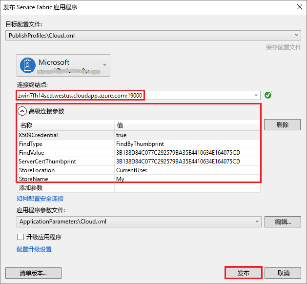

# <a name="tutorial-deploy-a-service-fabric-application-to-a-cluster-in-azure"></a>教程：将 Service Fabric 应用程序部署到 Azure 中的群集

本教程是一个系列中的第二部分。 它介绍如何将 Azure Service Fabric 应用程序部署到 Azure 中的新群集。

本教程介绍如何执行下列操作：
> [!div class="checklist"]
> * 创建群集。
> * 使用 Visual Studio 将应用程序部署到远程群集。

此教程系列介绍了如何：
> [!div class="checklist"]
> * [构建 .NET Service Fabric 应用程序](service-fabric-tutorial-create-dotnet-app.md)。
> * 将应用程序部署到远程群集。
> * [向 ASP.NET Core 前端服务添加 HTTPS 终结点](service-fabric-tutorial-dotnet-app-enable-https-endpoint.md)。
> * [使用 Azure Pipelines 配置 CI/CD](service-fabric-tutorial-deploy-app-with-cicd-vsts.md)。
> * [设置应用程序的监视和诊断](service-fabric-tutorial-monitoring-aspnet.md)。

## <a name="prerequisites"></a>先决条件

在开始学习本教程之前：

* 如果没有 Azure 订阅，请创建一个[试用帐户](https://www.azure.cn/pricing/1rmb-trial)。
* [安装 Visual Studio 2017](https://www.visualstudio.com/)，并安装 **Azure 开发**以及 **ASP.NET 和 Web 开发**工作负荷。
* [安装 Service Fabric SDK](service-fabric-get-started.md)。

## <a name="download-the-voting-sample-application"></a>下载投票示例应用程序

如果未生成[本教程系列的第一部分](service-fabric-tutorial-create-dotnet-app.md)中的投票示例应用程序，可以下载它。 在命令窗口中，运行以下代码，将示例应用程序存储库克隆到本地计算机。

```git
git clone https://github.com/Azure-Samples/service-fabric-dotnet-quickstart 
```

## <a name="publish-to-a-service-fabric-cluster"></a>发布到 Service Fabric 群集

至此，应用程序已准备就绪，可以直接通过 Visual Studio 将它部署到群集了。 [Service Fabric 群集](/service-fabric/service-fabric-deploy-anywhere)是一组通过网络连接在一起的虚拟机或物理计算机，你的微服务会在其中部署和管理。

对于本教程，使用 Visual Studio 将投票应用程序部署到 Service Fabric 群集时有一个选项可用：
* 发布到订阅中的现有群集。 可以通过 [Azure 门户](https://portal.azure.cn)、[PowerShel](./scripts/service-fabric-powershell-create-secure-cluster-cert.md)、[Azure CLI](./scripts/cli-create-cluster.md) 脚本或 [Azure 资源管理器模板](service-fabric-tutorial-create-vnet-and-windows-cluster.md)创建 Service Fabric 群集。

> [!NOTE]
> 许多服务使用反向代理来互相通信。 通过 Visual Studio 创建的群集默认启用反向代理。  如果使用现有的群集，则必须[在群集中启用反向代理](service-fabric-reverseproxy-setup.md)。

### <a name="find-the-voting-web-service-endpoint-for-your-azure-subscription"></a>查找你的 Azure 订阅的投票 Web 服务终结点

若要将投票应用程序发布到你自己的 Azure 订阅，请找到前端 Web 服务的终结点。

前端 Web 服务在特定端口上进行侦听。 当应用程序部署到 Azure 中的群集时，该群集和应用程序都在 Azure 负载均衡器之后运行。 必须使用规则在群集的 Azure 负载均衡器中打开应用程序端口。 打开的端口会将入站流量发送到 Web 服务。 端口可以在 **VotingWeb/PackageRoot/ServiceManifest.xml** 文件的 **Endpoint** 元素中找到。 例如，端口 8080。

```xml
<Endpoint Protocol="http" Name="ServiceEndpoint" Type="Input" Port="8080" />
```

对于你的 Azure 订阅，请通过 [PowerShell 脚本](./scripts/service-fabric-powershell-open-port-in-load-balancer.md)使用 Azure 中的某个负载均衡规则或者在 [Azure 门户](https://portal.azure.cn)中通过此群集的负载均衡器打开此端口。

<!--Not Available on ### Join a party cluster-->
### <a name="publish-the-application-by-using-visual-studio"></a>使用 Visual Studio 发布应用程序

至此，应用程序已准备就绪，可以直接通过 Visual Studio 将它部署到群集了。

1. 在解决方案资源管理器中，右键单击“投票”。 选择“发布”。 此时会显示“发布”对话框。

2. 将 Azure 订阅中的“连接终结点”复制到“连接终结点”字段。 例如 `zwin7fh14scd.chinanorth.cloudapp.chinacloudapi.cn:19000`。 选择“高级连接参数”。  确保 **FindValue** 和 **ServerCertThumbprint** 值与前面步骤中为与 Azure 订阅匹配的证书安装的证书指纹匹配。

    

    群集中的每个应用程序都必须具有唯一名称。  如果存在名称冲突，请重命名 Visual Studio 项目并将其重新部署。

3. 选择“发布”。

4. 若要转到群集中的投票应用程序，请打开浏览器并输入群集地址，后跟 **:8080**。 或者输入另一端口（如果已配置一个）。 例如 `http://zwin7fh14scd.chinanorth.cloudapp.chinacloudapi.cn:8080`。 会看到应用程序在 Azure 群集中运行。 在投票网页中，尝试添加和删除投票选项，并针对这些选项中的一个或多个进行投票。

    

## <a name="next-steps"></a>后续步骤

转到下一教程：
> [!div class="nextstepaction"]
> [启用 HTTPS](service-fabric-tutorial-dotnet-app-enable-https-endpoint.md)

<!--Update_Description: wording update, update link -->
