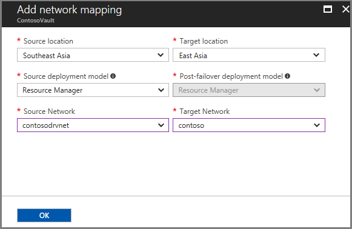
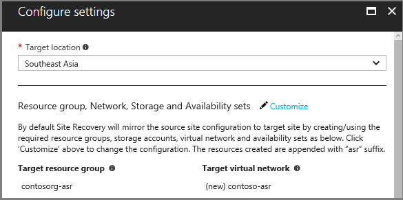
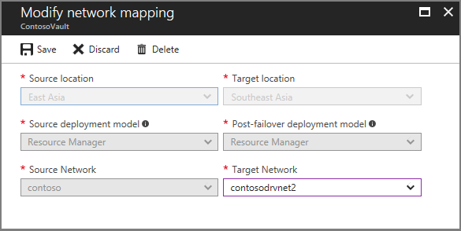

<!-- Notice: Change Source Location East Azure, China East TO Sourth East Asiz, China North --> 
# 可在不同 Azure 区域中的虚拟网络之间建立对等互连。

本文介绍如何将不同 Azure 区域中的两个 Azure 虚拟网络实例相互映射。 网络映射可确保在目标 Azure 区域中创建复制的虚拟机时，同样在映射到源虚拟机虚拟网络的虚拟网络上创建该虚拟机。  

## 先决条件
映射网络之前，请确保已在源 Azure 区域和目标 Azure 区域创建 [Azure 虚拟网络](../virtual-network/virtual-networks-overview.md)。

## 映射虚拟网络

若要将一个 Azure 区域中的 Azure 虚拟网络映射到另一个区域中的另一个虚拟网络，请转到“Site Recovery 基础结构” > “网络映射(针对 Azure 虚拟机)”，然后创建网络映射。 创建网络映射。

在以下示例中，虚拟机在“中国东部”区域中运行。 虚拟机正在复制到“中国北部”区域。
<!-- Notice: Change China East TO China North-->

若要创建从“中国东部”区域到“中国北部”区域的网络映射，请选择源网络的位置和目标网络的位置。 选择“确定”。
<!-- Notice: Change China East TO China North-->

重复前面的过程，以创建从“中国北部”区域到“中国东部”区域的网络映射。
<!-- Notice: Change China North TO China East-->

## 启用复制时映射网络

复制的虚拟机从一个 Azure 区域到另一个区域第一次，如果存在无网络映射时，设置复制时，可以设置目标网络。 根据此设置，Azure Site Recovery 创建网络映射的操作，从该源区域保存到目标区域中，从该目标区域保存到的源区域。   

默认情况下，Site Recovery 会在目标区域中创建与源网络相同的网络。 Site Recovery 会创建一个网络，通过添加 **-asr** 作为源网络的名称后缀。 若要选择已创建的网络，选择**自定义**。

如果已发生了网络映射，则无法更改目标虚拟网络，启用复制。 在这种情况下，若要更改目标虚拟网络，请修改现有的网络映射。  

> [!IMPORTANT]
> 如果你修改从区域 A 到区域 B 的网络映射，确保修改从区域 B 到区域 A 的网络映射
>
>

## 子网选择
根据源虚拟机子网的名称选择目标虚拟机的子网。 如果可在目标网络中找到与源虚拟机子网同名的子网，则为目标虚拟机选择该子网。 如果目标网络中没有同名的子网，则按字母顺序选择第一个子网作为目标子网。

若要修改子网，请转到**计算和网络**虚拟机的设置。

## IP 地址

按如下方式为目标虚拟机的各个网络接口选择 IP 地址：

### DHCP
如果源虚拟机的网络接口使用的是 DHCP，则目标虚拟机的网络接口也设置为 DHCP。

### 静态 IP 地址
如果源虚拟机的网络接口使用的是静态 IP 地址，则目标虚拟机的网络接口也设置为使用静态 IP 地址。 下列各节描述如何设置静态 IP 地址。

#### 地址空间相同

如果源子网和目标子网具有相同的地址空间，则将源虚拟机网络接口的 IP 地址设置为目标 IP 地址。 如果相同 IP 地址不可用，则将下一个可用 IP 地址设置为目标 IP 地址。

#### 不同的地址空间

如果源子网和目标子网具有不同的地址空间，则将目标 子网中下一个可用 IP 地址设置为目标 IP 地址。

可以转到虚拟机的“计算和网络”设置来修改各网络接口上的目标 IP。

## 后续步骤

* 查看[有关复制 Azure 虚拟机的网络指南](site-recovery-azure-to-azure-networking-guidance.md)。
<!--Update_Description: update meta properties -->