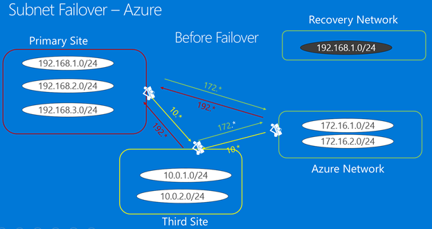
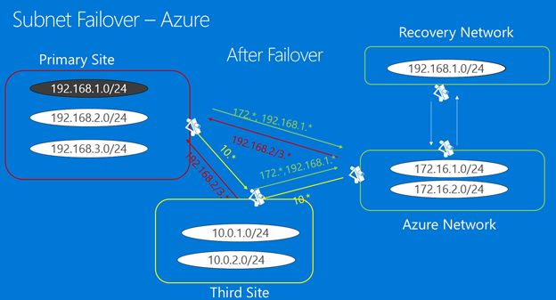

# 从本地故障转移后连接到 Azure VM 

本文介绍如何设置连接，以便在故障转移后能够成功连接到 Azure VM。

设置本地虚拟机 (VM) 和物理服务器到 Azure 的灾难恢复后，[Azure Site Recovery](site-recovery-overview.md) 会开始将计算机复制到 Azure。 然后，在发生服务中断时，你可以从本地站点故障转移到 Azure。 发生故障转移时，Site Recovery 将使用复制的本地数据创建 Azure VM。 作为灾难恢复规划的一部分，需要确定在故障转移后如何连接到这些 Azure VM 上运行的应用。

本文介绍如何执行以下操作：

> [!div class="checklist"]
> * 在故障转移之前准备本地计算机。
> * 在故障转移之后准备 Azure VM。 
> * 在故障转移之后保留 Azure VM 上的 IP 地址。
> * 在故障转移之后将新的 IP 地址分配给 Azure VM。

## 准备本地计算机

为了确保能够连接到 Azure VM，在故障转移之前请准备好本地计算机。

### 准备 Windows 计算机

在本地 Windows 计算机上执行以下操作：

1. 配置 Windows 设置。 这包括删除任何静态持久路由或 WinHTTP 代理，并将磁盘 SAN 策略设置为 **OnlineAll**。 [按照这些说明](../virtual-machines/windows/prepare-for-upload-vhd-image.md#set-windows-configurations-for-azure)进行操作。

2. 确保[这些服务](../virtual-machines/windows/prepare-for-upload-vhd-image.md#check-the-windows-services)正在运行。

3. 启用远程桌面 (RDP)，以便能够远程连接到本地计算机。 [了解如何](../virtual-machines/windows/prepare-for-upload-vhd-image.md#update-remote-desktop-registry-settings)使用 PowerShell 启用 RDP。

4. 若要在故障转移后通过 Internet 访问 Azure VM，请在本地计算机上的 Windows 防火墙中，在“公共”配置文件中允许 TCP 和 UDP，并将 RDP 设置为所有配置文件允许的应用。

5. 若要在故障转移后通过站点到站点 VPN 访问 Azure VM，请在本地计算机上的 Windows 防火墙中，允许对“域”和“专用”配置文件使用 RDP。 [了解](../virtual-machines/windows/prepare-for-upload-vhd-image.md#configure-windows-firewall-rules)如何允许 RDP 流量。
6. 确保在触发故障转移时本地 VM 上没有任何挂起的 Windows 更新。 如果有，在故障转移后，这些更新可能会在 Azure VM 上开始安装，而在更新完成之前，你将无法登录到 VM。

### 准备 Linux 计算机

在本地 Linux 计算机上执行以下操作：

1. 检查安全外壳服务是否设置为在系统引导时自动启动。
2. 确保防火墙规则允许 SSH 连接。

## 故障转移后配置 Azure VM

故障转移后，在创建的 Azure VM 上执行以下操作。

1. 若要通过 Internet 连接到 VM，请将公共 IP 地址分配到该 VM。 不能将本地计算机所用的同一个公共 IP 地址用于 Azure VM。 [了解详细信息](../virtual-network/virtual-network-public-ip-address.md)
2. 检查 VM 上的网络安全组 (NSG) 规则是否允许与 RDP 或 SSH 端口建立传入连接。
3. 在[启动诊断](../virtual-machines/troubleshooting/boot-diagnostics.md#enable-boot-diagnostics-on-existing-virtual-machine)中查看 VM。

<!--Not Available on [Learn more](../bastion/bastion-overview.md)-->

## 设置公共 IP 地址

除了手动为 Azure VM 分配公共 IP 地址以外，还可以在故障转移期间使用某个脚本或 Site Recovery [恢复计划](site-recovery-create-recovery-plans.md)中的 Azure 自动化 Runbook 来分配地址，或者使用 Azure 流量管理器设置 DNS 级路由。 [详细了解](concepts-public-ip-address-with-site-recovery.md)如何设置公共地址。

## 分配内部地址

若要在故障转移后设置 Azure VM 的内部 IP 地址，可使用以下选项：

- **保留相同 IP 地址**：可在 Azure VM 上使用与分配给本地计算机的 IP 地址相同的 IP 地址。
- **使用不同 IP 地址**：可为 Azure VM 使用其他 IP 地址。

## 保留 IP 地址

在故障转移到 Azure 时，Site Recovery 允许保留相同的 IP 地址。 保留相同的 IP 地址可以避免故障转移后出现潜在的网络问题，但这会带来一些复杂性。

- 如果目标 Azure VM 使用与本地站点相同的 IP 地址/子网，则无法使用站点到站点 VPN 连接或 ExpressRoute 在它们之间建立连接，因为地址存在重叠。 子网必须是唯一的。
- 故障转移后，需要从本地连接到 Azure，以便可以在 Azure VM 上使用相关的应用。 Azure 不支持延伸的 VLAN，因此，若要保留 IP 地址，需要通过故障转移本地计算机以及整个子网，将 IP 空间转接到 Azure。
- 子网故障转移确保特定的子网不能同时在本地和 Azure 中可用。

保留 IP 地址需要执行以下步骤：

- 在复制的项的“计算和网络”属性中，将目标 Azure VM 的网络和 IP 地址设置为镜像本地设置。
- 在灾难恢复过程中必须管理子网。 需要通过一个 Azure VNet 来匹配本地网络。故障转移后，必须修改故障转移网络路由，以反映子网已移到 Azure，并反映新的 IP 地址位置。  

### 故障转移示例

接下来举例说明。

- 虚构公司 Woodgrove Bank 在本地托管其业务应用，并在 Azure 中托管其移动应用。
- 他们通过站点到站点 VPN 从本地连接到 Azure。 
- Woodgrove 使用 Site Recovery 将本地计算机复制到 Azure。
- 其本地应用使用硬编码的 IP 地址，因此他们想要在 Azure 中保留相同的 IP 地址。
- 运行这些应用的本地计算机在以下三个子网中运行：
    - 192.168.1.0/24
    - 192.168.2.0/24
    - 192.168.3.0/24
- Azure 中运行的应用位于以下两个子网中的 Azure VNet“Azure 网络”中： 
    - 172.16.1.0/24
    - 172.16.2.0/24

他们通过以下操作来保留地址。

1. 启用复制时，指定应将计算机复制到“Azure 网络”。 
2. 在 Azure 中创建“恢复网络”。  此 VNet 镜像其本地网络中的 192.168.1.0/24 子网。
3. Woodgrove 在两个网络之间设置了 [VNet 到 VNet 连接](../vpn-gateway/vpn-gateway-howto-vnet-vnet-resource-manager-portal.md)。 

    > [!NOTE]
    > 根据应用程序的要求，可以在故障转移之前通过手动步骤/脚本化步骤/Site Recovery [恢复计划](site-recovery-create-recovery-plans.md)中的Azure 自动化 Runbook 设置 VNet 到 VNet 连接，或者在故障转移完成后设置此连接。

4. 故障转移之前，他们按以下过程中所述，在 Site Recovery 的计算机属性中将目标 IP 地址设置为本地计算机的地址。
5. 故障转移后，使用相同的 IP 地址创建 Azure VM。 Woodgrove 使用 VNet 对等互连（已启用传输连接）将“Azure 网络”连接到“恢复网络”VNet。  
6. 在本地，Woodgrove 需要进行网络更改（包括修改路由），以反映 192.168.1.0/24 已移到 Azure。  

**故障转移前的基础结构**

**故障转移后的基础结构**

### 指定目标网络设置

在故障转移之前，为目标 Azure VM 指定网络设置和 IP 地址。

1. 在“恢复服务保管库”->“复制的项”中，选择本地计算机。 
2. 在计算机的“计算和网络”页中，单击“编辑”以配置目标 Azure VM 的网络和适配器设置。  
3. 在“网络属性”中，选择故障转移后创建的 Azure VM 所在的目标网络。 
4. 在“网络接口”中，配置目标网络中的网络适配器。  Site Recovery 默认会显示本地计算机上所有已检测到的 NIC。
    - 在“目标网络接口类型”中，可将每个 NIC 设置为“主要”、“辅助”接口；如果在目标网络中不需要该特定 NIC，请选择“不要创建”。     必须将一个网络适配器设置为用于故障转移的主要接口。 请注意，修改目标网络会影响 Azure VM 的所有 NIC。
    - 单击 NIC 名称以指定要在其中部署 Azure VM 的子网。
    - 使用要分配给目标 Azure VM 的专用 IP 地址覆盖“动态”地址。  如果未指定 IP 地址，Site Recovery 会在故障转移时将子网中的下一个可用 IP 地址分配给 NIC。
    - [详细了解](site-recovery-manage-network-interfaces-on-premises-to-azure.md)如何管理用于从本地故障转移到 Azure 的 NIC。

## 获取新 IP 地址

在此方案中，Azure VM 会在故障转移后获取新的 IP 地址。 通过 DNS 更新将已故障转移的计算机的记录更新为指向 Azure VM 的 IP 地址。

## 后续步骤
[了解](site-recovery-active-directory.md)如何将本地 Active Directory 和 DNS 复制到 Azure。

<!-- Update_Description: update meta properties, wording update, update link -->