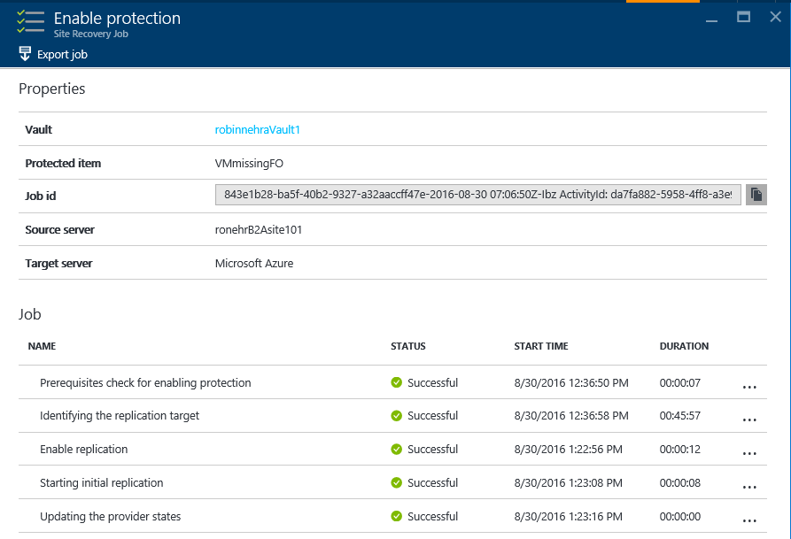
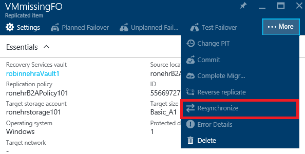

# Hyper-V 到 Azure 的灾难恢复体系结构

本文介绍使用 [Azure Site Recovery](site-recovery-overview.md) 服务在本地 Hyper-V 主机与 Azure 之间对 Hyper-V 虚拟机 (VM) 进行复制、故障转移和恢复时所使用的体系结构和过程。

可以选择在 System Center Virtual Machine Manager (VMM) 私有云中对 Hyper-V 主机进行托管。

## 体系结构组件 - Hyper-V（不使用 VMM）

下面的表和图提供了在 Hyper-V 主机不受 VMM 托管时用于将 Hyper-V 复制到 Azure 的组件的概要视图。

**组件** | **要求** | **详细信息**
--- | --- | ---
**Azure** | Azure 订阅、Azure 存储帐户和 Azure 网络。 | 从本地 VM 工作负载复制的数据存储在存储帐户中。 从本地站点运行故障转移时，使用复制的工作负载数据创建 Azure VM。   创建 Azure VM 后，它们将连接到 Azure 虚拟网络。
**Hyper-V** | 在 Site Recovery 部署期间，将 Hyper-V 主机和群集收集到 Hyper-V 站点。 在每个独立 Hyper-V 主机或每个 Hyper-V 群集节点上安装 Azure Site Recovery 提供程序和恢复服务代理。 | 提供程序通过 Internet 使用 Site Recovery 来安排复制。 恢复服务代理处理数据复制。   来自提供程序和代理的通信都是安全且经过加密的。 Azure 存储中的复制数据也已加密。
**Hyper-V VM** | 一个或多个在 Hyper-V 上运行的 VM。 | 不需在 VM 上显式安装任何内容。

**Hyper-V 到 Azure 体系结构（不使用 VMM）**

## 体系结构组件 - Hyper-V（使用 VMM）

下面的表和图提供了在 Hyper-V 主机托管在 VMM 云中时用于将 Hyper-V 复制到 Azure 的组件的概要视图。

**组件** | **要求** | **详细信息**
--- | --- | ---
**Azure** | Azure 订阅、Azure 存储帐户和 Azure 网络。 | 从本地 VM 工作负载复制的数据存储在存储帐户中。 从本地站点进行故障转移时，使用复制的数据创建 Azure VM。   创建 Azure VM 后，它们将连接到 Azure 虚拟网络。
**VMM 服务器** | VMM 服务器上有一个或多个包含 Hyper-V 主机的云。 | 在 VMM 服务器上安装 Site Recovery 提供程序，以便协调通过 Site Recovery 进行的复制，并在恢复服务保管库中注册服务器。
**Hyper-V 主机** | 一个或多个由 VMM 管理的 Hyper-V 主机/群集。 |  在每个 Hyper-V 主机或群集节点上安装恢复服务代理。
**Hyper-V VM** | 一个或多个在 Hyper-V 主机服务器上运行的 VM。 | 不需在 VM 上显式安装任何内容。
**联网** | 在 VMM 服务器上设置的逻辑网络和 VM 网络。 VM 网络应链接到与云关联的逻辑网络。 | VM 网络将映射到 Azure 虚拟网络。 如果在故障转移后创建 Azure VM，它们会添加到已映射至 VM 网络的 Azure 网络。

**Hyper-V 到 Azure 体系结构（使用 VMM）**

## 复制过程

**复制和恢复过程**

### 启用保护

1. 为 Hyper-V VM 启用保护后，在 Azure 门户中或本地，**启用保护**会启动。
2. 该作业先检查计算机是否符合先决条件，再调用 [CreateReplicationRelationship](https://msdn.microsoft.com/library/hh850036.aspx)，以使用用户配置的设置来设置复制。
3. 该作业通过调用 [StartReplication](https://msdn.microsoft.com/library/hh850303.aspx) 方法启动初始复制，以便初始化完整的 VM 复制，并将 VM 的虚拟磁盘发送到 Azure。
4. 可以在“作业”选项卡中监视作业。   

### 初始数据复制

1. 当触发初始复制时，系统会拍摄一个 [Hyper-V VM 快照](https://technet.microsoft.com/library/dd560637.aspx)。
2. VM 上的虚拟硬盘是逐一复制的，直至全部复制到 Azure 为止。 该过程可能需要一些时间，具体取决于 VM 大小和网络带宽。 [了解如何](https://support.microsoft.com/kb/3056159)增加网络带宽。
3. 如果在初始复制期间发生磁盘更改，Hyper-V 副本复制跟踪器将跟踪这些更改，并将其记录在 Hyper-V 复制日志 (.hrl) 中。 这些日志文件位于与磁盘相同的文件夹中。 每个磁盘都有一个关联的 .hrl 文件，该文件将发送到辅助存储器。 当初始复制正在进行时，快照和日志文件将占用磁盘资源。
4. 当初始复制完成时，会删除 VM 快照。
5. 日志中的增量磁盘更改会同步且合并到父磁盘中。

### 完成保护过程

1. 初始复制完成后，“在虚拟机上完成保护”  作业将运行。 该作业会配置网络和其他复制后设置以便保护 VM。
2. 在此阶段，可以检查 VM 设置以确保它已为故障转移做好准备。 可针对 VM 运行灾难恢复钻取（测试故障转移）来检查它是否按预期进行故障转移。 

## 增量复制

1. 在完成初始复制后，根据复制策略开始增量复制同步。
2. Hyper-V 副本复制跟踪器跟踪对虚拟硬盘所做的更改，并将其另存为 .hrl 文件。 为复制配置的每个磁盘都有一个关联的 .hrl 文件。
3. 此日志会发送到客户的存储帐户。 当日志正处于传输到 Azure 的过程中时，主磁盘中的变更会记录到同一文件夹的另一日志文件中。
4. 在初始复制和增量复制过程中，可以在 Azure 门户中监视 VM。

### 重新同步过程

1. 如果增量复制失败且完整复制因带宽或时间限制而需要大量开销，则会将 VM 标记为需要重新同步。
    - 例如，如果 .hrl 文件达到磁盘大小的 50%，系统会将 VM 标记为需要重新同步。
    -  默认情况下，重新同步安排为在非工作时间自动运行。
1. 重新同步仅发送增量数据。
    - 它通过计算源 VM 和目标 VM 的校验和，最大程度地减小发送的数据量。
    - 它使用固定块区块算法，其中源文件和目标文件被分到固定区块。
    - 会针对每个区块生成校验和。 这些校验和将进行比较，以确定源文件中的哪些区块需要应用到目标文件。
2. 重新同步完成后，应会恢复正常增量复制。
3. 如果你不希望等待默认非工作时间的重新同步，可手动重新同步 VM。 例如，在发生中断时。 为此，请在 Azure 门户中选择“VM”>“重新同步”  。

    

### 重试过程

如果发生复制错误，会进行内置重试。 重试的分类依据如表中所述。

**类别** | **详细信息**
--- | ---
**不可恢复的错误** | 不尝试重试操作。 VM 状态将为“严重”，并且需要管理员干预。    这些错误示例包括 VHD 链断裂、副本 VM 的状态无效、网络身份验证错误、授权错误以及“找不到 VM”错误（适用于独立 Hyper-V 服务器）。
**可恢复的错误** | 使用从首次尝试开始以 1、2、4、8 和 10 分钟幅度递增重试间隔时间的指数退避算法，在到达复制间隔时间后重试。 如果错误仍然存在，则每隔 30 分钟重试一次。 其中的一些示例包括网络错误、磁盘空间不足错误和内存不足的情况。

## 故障转移和故障回复过程

1. 可以运行从本地 Hyper-V VM 到 Azure 的计划内或计划外故障转移。 如果运行计划内故障转移，则源 VM 关闭以确保不会丢失数据。 如果无法访问主站点，则运行计划外故障转移。
2. 可以故障转移单个虚拟机，或者创建恢复计划来协调多个虚拟机的故障转移。
3. 运行故障转移。 故障转移的第一阶段完成后，应该会在 Azure 中看到创建的副本 VM。 如果需要，可向 VM 分配公共 IP 地址。
4. 然后，提交故障转移以开始从副本 Azure VM 访问工作负载。

在本地基础结构启动并再次运行后，即可进行故障回复。 故障回复会出现在以下三个阶段：

1. 启动从 Azure 到本地站点的计划内故障转移：
    - **最大限度减少停机时间**：如果使用此选项，Site Recovery 将在故障转移之前同步数据。 它会检查更改的数据块并将它们下载到本地站点，同时让 Azure VM 保持运行并最大限度减少停机时间。 当手动指定故障转移应完成时，Azure VM 会关闭，任何最终增量更改会被复制，而故障转移将启动。
    - **完整下载**：使用此选项可在故障转移期间同步数据。 此选项会下载整个磁盘。 该操作更快，因为不计算校验和，但停机时间会增加。 如果运行副本 Azure VM 已有一段时间，或者如果本地 VM 已删除，请使用此选项。
    - **创建 VM**：可选择故障回复到同一 VM 或备用 VM。 如果 VM 尚不存在，可指定 Site Recovery 应创建 VM。

2. 初始数据同步完成后，选择完成故障转移。 该操作完成后，可以登录到本地 VM 验证一切是否按预期运行。 在 Azure 门户中，可以看到 Azure VM 均已停止。
3. 然后，完成故障转移的提交，并重新开始从本地 VM 访问工作负载。
4. 在工作负载进行故障回复后，启用反向复制，以便本地 VM 重新复制到 Azure。

## 后续步骤

根据[此教程](tutorial-prepare-azure.md)开始使用 Hyper-V 到 Azure 复制。

<!-- Update_Description: update meta propreties -->