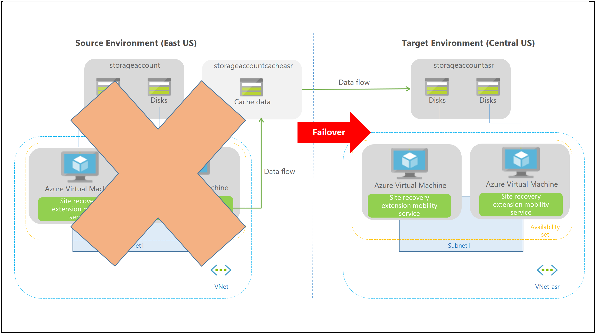

# 如何在 Site Recovery 中进行 Azure VM 复制？

本文介绍使用 [Azure Site Recovery](site-recovery-overview.md) 服务将 Azure 虚拟机 (VM) 从一个区域复制和恢复到另一个时所涉及的组件和进程。

>[!NOTE]
>使用 Site Recovery 服务进行 Azure VM 复制当前处于预览阶段。

## 体系结构组件

下面的高级视图展示了某个特定区域（在此示例中为中国东部）中的 Azure VM 环境。 在 Azure VM 环境中：
- 应用可在包含的磁盘分布于多个存储帐户中 VM 上运行。
- VM 可以包含在虚拟网络中的一个或多个子网中。

在[支持矩阵](site-recovery-support-matrix-azure-to-azure.md)中了解部署先决条件和要求。

## 复制过程

### 步骤 1

在 Azure 门户中启用 Azure VM 复制时，会在目标区域中自动创建以下图表中所示的资源。 默认情况下，基于源区域设置创建资源。 可根据需要自定义目标设置。
<!-- Not Available site-recovery-replicate-azure-to-azure.md -->

**资源** | **详细信息**
--- | ---
目标资源组 | 故障转移后复制的 VM 所属的资源组。
目标虚拟网络 | 故障转移后复制的 VM 所在的虚拟网络。 创建源虚拟网络与目标虚拟网络之间的网络映射，反之亦然。
缓存存储帐户 | 在将源 VM 上的更改复制到目标存储帐户之前，系统会跟踪这些更改，并将它们发送到目标位置中的缓存存储帐户。 这可最大限度降低对在 VM 上运行的生产应用的影响。
目标存储帐户  | 目标位置中的存储帐户，将向其中复制数据。
目标可用性集  | 故障转移后复制的 VM 所在的可用性集。

### 步骤 2

启用复制后，会在 VM 上自动安装 Site Recovery 扩展移动服务。 将发生以下情况：

1. 向 Site Recovery 注册 VM。

2. 为 VM 配置连续复制。 VM 磁盘中的数据写入会持续传输到源位置中的缓存存储帐户。

    

    > [!IMPORTANT]
    > Site Recovery 不必与 VM 建立入站连接。 VM 仅需与 Site Recovery 服务 URL/IP 地址、 Office 365 身份验证 URL/IP 地址和缓存存储帐户 IP 地址建立出站连接。 有关详细信息，请参阅 [Networking guidance for replicating Azure virtual machines（有关复制 Azure 虚拟机的网络指南）](site-recovery-azure-to-azure-networking-guidance.md)一文。

## 连续复制过程

开始运行连续复制后，磁盘写入会立即传输到缓存存储帐户。 Site Recovery 会处理数据，并将其发送到目标存储帐户。 处理数据后，每隔几分钟就会在目标存储帐户中生成恢复点。

## 故障转移过程

启动故障转移时，会在目标资源组、目标虚拟网络、目标子网和目标可用性集中创建 VM。 可在故障转移过程中使用任意恢复点。

## 后续步骤

- 了解有关 Azure VM 复制的[网络服务](site-recovery-azure-to-azure-networking-guidance.md)。
<!-- Not Available [replicate Azure VMs.](site-recovery-azure-to-azure.md) -->