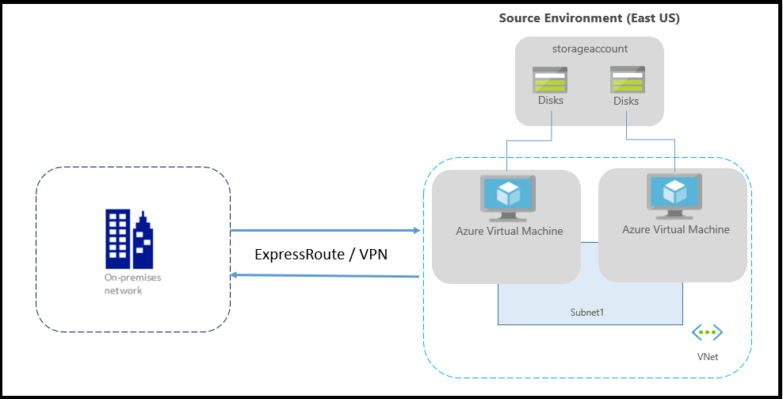

# 有关复制 Azure 虚拟机的网络指南

> [!NOTE]
> Azure 虚拟机的 Site Recovery 复制当前处于预览阶段。

本文详细介绍了使用 Azure Site Recovery 在不同区域之间复制和恢复 Azure 虚拟机的网络指南。 有关 Azure Site Recovery 要求的详细信息，请参阅[先决条件](site-recovery-prereq.md)一文。

## Site Recovery 体系结构

借助 Site Recovery，可以简单轻松地将 Azure 虚拟机上运行的应用程序复制到另一个 Azure 区域，以便在主要区域发生中断时恢复这些应用程序。 详细了解[此方案和 Site Recovery 体系结构](site-recovery-azure-to-azure-architecture.md)。

## 网络基础结构

下图描绘了 Azure 虚拟机上运行的应用程序的典型 Azure 环境：

如果使用 Azure ExpressRoute 或从本地网络到 Azure 的 VPN 连接，则环境如下所示：

通常，客户使用防火墙和/或网络安全组 (NSG) 保护他们的网络。 防火墙可以使用基于 URL 或基于 IP 的允许列表来控制网络连接。 NSG 允许使用 IP 范围控制网络连接的规则。

> [!IMPORTANT]
> 如果使用经过身份验证的代理控制网络连接，则不受支持，且无法启用 Site Recovery 复制。

以下部分讨论需要从 Azure 虚拟机进行的网络出站连接更改，以使 Site Recovery 复制正常工作。

## Azure Site Recovery URL 的出站连接

如果使用任何基于 URL 的防火墙代理控制出站连接，请确保将下列必需的 Azure Site Recovery 服务 URL 列入允许列表：

**URL** | **用途**  
--- | ---
*.blob.core.chinacloudapi.cn | 必需，以便从 VM 将数据写入到源区域中的缓存存储帐户。
login.chinacloudapi.cn | 对于 Site Recovery 服务 URL 的授权和身份验证而言是必需的。
*.hypervrecoverymanager.windowsazure.cn | 必需，以便从 VM 进行 Site Recovery 服务通信。
*.servicebus.chinacloudapi.cn | 必需，以便从 VM 写入 Site Recovery 监视和诊断数据。

## Azure Site Recovery IP 范围的出站连接

> [!NOTE]
> 若要在网络安全组上自动创建所需的 NSG 规则，可以[下载并使用此脚本](https://gallery.technet.microsoft.com/Azure-Recovery-script-to-0c950702)。

> [!IMPORTANT]
> * 在生产网络安全组上创建所需的 NSG 规则之前，建议先在测试网络安全组上创建这些规则，并确保没有任何问题。
> * 若要创建所需的 NSG 规则数，请确保订阅已列入允许列表。 联系支持人员，提高订阅中的 NSG 规则限制。

如果使用任何基于 IP 的防火墙代理或 NSG 规则控制出站连接，则需要将以下 IP 范围列入允许列表，具体取决于虚拟机的源位置和目标位置：

- 对应于源位置的所有 IP 范围。 （可以下载 [IP 范围](https://www.microsoft.com/download/confirmation.aspx?id=41653)。）必须列入允许列表，才能从 VM 将数据写入到缓存存储帐户。

- 对应于 Office 365 [身份验证和标识 IP V4 终结点](https://support.office.com/article/Office-365-URLs-and-IP-address-ranges-8548a211-3fe7-47cb-abb1-355ea5aa88a2#bkmk_identity)的所有 IP 范围。

    >[!NOTE]
    > 如果将来向 Office 365 IP 范围添加新的 IP，则需要创建新的 NSG 规则。

- 确保根据目标位置将 Site Recovery 服务终结点 IP 添加到白名单。
<!-- Append china region whitelist from PM later -->

## NSG 配置示例
本部分介绍配置 NSG 规则的相关步骤，配置后，Site Recovery 复制便可在虚拟机上正常工作。 如果使用 NSG 规则控制出站连接，请对所有必需的 IP 范围使用“允许 HTTPS 出站”规则。

>[!Note]
> 若要在网络安全组上自动创建所需的 NSG 规则，可以[下载并使用此脚本](https://gallery.technet.microsoft.com/Azure-Recovery-script-to-0c950702)。

例如，如果 VM 的源位置为“中国东部”，复制目标位置为“中国北部”，则按照接下来两部分中的步骤操作。

>[!IMPORTANT]
> * 在生产网络安全组上创建所需的 NSG 规则之前，建议先在测试网络安全组上创建这些规则，并确保没有任何问题。
> * 若要创建所需的 NSG 规则数，请确保订阅已列入允许列表。 联系支持人员，提高订阅中的 NSG 规则限制。

### 中国东部网络安全组上的 NSG 规则

* 创建对应于[中国东部 IP 范围](https://www.microsoft.com/download/details.aspx?id=42064)的规则。 这是必需的，以便数据可以从 VM 写入缓存存储帐户。

* 为对应于 Office 365 [身份验证和标识 IP V4 终结点](https://support.office.com/article/Office-365-URLs-and-IP-address-ranges-8548a211-3fe7-47cb-abb1-355ea5aa88a2#bkmk_identity)的所有 IP 范围创建规则。

* 创建对应于目标位置的规则：

   **位置** | **Site Recovery 服务 IP** |  **Site Recovery 监视 IP**
    --- | --- | ---
   中国北部 | 40.69.144.231 | 52.165.34.144

### 中国北部网络安全组上的 NSG 规则

必须创建这些规则，才能在故障转移后启用从目标区域到源区域的复制：

* 对应于[中国北部 IP 范围](https://www.microsoft.com/download/details.aspx?id=42064)的规则。 必须创建这些规则，才能从 VM 将数据写入到缓存存储帐户。

* 针对对应于 Office 365 [身份验证和标识 IP V4 终结点](https://support.office.com/article/Office-365-URLs-and-IP-address-ranges-8548a211-3fe7-47cb-abb1-355ea5aa88a2#bkmk_identity)的所有 IP 范围的规则。

* 对应于源位置的规则：

   **位置** | **Site Recovery 服务 IP** |  **Site Recovery 监视 IP**
    --- | --- | ---
   中国东部 | 13.82.88.226 | 104.45.147.24

## 现有 Azure 到本地 ExpressRoute/VPN 配置的相关准则

如果在本地和 Azure 中的源位置之间建立了 ExpressRoute 或 VPN 连接，请遵从本部分中的准则。

### 强制隧道配置

常见的客户配置是定义默认路由 (0.0.0.0/0)，以强制出站 Internet 流量流向本地位置。 但并不建议这样做。 复制流量和 Site Recovery 服务通信不应离开 Azure 边界。 若要解决此问题，可以为[这些 IP 范围](#outbound-connectivity-for-azure-site-recovery-ip-ranges)添加用户定义路由 (UDR)，使复制流量不流向本地。

### 目标位置与本地位置之间的连接

目标位置与本地位置之间的连接遵循以下准则：
- 如果应用程序需要连接到本地计算机，或者有通过 VPN/ExpressRoute 从本地连接到应用程序的客户端，请确保在目标 Azure 区域和本地数据中心之间至少有一个[站点到站点连接](../vpn-gateway/vpn-gateway-howto-site-to-site-resource-manager-portal.md)。

- 如果预计有大量流量在目标 Azure 区域与本地数据中心之间流动，则应在目标 Azure 区域与本地数据中心之间再创建一个 [ExpressRoute 连接](../expressroute/expressroute-introduction.md)。

- 如果想在故障转移后保留虚拟机的 IP，则将目标区域的站点到站点/ExpressRoute 连接保留为断开状态。 这样做可确保源区域的 IP 范围和目标区域的 IP 范围之间没有范围冲突。

### ExpressRoute 配置的最佳实践
请遵从以下 ExpressRoute 配置最佳做法：

- 需要在源区域和目标区域中分别创建 ExpressRoute 线路。 然后需要在以下对象之间创建连接：
  - 源虚拟网络和 ExpressRoute 线路。
  - 目标虚拟网络和 ExpressRoute 线路。

- ExpressRoute 标准规定，可以在同一地缘政治区域创建线路。 若要在不同的地缘政治区域创建 ExpressRoute 线路，则需使用 Azure ExpressRoute 高级版，这会增加成本。 （如果已在使用 ExpressRoute 高级版，则不必支付额外费用。）有关更多详细信息，请参阅 [ExpressRoute 定价](https://www.azure.cn/pricing/details/expressroute/)。
<!-- Not Available [ExpressRoute locations document](../expressroute/expressroute-locations.md#azure-regions-to-expressroute-locations-within-a-geopolitical-region) -->

- 建议在源区域和目标区域中使用不同的 IP 范围。 ExpressRoute 线路无法同时连接两个使用相同 IP 范围的 Azure 虚拟网络。

- 可以在这两个区域创建使用相同 IP 范围的虚拟网络，然后在这两个区域分别创建 ExpressRoute 线路。 发生故障转移时，断开源虚拟网络中的线路，连接目标虚拟网络中的线路。

 >[!IMPORTANT]
 > 如果主要区域完全关闭，断开连接操作可能会失败， 导致目标虚拟网络无法获取 ExpressRoute 连接。

## 后续步骤
<!-- Not Available [replicating Azure virtual machines](site-recovery-azure-to-azure.md) -->

<!--Update_Description: wording update-->