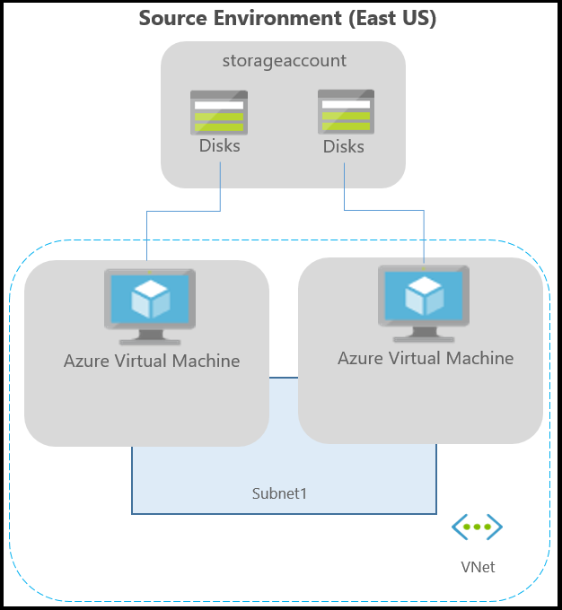

# 有关复制 Azure 虚拟机的网络指南

>[!NOTE]
>
> Azure 虚拟机的 Site Recovery 复制当前处于预览阶段。

本文详细介绍将 Azure 虚拟机从一个区域复制和恢复到另一个区域时的 Azure Site Recovery 网络指南。 有关 Azure Site Recovery 要求的详细信息，请参阅[先决条件](site-recovery-prereq.md)。

## Site Recovery 体系结构

Site Recovery 提供一种简单轻松的方式，来将 Azure 虚拟机上运行的应用程序复制到另一个 Azure 区域，以便在主要区域发生中断时进行恢复。 可在此文档中参考更多有关[方案及其体系结构](site-recovery-azure-to-azure-architecture.md)的详细信息。

## 准备网络基础结构

下图描绘了在 Azure 虚拟机上运行的应用程序的典型 Azure 环境。

如果使用从本地到 Azure 的 ExpressRoute 或 VPN 连接，则环境如下所示。

通常客户会使用防火墙和/或网络安全组 (NSG) 保护他们的网络。 防火墙可使用基于 URL 或 IP 的白名单来控制网络连接。 NSG 允许使用 IP 范围来控制网络连接的规则。

>[!IMPORTANT]
>
> 如果使用已验证的代理来控制网络连接，则它不受支持，且无法启用 Site Recovery 复制。

需要对 Azure 虚拟机进行以下网络出站连接更改，才能使 Site Recovery 复制正常工作。

## Azure Site Recovery URL 的出站连接

如果使用任何基于 URL 的防火墙代理来控制出站连接，请确保将以下提及的所有必需的 Azure Site Recovery 服务 URL 都添加到白名单内。

**URL** | **用途**  
--- | ---
*.blob.core.chinacloudapi.cn | 必需，以便数据可以从 VM 写入源区域中的缓存存储帐户。
login.chinacloudapi.cn | 对于 Site Recovery 服务 URL 的授权和身份验证而言是必需的。
*.hypervrecoverymanager.windowsazure.cn | 必需，以便可以从 VM 中进行 Site Recovery 服务通信。
*.servicebus.chinacloudapi.cn | 必需，以便可以从 VM 中写入 Site Recovery 监视和诊断数据。

##Azure Site Recovery IP 范围的出站连接

如果使用任何基于 IP 的防火墙代理或网络安全组 (NSG) 规则来控制出站连接，以下是需要添加到白名单的 IP 范围，具体取决于运行虚拟机的源位置和虚拟机将复制到的目标位置。

> [!NOTE]
>
> 可以下载并使用[此处可用的脚本](https://gallery.technet.microsoft.com/Azure-Recovery-script-to-0c950702)自动在 NSG 上创建所需的 NSG 规则。

> [!IMPORTANT]
> 1. 建议在测试 NSG 上创建所需的 NSG 规则，并确保在生产 NSG 上创建规则之前一切正常。
> 2. 确保订阅已添加到白名单，以便可创建所需数量的 NSG 规则。 可以联系支持人员增加订阅中的 NSG 规则上限。

- 确保对应于源位置的所有 IP 范围均已添加到白名单内。 可从[此处](https://www.microsoft.com/download/confirmation.aspx?id=41653)获取IP 范围。 这是必需的，以便数据可以从 VM 写入缓存存储帐户。

- 确保所有对应于[此处列出的 Office 365 验证和标识 IP V4 终结点](https://support.office.com/article/Office-365-URLs-and-IP-address-ranges-8548a211-3fe7-47cb-abb1-355ea5aa88a2#bkmk_identity)的 IP 范围均已添加到白名单。

    >[!NOTE]
    > 如果有新的 IP 在将来添加到 Office 365 IP 范围，则同样需要创建新的 NSG 规则。

- 确保根据目标位置将 Site Recovery 服务终结点 IP 添加到白名单。
<!-- Append china region whitelist from PM later -->

## 示例网络安全组 (NSG) 配置

本部分详细介绍配置 NSG 规则需遵循的步骤，以便 Site Recovery 复制可在虚拟机上工作。 如果使用网络安全组 (NSG) 规则来控制出站连接，需要确保对所有必需的 IP 范围启用“允许 HTTPS 出站”规则。

>[!Note]
>
> 可以下载并使用[此处可用的脚本](https://gallery.technet.microsoft.com/Azure-Recovery-script-to-0c950702)自动在 NSG 上创建所需的 NSG 规则。

例如，如果 VM 的源位置是“中国东部”，复制的目标位置是“中国北部”，则需要按照以下步骤操作。

>[!IMPORTANT]
> 1. 建议在测试 NSG 上创建所需的 NSG 规则，并确保在生产 NSG 上创建规则之前一切正常。
> 2. 确保订阅已添加到白名单，以便可创建所需数量的 NSG 规则。 可以联系支持人员增加订阅中的 NSG 规则上限。

### “中国东部”NSG 的 NSG 规则

1. 创建对应于“中国东部”IP 范围的规则。 可从[此处](https://www.microsoft.com/download/confirmation.aspx?id=41653)获取IP 范围。 这是必需的，以便数据可以从 VM 写入缓存存储帐户。

2. 为所有对应于[此处列出的 Office 365 验证和标识 IP V4 终结点](https://support.office.com/article/Office-365-URLs-and-IP-address-ranges-8548a211-3fe7-47cb-abb1-355ea5aa88a2#bkmk_identity)的 IP 范围创建规则。

3. 创建对应于目标位置的规则。

### “中国北部”NSG 的 NSG 规则

这些规则是必需的，以便复制能够在故障转移后从目标区域启用至源区域。

1. 创建对应于“中国北部”IP 范围的规则。 可在 [此处](https://www.microsoft.com/download/confirmation.aspx?id=41653) 获取 IP 范围。 这是必需的，以便数据可以从 VM 写入缓存存储帐户。

2. 为所有对应于[此处列出的 Office 365 验证和标识 IP V4 终结点](https://support.office.com/article/Office-365-URLs-and-IP-address-ranges-8548a211-3fe7-47cb-abb1-355ea5aa88a2#bkmk_identity)的 IP 范围创建规则。

3. 创建对应于源位置的规则。

## 如果已有 Azure 至本地 ExpressRoute / VPN 配置时的注意事项

如果在本地与 Azure 中的源位置之间有 ExpressRoute 或 VPN 连接，请遵循以下指南：

### 强制隧道配置

- 常见的客户配置是定义默认路由 (0.0.0.0/0)，以强制出站 Internet 流量流经本地。 这并不理想，因为复制流量和 Site Recovery 服务通信不应离开 Azure 边界。 解决方案是为[此处提到的 IP 范围](#outbound-connectivity-for-azure-site-recovery-ip-ranges)添加用户定义路由 (UDR)，以使复制流量不会流向本地。

### 目标位置与本地之间的连接

- 如果应用程序需要连接到本地计算机或如果有通过 VPN/ExpressRoute 从本地连接到应用程序的客户端，请确保在目标 Azure 区域和本地数据中心之间至少有[“站点到站点”连接](../vpn-gateway/vpn-gateway-howto-site-to-site-resource-manager-portal.md)。

- 如果预计有大量流量会在目标 Azure 区域和本地数据中心之间流动，则应在目标 Azure 区域和本地数据中心之间预创建另一个 [ExpressRoute 连接](../expressroute/expressroute-introduction.md)。

- 如果要在虚拟机故障转移后保留虚拟机的 IP，请确保保持目标区域“站点到站点”/“ExpressRoute”连接处于断开状态。 这是为了确保在源区域 IP 范围和目标区域 IP 范围之间没有 IP 范围冲突

### ExpressRoute 配置的最佳实践

- 需要在源区域和目标区域都创建 ExpressRoute 线路。 然后，需要创建连接：
  - 在源 VNet 和 ExpressRoute 线路之间
  - 在目标 VNet 和 ExpressRoute 线路之间

- 作为 ExpressRoute 标准的一部分，可在同一地缘政治区域内创建线路。 若要在不同地缘政治区域内创建 ExpressRoute 线路，需要 ExpressRoute 高级版。 这会产生增量成本。 但如果已经在使用 ExpressRoute 高级版，则无需额外费用。 有关更多详细信息，可参阅 [ExpressRoute 位置文档](../expressroute/expressroute-locations.md#azure-regions-to-expressroute-locations-within-a-geopolitical-region)和 [ExpressRoute 定价](https://www.azure.cn/pricing/details/expressroute/)。

- 建议在源区域和目标区域使用不同的 IP 范围。 ExpressRoute 线路不能同时连接相同 IP 范围的两个 VNET。

- 可在源区域和目标区域中使用相同的 IP 范围创建 VNet，然后在这两个区域中创建 ExpressRoute 线路。 如果发生故障转移事件，请从源 VNet 断开线路连接，并连接目标 VNet 中的线路。

 >[!IMPORTANT]
 >
 > 如果主要区域已完全关闭，那么断开连接操作可能会失败。 这将阻止目标 VNet 获取 ExpressRoute 连接。

## 后续步骤

<!-- Not Available [replicating Azure virtual machines](site-recovery-azure-to-azure.md) -->