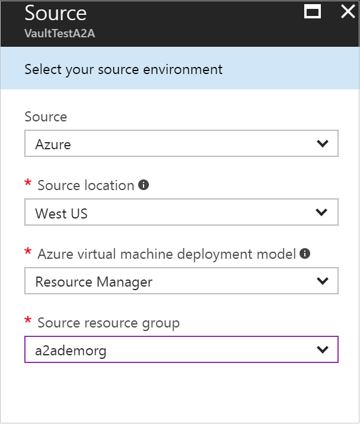
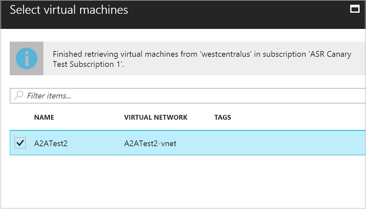
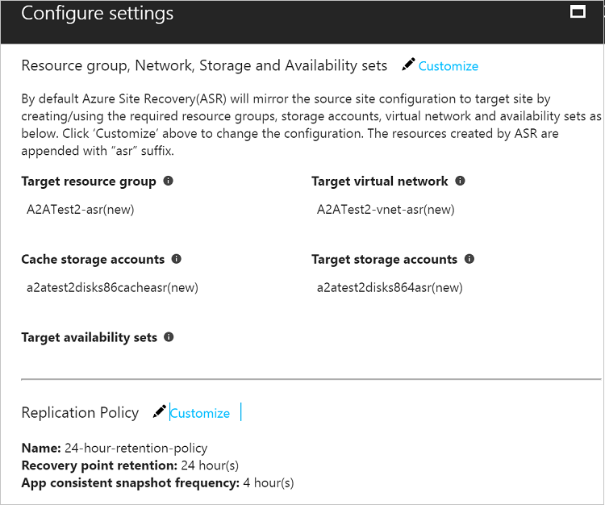
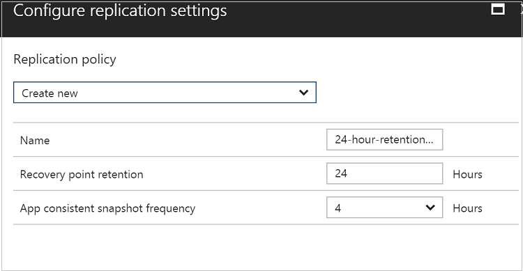

# 使用 Azure Site Recovery 在区域间复制 Azure VM

>[!NOTE]
>
> Azure 虚拟机 (VM) 的 Azure Site Recovery 复制当前处于预览阶段。

本文介绍如何使用 Azure 门户中的 [Site Recovery](site-recovery-overview.md) 服务在 Azure 区域间复制 Azure VM。

<!-- Not Available [Azure Recovery Services forum](https://social.msdn.microsoft.com/Forums/en-US/home?forum=hypervrecovmgr).-->

## Azure 中的灾难恢复

内置的 Azure 基础结构功能和特性为 Azure VM 上运行的工作负荷贡献了可靠且灵活的可用性策略。 但是出于很多原因，用户需要自行规划 Azure 区域之间的灾难恢复：

- 需要满足特定应用和工作负荷（需要业务连续性和灾难恢复 (BCDR) 策略）的符合性指南。
- 希望能根据业务决策保护和恢复 Azure VM，而不仅仅是基于内置的 Azure 功能。
- 需要根据业务和符合性需求测试故障转移和恢复，且不影响生产。
- 需要在发生灾难时故障转移到恢复区域，并无缝故障回复到原始源区域。

使用 Site Recovery 进行 Azure 到 Azure 的 VM 复制，以帮助执行这些任务。

## 为何使用 Site Recovery？      

Site Recovery 提供了一种简单方法，以在区域间复制 Azure VM：

- 自动部署。 与主动-主动复制模型不同，次要区域中不需要昂贵且复杂的基础结构。 在启用复制时，Site Recovery 会根据源区域设置自动在目标区域中创建所需的资源。
- 控制区域。 利用 Site Recovery，可在大洲内任意区域之间进行复制。 将此与读取访问异地冗余存储比较，后者仅在标准[配对区域](/best-practices-availability-paired-regions)间异步复制。 读取访问异地冗余存储提供对目标区域中数据的只读访问权限。
- 自动复制。 Site Recovery 提供自动连续复制。 通过一次单击便可触发故障转移和故障回复。
- RTO 和 RPO。 Site Recovery 利用连接区域的 Azure 网络基础结构，保持非常低的 RTO 和 RPO。
- **测试**。 在需要的时候，可以运行按需测试故障转移进行灾难恢复演练，而不影响生产工作负荷或正在进行的复制。
- **恢复计划**。 可以使用恢复计划为多个 VM 上运行的完整应用程序安排故障转移和故障回复。 恢复计划功能与 Azure 自动化 runbook 有丰富的一流集成。

## 部署摘要

下面总结了设置 Azure 区域间的 VM 复制所需执行的操作。

1. 创建恢复服务保管库。 保管库包含配置设置，并且安排复制。
2. 为 Azure VM 启用复制。
3. 运行测试故障转移，确保一切如预期正常运行。

>[!IMPORTANT]
>
> 可以查看 [Azure VM 复制的支持矩阵](./site-recovery-support-matrix-azure-to-azure.md)。

>[!IMPORTANT]
>
> 若要了解如何为 Azure VM 配置所需的网络出站连接以进行 Site Recovery 复制，请参阅[网络指南文档](./site-recovery-azure-to-azure-networking-guidance.md)。

### 开始之前

* Azure 用户帐户需要具有某些[权限](site-recovery-role-based-linked-access-control.md#permissions-required-to-enable-replication-for-new-virtual-machines)，才能启用 Azure 虚拟机的复制。
* 应启用 Azure 订阅，在作为灾难恢复区域的目标位置中创建 VM。 请联系支持部门，启用所需配额。

## 创建恢复服务保管库

[!INCLUDE [site-recovery-create-vault](../../includes/site-recovery-create-vault.md)]

>[!NOTE]
>
> 我们建议在要进行 VM 复制的位置创建恢复服务保管库。 例如，如果目标位置位于中国北部，请在**中国北部**区域中创建保管库。

## 启用复制

在“恢复服务保管库”中，单击保管库名称。 在保管库中，单击“+复制”按钮。

### 步骤 1。 配置源
1. 在“源”中，选择“Azure - 预览版”。
2. 在“源位置”中，选择当前运行 VM 的 Azure 源区域。
3. 选择 VM 的部署模型：“Resource Manager”或“经典”。
4. 为 Resource Manager VM 选择“源资源组”，为经典 VM 选择“云服务”。

    

### 步骤 2. 选择虚拟机

* 选择要复制的 VM，然后单击“确定”。

    

### 步骤 3. 配置设置

1. 若要替代默认目标设置并根据自己的选择指定设置，请单击“自定义”。 
<!-- Not Available [Customize target resources](site-recovery-replicate-azure-to-azure.md##customize-target-resources).-->

    

2. 默认情况下，Site Recovery 创建的复制策略每隔 4 小时捕获一次应用一致的快照，并保留恢复点 24 小时。 若要创建具有不同设置的策略，请单击“复制策略”旁边的“自定义”。

    

3. 若要开始预配目标资源，请单击“创建目标资源”。 预配大约需要 1 分钟。 请不要在预配期间关闭边栏选项卡，否则需要重新开始。

4. 若要触发所选 VM 的复制，请单击“启用复制”。

5. 可以在“设置” > “作业” > “Site Recovery 作业”中，跟踪“启用保护”作业的进度。

6. 在“设置” > “复制的项”中，可以查看 VM 的状态和初始复制进度。 单击 VM，向下钻取其设置。

## 运行测试故障转移

完成全部设置后，运行测试故障转移，确保一切按预期运行：

1. 若要故障转移单个计算机，请在“设置” > “复制的项”中，单击 VM“+测试故障转移”图标。

2. 若要故障转移某个恢复计划，请在“设置” > “恢复计划”中，右键单击计划“测试故障转移”。 若要创建恢复计划，请[遵循这些说明](site-recovery-create-recovery-plans.md)。 

3. 在“测试故障转移”中，选择 Azure VM 在故障转移后连接到的目标 Azure 虚拟网络。

4. 若要启动故障转移，请单击“确定”。 若要跟踪进度，请单击 VM 以打开其属性。 或者可以在保管库名称 >“设置” > “作业” > “Site Recovery 作业”中单击“测试故障转移”作业。

5. 故障转移完成后，副本 Azure 计算机会显示在 Azure 门户 >“虚拟机”中。 请确保 VM 的大小适当、已连接到相应的网络，并且正在运行。

6. 若要删除在测试故障转移期间创建的 VM，请单击复制项或恢复计划上的“清理测试故障转移”。 在“说明”中，记录并保存与测试性故障转移相关联的任何观测结果。 

[详细了解](site-recovery-test-failover-to-azure.md)测试故障转移。

## 后续步骤

测试部署之后：

- [详细了解](site-recovery-failover.md)不同类型的故障转移，以及如何运行它们。
- 详细了解如何[使用恢复计划](site-recovery-create-recovery-plans.md)来缩短 RTO。

<!--Update_Description: new articles on site recovery azure to azure -->