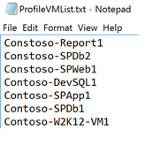
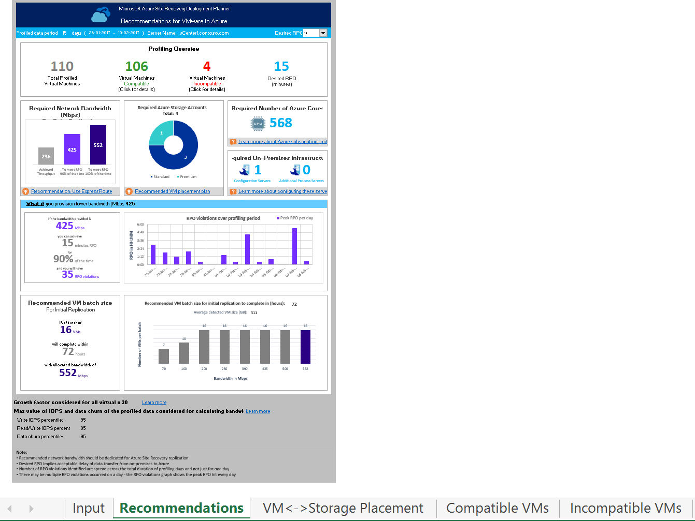
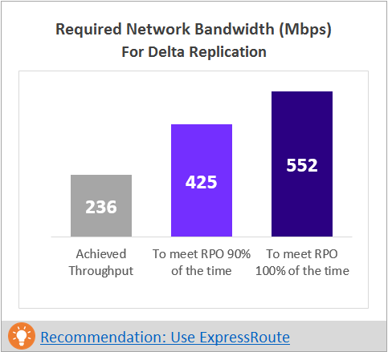
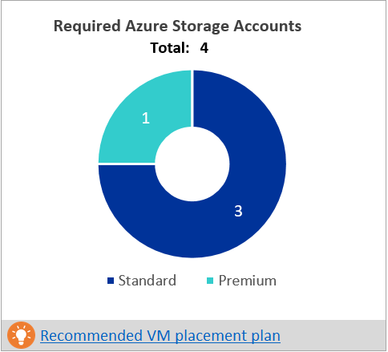
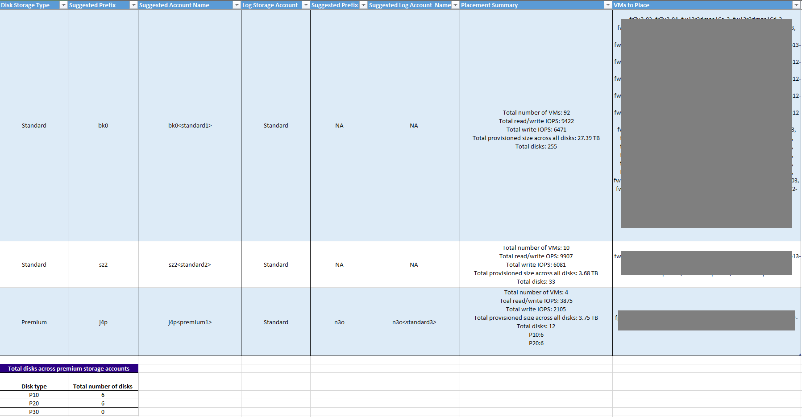

# <a name="azure-site-recovery-deployment-planner"></a>Azure Site Recovery Deployment Planner
本文为适用于 VMware 到 Azure 生产部署的 Azure Site Recovery Deployment Planner 用户指南。

## <a name="overview"></a>概述

在开始使用 Site Recovery 保护任何 VMware 虚拟机 (VM) 之前，请根据每日数据更改率分配足够的带宽以满足所需的恢复点目标 (RPO)。 请确保在本地部署适当数量的配置服务器和进程服务器。

此外还需要创建适当类型和数量的目标 Azure 存储帐户。 考虑到使用量会随着时间的推移而增加，从而导致源生产服务器数目的增加，请创建标准或高级存储帐户。 选择每个 VM 的存储类型时，需要考虑到工作负荷特征（例如每秒读/写 I/O 操作数 [IOPS] 或数据变动量）和 Site Recovery 限制。

Site Recovery Deployment Planner 公共预览版是一个命令行工具，目前仅适用于 VMware 到 Azure 的方案。 可以使用此工具远程分析 VMware VM（不会给生产造成任何影响），了解成功进行复制和测试性故障转移所需满足的带宽和 Azure 存储要求。 不需要在本地安装任何 Site Recovery 组件即可运行此工具。 但是，为了获得准确的吞吐量结果，建议在满足最终需要部署的 Site Recovery 配置服务器（生产部署的前几个步骤之一）的最低要求的 Windows Server 上运行 Planner。

该工具提供以下详细信息：

**兼容性评估**

* 根据磁盘数量、磁盘大小、IOPS、变动量和启动类型 (EFI/BIOS) 评估 VM 的合格性
* 增量复制所需的估计网络带宽

**网络带宽需求与 RPO 评估**

* 增量复制所需的估计网络带宽
* Site Recovery 可以获得的从本地到 Azure 的吞吐量
* 要批处理的 VM 数，具体取决于在给定时间内完成初始复制所需的估计带宽

**Azure 基础结构要求**

* 每个 VM 的存储类型（标准或高级存储帐户）要求
* 要为复制设置的标准和高级存储帐户总数
* 基于 Azure 存储指南的存储帐户命名建议
* 适用于所有 VM 的存储帐户归置
* 针对订阅执行测试性故障转移或故障转移之前要设置的 Azure 核心数
* 适用于每个本地 VM 的 Azure VM 建议大小

**本地基础结构要求**
* 需在本地部署的配置服务器和进程服务器数量

>[!IMPORTANT]
>
>由于使用量可能会随着时间的推移而增加，所有上述工具计算在执行时都会假定在工作负荷特征中存在一个 30% 的增长系数，而且所有分析指标（读/写 IOPS、变动量等）的值都会使用 95%。 这两个元素（增长系数和百分位数计算）均可配置。 若要详细了解增长系数，请参阅“增长系数考虑因素”部分。 若要详细了解百分位值，请参阅“用于计算的百分位值”部分。
>

## <a name="requirements"></a>要求
该工具的操作分两个主要阶段：分析和报告生成。 此外还有第三个选项，即仅计算吞吐量。 下表提供了可以进行分析和吞吐量测量的服务器的要求：

| 服务器要求 | 说明|
|---|---|
|分析和吞吐量测量| <ul><li>操作系统：Microsoft Windows Server 2012 R2<br>（理想情况下，至少符合[配置服务器的建议大小](https://aka.ms/asr-v2a-on-prem-components)）</li><li>计算机配置：8 个 vCPU，16 GB RAM，300 GB HDD</li><li>[Microsoft .NET Framework 4.5](https://aka.ms/dotnet-framework-45)</li><li>[VMware vSphere PowerCLI 6.0 R3](https://aka.ms/download_powercli)</li><li>[Microsoft Visual C++ Redistributable for Visual Studio 2012](https://aka.ms/vcplusplus-redistributable)</li><li>可在此服务器中通过 Internet 访问 Azure</li><li>Azure 存储帐户</li><li>服务器上的管理员访问权限</li><li>至少 100 GB 的可用磁盘空间（假定有 1000 个 VM，每个平均包含 3 个磁盘，分析时间为 30 天）</li><li>VMware vCenter 统计信息级别设置应设置为 2 或更高级别</li></ul>|
| 报告生成 | 装有 Microsoft Excel 2013 或更高版本的 Windows 电脑或 Windows Server |
| 用户权限 | 用于在分析期间访问 VMware vCenter 服务器/VMware vSphere ESXi 主机的用户帐户的只读权限 |

> [!NOTE]
>
>该工具只能分析使用 VMDK 和 RDM 磁盘的 VM， 无法分析使用 iSCSI 或 NFS 磁盘的 VM。 Site Recovery 支持 VMware 服务器的 iSCSI 和 NFS 磁盘，但由于 Deployment Planner 不在来宾计算机中并且只使用 vCenter 性能计数器进行分析，该工具无法洞察这些磁盘类型。
>

## <a name="download-and-extract-the-public-preview"></a>下载并提取公共预览版
1. 下载最新版本的 [Site Recovery Deployment Planner 公共预览版](https://aka.ms/asr-deployment-planner)。  
该工具已打包到 .zip 文件夹中。 该工具的当前版本仅支持 VMware 到 Azure 的方案。

2. 将 .zip 文件夹复制到要从中运行该工具的 Windows Server。  
可以从 Windows Server 2012 R2 运行该工具，前提是该服务器具有网络访问权限，可以连接到 vCenter 服务器/vSphere ESXi 主机，其中包含要分析的 VM。 但是，建议在其硬件配置符合[配置服务器大小调整指南](https://aka.ms/asr-v2a-on-prem-components)的服务器上运行该工具。 如果已在本地部署 Site Recovery 组件，请从配置服务器运行该工具。

 我们建议在运行该工具的服务器上实施与配置服务器（包含内置的进程服务器）一样的硬件配置。 此类配置可确保该工具所报告的已实现吞吐量与 Site Recovery 在复制过程中能够达到的实际吞吐量相符。 吞吐量计算取决于服务器上的可用网络带宽和服务器的硬件配置（CPU、存储等）。 如果从任何其他服务器运行该工具，则会计算从该服务器到 Azure 的吞吐量。 另外，由于该服务器的硬件配置可能不同于配置服务器的硬件配置，该工具所报告的已实现吞吐量可能不准确。

3. 解压缩 .zip 文件夹。  
该文件夹包含多个文件和子文件夹。 可执行文件是父文件夹中的 ASRDeploymentPlanner.exe。

    示例：  
    将 .zip 文件复制到 E:\ 驱动器并将它解压缩。
   E:\ASR Deployment Planner-Preview_v1.2.zip

    E:\ASR Deployment Planner-Preview_v1.2\ ASR Deployment Planner-Preview_v1.2\ ASRDeploymentPlanner.exe

## <a name="capabilities"></a>功能
可使用以下三种模式之一运行该命令行工具 (ASRDeploymentPlanner.exe)：

1. 分析  
2. 报告生成
3. 获取吞吐量

首先，请以分析模式运行该工具，收集 VM 数据变动量和 IOPS。 接下来，运行该工具生成报告，确定网络带宽和存储要求。

## <a name="profiling"></a>分析
在分析模式下，Deployment Planner 工具连接到 vCenter 服务器/vSphere ESXi 主机，以便收集有关 VM 的性能数据。

* 分析不会影响生产 VM 的性能，因为不会与其进行直接连接。 所有性能数据是从 vCenter 服务器/vSphere ESXi 主机收集的。
* 为了确保分析对服务器造成的影响可忽略不计，该工具每隔 15 分钟对 vCenter 服务器/vSphere ESXi 主机查询一次。 该查询时间间隔不会降低分析的准确性，因为该工具会存储每一分钟的性能计数器数据。

### <a name="create-a-list-of-vms-to-profile"></a>创建要分析的 VM 的列表
首先，需要一个要分析的 VM 的列表。 可以使用以下过程中的 VMware vSphere PowerCLI 命令获取 vCenter 服务器/vSphere ESXi 主机上的 VM 的所有名称。 也可以在文件中列出要手动分析的 VM 的友好名称或 IP 地址。

1. 登录到在其中安装了 VMware vSphere PowerCLI 的 VM。
2. 打开 VMware vSphere PowerCLI 控制台。
3. 确保启用脚本的执行策略。 如果已禁用，请以管理员模式启动 VMware vSphere PowerCLI 控制台，并运行以下命令将它启用：

            Set-ExecutionPolicy -ExecutionPolicy AllSigned

4. 要获取在 vCenter 服务器/vSphere ESXi 主机上的 VM 的所有名称并将列表存储在 .txt 文件中，请运行下面列出的两个命令。
将 &lsaquo;server name&rsaquo;、&lsaquo;user name&rsaquo;、&lsaquo;password&rsaquo; 和 &lsaquo;outputfile.txt&rsaquo; 替换为输入。

            Connect-VIServer -Server <server name> -User <user name> -Password <password>

            Get-VM |  Select Name | Sort-Object -Property Name >  <outputfile.txt>

5. 在记事本中打开输出文件，然后将要分析的所有 VM 的名称复制到另一文件（例如 ProfileVMList.txt）中，每行一个 VM 名称。 此文件用作命令行工具的 *-VMListFile* 参数的输入。

    

### <a name="start-profiling"></a>开始分析
创建要分析的 VM 的列表后，可在分析模式下运行该工具。 下面是在分析模式下运行该工具所要提供的必需和可选参数列表。

ASRDeploymentPlanner.exe -Operation StartProfiling /?

| 参数名称 | 说明 |
|---|---|
| -Operation | StartProfiling |
| -Server | 要分析其 VM 的 vCenter 服务器/vSphere ESXi 主机的完全限定域名或 IP 地址。|
| -User | 用于连接到 vCenter 服务器/vSphere ESXi 主机的用户名。 该用户至少需要拥有只读访问权限。|
| -VMListFile | 一个文件，其中包含要分析的 VM 的列表。 文件路径可以是绝对或相对路径。 此文件应该每行包含一个 VM 名称/IP 地址。 此文件中指定的虚拟机名称应与 vCenter 服务器/vSphere ESXi 主机上的 VM 名称相同。<br>例如，VMList.txt 文件包含以下 VM：<ul><li>virtual_machine_A</li><li>10.150.29.110</li><li>virtual_machine_B</li><ul> |
| -NoOfDaysToProfile | 运行分析的天数。 建议运行分析 15 天以上，确保在指定时间段内观察环境中的工作负荷模式，并根据该模式提供准确的建议。 |
| -Directory | （可选）通用命名约定 (UNC) 或本地目录路径，用于存储在分析期间生成的分析数据。 如果未指定目录名称，则使用当前路径下名为“ProfiledData”的目录作为默认目录。 |
| -Password | （可选）用于连接到 vCenter 服务器/vSphere ESXi 主机的密码。 如果现在不指定密码，则在执行命令时，系统会提示指定密码。|
| -StorageAccountName | （可选）存储帐户名称，用于确定在将数据从本地复制到 Azure 时可实现的吞吐量。 该工具会将测试数据上传到此存储帐户来计算吞吐量。|
| -StorageAccountKey | （可选）用于访问存储帐户的存储帐户密钥。 转到 Azure 门户 >“存储帐户”> <存储帐户名称> >“设置”>“访问密钥”> 密钥 1（或经典存储帐户的主访问密钥）。 |
| -Environment | （可选）这是目标 Azure 存储帐户环境。 此项可能采用下述三个值之一：AzureCloud、AzureUSGovernment、AzureChinaCloud。 默认值为 AzureCloud。 当目标 Azure 区域为 Azure 美国政府版或 Azure 中国云时，请使用此参数。 |

建议在分析 VM 时，至少分析 15 到 30 天。 在分析过程中，ASRDeploymentPlanner.exe 会保持运行。 该工具将取以天为单位的分析时间输入。 如果想要分析几小时或几分钟以便快速测试该工具，则需在公共预览版中将时间转换为相应的天数。 例如，若要分析 30 分钟，则输入必须为 30/(60*24) = 0.021 天。 允许的最短分析时间为 30 分钟。

在分析期间，可以选择性地传递存储帐户名称和密钥，确定在从配置服务器或进程服务器复制到 Azure 时，Site Recovery 可实现的吞吐量。 如果在分析期间不传递存储帐户名称和密钥，该工具不会计算可实现的吞吐量。

可以针对各个 VM 集运行该工具的多个实例。 确保不要在任何分析集中重复使用 VM 名称。 例如，如果已分析 10 个 VM（VM1 到 VM10），过几天后又想要分析另外 5 个 VM（VM11 到 VM15），则可通过另一个命令行控制台针对第二组 VM（VM11 到 VM15）运行该工具。 请确保第二组 VM 不包含第一个分析实例中的任何 VM 名称，或请确保为第二次运行使用不同的输出目录。 如果使用该工具的两个实例分析相同的 VM 并使用相同的输出目录，生成的报告不准确。

VM 配置会在分析操作开始时捕获一次，存储在名为 VMDetailList.xml 的文件中。 生成报告时会使用此信息。 从分析开始到结束都不捕获 VM 配置中发生的任何更改（例如，核心、磁盘或 NIC 数增加）。 如果分析的 VM 配置在分析过程中发生了更改，则可在公共预览版中通过下述解决方法在生成报告时获取最新的 VM 详细信息：

* 备份 VMdetailList.xml 文件，并将其从当前位置删除。
* 生成报告时传递 -User 和 -Password 参数。

该分析命令在分析目录中生成多个文件。 请勿删除任何文件，因为这样做会影响报告生成。

#### <a name="example-1-profile-vms-for-30-days-and-find-the-throughput-from-on-premises-to-azure"></a>示例 1：分析 VM 30 天，确定从本地到 Azure 的吞吐量
```
ASRDeploymentPlanner.exe -Operation StartProfiling -Directory "E:\vCenter1_ProfiledData" -Server vCenter1.contoso.com -VMListFile "E:\vCenter1_ProfiledData\ProfileVMList1.txt"  -NoOfDaysToProfile  30  -User vCenterUser1 -StorageAccountName  asrspfarm1 -StorageAccountKey Eby8vdM02xNOcqFlqUwJPLlmEtlCDXJ1OUzFT50uSRZ6IFsuFq2UVErCz4I6tq/K1SZFPTOtr/KBHBeksoGMGw==
```

#### <a name="example-2-profile-vms-for-15-days"></a>示例 2：分析 VM 15 天

```
ASRDeploymentPlanner.exe -Operation StartProfiling -Directory "E:\vCenter1_ProfiledData" -Server vCenter1.contoso.com -VMListFile "E:\vCenter1_ProfiledData\ProfileVMList1.txt"  -NoOfDaysToProfile  15  -User vCenterUser1
```

#### <a name="example-3-profile-vms-for-1-hour-for-a-quick-test-of-the-tool"></a>示例 3：分析 VM 1 小时以快速测试工具
```
ASRDeploymentPlanner.exe -Operation StartProfiling -Directory "E:\vCenter1_ProfiledData" -Server vCenter1.contoso.com -VMListFile "E:\vCenter1_ProfiledData\ProfileVMList1.txt"  -NoOfDaysToProfile  0.04  -User vCenterUser1
```

>[!NOTE]
>
>* 如果运行该工具的服务器重启或崩溃，或者使用 Ctrl + C 关闭该工具，系统会保存分析数据。 但是，过去 15 分钟的分析数据可能会丢失。 在这种情况下，请在服务器重新启动后以分析模式重新运行该工具。
>* 如果传递了存储帐户名称和密钥，该工具会在执行最后一个分析步骤时测量吞吐量。 如果在分析完成之前关闭该工具，则不会计算吞吐量。 若要在生成报告之前确定吞吐量，可通过命令行控制台运行 GetThroughput 操作。 否则，生成的报告不包含吞吐量信息。

## <a name="generate-a-report"></a>生成报告
该工具生成一个启用了宏的 Microsoft Excel 文件（XLSM 文件）作为报告输出，对所有部署建议进行了汇总。 该报告名为 DeploymentPlannerReport_<唯一数字标识符>.xlsm，置于指定目录中。

完成分析后，可在报告生成模式下运行该工具。 下表包含一系列必需的和可选的工具参数，适用于在报告生成模式下运行。

`ASRDeploymentPlanner.exe -Operation GenerateReport /?`

|参数名称 | 说明 |
|-|-|
| -Operation | GenerateReport |
| -Server |  vCenter/vSphere 服务器完全限定域名或 IP 地址（使用的名称或 IP 地址与分析时使用的相同），其中包含需要生成其报告的已分析 VM。 请注意，如果在分析时使用了 vCenter 服务器，则不能使用 vSphere 服务器来生成报告，反之亦然。|
| -VMListFile | 一个文件，其中包含一系列需为其生成报告的已分析 VM。 文件路径可以是绝对或相对路径。 此文件应该每行包含一个 VM 名称或 IP 地址。 此文件中指定的 VM 名称应与 vCenter 服务器/vSphere ESXi 主机上的 VM 名称相同，并与分析时使用的名称匹配。|
| -Directory | （可选）UNC 或本地目录路径，其中存储了分析数据（在分析期间生成的文件）。 需要使用此数据来生成报告。 如果未指定名称，则使用“ProfiledData”目录。 |
| -GoalToCompleteIR | （可选）小时数，需在此时间段内完成已分析 VM 的初始复制。 生成的报告将提供可在指定时间内完成初始复制的 VM 数。 默认值为 72 小时。 |
| -User | （可选）用于连接到 vCenter/vSphere 服务器的用户名。 此名称用于获取要在报告中使用的最新 VM 配置信息，例如磁盘数、核心数、NIC 数。 如果未提供此名称，则使用开始分析时收集的配置信息。 |
| -Password | （可选）用于连接到 vCenter 服务器/vSphere ESXi 主机的密码。 如果密码未作为参数指定，则稍后在执行命令时，系统会提示指定。 |
| -DesiredRPO | （可选）以分钟为单位的所需恢复点目标。 默认值为 15 分钟。|
| -Bandwidth | 以 Mbps 为单位的带宽。 一个参数，用于计算指定的带宽可实现的 RPO。 |
| -StartDate | （可选）采用 MM-DD-YYYY:HH:MM 格式（24 小时制）的开始日期和时间。 “StartDate”必须与“EndDate”一起指定。 如果指定 StartDate，会根据从 StartDate 到 EndDate 收集的分析数据生成报告。 |
| -EndDate | （可选）采用 MM-DD-YYYY:HH:MM 格式（24 小时制）的结束日期和时间。 “EndDate”必须与“StartDate”一起指定。 如果指定 EndDate，会根据从 StartDate 到 EndDate 收集的分析数据生成报告。 |
| -GrowthFactor | （可选）增长系数，以百分比表示。 默认值为 30%。 |
| -UseManagedDisks | （可选）UseManagedDisks - 是/否。 默认值为“是”。 计算可放置到单个存储帐户中的虚拟机数量时要考虑到：对虚拟机进行的故障转移/测试性故障转移是在托管磁盘而不是非托管磁盘上完成的。 |

#### <a name="example-1-generate-a-report-with-default-values-when-the-profiled-data-is-on-the-local-drive"></a>示例 1：当分析数据位于本地驱动器上时，使用默认值生成报告
```
ASRDeploymentPlanner.exe -Operation GenerateReport -Server vCenter1.contoso.com -Directory "\\PS1-W2K12R2\vCenter1_ProfiledData" -VMListFile "\\PS1-W2K12R2\vCenter1_ProfiledData\ProfileVMList1.txt"
```

#### <a name="example-2-generate-a-report-when-the-profiled-data-is-on-a-remote-server"></a>示例 2：当分析数据位于远程服务器上时生成报告
应该对远程目录拥有读/写访问权限。
```
ASRDeploymentPlanner.exe -Operation GenerateReport -Server vCenter1.contoso.com -Directory "\\PS1-W2K12R2\vCenter1_ProfiledData" -VMListFile "\\PS1-W2K12R2\vCenter1_ProfiledData\ProfileVMList1.txt"
```

#### <a name="example-3-generate-a-report-with-a-specific-bandwidth-and-goal-to-complete-ir-within-specified-time"></a>示例 3：生成一个报告，列出指定的带宽，以及在指定时间内完成 IR 的目标
```
ASRDeploymentPlanner.exe -Operation GenerateReport -Server vCenter1.contoso.com -Directory "E:\vCenter1_ProfiledData" -VMListFile "E:\vCenter1_ProfiledData\ProfileVMList1.txt" -Bandwidth 100 -GoalToCompleteIR 24
```

#### <a name="example-4-generate-a-report-with-a-5-percent-growth-factor-instead-of-the-default-30-percent"></a>示例 4：使用 5% 的增长系数而不是默认值 30% 来生成报告
```
ASRDeploymentPlanner.exe -Operation GenerateReport -Server vCenter1.contoso.com -Directory "E:\vCenter1_ProfiledData" -VMListFile "E:\vCenter1_ProfiledData\ProfileVMList1.txt" -GrowthFactor 5
```

#### <a name="example-5-generate-a-report-with-a-subset-of-profiled-data"></a>示例 5：使用分析数据的子集生成报告
例如，有 30 天的分析数据，但只想生成 20 天的报告。
```
ASRDeploymentPlanner.exe -Operation GenerateReport -Server vCenter1.contoso.com -Directory "E:\vCenter1_ProfiledData" -VMListFile "E:\vCenter1_ProfiledData\ProfileVMList1.txt" -StartDate  01-10-2017:12:30 -EndDate 01-19-2017:12:30
```

#### <a name="example-6-generate-a-report-for-5-minute-rpo"></a>示例 6：生成 5 分钟 RPO 报告
```
ASRDeploymentPlanner.exe -Operation GenerateReport -Server vCenter1.contoso.com -Directory "E:\vCenter1_ProfiledData" -VMListFile "E:\vCenter1_ProfiledData\ProfileVMList1.txt"  -DesiredRPO 5
```

## <a name="percentile-value-used-for-the-calculation"></a>用于计算的百分位值

            **在生成报告时，该工具使用分析期间收集的性能指标的哪个默认百分位值？**

该工具默认使用分析所有 VM 期间收集的读/写 IOPS、写入 IOPS 和数据变动量的第 95 百分位值。 此指标可确保系统不使用第 100 百分位峰值（在发生临时事件时，可能会出现在 VM 中）来确定目标存储帐户和源带宽需求。 例如，临时事件可能是一天运行一次的备份作业、定期发生的数据库索引编制或分析报告生成活动，或者其他类似的短期时间点事件。

使用第 95 百分位值可以反映真实的工作负荷特征，使这些工作负荷在 Azure 中运行时提供最佳性能。 我们预计不需要更改此数字。 如果更改此值（例如更改为第 90 百分位），则可在默认文件夹中更新并保存配置文件“ASRDeploymentPlanner.exe.config”，针对现有的分析数据生成新报告。
```
<add key="WriteIOPSPercentile" value="95" />      
<add key="ReadWriteIOPSPercentile" value="95" />      
<add key="DataChurnPercentile" value="95" />
```

## <a name="growth-factor-considerations"></a>增长系数考虑因素
**为何在对部署进行计划时应考虑增长系数？**

假设使用量在一段时间内可能会增多，则考虑工作负荷特征的增长就至关重要。 在保护就位以后，如果工作负荷特征发生更改，则除非先禁用保护再重新启用保护，否则在切换到其他存储帐户后将无法获得保护。

例如，假设你目前的 VM 适合标准存储复制帐户。 在随后的三个月中，可能会发生多项变化：

* 在 VM 上运行的应用程序的用户数会增加。
* 该 VM 上的变动量随之会增加，因此需使用高级存储，使 Site Recovery 复制能够跟上节奏。
* 结果就是，需要先禁用对高级存储帐户的保护，再重新启用该保护。

强烈建议在部署计划期间以及在默认值为 30% 的时候对增长进行计划。 对自己的应用程序使用模式和增长预测了解得最充分，生成报告时可以相应地更改此数字。 另外，可以使用相同的分析数据根据各种增长系数生成多份报告，确定哪些目标存储和源带宽建议最适合自己。

生成的 Microsoft Excel 报告包含以下信息：

* [输入](site-recovery-deployment-planner.md#input)
* 建议[](site-recovery-deployment-planner.md#recommendations-with-desired-rpo-as-input)
* [建议-带宽输入](site-recovery-deployment-planner.md#recommendations-with-available-bandwidth-as-input)
* [VM<->存储位置](site-recovery-deployment-planner.md#vm-storage-placement)
* [兼容的 VM](site-recovery-deployment-planner.md#compatible-vms)
* [不兼容的 VM](site-recovery-deployment-planner.md#incompatible-vms)



## <a name="get-throughput"></a>获取吞吐量

若要估算从本地复制到 Azure 期间 Site Recovery 可实现的吞吐量，请在 GetThroughput 模式下运行该工具。 该工具计算的吞吐量源自运行该工具的服务器。 理想情况下，该服务器的配置遵循配置服务器大小调整指南。 如果已在本地部署 Site Recovery 基础结构组件，请在配置服务器上运行该工具。

打开命令行控制台，转到 Site Recovery 部署规划工具文件夹。 结合以下参数运行 ASRDeploymentPlanner.exe。

`ASRDeploymentPlanner.exe -Operation GetThroughput /?`

|参数名称 | 说明 |
|-|-|
| -Operation | GetThroughput |
| -Directory | （可选）UNC 或本地目录路径，其中存储了分析数据（在分析期间生成的文件）。 需要使用此数据来生成报告。 如果未指定目录名称，则使用“ProfiledData”目录。 |
| -StorageAccountName | 存储帐户名称，用于确定在将数据从本地复制到 Azure 时消耗的带宽。 该工具会将测试数据上传到此存储帐户来确定消耗的带宽。 |
| -StorageAccountKey | 用于访问存储帐户的存储帐户密钥。 转到 Azure 门户 >“存储帐户”> <存储帐户名称> >“设置”>“访问密钥”> 密钥 1（或经典存储帐户的主访问密钥）。 |
| -VMListFile | 一个文件，其中包含一系列可以通过分析来计算所消耗带宽的 VM。 文件路径可以是绝对或相对路径。 此文件应该每行包含一个 VM 名称/IP 地址。 此文件中指定的 VM 名称应与 vCenter 服务器/vSphere ESXi 主机上的 VM 名称相同。<br>例如，VMList.txt 文件包含以下 VM：<ul><li>VM_A</li><li>10.150.29.110</li><li>VM_B</li></ul>|
| -Environment | （可选）这是目标 Azure 存储帐户环境。 此项可能采用下述三个值之一：AzureCloud、AzureUSGovernment、AzureChinaCloud。 默认值为 AzureCloud。 当目标 Azure 区域为 Azure 美国政府版或 Azure 中国云时，请使用此参数。 |

该工具会在指定的目录中创建多个 64 MB 的 asrvhdfile<#>.vhd 文件（其中“#”是文件编号）。 该工具会将这些文件上传到存储帐户来确定吞吐量。 测出吞吐量后，该工具会从存储帐户和本地服务器中删除所有这些文件。 如果该工具在计算吞吐量时因故被终止，它不会从存储或本地服务器中删除这些文件。 需要手动删除这些文件。

吞吐量是根据指定时间点测量的，也是在其他所有系数保持相同的前提下，Site Recovery 可实现的最大吞吐量。 例如，如果任何应用程序在相同的网络中开始消耗更多的带宽，则在复制期间实际吞吐量会有所变化。 如果从配置服务器运行 GetThroughput 命令，该工具无法识别任何受保护的 VM 和正在进行的复制。 如果是在受保护 VM 的数据变动量高时运行 GetThroughput 操作，则所测吞吐量的结果会有所不同。 建议在分析期间的不同时间点运行该工具，了解在不同时间能够达到的吞吐量水平。 在报告中，该工具会显示最后一个测得的吞吐量。

### <a name="example"></a>示例
```
ASRDeploymentPlanner.exe -Operation GetThroughput -Directory  E:\vCenter1_ProfiledData -VMListFile E:\vCenter1_ProfiledData\ProfileVMList1.txt  -StorageAccountName  asrspfarm1 -StorageAccountKey by8vdM02xNOcqFlqUwJPLlmEtlCDXJ1OUzFT50uSRZ6IFsuFq2UVErCz4I6tq/K1SZFPTOtr/KBHBeksoGMGw==
```

>[!NOTE]
>
> 注意在与配置服务器具有相同存储和 CPU 特征的服务器上运行该工具。
>
> 对于复制，请设置建议的带宽以满足 100% 时间的 RPO。 在设置适当的带宽后，如果工具所报告的已实现吞吐量没有增长，请执行以下操作：
>
>  1. 通过检查来确定是否有任何网络服务质量 (QoS) 限制了 Site Recovery 吞吐量。
>
>  2. 通过查看来确定 Site Recovery 保管库是否位于从物理上来说最近的受支持 Microsoft Azure 区域，以尽量降低网络延迟。
>
>  3. 检查本地存储特征，确定能否改进硬件（例如，从 HDD 升级到 SSD）。
>
>  4. 更改进程服务器中的 Site Recovery 设置，[增大用于复制的网络带宽量](./site-recovery-plan-capacity-vmware.md#control-network-bandwidth)。

## <a name="recommendations-with-desired-rpo-as-input"></a>用作输入的所需 RPO 建议

### <a name="profiled-data"></a>分析的数据


**数据分析期**：在此期间运行了分析。 默认情况下，该工具使用所有分析数据进行计算，除非在生成报告期间使用 StartDate 和 EndDate 选项生成特定时间段的报告。

服务器名称：为其生成 VM 报告的 VMware vCenter 或 ESXi 主机的名称或 IP 地址。

所需 RPO：部署的恢复点目标。 默认情况下，所需网络带宽是根据 RPO 值为 15、30 和 60 分钟计算的。 根据所做的选择，受影响的值会在工作表中更新。 如果生成报告时使用了 DesiredRPOinMin 参数，该值会显示在“所需 RPO”结果中。

### <a name="profiling-overview"></a>分析概述


**分析的虚拟机总数**：提供了其分析数据的 VM 总数。 如果 VMListFile 中包含未分析的任何 VM 的名称，则生成报告时不会考虑这些 VM，会将其从分析的 VM 总数中排除。

**兼容的虚拟机数**：可以使用 Site Recovery 在 Azure 中保护的 VM 数。 它是计算了所需网络带宽、存储帐户数、Azure 核心数以及配置服务器与附加进程服务器数的兼容 VM 总数。 “兼容的 VM”部分提供了每个兼容的 VM 的详细信息。

**不兼容的虚拟机数**：在保护方面与 Site Recovery 不兼容的已分析 VM 数。 “不兼容的 VM”部分说明了不兼容的原因。 如果 VMListFile 包含任何未分析 VM 的名称，则这些 VM 不计入不兼容 VM 的数目。 在“不兼容的 VM”部分的末尾，这些 VM 作为“找不到数据”类型列出。

所需 RPO：以分钟为单位的所需恢复点目标。 针对以下三个 RPO 值生成报告：15分钟（默认值）、30 分钟、60 分钟。 会根据你在工作表右上方“所需 RPO”下拉列表中所做的选择来更改报告中的带宽建议。 如果结合某个自定义值使用“-DesiredRPO”参数生成了报告，此自定义值会在“所需 RPO”下拉列表中显示为默认值。

### <a name="required-network-bandwidth-mbps"></a>所需的网络带宽 (Mbps)



**为了满足 100% 时间的 RPO：** 分配建议的以 Mbps 为单位的带宽，以便满足 100% 时间的所需 RPO。 这种带宽量必须专用于所有兼容 VM 的稳态增量复制，避免任何 RPO 违规。

**为了满足 90% 时间的 RPO**：如果由于宽带价格或任何其他原因而无法设置所需的带宽来满足 100% 时间的所需 RPO，可以选择规格较低但仍可满足 90% 时间的所需 RPO 的带宽设置。 为了帮助理解设置这种规格较低的带宽所造成的影响，报告中会根据预期发生的 RPO 违规的数目和持续时间提供一项假设 (what-if) 分析。

**实现的吞吐量** ：从运行 GetThroughput 命令的服务器到存储帐户所在的 Microsoft Azure 区域的吞吐量。 此吞吐量数字表示在配置服务器或进程服务器的存储和网络特征与运行该工具的服务器保持相同的前提下，使用 Site Recovery 保护兼容的 VM 时可实现的大致吞吐量水平。

对于复制，应设置建议的带宽以满足 100% 时间的 RPO。 在设置带宽后，如果工具所报告的已实现吞吐量没有增长，请执行以下操作：

1. 查看是否有任何网络服务质量 (QoS) 限制了 Site Recovery 吞吐量。

2. 查看 Site Recovery 保管库是否位于从物理上来说最近的受支持 Microsoft Azure 区域，以尽量降低网络延迟。

3. 检查本地存储特征，确定能否改进硬件（例如，从 HDD 升级到 SSD）。

4. 更改进程服务器中的 Site Recovery 设置，[增大用于复制的网络带宽量](./site-recovery-plan-capacity-vmware.md#control-network-bandwidth)。

如果是在其 VM 已经受保护的配置服务器或进程服务器上运行该工具，请运行该工具多次。 已实现的吞吐量数字会更改，具体取决于在该时间点处理的数据更改量。

对于所有企业型 Site Recovery 部署，建议使用 [ExpressRoute](https://aka.ms/expressroute)。

### <a name="required-storage-accounts"></a>所需的存储帐户
下图显示了保护所有兼容 VM 所需的存储帐户（标准和高级）总数。 若要了解适用于每个 VM 的存储帐户，请参阅“VM-存储位置”部分。



### <a name="required-number-of-azure-cores"></a>所需的 Azure 核心数
此结果是在对所有兼容的 VM 进行故障转移或测试性故障转移之前需要设置的核心总数。 如果订阅中能够使用的核心太少，在执行测试性故障转移或故障转移时，Site Recovery 无法创建 VM。


### <a name="required-on-premises-infrastructure"></a>所需的本地基础结构
下图是要配置的配置服务器和附加进程服务器的总数，该数目足以保护所有兼容 VM。 根据所支持的[配置服务器大小建议](https://aka.ms/asr-v2a-on-prem-components)，该工具可能会建议使用更多的服务器。 该建议取决于每日变动量和受保护 VM（假定每个 VM 平均有三个磁盘）的最大数目哪个更大，即在配置服务器或附加进程服务器上哪个最先达到。 在“输入”部分可以找到每天总变动量和受保护磁盘总数的详细信息。


### <a name="what-if-analysis"></a>假设分析
此项分析概述了如果设置较低的带宽，导致只能在 90% 的时间内满足所需 RPO，则在分析期间可能会发生多少项违规。 在任何给定的日期可能会发生一项或多项 RPO 违规。 下图显示了一天的峰值 RPO。
基于此分析，可以确定在使用指定的较低带宽的条件下，是否可以接受所有日期的 RPO 违规数以及每天的峰值 RPO。 如果可以接受，则可为复制分配较低的带宽，否则，应根据建议分配更高的带宽来满足 100% 时间的所需 RPO。


### <a name="recommended-vm-batch-size-for-initial-replication"></a>用于初始复制的建议 VM 批大小
在本部分，我们提供了可以进行并行保护的 VM 数的建议，目的是在 72 小时内使用建议的带宽完成初始复制，该带宽满足所设置的 100% 时间的所需 RPO。 此值是可以配置的值。 若要在生成报告时对其进行更改，请使用“GoalToCompleteIR”参数。

下图显示了一系列带宽值和计算出的 VM 批大小计数，用于根据所有兼容 VM 上检测到的平均 VM 大小，在 72 小时内完成初始复制。

在公共预览版中，报告不会指定应在批中包含的具体 VM。 可以使用“兼容的 VM”部分显示的磁盘大小找出每个 VM 的大小，为批选择 VM，也可以根据已知的工作负荷特征选择 VM。 初始复制的完成时间根据实际 VM 磁盘大小、已用磁盘空间和可用的网络吞吐量按比例变化。


### <a name="growth-factor-and-percentile-values-used"></a>增长系数和使用的百分位值
工作表底部的此部分显示用于已分析 VM 的所有性能计数器的百分位值（默认为第 95 百分位），以及所有计算中使用的增长系数（默认为 30%）。


## <a name="recommendations-with-available-bandwidth-as-input"></a>有关用作输入的可用带宽建议


有时，知道无法为 Site Recovery 复制设置 x Mbps 以上的带宽。 在该工具中可以输入可用带宽（生成报告时使用 -Bandwidth 参数），在数分钟内就能获得可实现的 RPO。 使用这个可实现的 RPO 值，可以确定是需要设置额外的带宽，还是可以使用某个灾难恢复解决方案来实现此 RPO。


## <a name="input"></a>输入
“输入”工作表概述了分析的 VMware 环境。


开始日期和结束日期：生成报告时要考虑的分析数据的开始和结束日期。 默认情况下，开始日期是开始分析的日期，结束日期是停止分析的日期。 如果结合这些参数生成报告，可以使用“StartDate”和“EndDate”值。

**分析总天数**：要生成报告的开始和结束日期之间的分析总天数。

**兼容的虚拟机数**：计算了所需网络带宽、所需存储帐户数、Microsoft Azure 核心数、配置服务器与附加进程服务器数的兼容 VM 总数。

**所有兼容虚拟机的磁盘总数**：此数字用作输入之一，确定要在部署中使用的配置服务器和附加进程服务器的数目。

**每个兼容虚拟机的平均磁盘数**：根据所有兼容 VM 计算出的平均磁盘数。

平均磁盘大小(GB)：根据所有兼容 VM 计算出的平均磁盘大小。

所需 RPO (分钟)：默认恢复点目标，或者在生成报告时为了估算所需带宽为“DesiredRPO”参数传递的值。

所需带宽(Mbps)：在生成报告时为了估算可实现 RPO 为“Bandwidth”参数传递的值。

每日观察到的典型数据变动量(GB)：在所有分析日期观察到的平均数据变动量。 此数字用作输入之一，确定要在部署中使用的配置服务器和附加进程服务器的数目。

## <a name="vm-storage-placement"></a>VM-存储位置



磁盘存储类型：标准或高级存储帐户，用于复制“要放置的 VM”列中所述的所有相应 VM。

**建议的前缀**：建议的三字符前缀，可用于存储帐户的命名。 可以使用自己的前缀，而该工具的建议则遵循[存储帐户的分区命名约定](https://aka.ms/storage-performance-checklist)。


            **建议的帐户名称**：在使用建议的前缀后出现的存储帐户名称。 将尖括号（< 和 >）中的名称替换为自定义输入。

**日志存储帐户**：所有复制日志存储在标准存储帐户中。 对于复制到高级存储帐户的 VM，请设置一个附加的标准存储帐户来进行日志存储。 单个标准日志存储帐户可由多个高级复制存储帐户使用。 复制到标准存储帐户的 VM 为日志使用相同的存储帐户。

**建议的日志帐户名称**：在使用建议的前缀后出现的存储日志帐户名称。 将尖括号（< 和 >）中的名称替换为自定义输入。

**位置摘要**：执行复制和测试性故障转移或故障转移时，存储帐户中 VM 总负载的摘要。 其中包括映射到存储帐户的 VM 总数、放置在此存储帐户中的所有 VM 上发生的读/写 IOPS 总数、写入（复制）IOPS 总数、所有磁盘的总设置大小，以及磁盘总数。

**要放置的虚拟机**：列出了为优化性能和使用而应放置在给定存储帐户中的所有 VM。

## <a name="compatible-vms"></a>兼容的 VM


**VM 名称**：VM 名称或 IP 地址，生成报告时在 VMListFile 中使用。 此列还列出附加到 VM 的磁盘 (VMDK)。 为了区分使用重复名称或 IP 地址的 vCenter VM，这些名称包含 ESXi 主机名。 列出的 ESXi 主机是在其中放置了 VM 的主机，该 VM 是在分析期间通过工具发现后放置的。

VM 兼容性：值为“是”和“是\*”。  “是\*”针对 VM 适用于 [Azure 高级存储](https://aka.ms/premium-storage-workload)的情况。 在这里，所分析的高变动量或 IOPS 磁盘适合 P20 或 P30 类别，但考虑到磁盘大小，因此将其归入较低的 P10 或 P20 类别。 存储帐户决定了根据大小对磁盘分类时，可将磁盘归入哪种高级存储磁盘类型。 例如：
* <128 GB 为 P10。
* 128 GB 到 512 GB 为 P20。
* 512 GB 到 1024 GB 为 P30。
* 1025 GB 到 2048 GB 为 P40。
* 2049 GB 到 4095 GB 为 P50。

如果某个磁盘按工作负荷特征应归入 P20 或 P30 类别，但按大小应归入较低的高级存储磁盘类型，则该工具会将该 VM 标记为“是\*”。 该工具还建议根据建议的高级存储磁盘类型更改源磁盘大小，或者在故障转移后更改目标磁盘类型。

**存储类型**：标准或高级。

**建议的前缀**：由三个字符构成的存储帐户前缀。

**存储帐户**：此名称使用建议的存储帐户前缀。

读/写 IOPS (包括增长系数)：磁盘上的峰值工作负荷读/写 IOPS（默认为第 95 百分位），包括将来的增长系数（默认为 30%）。 请注意，VM 的读/写 IOPS 总数并非总是该 VM 各个磁盘的读/写 IOPS 之和，因为在分析期间，该 VM 每分钟的读/写 IOPS 峰值是其各个磁盘的读/写 IOPS 之和的峰值。

以 Mbps 为单位的数据变动量(包括增长系数)：磁盘上的峰值变动率（默认为第 95 百分位），包括将来的增长系数（默认为 30%）。 请注意，VM 的总数据变动量并非总是 VM 各个磁盘的数据变动量之和，因为 VM 的峰值数据变动量是该 VM 在分析期间每分钟的各个磁盘变动量之和的峰值。

**Azure VM 大小**：适用于此本地 VM 的映射 Azure 云服务虚拟机大小。 映射取决于本地 VM 的内存、磁盘/核心/NIC 数以及读/写 IOPS。 建议在符合所有本地 VM 特征的情况下，始终使用最小的 Azure VM 大小。

磁盘数：VM 上的虚拟机磁盘 (VMDK) 总数。

磁盘大小(GB)：VM 所有磁盘的总安装大小。 该工具还会显示 VM 中各个磁盘的磁盘大小。

**核心数**：VM 上的 CPU 核心数。

内存(MB)：VM 上的 RAM。

**NIC**：VM 上的 NIC 数。

启动类型：即 VM 的启动类型。 它可以是 BIOS 或 EFI。 目前，Azure Site Recovery 仅支持 BIOS 启动类型。 所有 EFI 启动类型的虚拟机都列在“不兼容的 VM”工作表中。

OS 类型：VM 的 OS 类型。 可以是 Windows、Linux 或其他。

## <a name="incompatible-vms"></a>不兼容的 VM


**VM 名称**：VM 名称或 IP 地址，生成报告时在 VMListFile 中使用。 此列还列出附加到 VM 的 VMDK。 为了区分使用重复名称或 IP 地址的 vCenter VM，这些名称包含 ESXi 主机名。 列出的 ESXi 主机是在其中放置了 VM 的主机，该 VM 是在分析期间通过工具发现后放置的。

**VM 兼容性**：指示给定的 VM 为何无法与 Site Recovery 兼容使用。 会针对 VM 的每个不兼容磁盘说明原因，而根据已发布的[存储限制](https://aka.ms/azure-storage-scalbility-performance)，这些原因不外乎：

* 磁盘大小超出 4095 GB。 Azure 存储目前不支持大于 4095 GB 的数据磁盘大小。
* OS 磁盘大于 2048 GB。 Azure 存储目前不支持大于 2048 GB 的 OS 磁盘大小。
* 启动类型是 EFI。 Azure Site Recovery 目前仅支持 BIOS 启动类型的虚拟机。

* VM 总大小（复制 + TFO）超出系统支持的存储帐户大小限制 (35 TB)。 当 VM 中的单个磁盘的性能特征超出系统支持的适用于标准存储的 Azure 或 Site Recovery 最大限制时，通常会表现出这种不兼容性。 如果出现这种情况，则必须将 VM 置于高级存储区域。 但是，高级存储帐户支持的最大大小为 35 TB，并且无法跨多个存储帐户保护单个需要保护的 VM。 另请注意，在受保护 VM 上执行测试性故障转移时，该故障转移运行时所使用的存储帐户与进行复制时所使用的存储帐户相同。 在这种情况下，可以在设置时将磁盘大小加倍，既可进行复制，又可成功地进行测试性故障转移。
* 源 IOPS 超出了每个磁盘支持的存储 IOPS 限制，即 5000。
* 源 IOPS 超出了每个 VM 支持的存储 IOPS 限制，即 80,000。
* 平均数据变动量超出了磁盘支持的 Site Recovery 数据变动量限制：平均 I/O 大小不能超过 10 MBps。
* VM 中所有磁盘的总数据变动量超出了每个 VM 支持的最大 Site Recovery 数据变动量限制，即 54 MBps。
* 平均有效写入 IOPS 超出了磁盘支持的 Site Recovery IOPS 限制，即 840。
* 计算出的快照存储超出了支持的快照存储限制，即 10 TB。

读/写 IOPS (包括增长系数)：磁盘上的峰值工作负荷 IOPS（默认为第 95 百分位），包括将来的增长系数（默认为 30%）。 请注意，VM 的读/写 IOPS 总数并非总是该 VM 各个磁盘的读/写 IOPS 之和，因为在分析期间，该 VM 每分钟的读/写 IOPS 峰值是其各个磁盘的读/写 IOPS 之和的峰值。

以 Mbps 为单位的数据变动量(包括增长系数)：磁盘上的峰值变动率（默认为第 95 百分位），包括将来的增长系数（默认为 30%）。 请注意，VM 的总数据变动量并非总是 VM 各个磁盘的数据变动量之和，因为 VM 的峰值数据变动量是该 VM 在分析期间每分钟的各个磁盘变动量之和的峰值。

**磁盘数**：VM 上的 VMDK 总数。

磁盘大小(GB)：VM 所有磁盘的总安装大小。 该工具还会显示 VM 中各个磁盘的磁盘大小。

**核心数**：VM 上的 CPU 核心数。

内存(MB)：VM 上的 RAM 量。

**NIC**：VM 上的 NIC 数。

启动类型：即 VM 的启动类型。 它可以是 BIOS 或 EFI。 目前，Azure Site Recovery 仅支持 BIOS 启动类型。 所有 EFI 启动类型的虚拟机都列在“不兼容的 VM”工作表中。

OS 类型：VM 的 OS 类型。 可以是 Windows、Linux 或其他。

## <a name="site-recovery-limits"></a>站点恢复限制

**复限制复制存储目标** | **平均源磁盘 I/O 大小** |**平均源磁盘数据变动量** | **每天的总源磁盘数据变动量**
---|---|---|---
标准存储 | 8 KB | 2 MBps | 每个磁盘 168 GB
高级 P10 磁盘 | 8 KB | 2 MBps | 每个磁盘 168 GB
高级 P10 磁盘 | 16 KB | 4 MBps | 每个磁盘 336 GB
高级 P10 磁盘 | 至少 32 KB | 8 MBps | 每个磁盘 672 GB
高级 P20 或 P30 磁盘 | 8 KB  | 5 MBps | 每个磁盘 421 GB
高级 P20 或 P30 磁盘 | 至少 16 KB |10 MBps | 每个磁盘 842 GB

这是在假设存在 30% 的 I/O 重叠的情况下给出的平均数。 Site Recovery 能够根据重叠率、较大的写入大小和实际工作负荷 I/O 行为处理更高的吞吐量。 上述数字假设通常情况下存在大约 5 分钟的积压工作。 也就是说，数据在上传后会在 5 分钟内进行处理并创建恢复点。

这些限制基于我们的测试，但无法涵盖所有可能的应用程序 I/O 组合。 实际结果可能因应用程序 I/O 组合而异。 为获得最佳结果，我们始终建议使用测试性故障转移执行广泛的应用程序测试，获取真实的性能视图，即使在规划部署后，也应如此。

## <a name="updating-the-deployment-planner"></a>更新 Deployment Planner
若要更新 Deployment Planner，请执行以下操作：

1. 下载最新版本的 [Azure Site Recovery Deployment Planner](https://aka.ms/asr-deployment-planner)。

2. 将 .zip 文件夹复制到要运行 Deployment Planner 的服务器。

3. 解压缩 .zip 文件夹。

4. 执行以下操作之一：
 * 如果最新版不包含分析修补程序且分析已在当前版本的 Planner 上进行，请继续该分析。
 * 如果最新版本不包含分析修补程序，则建议停止在当前版本上进行分析，使用新版本重新开始分析。

  >[!NOTE]
  >
  >注意开始使用新版本进行分析以后，请传递相同的输出目录路径，以便工具将配置文件数据追加到现有文件。 将使用完整的分析数据集来生成报告。 如果传递不同的输出目录，则会创建新文件，生成报告时不能使用旧的分析数据。
  >
  >每个新的 Deployment Planner 都是 .zip 文件的累积更新。 不需将最新文件复制到旧文件夹。 可以创建和使用新文件夹。

## <a name="version-history"></a>版本历史记录

### <a name="131"></a>1.3.1
更新时间：2017 年 7 月 19 日

添加了以下新功能：

* 在报表生成过程中添加了对大型磁盘 (> 1TB) 的支持。 现在可以使用 Deployment Planner 来计划磁盘大小超出 1 TB（最大为 4095 GB）的虚拟机的复制。
阅读有关 [Azure Site Recovery 中的大型磁盘支持](https://azure.microsoft.com/blog/azure-site-recovery-large-disks/)的更多内容

### <a name="13"></a>1.3
更新时间：2017 年 5 月 9 日

添加了以下新功能：

* 在报告生成时添加了托管磁盘支持。 可以放置到单个存储帐户的虚拟机数的计算取决于是否为故障转移/测试性故障转移选择了托管磁盘。        

### <a name="12"></a>1.2
更新时间：2017 年 4 月 7 日

添加了以下修补程序：

* 添加了针对每个虚拟机的启动类型（BIOS 或 EFI）检查，用于确定虚拟机是否兼容相应的保护措施。
* 在“兼容的 VM”和“不兼容的 VM”工作表中添加了针对每个虚拟机的 OS 类型信息。
* Azure 美国政府版和中国区域现在支持 GetThroughput 操作。
* 添加了针对 vCenter 和 ESXi Server 的更多先决条件检查。
* 将区域设置设置为非英语语言时，会生成不正确的报告。

### <a name="11"></a>1.1
更新时间：2017 年 3 月 9 日

修复了以下问题：

* 如果 vCenter 中有两个或更多个 VM 跨不同的 ESXi 主机使用相同的名称或 IP 地址，该工具无法分析 VM。
* 兼容 VM 和不兼容 VM 的工作表均已禁用复制和搜索。

### <a name="10"></a>1.0
更新时间：2017 年 2 月 23 日

Azure Site Recovery Deployment Planner 公共预览版 1.0 存在以下已知问题（会在以后的更新中解决）：

* 该工具仅适用于 VMware 到 Azure 的方案，而不适用于 Hyper-V 到 Azure 的部署。 对于 Hyper-V 到 Azure 的方案，请使用 [Hyper-V Capacity Planner 工具](./site-recovery-capacity-planning-for-hyper-v-replication.md)。
* Azure 美国政府版和中国区域不支持 GetThroughput 操作。
* 如果 vCenter 服务器中有两个或更多个 VM 跨不同的 ESXi 主机使用相同的名称或 IP 地址，则该工具无法分析 VM。 在此版本中，该工具将跳过 VMListFile 中针对重复 VM 名称或 IP 地址的分析。 解决方法是使用 ESXi 主机而不是 vCenter 服务器来分析 VM。 必须针对每个 ESXi 主机运行一个实例。

<!--Update_Description: update meta properties -->