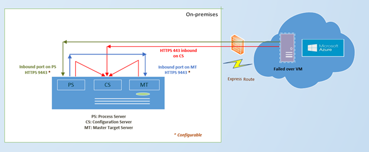
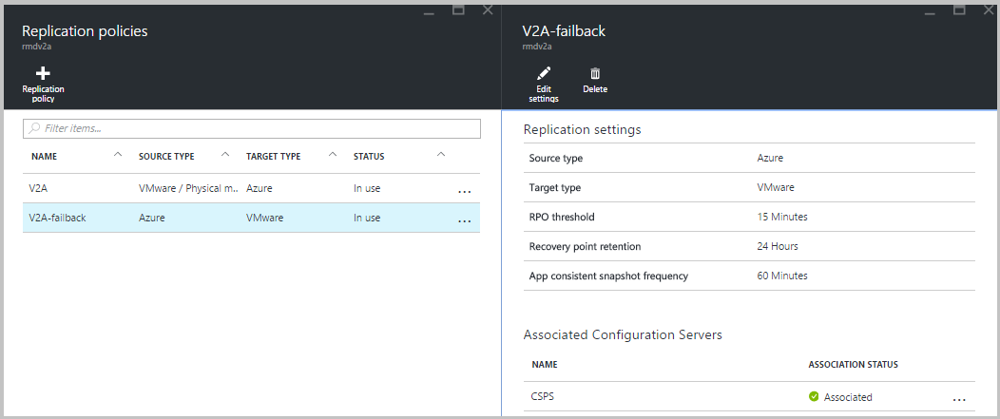
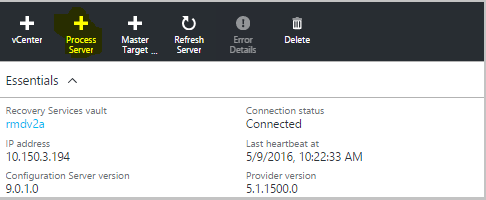
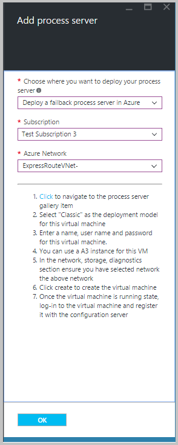
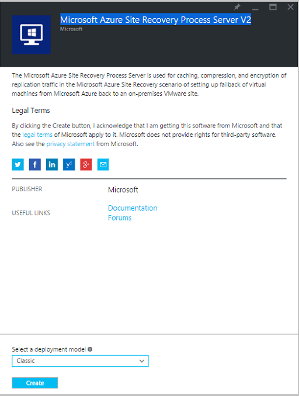
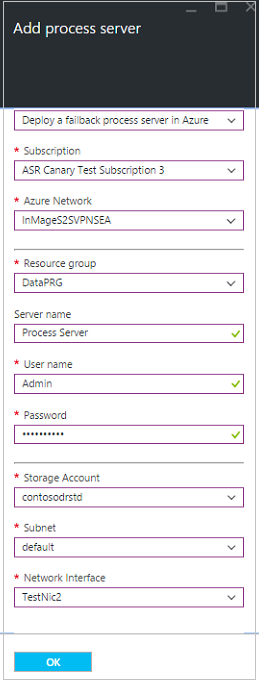
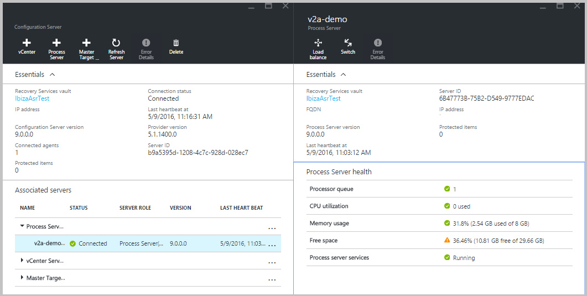

# 将 VMware 虚拟机和物理服务器故障回复到本地站点

本文介绍如何将 Azure 虚拟机从 Azure 故障回复到本地站点。 根据此[参考](site-recovery-how-to-reprotect.md)文档重新保护计算机后，可以故障回复 VMware 虚拟机或 Windows/Linux 物理服务器时，请按照此处的说明进行故障回复。

>[!NOTE]
>如果使用的是经典 Azure 门户，请参阅[此文](site-recovery-failback-azure-to-vmware-classic.md)提到的说明了解增强的“VMware 到 Azure”体系结构，并参阅[此文](site-recovery-failback-azure-to-vmware-classic-legacy.md)了解旧体系结构

## 概述
本部分中的图片显示了这种情况下的故障回复体系结构。

如果进程服务器位于本地，且使用的是 Azure ExpressRoute 连接，请使用以下体系结构：

如果进程服务器位于 Azure 中，且部署了 VPN 或 ExpressRoute 连接，请使用以下体系结构：

有关完整的端口列表以及故障回复体系结构关系图，请参阅下图：

故障转移到 Azure 以后，可通过以下 3 个阶段故障回复到本地站点：

* **阶段 1**：对 Azure VM 进行重新保护，使之开始复制回在本地站点运行的 VMware VM。
* **阶段 2**：将 Azure VM 复制到本地站点后，通过运行故障转移从 Azure 进行故障回复。
* **阶段 3**：对数据进行故障回复以后，对故障回复到的本地 VM 进行重新保护，使之开始复制到 Azure。

### 故障回复到原始位置或备用位置
对某个 VMware VM 进行了故障转移后，可故障回复到同一源 VM，前提是该 VM 仍存在于本地。 在这种情况下，仅对增量进行了故障回复。

如果对物理服务器进行了故障转移，则会始终故障回复到新的 VMware VM。 在故障回复物理计算机之前，请注意：
* 当从 Azure 故障转移回复到 VMware 时，受保护的物理计算机会回复成虚拟机。 受保护且已故障转移到 Azure 的 Windows Server 2008 R2 SP1 物理计算机无法故障回复。 作为本地虚拟机启动的 Windows Server 2008 R2 SP1 计算机可执行故障回复。
* 确保除了需要故障回复到的必要 ESX/ESXi 主机之外，还发现至少一台主目标服务器。

如果故障回复到原始 VM，则需满足以下条件：

* 如果 VM 由 vCenter 服务器管理，主目标的 ESX 主机应该可以访问 VM 数据存储。
* 如果 VM 位于 ESX 主机上，但不由 vCenter 管理，则 VM 的硬盘必须位于 MT 的主机可访问的数据存储中。
* 如果 VM 位于 ESX 主机上但不使用 vCenter，则应完成针对 MT 的 ESX 主机的发现操作，才能进行重新保护。 如果要对物理服务器进行故障回复，此规则也同样适用。
* 另一选项（如果本地 VM 存在）是在进行故障回复之前删除它。 故障回复之后会在与主目标 ESX 主机相同的主机上创建新的 VM。

故障回复到备用位置时，会将数据恢复到与本地主目标服务器所用数据存储和 ESX 主机相同的数据存储和 ESX 主机。

## 先决条件
* 要对 VMware VM 和物理服务器进行故障回复，需要 VMware 环境。 不支持故障回复到物理服务器。
* 要进行故障回复，必须在最初设置保护时，就已经创建 Azure 网络。 故障回复需要进行 VPN 或 ExpressRoute 连接，从 Azure VM 所在的 Azure 网络连接到本地站点。
* 如需故障回复到的 VM 受 vCenter 服务器管理，请确保拥有在 vCenter 服务器上发现 VM 所必需的权限。 有关详细信息，请参阅[通过 Azure Site Recovery 将 VMware 虚拟机和物理服务器复制到 Azure](site-recovery-vmware-to-azure-classic.md)。
* 如果 VM 上存在快照，重新保护会失败。 可以删除这些快照或磁盘。
* 故障回复之前，请创建以下组件：
  * **在 Azure 中创建进程服务器**。 该组件是在故障回复过程中创建并保持运行的 Azure VM。 完成故障回复后，可以删除该 VM。
  * **创建主目标服务器**：主目标服务器发送和接收故障回复数据。 在本地创建的管理服务器具有默认安装的主目标服务器。 但是，可能需要创建单独的故障回复用主目标服务器，具体取决于故障回复流量。
  * 要创建其他在 Linux 上运行的主目标服务器，需先设置 Linux VM，再安装主目标服务器，如后文所示。
* 执行故障回复时，本地需有配置服务器。 故障回复期间，虚拟机必须位于配置服务器数据库中。 如果配置服务器数据库不包含 VM，则故障回复不会成功。 因此，请确保定期计划服务器备份。 发生灾难时，需要使用相同的 IP 地址进行还原，让故障回复正常工作。
* 在 VMware 的主目标 VM 的“配置参数”中设置 disk.enableUUID=true 设置。 如果此行不存在，请添加此行。 需要此设置为虚拟机磁盘 (VMDK) 文件提供一致的全局唯一标识符 (UUID)，以便正确安装。
* 注意“主目标服务器不能进行存储 vMotion”条件，这可能导致故障回复失败。 无法显示 VM，因为未向其提供磁盘。
* 将名为保留驱动器的驱动器添加到主目标服务器上。 添加磁盘并格式化驱动器。

## 故障回复策略
若要复制回本地，需要故障回复策略。 创建正向策略时，会自动创建该策略，并且会自动与配置服务器关联。 该策略不能编辑。 该策略具有以下复制设置：

* RPO 阈值 = 15 分钟
* 恢复点保留期 = 24 小时
* 应用一致性快照频率 = 60 分钟

 

## 在 Azure 中设置进程服务器
在 Azure 中安装进程服务器，以便 Azure VM 将数据发送回本地主目标服务器。

如果已将虚拟机作为经典资源进行保护（即，在 Azure 中恢复的 VM 是使用经典部署模型创建的 VM），则需要在 Azure 中安装进程服务器。 如果已使用 Azure 资源管理器将 VM 恢复为部署类型，则进程服务器必须为资源管理器部署类型。 在其中部署进程服务器的 Azure 虚拟网络会选择相应部署类型。

1. 在“保管库” > “设置” > “Site Recovery 基础结构”（位于“管理”下）>“配置服务器”（位于“针对 VMware 和物理计算机”下）中，选择配置服务器。
2. 单击“进程服务器”。

  
3. 选择像“在 Azure 中部署故障回复进程服务器”一样部署进程服务器。
4. 选择已将 VM 恢复到的订阅。
5. 选择已将 VM 恢复到的 Azure 网络。 进程服务器需要位于同一网络中，以使已恢复的 VM 和进程服务器可以通信。
6. 如果选择了经典部署模型网络，则通过 Azure Marketplace 创建 VM 并将进程服务器安装于其中。

 

 创建进程服务器时，请注意以下事项：
 * 映像的名称为“Azure Site Recovery 进程服务器 V2”。 选择“经典”作为部署模型。

       
 * 按照[将 VMware 虚拟机和物理服务器复制到 Azure Site Recovery](site-recovery-vmware-to-azure-classic.md) 中的说明安装进程服务器。
7. 如果选择资源管理器 Azure 网络，请通过提供以下信息部署进程服务器：

  * 要将服务器部署到的资源组的名称
  * 服务器名称
  * 用于登录服务器的用户名和密码
  * 要将服务器部署到的存储帐户
  * 要连接到的子网和网络接口
   >[!NOTE]
   >必须创建自己的[网络接口](../virtual-network/virtual-networks-multiple-nics.md) (NIC)，并在部署进程服务器时选择它。

    

8. 单击 **“确定”**。 此操作会触发一个作业，该作业在进程服务器安装期间创建一个资源管理器部署类型虚拟机。 要将服务器注册到配置服务器，请按照[通过 Azure Site Recovery 将 VMware 虚拟机和物理服务器复制到 Azure](site-recovery-vmware-to-azure-classic.md) 中的步骤在 VM 中运行安装程序。 还会触发一个用于部署进程服务器的作业。

  进程服务器会列出在“配置服务器” > “关联服务器” > “进程服务器”选项卡上。

    

    > [!NOTE]
    > 进程服务器不会显示在“VM 属性”下。 它只显示在所注册到的管理服务器中的“服务器”选项卡上。 可能需要 10 至 15 分钟才能显示进程服务器。

## 在本地安装主目标服务器
主目标服务器接收故障回复数据。 服务器会自动安装在本地管理服务器上，但如果要对太多数据进行故障回复，则需安装另一主目标服务器。 若要在本地安装主目标服务器，请执行以下操作：

> [!NOTE]
> 若要在 Linux 上安装主目标服务器，请跳到下一步骤。 仅使用 CentOS 6.6 精简操作系统作为主目标 OS。

1. 如果要在 Windows 上设置主目标服务器，请通过需在其中安装主目标服务器的 VM 打开快速启动页。
2. 下载 Azure Site Recovery 统一安装程序向导的安装文件。
3. 运行安装程序，并在“开始之前”中选择“添加额外的进程服务器以扩大部署”。
4. 完成向导，完成方式与[安装管理服务器](site-recovery-vmware-to-azure-classic.md)时采用的方式相同。 在“配置服务器详细信息”页上，指定此主目标服务器的 IP 地址，并输入访问 VM 所需的密码。

### 将 Linux VM 安装为主目标服务器
要将运行主目标服务器的管理服务器设置为 Linux VM，需至少安装 CentOS 6.6 操作系统。 接下来，检索每个 SCSI 硬盘的 SCSI ID，安装一些其他软件包，并应用一些自定义更改。

#### 安装 CentOS 6.6

1. 在管理服务器 VM 上至少安装 CentOS 6.6 操作系统。 将 ISO 留在 DVD 驱动器中，并启动系统。 跳过介质测试。 选择“美国英语”作为语言，选择“基本存储设备”，确保硬盘驱动器上没有任何重要数据，并单击“是”，丢弃所有数据。 输入管理服务器的主机名，并选择服务器网络适配器。  在“编辑系统”对话框中选择“自动连接”，并添加静态 IP 地址、网络和 DNS 设置。 指定时区。 要访问管理服务器，请输入根密码。
2. 当系统询问安装类型时，应选择“创建自定义布局”作为分区。 单击“下一步”。 选择“免费”，并单击“创建”。 使用 **FS Type:** **ext4** 创建 **/**、**/var/crash** 和 **/home 分区**。 创建交换分区，格式为 **FS Type: swap**。
3. 如果发现有预先存在的设备，则会显示警告消息。 单击“格式化”  ，以使用分区设置格式化驱动器。 单击“将更改写入磁盘” 以应用分区更改。
4. 选择“安装引导加载程序” > “下一步”，在根分区上安装引导加载程序。
5. 安装完成后，单击“重新启动”。

#### 检索 SCSI ID

1. 安装后，检索 VM 中每个 SCSI 硬盘的 SCSI ID。 为此，请关闭管理服务器 VM。 在 VMware 的 VM 属性中，右键单击 VM 条目 >“编辑设置” > “选项”。
2. 选择“高级” > “常规项”，并单击“配置参数”。 当计算机正在运行时，此选项不可用。 若要使其可用，必须关闭计算机。
3. 执行以下操作之一：
 * 如果 **disk.EnableUUID** 这一行存在，请确保将值设置为 **True**（区分大小写）。 如果已将值设置为 True，则可先取消，并在启动来宾操作系统后对其中的 SCSI 命令进行测试。
 * 如果 **disk.EnableUUID** 行不存在，请单击“添加行”，并在添加时会值设置为 **True**。 不要使用双引号。

#### 安装其他程序包
下载并安装其他程序包。

1. 请确保主目标服务器已连接到 Internet。
2. 若要从 CentOS 存储库下载并安装 15 个程序包，请运行以下命令：`# yum install -y xfsprogs perl lsscsi rsync wget kexec-tools`。
3. 如果所要保护的源计算机运行针对根设备或启动设备的 Linux wit Reiser 或 XFS 文件系统，请下载和安装其他程序包，如下所示：

   * \# cd /usr/local
   * \# wget [http://elrepo.org/linux/elrepo/el6/x86_64/RPMS/kmod-reiserfs-0.0-1.el6.elrepo.x86_64.rpm](http://elrepo.org/linux/elrepo/el6/x86_64/RPMS/kmod-reiserfs-0.0-1.el6.elrepo.x86_64.rpm)
   * \# wget [http://elrepo.org/linux/elrepo/el6/x86_64/RPMS/reiserfs-utils-3.6.21-1.el6.elrepo.x86_64.rpm](http://elrepo.org/linux/elrepo/el6/x86_64/RPMS/reiserfs-utils-3.6.21-1.el6.elrepo.x86_64.rpm)
   * \# rpm -ivh kmod-reiserfs-0.0-1.el6.elrepo.x86_64.rpm reiserfs-utils-3.6.21-1.el6.elrepo.x86_64.rpm
   * \# wget [http://mirror.centos.org/centos/6.6/os/x86_64/Packages/xfsprogs-3.1.1-16.el6.x86_65.rpm](http://mirror.centos.org/centos/6.6/os/x86_64/Packages/xfsprogs-3.1.1-16.el6.x86_65.rpm)
   * \# rpm -ivh xfsprogs-3.1.1-16.el6.x86_64.rpm
   * \# yum install device-mapper-multipath（在主目标服务器上启用多路径包时需要此包）

#### 应用自定义更改
在完成安装后步骤并安装程序包以后，请执行下述操作以应用自定义更改：

1. 将 RHEL 6-64 统一代理二进制文件复制到 VM。 要解压缩二进制文件，请运行以下命令：`tar -zxvf <file name>`。
2. 要授予权限，请运行以下命令：`# chmod 755 ./ApplyCustomChanges.sh`。
3. 运行以下脚本：`# ./ApplyCustomChanges.sh`。 只运行一次。 成功运行脚本后，重新启动服务器。

## 运行故障回复
### 重新保护 Azure VM
1. 在“保管库”>“复制的项”中，右键单击已故障转移的 VM，并选择“重新保护”。
2. 在边栏选项卡上，可以看到已选中“Azure 到本地”的保护方向。
3. 在“主目标服务器”和“进程服务器”中，选择本地主目标服务器，以及 Azure VM 进程服务器。
4. 选择要将本地磁盘恢复到的数据存储。 删除本地 VM 并且需要创建新磁盘时，可使用此选项。 如果磁盘已存在，但仍然需要指定一个值，则忽略此选项。
5. 使用保留驱动器停止 VM 复制回本地的时间点。 此处列出了保留驱动器的一些条件。 如果没有这些条件，则无法为主目标服务器列出驱动器。

  * 卷不应用于任何其他目的（复制的目标，等等）。
  * 卷不应处于锁定模式。
  * 卷不应为缓存卷。 （该卷上不应存在主目标安装。 进程服务器和主目标自定义安装卷不能用作保留卷。 此处安装的进程服务器和主目标卷是主目标的缓存卷。）
  * 卷文件系统类型不应为 FAT 和 FAT32。
  * 卷容量应为非零值。
  * Windows 的默认保留卷是 R 卷。
  * Linux 的默认保留卷是 /mnt/retention。

6. 会自动选择故障回复策略。
7. 单击“确定”开始重新保护以后，作业就会开始将 VM 从 Azure 复制到本地站点。 可以在“作业”选项卡上跟踪进度。

如果要恢复到备用位置，则请选择针对主目标服务器配置的保留驱动器和数据存储。 故障回复到本地站点时，故障回复保护计划中的 VMware VM 会使用与主目标服务器相同的数据存储。 如果要将副本 Azure VM 恢复到相同的本地 VM，则本地 VM 所在的数据存储应与主目标服务器的相同。 如果没有本地 VM，则会在重新保护期间创建一个新的本地 VM。

也可以在恢复计划级别重新保护。 如果有复制组，则只能使用恢复计划对其进行重新保护。 通过恢复计划重新保护时，需为每台受保护的计算机使用上述值。

> [!NOTE]
> 应使用相同的主目标服务器重新保护复制组。 如果使用不同的主目标服务器重新保护它们，则无法为其确定一个共同的时间点。

### 运行到本地站点的故障转移
在重新保护 VM 之后，可以启动从 Azure 到本地的故障转移。

1. 在“复制的项”页中右键单击该虚拟机，并选择“非计划的故障转移”。
2. 在“确认故障转移”中，验证故障转移方向（从 Azure 故障转移），并选择要用于故障转移的恢复点（最新恢复点，或最新的应用一致性恢复点）。 应用一致性恢复点在最新恢复点之前发生，这会导致丢失某些数据。
3. 故障转移期间，Site Recovery 会关闭 Azure VM。 查看故障回复是否按预期完成以后，即可查看以确保 Azure VM 是否已按预期关闭。

### 重新保护本地站点
故障回复完成后，提交虚拟机以确保删除在 Azure 中恢复的 VM。 为此，请右键单击受保护的项，并单击“提交”。 此操作会触发一个作业，该作业会删除之前在 Azure 中恢复的虚拟机。

完成提交以后，数据应回到本地站点，但不受保护。 若要再次开始复制到 Azure，请执行以下操作：

1. 在“保管库”>“设置” > “复制的项”中，选择已故障回复的 VM，并单击“重新保护”。
2. 提供用于将数据发送回 Azure 的进程服务器值。
3. 单击 **“确定”**。

完成重新保护后，VM 会复制回 Azure，这时可以执行故障转移。

### 解决常见故障回复问题
* 如果执行只读的用户 vCenter 发现并保护虚拟机，操作将成功且故障转移可正常工作。 在重新保护期间，故障转移将失败，因为无法发现数据存储。 症状是重新保护期间不会列出数据存储。 若要解决此问题，可以使用具有适当权限的帐户更新 vCenter 凭据并重试该作业。 有关详细信息，请参阅[通过 Azure Site Recovery 将 VMware 虚拟机和物理服务器复制到 Azure](site-recovery-vmware-to-azure-classic.md)
* 在故障回复 Linux VM 并在本地运行它时，可以看到网络管理器程序包已从该计算机卸载。 之所以发生此卸载，是因为在 Azure 中恢复 VM 时网络管理器程序包被删除。
* 当 VM 以静态 IP 地址配置且故障转移到 Azure 时，会通过 DHCP 获取 IP 地址。 当故障转移回本地时，该 VM 会继续使用 DHCP 获取 IP 地址。 如果需要，请手动登录到计算机并将 IP 地址重新设置为静态地址。
* 如果使用 ESXi 5.5 免费版或 vSphere 6 虚拟机监控程序免费版，则故障转移会成功，但故障回复不会成功。 若要启用故障回复，请升级到以上任一程序的评估许可证。
* 如果无法从进程服务器联系配置服务器，请通过在端口 443 上对配置服务器计算机执行 Telnet 来检查到配置服务器的连接。 还可以尝试从进程服务器计算机对配置服务器执行 ping 命令。 当进程服务器已连接到配置服务器时，它还应当具有检测信号。
* 如果尝试故障回复到备用 vCenter，请确保已发现新 vCenter，同时已发现主目标服务器。 一种典型的症状是，“重新保护”对话框中显示数据存储不可访问/不可见。
* 作为本地物理计算机保护的 WS2008R2SP1 计算机无法从 Azure 故障回复到本地。

## 使用 ExpressRoute 进行故障回复
可以通过 VPN 连接或使用 ExpressRoute 连接进行故障回复。 若要使用 ExpressRoute 连接，请注意：

* 应在 Azure 虚拟网络上设置 ExpressRoute 连接，源计算机会故障转移到该网络，而故障转移完成后，Azure VM 也会位于其中。
* 在公共终结点上，数据将复制到 Azure 存储帐户。 要使用 ExpressRoute 连接，应在 ExpressRoute 中设置目标数据中心的公共对等互连，以便进行 Site Recovery 复制。

<!--Update_Description: new articles on failback frm azure to vmware in site recovery -->
