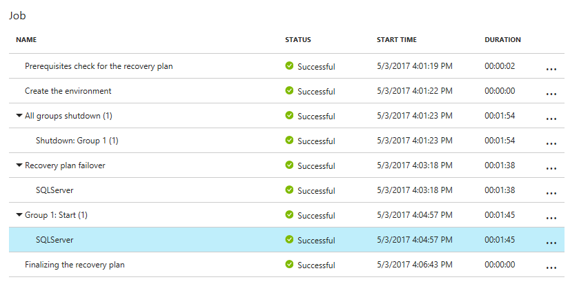

# 运行从本地到 Azure 的故障转移

本文介绍如何在 [Azure Site Recovery](site-recovery-overview.md) 中将本地计算机故障转移到 Azure。

## 开始之前

- [了解](failover-failback-overview.md)灾难恢复中的故障转移过程。
- 如果要对多台计算机进行故障转移，请[了解](recovery-plan-overview.md)如何在恢复计划中聚集计算机。
- 在执行完全故障转移之前，请运行[灾难恢复演练](site-recovery-test-failover-to-azure.md)，确保一切按预期运行。

## 准备在故障转移后进行连接

若要确保可连接到故障转移后创建的 Azure VM，故障转移前需要在本地执行多项操作。

### 在本地为故障转移后进行连接做好准备

如果要在故障转移后使用 RDP/SSH 连接到 Azure VM，则故障转移前需要在本地执行多项操作。

**故障转移之后** | **位置** | **操作**
--- | --- | ---
**运行 Windows 的 Azure VM** | 故障转移之前的本地计算机 | 若要通过 Internet 访问 Azure VM，请启用 RDP，并确保已针对“公共”  添加 TCP 和 UDP 规则，并在“Windows 防火墙”   > “允许的应用”  中针对所有配置文件允许 RDP。   若要通过站点到站点连接访问 Azure VM，请在计算机上启用 RDP，并确保在“Windows 防火墙”   -> “允许的应用和功能”  中针对“域和专用”  网络允许 RDP。      删除所有静态永久性路由和 WinHTTP 代理。 确保操作系统 SAN 策略已设置为 **OnlineAll**。 [了解详细信息](https://support.microsoft.com/kb/3031135)。   在触发故障转移时，请确保 VM 上没有处于挂起状态的 Windows 更新。 Windows 更新可能会在故障转移时启动，在更新完成之前，无法登录到 VM。
**运行 Linux 的 Azure VM** | 故障转移之前的本地计算机 | 确保 VM 上的安全外壳服务已设置为在系统引导时自动启动。   确保防火墙规则允许 SSH 连接。

## 运行故障转移

本过程介绍了如何对[恢复计划](site-recovery-create-recovery-plans.md)运行故障转移。 如果要为单个 VM 运行故障转移，请遵循适用于 [VMware VM](vmware-azure-tutorial-failover-failback.md)、[物理服务器](physical-to-azure-failover-failback.md)或 [Hyper-V VM](hyper-v-azure-failover-failback-tutorial.md) 的说明。

运行恢复计划故障转移，如下所示：

1. 在 Site Recovery 保管库中，选择“恢复计划” > “recoveryplan_name”   。
2. 单击 **“故障转移”** 。

    

3. 在“故障转移” > “故障转移方向”中，如果要复制到 Azure，则保留默认值   。
4. 在“故障转移”中，选择要故障转移到的恢复点   。

    - **最新**：使用最新的点。 此时会处理发送到 Site Recovery 服务的所有数据，并为每台计算机创建一个恢复点。 此选项提供最低 RPO（恢复点目标），因为故障转移后创建的 VM 具有触发故障转移时复制到 Site Recovery 的所有数据。
    - **最新处理**：使用此选项可将 VM 故障转移到已由 Site Recovery 处理的最新恢复点。 你可在 VM 的“最新恢复点”中查看最新处理的恢复点  。 此选项提供较低的 RTO，因为无需费时处理未经处理的数据
    - **最新应用一致**：使用此选项可将 VM 故障转移到已由 Site Recovery 处理的最新应用程序一致恢复点。
    - **最新处理的多 VM**：借助此选项，属于复制组的 VM 会故障转移到最新通用多 VM 一致恢复点。 其他虚拟机会故障转移到其最新处理的恢复点。 此选项仅可用于至少有一个 VM 已启用多 VM 一致性的恢复计划。
    - **最新的多 VM 应用一致**：借助此选项，属于复制组的 VM 会故障转移到最新的常用多 VM 应用程序一致恢复点。 其他虚拟机将故障转移到其最新的应用程序一致恢复点。 仅可用于至少有一个 VM 已启用多 VM 一致性的恢复计划。
    - **自定义**：不可用于恢复计划。 此选项仅可用于单个 VM 的故障转移。

5. 如果希望 Site Recovery 在启动故障转移前关闭源 VM，请选择“在开始故障转移前关闭计算机”  。 即使关机失败，故障转移也仍会继续。  

    > [!NOTE]
    > 如果对 Hyper-V VM 进行故障转移，则在触发故障转移前，关机操作会尝试同步和复制尚未发送到服务的本地数据。 

6. 在“作业”页上跟踪故障转移进度  。 即使发生错误，恢复计划也会运行到完成为止。
7. 故障转移后，登录到 VM 进行验证。 
8. 如果要切换到用于故障转移的其他恢复点，请使用“更改恢复点”  。
9. 准备就绪后，就可以提交故障转移。**提交**操作将删除该服务可用的所有恢复点。 “更改恢复点”选项将不再可用  。

## 运行计划故障转移 (Hyper-V)

可为 Hyper-V VM 运行计划故障转移。

- 计划故障转移是不会丢失任何数据的故障转移选项。
- 触发计划内故障转移时，首先会关闭源虚拟机，同步最新数据，然后再触发故障转移。
- 可使用“计划故障转移”选项运行计划的故障转移  。 它以与常规故障转移类似的方式运行。

## 跟踪故障转移

有多个与故障转移相关的作业。

- **先决条件检查**：确保满足故障转移所需的全部条件。
- **故障转移**：处理数据，以便通过其创建 Azure VM。 如果选择了**最新的**恢复点，则会基于发送到服务的数据创建恢复点。
- **开始**：使用上一步中处理的数据创建 Azure VM。

> [!WARNING]
> **请勿取消正在进行的故障转移**：在启动故障转移前，VM 的复制已停止。 如果取消正在进行的作业，故障转移会停止，但 VM 将不会开始复制。 无法再次启动复制。

### 额外的故障转移时间

在某些情况下，VM 故障转移需要执行中间步骤，这些步骤通常需要大约 8 到 10 分钟才能完成。 以下是受此额外步骤/时间影响的计算机：

* 运行的移动服务版本低于 9.8 的 VMware 虚拟机。
* 物理服务器以及作为物理服务器受到保护的 Hyper-V VM。
* VMware Linux VM。
* 这些驱动程序不作为启动驱动程序出现的 VMware VM：
    * storvsc
    * vmbus
    * storflt
    * intelide
    * atapi
* 未启用 DHCP 的 VMware VM，无论它们使用的是 DHCP 还是静态 IP 地址。

## 在故障转移过程中自动执行操作

你可能希望在故障转移过程中自动执行操作。 为此，可以在恢复计划中使用脚本或 Azure 自动化 runbook。

- [了解](site-recovery-create-recovery-plans.md)如何创建和自定义恢复计划，包括添加脚本。
- [了解](site-recovery-runbook-automation.md)如何将 Azure 自动化 runbook 添加到恢复计划中。

## 故障转移后配置设置

### 在故障转移后保留驱动器号

Site Recovery 会处理驱动器号的保留。 如果要在 VM 复制期间排除磁盘，请[查看其工作原理示例](exclude-disks-replication.md#example-1-exclude-the-sql-server-tempdb-disk)。

### 在 Azure 中为故障转移后进行连接做好准备

如果要使用 RDP 或 SSH 连接到故障转移后创建的 Azure VM，请遵照表格中汇总的要求。

**故障转移** | **位置** | **操作**
--- | --- | ---
**运行 Windows 的 Azure VM** | 故障转移之后在 Azure VM 上 |  为 VM [添加公共 IP 地址](https://aka.ms/addpublicip)。   已故障转移的 VM（及其连接到的 Azure 子网）上的网络安全组规则需要允许与 RDP 端口建立传入连接。   选中“启动诊断”可查看 VM 的屏幕截图  。   如果无法连接，请检查 VM 是否正在运行，并查看这些[故障排除提示](https://social.technet.microsoft.com/wiki/contents/articles/31666.troubleshooting-remote-desktop-connection-after-failover-using-asr.aspx)。
**运行 Linux 的 Azure VM** | 故障转移之后在 Azure VM 上 | 已故障转移的 VM（及其连接到的 Azure 子网）上的网络安全组规则需要允许与 SSH 端口建立传入连接。   为 VM [添加公共 IP 地址](https://aka.ms/addpublicip)。   选中“启动诊断”可查看 VM 的屏幕截图  。  

请按照[此处](site-recovery-failover-to-azure-troubleshoot.md)所述的步骤对故障转移后的任何连接问题进行故障排除。

## 设置 IP 寻址

- **内部 IP 地址**：若要在故障转移后设置 Azure VM 的内部 IP 地址，可使用以下选项：
    - 保留相同 IP 地址：可在 Azure VM 上使用与分配给本地计算机的 IP 地址相同的 IP 地址。
    - 使用其他 IP 地址：可为 Azure VM 使用其他 IP 地址。
    - [详细了解](concepts-on-premises-to-azure-networking.md#assign-an-internal-address)如何设置内部 IP 地址。
- **外部 IP 地址**：可在故障转移时保留公共 IP 地址。 必须将故障转移过程中创建的 Azure VM 分配给 Azure 区域中可用的 Azure 公共 IP 地址。 可手动分配公共 IP 地址，也可通过恢复计划自动化公共 IP 地址分配过程。 [了解详细信息](concepts-public-ip-address-with-site-recovery.md)。

## 后续步骤

故障转移后，需要重新保护才能开始将 Azure VM 复制回本地站点。 复制启动并运行后，即可在准备就绪时进行本地故障回复。

- [详细了解](failover-failback-overview.md#reprotectionfailback)重新保护和故障回复。
- [准备](vmware-azure-reprotect.md)进行 VMware 重新保护和故障回复。
- [故障回复](hyper-v-azure-failback.md) Hyper-V VM。
- [了解](physical-to-azure-failover-failback.md)物理服务器的故障转移和故障回复过程。

<!-- Update_Description: update meta properties, wording update, update link -->