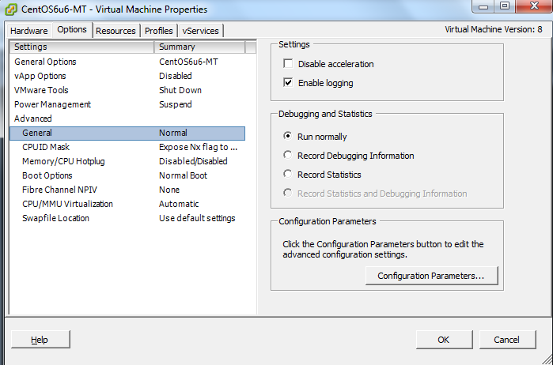
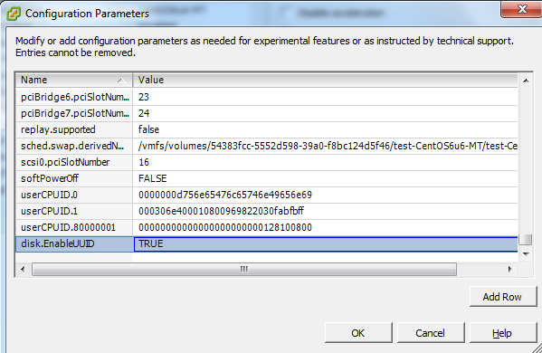

# <a name="install-a-linux-master-target-server"></a>安装 Linux 主目标服务器
故障转移虚拟机后，可将虚拟机故障回复到本地站点。 若要故障回复，需要在本地站点中重新保护 Azure 中的虚拟机。 对于此过程，需要安装一个本地主目标服务器用于接收流量。 

如果受保护的虚拟机是 Windows 虚拟机，则需要安装 Windows 主目标。 对于 Linux 虚拟机，需要安装 Linux 主目标。 请阅读以下步骤，了解如何创建和安装 Linux 主目标。

> [!IMPORTANT]
> 从主目标服务器版本 9.10.0 开始，只能在 Ubuntu 16.04 服务器上安装最新的主目标服务器。 CentOS6.6 服务器不支持新安装。 但是，可继续使用 9.10.0 版本升级旧版主目标服务器。

## <a name="overview"></a>概述
本文提供 Linux 主目标的相关安装说明。

请在本文末尾或者在 [Azure 恢复服务论坛](https://social.msdn.microsoft.com/Forums/en-US/home?forum=hypervrecovmgr)中发表任何评论或问题。

## <a name="prerequisites"></a>先决条件

* 若要选择用于部署主目标的主机，请确定是要故障回复到现有的本地虚拟机还是新的虚拟机。 
    * 对于现有虚拟机，主目标的主机应有权访问虚拟机的数据存储。
    * 如果本地虚拟机不存在，需在主目标所在的同一台主机上创建故障回复虚拟机。 可以选择任何一台 ESXi 主机用于安装主目标。
* 主目标应在可与进程服务器和配置服务器通信的网络中。
* 主目标版本应该低于或等于进程服务器和配置服务器的版本。 例如，如果配置服务器版本为 9.4，则主目标的版本可以是 9.4 或 9.3，而不能是 9.5。
* 主目标只能是 VMware 虚拟机，而不能是物理服务器。

## <a name="create-the-master-target-according-to-the-sizing-guidelines"></a>根据大小调整准则创建主目标

根据下列大小调整准则创建主目标：
- **RAM**：6GB 或更多
- **OS 磁盘大小**：100GB 或更多（用于安装 CentOS6.6）
- **保留驱动器的附加磁盘大小**：1TB
- **CPU 核心数**：4 个核心或更多

支持以下受支持的 Ubuntu 内核。

|内核系列  |最高支持  |
|---------|---------|
|4.4      |4.4.0-81-generic         |
|4.8      |4.8.0-56-generic         |
|4.10     |4.10.0-24-generic        |

## <a name="deploy-the-master-target-server"></a>部署主目标服务器

### <a name="install-ubuntu-16042-minimal"></a>安装 Ubuntu 16.04.2 最简版

按下列步骤安装 Ubuntu 16.04.2 64 位操作系统。

**步骤 1：**转至[下载链接](https://www.ubuntu.com/download/server/thank-you?version=16.04.2&architecture=amd64)，并选择最接近的镜像，从中下载 Ubuntu 16.04.2 最简版 64 位 ISO。

将 Ubuntu 16.04.2 最简版 64 位 ISO 保存在 DVD 驱动器中，并启动系统。

**步骤 2：**选择“英语”作为首选语言，并按 **Enter**。


**步骤 3：**选择“安装 Ubuntu 服务器”，并按 **Enter**。


**步骤 4：**选择“英语”作为首选语言，并按 **Enter**。


**步骤 5：**在“时区”选项列表中选择相应选项，并按 **Enter**。


**步骤 6：**选择“否”（默认选项），并按 **Enter**。


**步骤 7：**选择“英语(美国)”作为键盘原产地语言，并按 **Enter**。


**步骤 8：**选择“英语(美国)”作为键盘布局，并按 **Enter**。


**步骤 9：**在“主机名”框中输入服务器的主机名，并选择“继续”。


**步骤 10：**要创建用户帐户，请输入用户名，并选择“继续”。


**步骤 11：**为新用户帐户输入密码，并选择“继续”。


**步骤 12：**确认新用户的密码，再选择“继续”。


**步骤 13：**选择“否”（默认选项），并按 **Enter**。


**步骤 14：**如果显示的时区正确，请选择“是”（默认选项），并按 **Enter**。

要重新配置时区，请选择“否”。


**步骤 15：**在分区方法选项中选择“引导式 - 使用整个磁盘”，并按 **Enter**。


**步骤 16：**在“选择要分区的磁盘”选项中选择相应的磁盘，并按 **Enter**。


**步骤 17：**选择“是”将更改写入磁盘，并按 **Enter**。


**步骤 18：**选择默认选项，再选择“继续”按钮并按 **Enter**。


**步骤 19：**在系统中选择相应选项以管理升级，并按 **Enter**。


> [!WARNING]
> 由于 Azure Site Recovery 主目标服务器需要非常特定的 Ubuntu 版本，因此需确保已为虚拟机禁用内核升级。 如果启用，任意常规升级都会导致主目标服务器无法正常工作。 请务必选择“不自动更新”选项。

**步骤 20：**选择默认选项。 若要对 SSH 连接使用 openSSH，请依次选择“OpenSSH 服务器”选项和“继续”。


**步骤 21：**选择“是”，并按 **Enter**。


**步骤 22：**为启动加载程序安装选择相应的设备（推荐 **/dev/sda**），并按 **Enter**。


**步骤 23：**选择“继续”，并按 **Enter** 来完成安装。


在完成安装后，使用新用户凭据登录 VM。 （有关详细信息，请参阅“步骤 10”。）

按下列屏幕截图中所述步骤来设置根用户密码。 然后以根用户身份登录。


### <a name="prepare-the-machine-for-configuration-as-a-master-target-server"></a>准备要配置为主目标服务器的计算机
接下来，准备要配置为主目标服务器的计算机。

若要获取 Linux 虚拟机中每个 SCSI 硬盘的 ID，请启用 **disk.EnableUUID = TRUE** 参数。

要启用此参数，请使用以下步骤：

1. 关闭虚拟机。

2. 在左窗格中右键单击虚拟机对应的条目，并选择“编辑设置”。

3. 选择“选项”选项卡。

4. 在左窗格中，选择“高级” > “常规”，并选择屏幕右下角的“配置参数”按钮。

    

    当计算机正在运行时，“配置参数”选项不可用。 若要使此选项卡处于活动状态，请关闭虚拟机。

5. 查看是否存在包含 **disk.EnableUUID** 的行。

    - 如果该值存在且设置为 **False**，请将它更改为 **True**。 （值不区分大小写。）

    - 如果该值存在且设置为 **True**，请选择“取消”。

    - 如果该值不存在，请选择“添加行”。

    - 在名称列中添加 **disk.EnableUUID**，并将值设置为 **TRUE**。

    

#### <a name="disable-kernel-upgrades"></a>禁用内核升级

Azure Site Recovery 主目标服务器需要特定版本的 Ubuntu，请确保已为虚拟机禁用内核升级。

如果启用，则任意常规升级都会导致主目标服务器无法正常工作。

#### <a name="download-and-install-additional-packages"></a>下载并安装其他包

> [!NOTE]
> 在下载并安装其他包之前，请确保已建立 Internet 连接。 如果没有 Internet 连接，需手动找到并安装这些 RPM 包。

```
apt-get install -y multipath-tools lsscsi python-pyasn1 lvm2 kpartx
```

### <a name="get-the-installer-for-setup"></a>获取安装程序

如果主目标已建立 Internet 连接，可以使用以下步骤下载安装程序。 或者，可从进程服务器复制该安装程序并执行安装。

#### <a name="download-the-master-target-installation-packages"></a>下载主目标安装包

[下载最新的 Linux 主目标安装程序](https://aka.ms/latestlinuxmobsvc)。

若要使用 Linux 下载该安装程序，请键入：

```
wget https://aka.ms/latestlinuxmobsvc -O latestlinuxmobsvc.tar.gz
```

请务必将安装程序下载并解压缩到主目录。 如果解压缩到 **/usr/Local**，则安装会失败。

#### <a name="access-the-installer-from-the-process-server"></a>从进程服务器访问安装程序

1. 在进程服务器上，转到 **C:\Program Files (x86)\Microsoft Azure Site Recovery\home\svsystems\pushinstallsvc\repository**。

2. 从进程服务器复制所需的安装程序文件，并在主目录中将它保存为 **latestlinuxmobsvc.tar.gz**。

### <a name="apply-custom-configuration-changes"></a>应用自定义配置更改

若要应用自定义配置更改，请使用以下步骤：

1. 运行以下命令解压缩二进制文件。
    ```
    tar -zxvf latestlinuxmobsvc.tar.gz
    ```
    

2. 运行以下命令来指定权限。
    ```
    chmod 755 ./ApplyCustomChanges.sh
    ```

3. 运行以下命令来运行该脚本。
    ```
    ./ApplyCustomChanges.sh
    ```
> [!NOTE]
> 仅在服务器上运行该脚本一次。 关闭服务器。 根据后续部分所述添加磁盘后，重启服务器。

### <a name="add-a-retention-disk-to-the-linux-master-target-virtual-machine"></a>将保留磁盘添加到 Linux 主目标虚拟机

使用以下步骤创建保留磁盘：

1. 将新的 1-TB 磁盘附加到 Linux 主目标虚拟机，并启动计算机。

2. 通过 **multipath -ll** 命令了解保留磁盘的多路径 ID。

    ```
    multipath -ll
    ```
    

3. 格式化驱动器并在新驱动器上创建文件系统。

    ```
    mkfs.ext4 /dev/mapper/<Retention disk's multipath id>
    ```
    

4. 创建文件系统后，请装载保留磁盘。
    ```
    mkdir /mnt/retention
    mount /dev/mapper/<Retention disk's multipath id> /mnt/retention
    ```
    

5. 创建每次系统启动期间用于装载保留驱动器的 **fstab** 项。
    ```
    vi /etc/fstab
    ```
    按 **Insert** 开始编辑文件。 创建新行并插入以下文本。 根据前一命令中突出显示的多路径 ID 编辑磁盘多路径 ID。

    **/dev/mapper/<Retention disks multipath id> /mnt/retention ext4 rw 0 0**

    按 **Esc**，键入 **:wq**（写入并退出）来关闭编辑器窗口。

### <a name="install-the-master-target"></a>安装主目标

> [!IMPORTANT]
> 主目标服务器的版本应该低于或等于进程服务器和配置服务器的版本。 如果不满足此条件，重新保护会成功，但复制会失败。

> [!NOTE]
> 安装主目标服务器之前，请检查虚拟机上的 **/etc/hosts** 文件是否包含用于将本地主机名映射到所有网络适配器关联的 IP 地址的条目。

1. 在配置服务器上从 **C:\ProgramData\Azure Site Recovery\private\connection.passphrase** 复制通行短语。 然后运行以下命令，将其作为 **passphrase.txt** 保留在同一本地目录中：

    ```
    echo <passphrase> >passphrase.txt
    ```
    示例： 

    ```
    echo itUx70I47uxDuUVY >passphrase.txt
    ```

2. 记下配置服务器的 IP 地址， 因为下一步骤需要用到。

3. 运行以下命令安装主目标服务器并将它注册到配置服务器。

     ```
    ./install -q -d /usr/local/ASR -r MT -v VmWare
    /usr/local/ASR/Vx/bin/UnifiedAgentConfigurator.sh -i <ConfigurationServer IP Address> -P passphrase.txt
    ```

    示例： 

    ```
    /usr/local/ASR/Vx/bin/UnifiedAgentConfigurator.sh -i 104.40.75.37 -P passphrase.txt
    ```

    等到脚本执行完成。 如果成功注册主目标，门户中的“Site Recovery 基础结构”页上会列出该主目标。

#### <a name="install-the-master-target-by-using-interactive-installation"></a>使用交互式安装来安装主目标

1. 运行以下命令安装主目标。 选择“主目标”作为代理角色。

    ```
    ./install
    ```

2. 选择默认安装位置，并按 **Enter** 继续。

    

安装完成后，使用命令行注册配置服务器。

1. 请注意配置服务器的 IP 地址。 因为下一步骤需要用到。

2. 运行以下命令安装主目标服务器并将它注册到配置服务器。

    ```
    ./install -q -d /usr/local/ASR -r MT -v VmWare
    /usr/local/ASR/Vx/bin/UnifiedAgentConfigurator.sh -i <ConfigurationServer IP Address> -P passphrase.txt
    ```
    示例： 

    ```
    /usr/local/ASR/Vx/bin/UnifiedAgentConfigurator.sh -i 104.40.75.37 -P passphrase.txt
    ```

   等到脚本执行完成。 如果成功注册主目标，门户中的“Site Recovery 基础结构”页上会列出该主目标。

### <a name="upgrade-the-master-target"></a>升级主目标服务器

运行安装程序。 它会自动检测是否在 master 目标服务器上安装了代理。 选择“是”进行升级。安装完成后，可运行下列命令，检查安装的主目标版本：

    ```
    cat /usr/local/.vx_version
    ```

“版本”字段中显示了主目标的版本号。

### <a name="install-vmware-tools-on-the-master-target-server"></a>在主目标服务器上安装 VMware 工具

需将 VMware 工具安装在主目标上，使其可发现数据存储。 若未安装这些工具，则数据存储中不会列出重新保护屏幕。 安装 VMware 工具后，需重启计算机。

## <a name="next-steps"></a>后续步骤
主目标安装和注册完成后，在“Site Recovery 基础结构”中“主目标”部分的配置服务器概述下即会显示此主目标。

现在，可以继续执行[重新保护](site-recovery-how-to-reprotect.md)过程，并执行故障回复。

## <a name="common-issues"></a>常见问题

* 切勿在主目标等任何管理组件上打开存储 vMotion。 如果重新保护成功后移动主目标，将无法分离虚拟机磁盘 (VMDK)。 此情况下，故障回复会失败。

* 主目标不应在虚拟机上留下任何快照。 如果有快照，故障回复会失败。

* 由于某些客户使用某些自定义 NIC 配置，使得网络接口在启动期间被禁用，因此，主目标代理无法初始化。 请确保正确设置以下属性。 在以太网卡文件 /etc/sysconfig/network-scripts/ifcfg-eth* 中检查这些属性。
    * BOOTPROTO=dhcp
    * ONBOOT=yes
    
<!--Update_Description: update meta properties, wording update -->