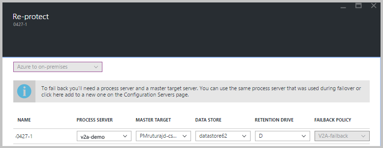

# 在本地站点中重新保护 Azure 上的虚拟机

## 概述
本文介绍了如何将 Azure 虚拟机从 Azure 重新保护到本地站点。 如[使用 Azure Site Recovery 将 VMware 虚拟机和物理服务器复制到 Azure](site-recovery-failover.md) 中所述将 VMware 虚拟机或 Windows/Linux 物理服务器从本地站点故障转移到 Azure 后，准备对它们进行故障回复时，请遵循本文中的说明。

> [!WARNING]
> 如果[已完成迁移](site-recovery-migrate-to-azure.md#what-do-we-mean-by-migration)、已将虚拟机移至另一资源组或已删除 Azure 虚拟机，则无法进行故障回复。 如果禁用虚拟机的保护，则无法进行故障回复。 如果在 Azure（基于云）中首次创建虚拟机，则无法重新保护该回本地。 计算机应具有已在本地最初受保护和故障转移到 Azure 之前重新保护。

在重新保护完成并且受保护的虚拟机正在复制后，可以在虚拟机上启动故障回复将其恢复到本地站点。

> [!NOTE]
> 仅可重新保护和故障回复到 ESXi 主机。 无法将虚拟机故障回复到 Hyper-v 主机、VMware 工作站或任何其他虚拟化平台。

<!-- Not Available [Azure Recovery Services Forum] -->

<!--Not Available VIDEO-->
## 先决条件

> [!IMPORTANT]
> 在故障转移到 Azure 的过程中，本地站点可能无法访问，因此配置服务器可能不可用或关闭。 在重新保护和故障回复期间，本地配置服务器应运行且处于连接正常状态。

在准备重新保护虚拟机时，请执行或注意以下先决条件操作：

* 如果 vCenter 服务器管理着要故障回复到的虚拟机，请确保拥有在 vCenter 服务器上发现虚拟机[所需的权限](site-recovery-vmware-to-azure-classic.md)。

  > [!WARNING]
  > 如果本地主目标或虚拟机上存在快照，则重新保护会失败。 可以先删除主目标上的快照，再继续重新保护。 在执行重新保护作业期间，虚拟机上的快照会自动合并。

* 在进行故障回复之前，创建两个其他组件：

  * **进程服务器**：[进程服务器](site-recovery-vmware-setup-azure-ps-resource-manager.md)从 Azure 中受保护的虚拟机接收数据，将数据发送到本地站点。 在进程服务器与受保护虚拟机之间需要配置低延迟网络。 因此，如果在使用 Azure ExpressRoute 连接或者在使用基于 Azure 的进程服务器和 VPN，则可以具有本地进程服务器。

  * **主目标服务器**：主目标服务器接收故障回复数据。 创建的本地管理服务器默认情况下已安装主目标服务器。 但是，可能需要创建单独的故障回复用主目标服务器，具体取决于故障回复流量。
    * [Linux 虚拟机需要 Linux 主目标服务器](site-recovery-how-to-install-linux-master-target.md)。
    * Windows 虚拟机需要 Windows 主目标服务器。 可以重复使用本地进程服务器和主目标计算机。
    * 主目标具有[在重新保护前要在主目标上检查的公共事项](site-recovery-how-to-reprotect.md#common-things-to-check-after-completing-installation-of-the-master-target-server)中列出的其他先决条件。

> [!NOTE]
> 复制组的所有虚拟机应都为相同的操作系统类型（所有 Windows 或所有 Linux）。 混合操作系统的复制组当前不支持重新保护和故障回复到本地。 这是操作系统的因为主目标应为作为虚拟机相同和的复制组的所有虚拟机应都具有相同的主目标。 

* 执行故障回复时，本地需有配置服务器。 故障回复期间，虚拟机必须位于配置服务器数据库中。 否则，故障回复不会成功。 

> [!IMPORTANT]
> 请确保定期计划配置服务器备份。 如果发生灾难，请使用相同的 IP 地址还原服务器，以便故障回复正常工作。

> [!WARNING]
> 复制组仅应有 Windows VM 或 Linux VM，并不这二者的融合因为 replictaion 组中的所有 VM 都使用相同的主目标服务器和 Linux VM 需要的 Linux 主目标服务器和 Windows 虚拟机喜欢明智的做法。

* 在 VMware 中的主目标虚拟机的配置参数中设置 `disk.EnableUUID=true` 设置。 如果此行不存在，请添加此行。 若要为虚拟机磁盘 (VMDK) 提供一致的 UUID，以便能够正确进行装载，则必须指定此设置。

* *不能在主目标服务器上使用存储 vMotion*。 这会导致故障回复失败。 虚拟机无法启动，因为磁盘不可供其使用。 若要防止出现此问题，请从 vMotion 列表中排除主目标服务器。

* 向主目标服务器添加一个新驱动器：一个保留驱动器。 添加新磁盘并格式化驱动器。

### 常见问题

#### 将数据复制回本地站点时为何需要 S2S VPN 或 ExpressRoute 连接？
虽然从本地到 Azure 的复制可通过 Internet 或通过具有公共对等互连的 ExpressRoute 连接进行，但重新保护和故障回复需要通过站点到站点 (S2S) VPN 来复制数据。 应提供网络，以便 Azure 中已故障转移的虚拟机可以访问 (ping) 本地配置服务器。 还可能需要在已故障转移的虚拟机所在的 Azure 网络中部署进程服务器。 此进程服务器还应能够与本地配置服务器通信。

#### 何时应在 Azure 中安装进程服务器？

要重新保护的 Azure虚拟机会将复制数据发送到进程服务器。 对网络进行设置，以使 Azure 上的虚拟机可以访问进程服务器。

可在 Azure 中部署进程服务器，或使用故障转移期间用过的现有进程服务器。 要考虑的要点是将数据从 Azure 中的虚拟机发送到进程服务器时的延迟。

如果已设置了 ExpressRoute 连接，则可以使用本地进程服务器发送数据，因为虚拟机与进程服务器之间的延迟较低。

 

但是，如果只有 S2S VPN，则我们建议在 Azure 中部署进程服务器。

 

请记住，从 Azure 复制到本地的操作将只能通过 S2S VPN 或 ExpressRoute 网络的专用对等互连进行。 请确保该网络通道有足够的带宽可用。

有关安装基于 Azure 的进程服务器的信息，请参阅[管理在 Azure 中运行的进程服务器](site-recovery-vmware-setup-azure-ps-resource-manager.md)。

> [!TIP]
> 我们建议在故障回复期间使用基于 Azure 的进程服务器。 如果进程服务器离复制虚拟机（Azure 中进行故障转移的计算机）较近，则复制性能较高。 但是，在概念验证 (POC) 或演示期间，可将本地进程服务器与专用对等互连的 ExpressRoute 一起使用以更快地完成 POC。

> [!NOTE]
> 从本地复制到 Azure 的操作只能通过 Internet 或具有公共对等互连的 ExpressRoute 来完成。 从 Azure 复制到本地的操作只能通过 S2S VPN 或具有专用对等互连的 ExpressRoute 来完成

#### 要使重新保护正常工作，应当在不同的组件上打开哪些端口？

#### 应该将哪个主目标服务器用于重新保护？
需要本地主目标服务器，以便从进程服务器接收数据，然后将数据写入到本地虚拟机的 VMDK。 如果要保护 Windows 虚拟机，需要 Windows 主目标服务器。 可以重复使用本地进程服务器和主目标<!-- !todo component -->。 对于 Linux虚拟机，需要设置附加的本地 Linux 主目标。

有关安装主目标服务器的信息，请参阅：

* [如何安装 Windows 主目标服务器](site-recovery-vmware-to-azure.md)
* [如何安装 Linux 主目标服务器](site-recovery-how-to-install-linux-master-target.md)

#### 故障回复期间，本地 ESXi 主机支持哪些数据存储类型？

当前，Azure Site Recovery 仅支持故障回复到虚拟机文件系统 (VMFS) 或 vSAN 数据存储。 不支持 NFS 数据存储。 由于此限制，如果使用 NFS 数据存储，则重新保护屏幕中的数据存储选择输入为空；或者它会显示 vSAN 数据存储，但在执行作业时会失败。 如果打算执行故障回复，则可在本地创建 VMFS 数据存储并故障回复到该数据存储。 此故障回复操作会引发完整下载 VMDK 的操作。

### 在完成主目标服务器的安装后要检查的常见事项

* 如果虚拟机在 vCenter 服务器本地，主目标服务器需要访问本地虚拟机的 VMDK。 需要分配向虚拟机磁盘写入复制数据的访问权限。 确保在具有读写访问权限的主目标主机上装载本地虚拟机的数据存储。

* 如果虚拟机不在 vCenter 服务器本地，则 Site Recovery 服务需要在重新保护过程中创建新的虚拟机。 会在创建主目标的 ESX 主机上创建此虚拟机。 请谨慎选择 ESX 主机，以便将故障回复虚拟机创建在所需的主机上。

* *不能对主目标服务器使用存储 vMotion*。 这会导致故障回复失败。 虚拟机无法启动，因为磁盘不可供其使用。

  > [!WARNING]
  > 如果主目标在重新保护后执行存储 vMotion 任务，则附加到主目标的受保护虚拟机磁盘会迁移到 vMotion 任务的目标。 如果尝试在此之后进行故障回复，则磁盘分离会因为找不到磁盘而失败。 此后，会难以在存储帐户中找到磁盘。 需要手动查找磁盘，并将它们附加到虚拟机。 在此之后，可以启动本地虚拟机。

* 向现有的 Windows 主目标服务器添加一个保留驱动器。 添加新磁盘并格式化驱动器。 保留驱动器用于停止虚拟机复制回本地站点的时间点。 下面是保留驱动器的一些条件。 如果不符合这些条件，则不会为主目标服务器列出该驱动器。

   * 卷没有用于任何其他目的，例如用作复制目标。

   * 卷没有处于锁定模式。

   * 卷不是缓存卷。 该卷上不应存在主目标安装。 用于进程服务器和主目标的自定义安装卷不能用作保留卷。 当进程服务器和主目标安装在某个卷上时，该卷是主目标的缓存卷。

   * 卷的文件系统类型不是 FAT 或 FAT32。

   * 卷容量为非零值。

   * Windows 的默认保留卷是 R 卷。

   * Linux 的默认保留卷是 /mnt/retention。

  > [!IMPORTANT]
  > 如果使用的是现有进程服务器/配置服务器计算机或者是规模或进程服务器/主目标服务器计算机，则需要添加新驱动器。 新驱动器应满足上述要求。 如果保留驱动器不存在，则它不会显示在门户上的选择下拉列表中。 将驱动器添加到本地主目标后，该驱动器最多需要 15 分钟才会显示在门户上的选择项中。 如果 15 分钟后未显示该驱动器，还可以刷新配置服务器。

* Linux 故障转移虚拟机需要 Linux 主目标服务器。 Windows 故障转移虚拟机需要 Windows 主目标服务器。

* 在主目标服务器上安装 VMware 工具。 没有 VMware 工具，将无法检测到主目标的 ESXi 主机上的数据存储。

* 使用 vCenter 属性在主目标虚拟机上启用 `disk.EnableUUID=true` 参数。 <!-- !todo Needs link. -->

* 主目标应当附加了至少一个 VMFS 数据存储。 如果未附加任何数据存储，则重新保护页上的“数据存储”输入为空，无法继续操作。

* 主目标服务器在磁盘上不能具有任何快照。 如果具有快照，则重新保护和故障回复会失败。

* 主目标不能具有半虚拟化 SCSI 控制器。 控制器只能是 LSI 逻辑控制器。 如果没有 LSI 逻辑控制器，重新保护会失败。

* 在任何给定的实例，主目标可以具有 atmst 60 磁盘附加到它。 如果正在重新保护到本地主目标虚拟机数之和总磁盘数超过 60，则重新保护到主目标会失败。 确保有足够的主目标的磁盘槽或部署更多的主目标服务器。

## 重新保护步骤

> [!NOTE]
> 虚拟机在 Azure 中启动后，会留出一段时间让代理重新注册到配置服务器（最多 15 分钟）。 在此期间，重新保护会失败并返回一条错误消息，指出未安装代理。 请等待几分钟，并重试重新保护。

1. 在“保管库” > “已复制的项”中，右键单击已故障转移的虚拟机，并选择“重新保护”。 也可以单击该计算机，并从命令按钮中选择“重新保护”。
2. 在边栏选项卡中，可以看到已选中“Azure 到本地”的保护方向。
3. 在“主目标服务器”和“进程服务器”中，选择本地主目标服务器和进程服务器。
4. 对于“数据存储”，选择要将本地磁盘恢复到的数据存储。 删除本地虚拟机后，如果需要创建新磁盘，可使用此选项。 如果磁盘已存在，则会忽略此选项，但你仍然需要指定一个值。
5. 选择保留驱动器。
6. 会自动选择故障回复策略。
7. 单击“确定”开始重新保护。 一个作业会开始将虚拟机从 Azure 复制到本地站点。 可以在“作业”选项卡上跟踪进度。

如果要恢复到备用位置（删除了本地虚拟机时），请选择针对主目标服务器配置的保留驱动器和数据存储。 故障回复到本地站点时，故障回复保护计划中的 VMware 虚拟机会使用与主目标服务器相同的数据存储。 会在 vCenter 中创建一个新虚拟机。

如果要将 Azure 中的虚拟机恢复到现有本地虚拟机，则应在主目标服务器的 ESXi 主机上使用读/写访问权限装载本地虚拟机的数据存储。
    

也可以在恢复计划级别重新保护。 只能通过恢复计划重新保护复制组。 使用恢复计划重新保护时，需要为每台受保护的计算机提供值。

> [!NOTE]
> 请使用同一台主目标服务器来重新保护复制组。 如果使用不同的主目标服务器来重新保护复制组，则服务器无法提供共同的时间点。

> [!NOTE]
> 在重新保护期间，本地虚拟机会关闭。 这有助于确保复制期间的数据一致性。 重新保护完成后，请勿打开虚拟机。

重新保护成功后，虚拟机会进入受保护状态。

## 常见问题

* 如果虚拟机是使用模板创建的，请确保每个虚拟机对于磁盘具有其自己的 UUID。 如果本地虚拟机的 UUID 与主目标的 UUID 冲突（因为两者都是基于同一模板创建的），重新保护会失败。 请部署不是基于同一模板创建的另一个主目标。

* 如果执行只读的用户 vCenter 发现并保护虚拟机，保护会成功且故障转移可正常工作。 进行重新保护期间，操作会失败，因为无法发现数据存储。 症状是在重新保护期间数据存储没有列出。 若要解决此问题，可以使用具有适当权限的帐户更新 vCenter 凭据并重试该作业。 有关详细信息，请参阅[通过 Azure Site Recovery 将 VMware 虚拟机和物理服务器复制到 Azure](site-recovery-vmware-to-azure-classic.md)。

* 在故障回复 Linux 虚拟机并在本地运行它时，会看到网络管理器程序包已从该计算机卸载。 发生此卸载的原因是虚拟机在 Azure 中恢复时，网络管理器程序包遭到删除。

* 当 Linux 虚拟机配置有静态 IP 地址且故障转移到 Azure 时，会通过 DHCP 获取 IP 地址。 当故障转移回复到本地时，该虚拟机会继续使用 DHCP 获取 IP 地址。 如有需要，请手动登录到该计算机并将 IP 地址设置回静态地址。 Windows 虚拟机可以重新获取其静态 IP。

* 如果使用 ESXi 5.5 免费版或 vSphere 6 虚拟机监控程序免费版，则故障转移会成功，但故障回复不会成功。 若要启用故障回复，请升级到以上任一程序的评估许可证。

* 如果无法从进程服务器访问配置服务器，请使用 Telnet 在端口 443 上检查与配置服务器的连接。 也可以尝试从进程服务器 ping 配置服务器。 连接到配置服务器后，进程服务器也应会发出检测信号。

* 如果尝试故障回复到备用 vCenter，请确保已发现新 vCenter 和主目标服务器。 一种典型的症状是，“重新保护”对话框中显示数据存储不可访问/不可见。

* 作为物理本地服务器保护的 Windows Server 2008 R2 SP1 服务器无法从 Azure 故障回复到本地站点。

## 后续步骤

虚拟机进入受保护状态后，可以[启动故障回复](site-recovery-how-to-failback-azure-to-vmware.md#steps-to-fail-back)。 

故障回复会关闭 Azure 中的虚拟机，并启动本地虚拟机。 应用程序应该会停机一段时间。 请在应用程序可以容许停机时选择一个时间进行故障回复。
<!--Update_Description: update meta properties, wording update -->