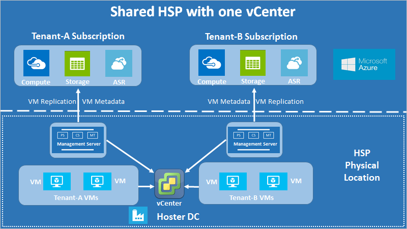
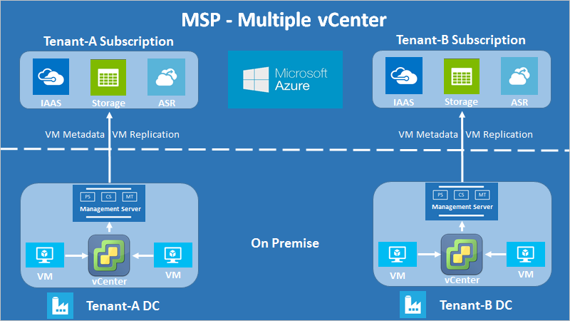
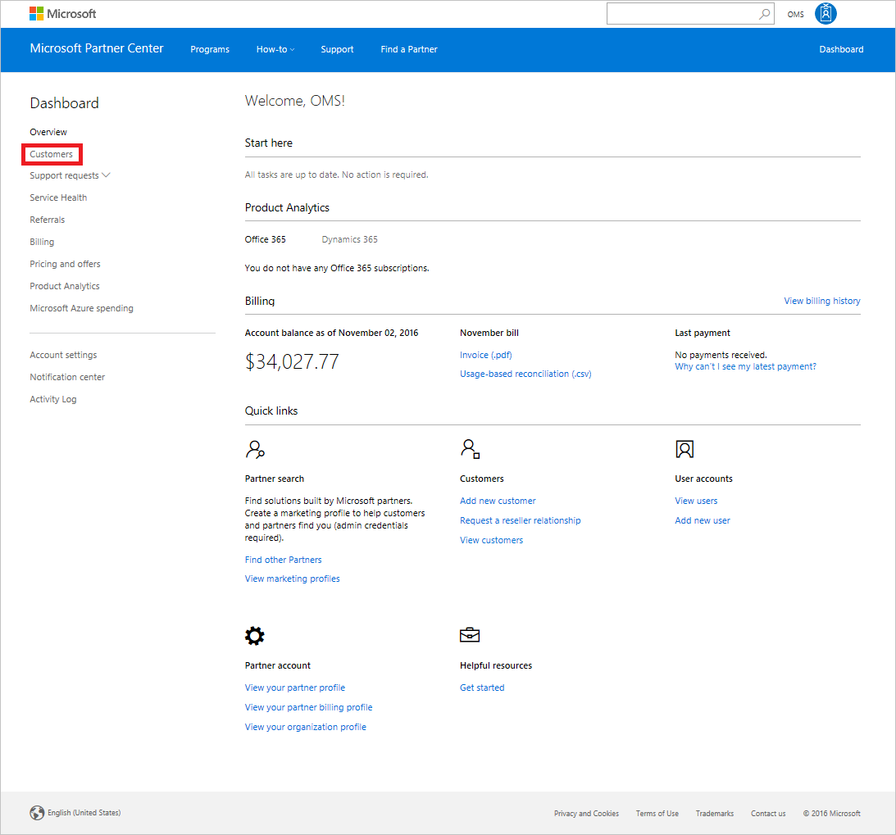
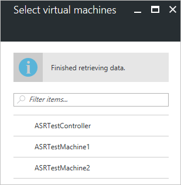

# Azure Site Recovery 中通过 CSP 将 VMware 虚拟机复制到 Azure 的多租户支持

Azure Site Recovery 支持适用于租户订阅的多租户环境。 它还支持适用于租户订阅的多租户，这些租户订阅通过 Microsoft 云解决方案提供商 (CSP) 计划创建和管理。 本文详述了实现和管理多租户 VMware 到 Azure 方案的指南。 此外还介绍了如何通过 CSP 创建和管理租户订阅。

本指南大量引用了现有文档中关于如何将 VMware 虚拟机复制到 Azure 的内容。 有关详细信息，请参阅[通过 Site Recovery 将 VMware 虚拟机复制到 Azure](site-recovery-vmware-to-azure.md)。

## 多租户环境
有三种主要的多租户模型：

* **共享托管服务提供程序 (HSP)**：合作伙伴拥有物理基础结构，并使用共享资源（vCenter、数据中心、物理存储等）在同一基础结构上托管多个租户的 VM。 合作伙伴可以提供灾难恢复管理作为托管服务，租户也可以拥有灾难恢复作为自助解决方案。

* **专用托管服务提供程序**：合作伙伴拥有物理基础结构，但使用专用资源（多个 vCenter、物理数据存储等）在单独的基础结构上托管每个租户的 VM。 合作伙伴可以提供灾难恢复管理作为托管服务，租户也可以拥有它作为自助解决方案。

* **托管服务提供程序 (MSP)**：客户拥有托管 VM 的物理基础结构，合作伙伴提供灾难恢复启用和管理功能。

## 共享托管多租户指南
本部分详细介绍共享托管方案。 另外两种方案也属于共享托管方案，并使用相同的原则。 共享托管指南结尾对其中的差异进行了说明。

在多租户方案中，基本的要求是隔离各个租户。 不允许一个租户观察到另一个租户托管的内容。 在由合作伙伴管理的环境中，此要求不那么重要，而在自助服务环境中，此要求相当重要。 本指南假定租户隔离是必需的。

下图对此体系结构做了演示：

  
**包含一个 vCenter 的共享托管方案**

如上图所示，每个客户都有一个单独的管理服务器。 此配置限制租户访问特定于租户的 VM，实现了租户隔离。 VMware 虚拟机复制方案使用配置服务器来管理帐户，以便发现 VM 和安装代理。 我们遵循多租户环境的相同原则，只是增加了通过 vCenter 访问控制限制 VM 发现这一规定。

根据数据隔离要求，所有敏感的基础结构信息（例如访问凭据）始终不能披露给租户。 因此，建议将管理服务器的所有组件交由合作伙伴全权控制。 管理服务器组件包括：
* 配置服务器 (CS)
* 进程服务器 (PS)
* 主目标服务器 (MT)

横向扩展 PS 也由合作伙伴控制。

### 在多租户方案中，每个 CS 使用两个帐户

- **vCenter 访问帐户**：使用此帐户可发现租户 VM。 它有分配给自己的 vCenter 访问权限（在下一部分介绍）。 为了避免意外访问泄漏，建议合作伙伴在配置工具中自行输入这些凭据。

- **虚拟机访问帐户**：使用此帐户可通过自动推送在租户 VM 上安装移动代理。 它通常为域帐户，可以由租户提供给合作伙伴，也可以由合作伙伴直接管理。 如果不希望将详细信息直接共享给合作伙伴，租户可以在进行有时间限制的 CS 访问时输入凭据，也可以在合作伙伴的协助下，手动安装移动代理。

### vCenter 访问帐户的要求

如前一部分所述，必须使用已向其分配了特殊角色的帐户来配置 CS。 角色分配需要应用到每个 vCenter 对象的 vCenter 访问帐户，不能传播到子对象。 此配置可确保租户隔离，因为传播访问权限可能会导致意外访问其他对象。

替代方法是将用户帐户和角色分配给数据中心对象，再将其传播到子对象。 然后，针对每个不允许特定租户访问的对象（例如，其他租户的 VM），为帐户分配“无访问权限”角色。 此配置既繁琐又会意外公开访问控制，因为系统会自动为每个新建的子对象授予从父对象继承的访问权限。 因此，建议使用第一种方法。

vCenter 帐户访问过程如下所示：

1. 通过克隆预定义的“只读”角色创建新角色，然后为其提供一个方便的名称（例如此示例中显示的 Azure_Site_Recovery）。

2. 将以下权限分配给该角色：

    * **数据存储**：分配空间、浏览数据存储、低级别文件操作、删除文件、更新虚拟机文件

    * **网络**：网络分配

    * **资源**：将 VM 分配到资源池、迁移已关机的 VM、迁移已开机的 VM

    * **任务**：创建任务、更新任务

    * **虚拟机**：
        * 配置 > 所有
        * 交互 > 回答问题、设备连接、配置 CD 介质、配置软盘介质、关机、开机、VMware 工具安装
        * 清单 > 从现有项创建、新建、注册、注销
        * 预配 > 允许虚拟机下载、允许虚拟机文件上传
        * 快照管理 > 删除快照

    

3. 将访问级别分配给各种对象的 vCenter 帐户（在租户 CS 中使用），如下所示：

>| 对象 | 角色 | 备注 |
>| --- | --- | --- |
>| vCenter | 只读 | 需要获取 vCenter 访问权限来管理不同对象时，才需要此项。 如果不需要将此帐户提供给租户，或者不需要使用此帐户在 vCenter 进行任何管理操作，则可删除此权限。 |
>| 数据中心 | Azure_Site_Recovery |  |
>| 主机和主机群集 | Azure_Site_Recovery | 请再次确保访问权限为对象级别，使得在故障转移之前和故障回复之后，只有那些可供访问的主机才有租户 VM。 |
>| 数据存储和数据存储群集 | Azure_Site_Recovery | 与前相同。 |
>| 网络 | Azure_Site_Recovery |  |
>| 管理服务器 | Azure_Site_Recovery | 包括对所有组件（CS、PS 和 MT）的访问权限，前提是某个组件位于 CS 计算机外部。 |
>| 租户 VM | Azure_Site_Recovery | 确保特定租户的任何新租户 VM 也会获得此访问权限，否则无法通过 Azure 门户发现这些 VM。 |

vCenter 帐户访问现已完成。 此步骤可满足完成故障回复操作的最低权限要求。 这些访问权限也可与现有策略结合使用。 只需修改现有权限集，包括前面详述的步骤 2 中的角色权限即可。

若要限制灾难恢复操作直至出现故障转移状态（即没有故障回复功能），请按上述过程操作，但有一个例外：只能向 vCenter 访问帐户分配“只读”角色，而不能向该帐户分配“Azure_Site_Recovery”角色。 此权限集允许 VM 复制和故障转移，不允许故障回复。 前述进程中的所有其他内容保留原样。 每个权限仍然只在对象级别分配，不传播到子对象，以便确保租户隔离并限制 VM 发现。

## 其他多租户环境

前面部分介绍了如何设置共享托管解决方案的多租户环境。 其他两个主要解决方案为专用托管解决方案和托管服务解决方案。 以下部分介绍这些解决方案的体系结构。

### 专用托管解决方案

如下图所示，专用托管解决方案中的体系结构差异在于，每个租户的基础结构是专为该租户设置的。 由于租户是通过单独的 vCenter 隔离的，因此托管提供者仍需遵循为共享托管提供的 CSP 步骤，但不需担心租户隔离。 CSP 安装程序保持不变。

  
**包含多个 vCenter 的专用托管方案**

### 托管服务解决方案

如下图所示，托管服务解决方案中的体系结构差异在于，每个租户的基础结构在物理上也是与其他租户的基础结构分隔开的。 当租户拥有基础结构但需解决方案提供商管理灾难恢复时，通常使用此方案。 同样，由于租户是通过不同的基础结构进行物理隔离的，因此合作伙伴需要遵循为共享托管提供的 CSP 步骤，但不需要担心租户隔离。 CSP 预配保持不变。

  
**包含多个 vCenter 的托管服务方案**

## CSP 计划概述
[CSP 计划](https://partner.microsoft.com/cloud-solution-provider)倡导合作共赢，为合作伙伴提供所有的 Microsoft 云服务，包括 Office 365、企业移动性套件和 Azure。 有了 CSP，合作伙伴就可以与客户建立端到端关系，并在建立关系的过程中充当主要联络点。 合作伙伴可以为客户部署 Azure 订阅，并将这些订阅与自己的增值型自定义产品/服务相结合。

有了 Azure Site Recovery，合作伙伴就可以直接通过 CSP 为客户管理完整的灾难恢复解决方案。 合作伙伴也可以通过 CSP 来设置 Site Recovery 环境，让客户以自助方式管理自己的灾难恢复需求。 在这两种方案中，合作伙伴充当联系 Site Recovery 和客户的纽带。 合作伙伴提供客户关系服务，并针对 Site Recovery 使用情况向客户收费。

## 创建和管理租户帐户

### 步骤 0：先决条件检查

VM 先决条件与 [Azure Site Recovery 文档](site-recovery-vmware-to-azure.md)所述相同。 除了这些先决条件，在通过 CSP 进行租户管理之前，还应将上述访问控制准备到位。 为每个租户创建单独的管理服务器，以便与租户 VM 以及合作伙伴的 vCenter 通信。 仅合作伙伴具有该服务器的访问权限。

### 步骤 1：创建租户帐户

1. 通过 [Microsoft 合作伙伴中心](https://partnercenter.microsoft.com/)登录到 CSP 帐户。

2. 在“仪表板”菜单上，选择“客户”。

    

3. 在打开的页面上，单击“添加客户”按钮。

    

4. 在“新建客户”页上，填写租户的帐户信息细节，单击“下一步: 订阅”。

    

5. 在订阅选择页上，选中“Microsoft Azure”复选框。 可以现在就添加其他订阅，也可以选择在其他时间添加。

    

6. 在“审阅”页上，确认租户详细信息，单击“提交”。

      

    创建租户帐户以后，会显示确认页，其中显示默认帐户的详细信息，以及该订阅的密码。

7. 保存信息，以后可根据需要通过 Azure 门户登录页更改密码。  

    可以将该信息与租户原样共享，也可以根据需要创建单独的帐户并进行共享。

### 步骤 2：访问租户帐户

可以通过 Microsoft 合作伙伴中心仪表板访问租户的订阅，如“步骤 1：创建租户帐户”中所述。

1. 转到“客户”页，单击租户帐户的名称。

2. 在租户帐户的“订阅”页上，可以监视现有的帐户订阅，并根据需要添加更多订阅。 若要管理租户的灾难恢复操作，请选择“所有资源(Azure 门户)”。

      

    单击“所有资源”即可获得访问租户的 Azure 订阅的授权。 单击 Azure 门户右上角的 Azure Active Directory 链接即可验证访问权限。

    

现在可以通过 Azure 门户执行针对租户的所有站点恢复操作，以及管理灾难恢复操作。 若要通过 CSP 来访问租户订阅以实现托管式灾难恢复，请按前述过程操作。

### 步骤 3：将资源部署到租户订阅
1. 在 Azure 门户中，按照常规过程创建资源组，部署恢复服务保管库。

2. 下载保管库注册密钥。

3. 使用保管库注册密钥为租户注册 CS。

4. 输入两个访问帐户（vCenter 访问帐户和 VM 访问帐户）的凭据。

    

### 步骤 4：将 Site Recovery 基础结构注册到恢复服务保管库
1. 在 Azure 门户的此前创建的保管库中，将 vCenter 服务器注册到已在“步骤 3：将资源部署到租户订阅”中注册的 CS。 将 vCenter 访问帐户用于此目的。

2. 按照常规过程完成 Site Recovery 的“准备基础结构”过程。

3. VM 现在可以进行复制了。 验证在“复制”选项下的“选择虚拟机”边栏选项卡上，是否只有租户的 VM 显示。

    

### 步骤 5：分配租户对订阅的访问权限

对于自助式灾难恢复，请为租户提供帐户详细信息，如“步骤 1：创建租户帐户”部分中的步骤 6 所述。 请在合作伙伴设置灾难恢复基础结构后执行此操作。 不管灾难恢复类型是托管式还是自助式，合作伙伴都必须通过 CSP 门户访问租户订阅。 合作伙伴设置其所拥有的保管库，并将基础结构注册到租户订阅。

合作伙伴也可通过 CSP 门户将新用户添加到租户订阅，操作步骤如下：

1. 转到租户的 CSP 订阅页，然后选择“用户和许可证”选项。

    

    现在可以创建新的用户，只需输入相关详细信息并选择权限，或者通过 CSV 文件上传用户列表即可。

2. 创建新用户之后，请返回到 Azure 门户，然后在“订阅”边栏选项卡上选择相关订阅。

3. 在打开的边栏选项卡上选择“访问控制(IAM)”，然后单击“+添加”添加具有相关访问级别的用户。      
    通过 CSP 门户创建的用户会自动显示在单击一种访问级别后打开的边栏选项卡上。

    

    对于大多数管理操作，“参与者”角色已足够。 具有此访问级别的用户可以对订阅执行所有操作，更改访问级别除外（此操作需要“所有者”级别访问权限）。 还可以根据需要微调访问级别。
    
<!--Update_Description: update meta properties, wording update-->
