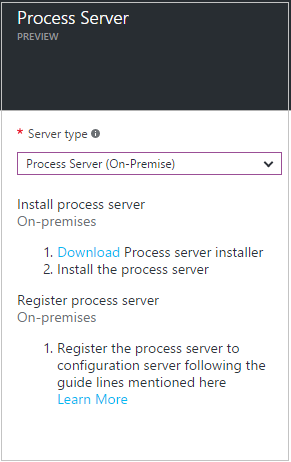

# 通过 Azure Site Recovery，针对 VMware 复制规划容量和缩放

请阅读本文，了解如何规划容量和缩放，以便使用 [Azure Site Recovery](site-recovery-overview.md) 将本地 VMware VM 和物理服务器复制到 Azure。

## 如何开始容量规划？

为 VMware 复制运行 [Azure Site Recovery Deployment Planner](/site-recovery/site-recovery-deployment-planner) 以收集有关复制环境的信息。 [详细了解](site-recovery-deployment-planner.md)此工具。 需要收集有关兼容的和不兼容 VM、每个 VM 的磁盘以及每个磁盘数据变化的信息。 该工具还介绍了成功复制和测试故障转移所需的网络带宽要求，以及所需的 Azure 基础结构。

## 容量注意事项

**组件** | **详细信息** |
--- | --- | ---
**复制** | **每日最大更改率：** 一台受保护的计算机只能使用一个进程服务器，一个进程服务器可处理的每日更改率最高可达 2 TB。 因此，2 TB 是受保护计算机支持的每日数据更改率上限。   **最大吞吐量：** 在 Azure 中，一个复制的计算机可能属于一个存储帐户。 标准存储帐户每秒最多可以处理 20,000 个请求，因此建议将源计算机中的每秒输入/输出操作数 (IOPS) 保持在 20,000。 例如，如果源计算机有 5 个磁盘，每个磁盘在源计算机上生成 120 IOPS（8K 大小），则 Azure 中单磁盘 IOPS 限制为 500。 （所需的存储帐户数等于源计算机总 IOPS 除以 20,000。）
**配置服务器** | 配置服务器应该能够处理跨所有工作负荷（运行在受保护的计算机上）的每日更改率容量，并需要有足够的带宽，才能持续将数据复制到 Azure 存储。   最佳做法是，将配置服务器置于与所要保护的计算机相同的网络和 LAN 网段上。 可以将配置服务器置于另一网络中，但所要保护的计算机应可通过第 3 层网络来查看它。   以下部分的表中汇总了配置服务器的建议大小。
**进程服务器** | 默认情况下，第一个进程服务器安装在配置服务器上。 可以部署更多的进程服务器以扩展环境。    进程服务器接收受保护计算机提供的复制数据，并对其通过缓存、压缩和加密进行优化。 然后将数据发送到 Azure。 进程服务器计算机应有足够的资源来执行这些任务。   进程服务器使用基于磁盘的缓存。 在出现网络瓶颈或中断时，使用单独的大小至少为 600 GB 的缓存磁盘来处理存储的数据更改。

## 配置服务器的建议大小

**CPU** | **内存** | **缓存磁盘大小** | **数据更改率** | **受保护的计算机**
--- | --- | --- | --- | ---
8 个 vCPU（2 个插槽 * 4 个核心 \@ 2.5 千兆赫 [GHz]） | 16 GB | 300 GB | 500 GB 或更少 | 复制少于 100 台计算机。
12 个 vCPU（2 个插槽 * 6 个核心 \@ 2.5 GHz） | 18 GB | 600 GB | 500 GB 到 1 TB | 复制 100-150 台计算机。
16 个 vCPU（2 个插槽 * 8 个核心 \@ 2.5 GHz） | 32 GB | 1 TB | 1 TB 到 2 TB | 复制 150-200 台计算机。
部署另一个进程服务器 | | | > 2 TB | 如果要复制超过 200 台计算机，或者每日数据更改率超过 2 TB，则需部署额外的进程服务器。

其中：

* 每台源计算机均配置 3 个磁盘，每个磁盘 100 GB。
* 我们使用了包含 8 个 SAS 驱动器 (10 K RPM) 的基准测试存储空间，使用 RAID 10 进行缓存磁盘度量。

## 进程服务器的建议大小

如果需要保护的计算机超过 200 台，或者每日更改率大于 2 TB，可添加进程服务器来处理复制负载。 若要扩大，可执行以下操作：

* 增加配置服务器的数目。 例如，可以通过两台配置服务器来保护最多 400 台计算机。
* 添加更多进程服务器，使用这些服务器来处理流量，而不是添加配置服务器。

下表介绍了一种方案，在该方案中：

* 不打算使用配置服务器作为进程服务器。
* 已设置额外的进程服务器。
* 现已将受保护的虚拟机配置为使用这个额外的进程服务器。
* 每台受保护的源计算机配置为了三个磁盘，每个磁盘 100 GB。

**配置服务器** | **额外的进程服务器** | **缓存磁盘大小** | **数据更改率** | **受保护的计算机**
--- | --- | --- | --- | ---
8 个 vCPU（2 个插槽 * 4 个核心 \@ 2.5 GHz），16 GB 内存 | 4 个 vCPU（2 个插槽 * 2 个核心 \@ 2.5 GHz），8 GB 内存 | 300 GB | 250 GB 或更少 | 复制 85 台或更少的计算机。
8 个 vCPU（2 个插槽 * 4 个核心 \@ 2.5 GHz），16 GB 内存 | 8 个 vCPU（2 个插槽 * 4 个核心 \@ 2.5 GHz），12 GB 内存 | 600 GB | 250 GB 到 1 TB | 复制 85-150 台计算机。
12 个 vCPU（2 个插槽 * 6 个核心 \@ 2.5 GHz），18 GB 内存 | 12 个 vCPU（2 个插槽 * 6 个核心 \@ 2.5 GHz），24 GB 内存 | 1 TB | 1 TB 到 2 TB | 复制 150-225 台计算机。

使用哪种方式来扩展服务器取决于是要纵向扩展模型还是横向扩展模型。  纵向扩展时，需要部署一些高端配置服务器和进程服务器，而横向扩展时，需要使用更少资源部署更多服务器。 例如，如果需要对 220 台计算机进行保护，可执行以下操作之一：

* 使用 12 vCPU、18 GB 的内存设置配置服务器，使用 12 vCPU、24 GB 的内存设置附加的进程服务器。 将受保护的计算机配置为仅使用附加的进程服务器。
* 设置两个配置服务器（2 x 8 vCPU，16 GB RAM）和两个附加的进程服务器（1 x 8 vCPU 和 4 vCPU x 1，可处理 135 + 85 [220] 台计算机）。 将受保护的计算机配置为仅使用附加的进程服务器。

## 控制网络带宽

使用[部署计划器工具](site-recovery-deployment-planner.md)计算复制（初始复制和增量复制）所需的带宽后，可以使用下列几个选项来控制用于复制的带宽量：

* **限制带宽**：复制到 Azure 的 VMware 流量会经过特定的进程服务器。 可以在运行进程服务器的计算机上限制带宽。
* **控制带宽**：可以使用几个注册表项来控制用于复制的带宽：
  * **HKEY_LOCAL_MACHINE\SOFTWARE\Microsoft\Windows Azure Backup\Replication\UploadThreadsPerVM** 注册表值指定用于磁盘数据传输（初始或增量复制）的线程数。 使用较大的值会增加复制所用的网络带宽。
  * **HKEY_LOCAL_MACHINE\SOFTWARE\Microsoft\Windows Azure Backup\Replication\DownloadThreadsPerVM** 指定故障回复期间用于数据传输的线程数。

### 限制带宽

1. 在作为进程服务器的计算机上打开 Azure 备份 MMC 管理单元。 默认情况下，备份的快捷方式位于桌面上或在以下文件夹中：C:\Program Files\Azure Recovery Services Agent\bin\wabadmin 中。
2. 在管理单元中，单击“更改属性”。

    
3. 在“限制”选项卡上，选择“为备份操作启用 Internet 带宽使用限制”。 设置工作和非工作小时数限制。 有效范围为 512 Kbps 到 1023 Mbps。

    

也可以使用 [Set-OBMachineSetting](https://technet.microsoft.com/library/hh770409.aspx) cmdlet 来设置限制。 下面是一个示例：

    $mon = [System.DayOfWeek]::Monday
    $tue = [System.DayOfWeek]::Tuesday
    Set-OBMachineSetting -WorkDay $mon, $tue -StartWorkHour "9:00:00" -EndWorkHour "18:00:00" -WorkHourBandwidth  (512*1024) -NonWorkHourBandwidth (2048*1024)

**Set-OBMachineSetting -NoThrottle** 表示不需要限制。

### 影响 VM 的网络带宽

1. 在 VM 的注册表中导航到 **HKEY_LOCAL_MACHINE\SOFTWARE\Microsoft\Windows Azure Backup\Replication**。
   * 若要影响复制磁盘上的带宽流量，请修改 **UploadThreadsPerVM** 的值，或者创建该项（如果不存在）。
   * 若要影响用于从 Azure 故障回复流量的带宽，请修改 **DownloadThreadsPerVM** 的值。
2. 默认值为 4。 在“过度预配型”网络中，这些注册表项需要更改，不能使用默认值。 最大值为 32。 监视流量以优化值。

## 部署额外的进程服务器

如果必须将部署扩大到 200 台以上的源计算机，或者每日总改动率超过 2 TB，则需要额外的进程服务器来处理流量。 按照[本文](vmware-azure-set-up-process-server-scale.md)所述说明设置进程服务器。 设置服务器后，可以迁移源计算机来使用它。

### 对计算机进行迁移，以使用新的进程服务器

1. 在“设置” > “Site Recovery 服务器”中，单击配置服务器，并展开“进程服务器”。

    
2. 右键单击当前正在使用的进程服务器，并单击“切换”。

    
3. 在“选择目标进程服务器”中，选择要使用的新进程服务器，然后选择该服务器将要处理的虚拟机。 单击信息图标，获取服务器的相关信息。 为了帮助你做出负载决策，随后会显示将每个所选虚拟机复制到新进程服务器所需的平均空间。 单击复选标记，开始复制到新的进程服务器。

## 后续步骤

下载并运行 [Azure Site Recovery Deployment Planner](https://aka.ms/asr-deployment-planner)

<!--Update_Description: update meta properties -->