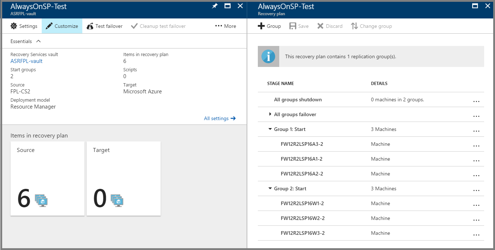
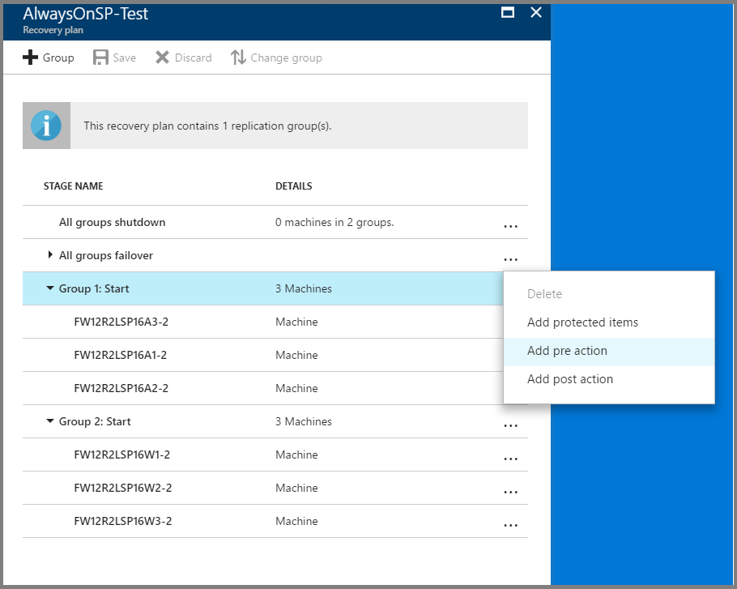
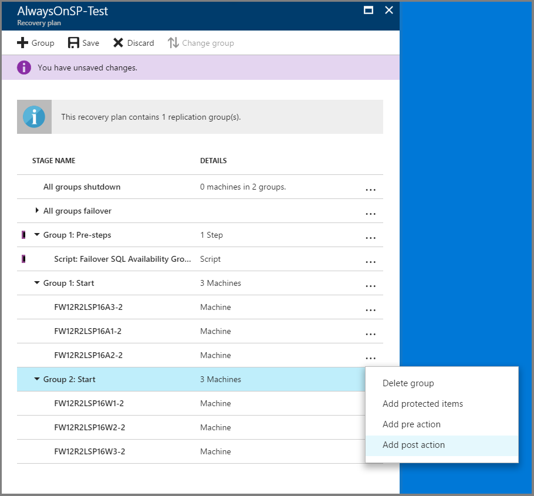
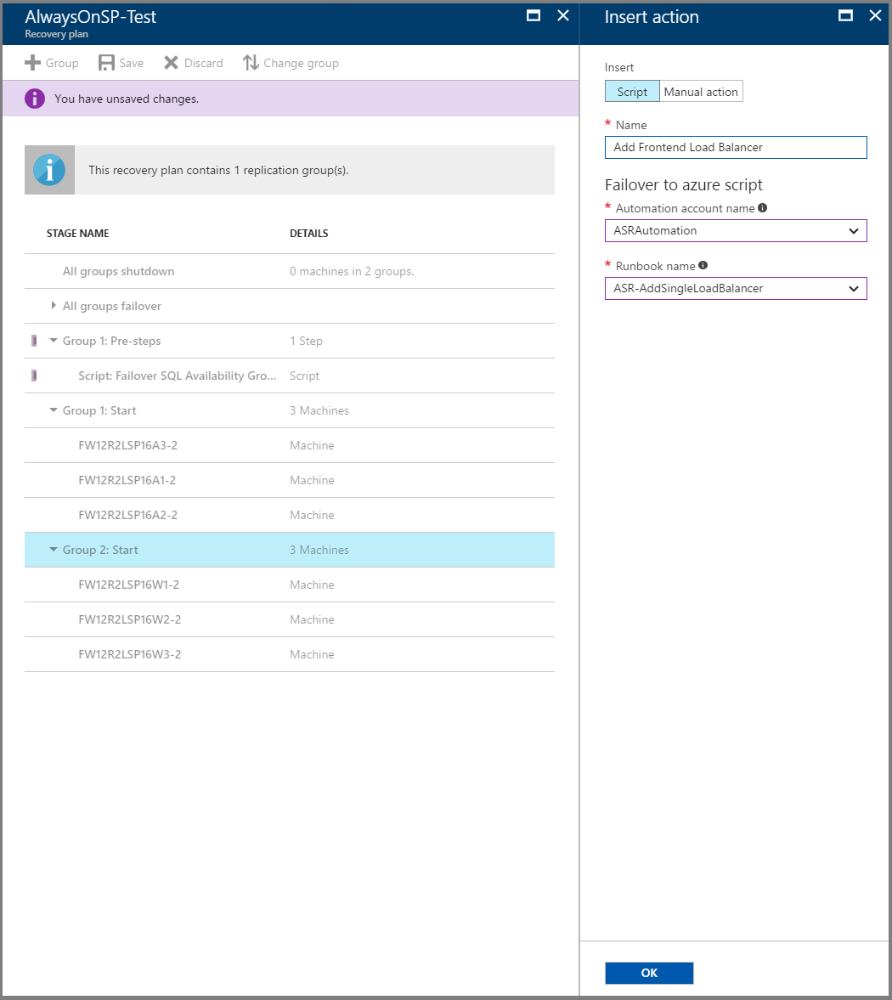

# 使用 Azure Site Recovery 复制多层 SharePoint 应用程序以实现灾难恢复

本文详细介绍如何使用 [Azure Site Recovery](site-recovery-overview.md) 保护 SharePoint 应用程序。

## 概述

Microsoft SharePoint 是一个功能强大的应用程序，可帮助小组或部门组织、协作和共享信息。 SharePoint 可以提供 Intranet 门户、文档和文件管理、协作、社交网络、Extranet、网站、企业搜索和商业智能。 它还有系统集成、过程集成和工作流自动化功能。 通常，组织将它视为不能轻易发生停机和数据丢失的第 1 层应用程序。

目前，Microsoft SharePoint 不提供任何现成的灾难恢复功能。 不管灾难的类型和规模是什么，恢复都涉及到使用可将场恢复到的备用数据中心。 如果发生服务中断后，本地冗余系统和备份无法在主数据中心恢复，则就需要使用备用数据中心。

良好的灾难恢复解决方案应允许围绕 SharePoint 等复杂应用程序体系结构为恢复计划建模。 此外，还应该能够添加自定义步骤来处理不同层之间的应用程序映射，因此，能够在发生灾难时，以较低的 RTO 提供一键式故障转移。

本文详细介绍如何使用 [Azure Site Recovery](site-recovery-overview.md) 保护 SharePoint 应用程序。 内容包括如何将三层 SharePoint 应用程序复制到 Azure、如何执行灾难恢复演练，以及如何将应用程序故障转移到 Azure 的最佳做法。
<!-- Not Available on VIDEO-->

## 先决条件

在开始之前，请确保了解以下知识：

1. [将虚拟机复制到 Azure](site-recovery-vmware-to-azure.md)
2. 如何[设计恢复网络](site-recovery-network-design.md)
3. [执行到 Azure 的测试故障转移](site-recovery-test-failover-to-azure.md)
4. [执行到 Azure 的故障转移](site-recovery-failover.md)
5. 如何[复制域控制器](site-recovery-active-directory.md)
6. 如何[复制 SQL Server](site-recovery-sql.md)

## SharePoint 体系结构

可以使用分层拓扑和服务器角色在一个或多个服务器上部署 SharePoint，实现符合特定目标的场设计。 支持大量并发用户和大量内容项的典型大型高要求 SharePoint 服务器场使用服务分组作为可伸缩性策略的一部分。 此方法涉及到在专用服务器上运行服务，将这些服务组合在一起，然后将服务器扩展为一个组。 以下拓扑演示了三层 SharePoint 服务器场的服务和服务器分组。 请参阅 SharePoint 文档和产品线体系结构，了解有关不同 SharePoint 拓扑的详细指导。 可在[此文档](https://technet.microsoft.com/library/cc303422.aspx)中找到有关 SharePoint 2013 部署的更多详细信息。

## Site Recovery 支持

制作本文时，使用了装有 Windows Server 2012 R2 Enterprise 的 VMware 虚拟机。 使用了 SharePoint 2013 Enterprise Edition 和 SQL server 2014 Enterprise Edition。 由于 Site Recovery 复制不区分应用程序，因此本文提供的建议应该也适用于后续方案。

### 源和目标

**方案** | **到辅助站点** | **到 Azure**
--- | --- | ---
**Hyper-V** | 是 | 是
**VMware** | 是 | 是
**物理服务器** | 是 | 是
**Azure** | 不可用 | 是

### SharePoint 版本
支持以下 SharePoint Server 版本。

* SharePoint Server 2013 Standard
* SharePoint Server 2013 Enterprise
* SharePoint Server 2016 Standard
* SharePoint Server 2016 Enterprise

### 要点

如果使用基于共享磁盘的群集作为应用程序中的任何层，则无法使用 Site Recovery 复制来复制这些虚拟机。 可以使用应用程序提供的本机复制，并使用[恢复计划](site-recovery-create-recovery-plans.md)来故障转移所有层。

## 复制虚拟机

请遵循[此指南](site-recovery-vmware-to-azure.md)开始将虚拟机复制到 Azure。

* 复制完成后，请务必转到每个层的每个虚拟机，并在“已复制的项”>“设置”>“属性”>“计算和网络”中选择相同的可用性集。 例如，如果 Web 层包含 3 个 VM，请确保将所有 3 个 VM 配置为属于 Azure 中的同一个可用性集。

    

* 有关保护 Active Directory 和 DNS 的指导，请参阅[保护 Active Directory 和 DNS](site-recovery-active-directory.md) 文档。

* 有关保护 SQL 服务器上运行的数据库层的指导，请参阅[保护 SQL Server](site-recovery-active-directory.md) 文档。

## 网络配置

### 网络属性

* 对于应用层和 Web 层 VM，请在 Azure 门户中配置网络设置，以便在故障转移后将 VM 附加到适当的 DR 网络。

    

* 如果使用的是静态 IP，请在“目标 IP”字段中指定希望虚拟机采用的 IP

    

### DNS 和流量路由

用于面向 Internet 的站点，请在 Azure 订阅中[创建“优先级”类型的流量管理器配置文件](../traffic-manager/traffic-manager-create-profile.md)。 然后按以下方式配置 DNS 和流量管理器配置文件。

| **Where** | Source | **目标**|
| --- | --- | --- |
| 公共 DNS | SharePoint 站点的公共 DNS    例如：sharepoint.contoso.com | 流量管理器    contososharepoint.trafficmanager.cn |
| 本地 DNS | sharepointonprem.contoso.com | 本地场中的公共 IP |

在流量管理器配置文件中[创建主终结点和恢复终结点](../traffic-manager/traffic-manager-configure-priority-routing-method.md)。 对本地终结点使用外部终结点，对 Azure 终结点使用公共 IP。 确保将优先级设置为比本地终结点更高。

在 SharePoint Web 层中的特定端口（例如 800）上托管测试页，以便故障转移后流量管理器能够自动检测可用性。 如果无法在任何 SharePoint 站点中启用匿名身份验证，则可以采用这种解决方法。

使用以下设置[配置流量管理器配置文件](../traffic-manager/traffic-manager-configure-priority-routing-method.md)。

* 路由方法 -“优先级”
* DNS 生存时间 (TTL) -“30 秒”
* 终结点监视设置 - 如果可以启用匿名身份验证，则可以指定特定的网站终结点。 或者，可以在特定的端口（例如 800）上使用测试页。

## 创建恢复计划

使用恢复计划可将多层应用程序中各个层的故障转移排序，从而可以保持应用程序一致性。 为多层 Web 应用程序创建恢复计划时，请遵循以下步骤。 [详细了解如何创建恢复计划](site-recovery-runbook-automation.md#customize-the-recovery-plan)。

### 将虚拟机添加到故障转移组

1. 通过添加应用层和 Web 层 VM 来创建恢复计划。
2. 单击“自定义”将 VM 分组。 默认情况下，所有 VM 属于“组 1”。

    

3. 创建另一个组（组 2），并将 Web 层 VM 移到新组。 应用层 VM 应属于“组 1”，Web 层 VM 应属于“组 2”。 这是为了确保先启动应用层 VM，再启动 Web 层 VM。

### 将脚本添加到恢复计划

可以单击下面的“部署到 Azure”按钮，将最常用的 Azure Site Recovery 脚本部署到自动化帐户。 使用任何已发布的脚本时，请确保遵循脚本中的指导。

1. 将操作前脚本添加到“组 1”，以故障转移 SQL 可用性组。 使用示例脚本中发布的“ASR-SQL-FailoverAG”脚本。 确保遵循脚本中的指导，并相应地在脚本中进行所需的更改。

    

    

2. 添加操作后脚本，在 Web 层的已故障转移虚拟机（组 2）上附加负载均衡器。 使用示例脚本中发布的“ASR-AddSingleLoadBalancer”脚本。 确保遵循脚本中的指导，并相应地在脚本中进行所需的更改。

    

    

3. 添加一个手动步骤，将 DNS 记录更新为指向 Azure 中的新场。

    * 对于面向 Internet 的站点，故障转移后不需要进行 DNS 更新。 遵循“网络指导”部分中所述的步骤配置流量管理器。 如果根据上一部分中所述设置了流量管理器配置文件，请添加一个脚本在 Azure VM 上打开虚拟端口（本示例中为 800）。

    * 对于面向内部的站点，请添加一个手动步骤，将 DNS 记录更新为指向新 Web 层 VM 的负载均衡器 IP。

4. 添加一个手动步骤，用于从备份还原搜索应用程序或启动新的搜索服务。

5. 若要从备份还原搜索服务应用程序，请遵循以下步骤。

    * 此方法假设发生灾难性事件之前已执行搜索服务应用程序的备份，并且 DR 站点上提供了备份。
    * 计划备份（例如，每天一次）并使用复制过程在 DR 站点上放置备份，即可轻松实现此目的。 复制过程可以融入 AzCopy（Azure 复制）等脚本程序，或设置 DFSR（分布式文件服务复制）。
    * 运行 SharePoint 场后，请在管理中心导航到“备份和还原”，并选择“还原”。 还原过程会查询指定的备份位置（可能需要更新该值）。 选择要还原的搜索服务应用程序备份。
    * 随后即会还原搜索应用程序。 请记住，还原过程预期会查找相同的拓扑（相同的服务器数目）以及分配给这些服务器的相同驱动器号。 有关详细信息，请参阅[在 SharePoint 2013 中还原搜索服务应用程序](https://technet.microsoft.com/library/ee748654.aspx)文档。

6. 若要在新的搜索服务应用程序中开始复制，请遵循以下步骤。

    * 此方法假设 DR 站点上提供了“搜索管理”数据库的备份。
    * 由于不会复制其他搜索服务应用程序数据库，因此需要重新创建这些数据库。 为此，请导航到管理中心，并删除搜索服务应用程序。 在托管搜索索引的所有服务器上删除索引文件。
    * 重新创建搜索服务应用程序并重新创建数据库。 建议准备一个脚本用于重新创建此服务应用程序，因为无法通过 GUI 执行所有操作。 例如，只能使用 SharePoint PowerShell cmdlet 设置索引驱动器位置以及配置搜索拓扑。 使用 Windows PowerShell cmdlet Restore-SPEnterpriseSearchServiceApplication，并指定在日志中传送和复制的搜索管理数据库 Search_Service__DB。 此 cmdlet 提供搜索配置、架构、托管属性、规则和源，并创建其他一组默认组件。
    * 重新创建搜索服务应用程序后，必须针对每个内容源启动完全爬网，以还原搜索服务。 会丢失本地场中的一些分析信息，例如搜索建议。

7. 完成所有步骤后，请保存恢复计划，最终的恢复计划如下所示。

    

## 执行测试故障转移
遵循[此指南](site-recovery-test-failover-to-azure.md)执行测试故障转移。

1.  转到 Azure 门户并选择恢复服务保管库。
2.  单击针对 SharePoint 应用程序创建的恢复计划。
3.  单击“测试故障转移”。
4.  选择恢复点和 Azure 虚拟网络开始测试故障转移过程。
5.  辅助环境启动后，可以执行验证。
6.  完成验证后，可以在恢复计划中单击“清理测试故障转移”，这样即可清理测试故障转移环境。

有关针对 AD 和 DNS 执行测试故障转移的指导，指参阅[针对 AD 和 DNS 的测试故障转移注意事项](site-recovery-active-directory.md#test-failover-considerations)文档。

有关针对 SQL Always ON 可用性组执行测试故障转移的指导，请参阅[针对 SQL Server Always On 执行测试故障转移](site-recovery-sql.md#steps-to-do-a-test-failover)文档。

## 执行故障转移
执行故障转移时，请遵循[此指南](site-recovery-failover.md)。

1.  转到 Azure 门户并选择恢复服务保管库。
2.  单击针对 SharePoint 应用程序创建的恢复计划。
3.  单击“故障转移”。
4.  选择恢复点开始故障转移过程。

## 后续步骤
详细了解如何使用 Site Recovery [复制其他应用程序](site-recovery-workload.md)。

<!-- Update_Description: update meta properties -->