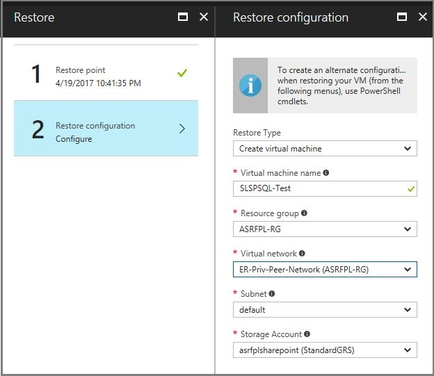
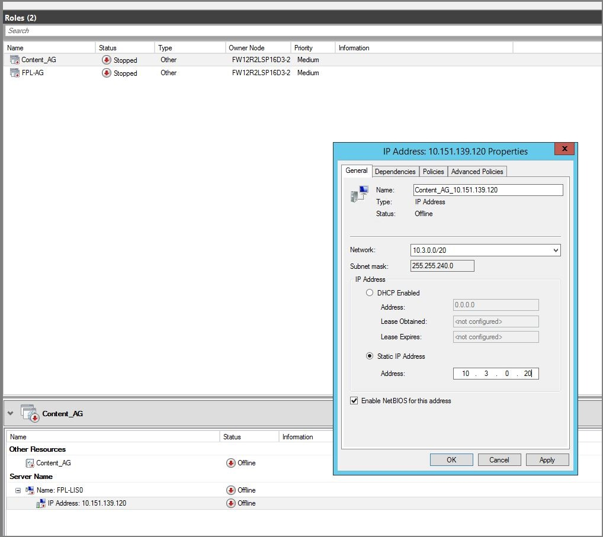
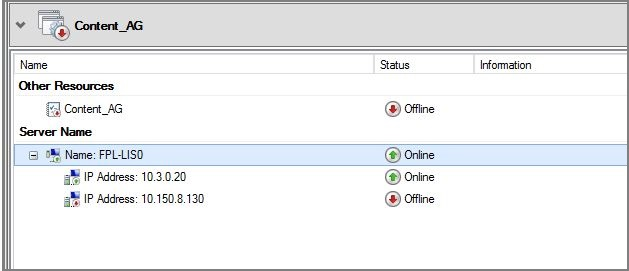

# 为 SQL Server 设置灾难恢复

本文介绍如何结合使用 SQL Server 业务连续性和灾难恢复 (BCDR) 技术与 [Azure Site Recovery](site-recovery-overview.md) 来保护应用程序的 SQL Server 后端。

在开始之前，请确保了解 SQL Server 灾难恢复功能，包括故障转移群集、Always On 可用性组、数据库镜像、日志传送、活动异地复制和自动故障转移组。

## 有关将 SQL Server BCDR 技术与 Site Recovery 集成的 DR 建议

应该参考下表根据 RTO 和 RPO 需求选择恢复 SQL 服务器的 BCDR 技术。 做出选择后，可将 Site Recovery 集成到该技术的故障转移操作，以协调整个应用程序的恢复。

**部署类型** | **BCDR 技术** | **预期的 SQL RTO** | **预期的 SQL RPO** |
--- | --- | --- | ---
Azure IaaS VM 上的或本地的 SQL Server| **[Always On 可用性组](https://docs.microsoft.com/sql/database-engine/availability-groups/windows/overview-of-always-on-availability-groups-sql-server?view=sql-server-2017)** | 相当于将辅助副本设为主要副本所花费的时间 | 以异步方式复制到辅助副本，因此会有一定的数据丢失。
Azure IaaS VM 上的或本地的 SQL Server| **[故障转移群集 (Always On FCI)](https://docs.microsoft.com/sql/sql-server/failover-clusters/windows/windows-server-failover-clustering-wsfc-with-sql-server?view=sql-server-2017)** | 相当于在节点之间进行故障转移所花费的时间 | 它使用共享存储，因此故障转移时会提供相同的存储实例视图。
Azure IaaS VM 上的或本地的 SQL Server| **[数据库镜像（高性能模式）](https://docs.microsoft.com/sql/database-engine/database-mirroring/database-mirroring-sql-server?view=sql-server-2017)** | 相当于强制服务所花费的时间，使用镜像服务器作为温备用服务器。 | 复制是异步的。 镜像数据库可能稍微滞后于主体数据库。 这种差距通常很小，但是，如果主体服务器或镜像服务器的系统负载过大，则差距可能会变得很大。  日志传送可用作数据库镜像的补充，它是异步数据库镜像的理想替代方案
Azure 上的 SQL as PaaS  （弹性池、SQL 数据库服务器） | **活动异地复制** | 触发后持续 30 秒  当将故障转移激活到辅助数据库之一时，所有其他辅助数据库会自动链接到新的主数据库。 | 5 秒 RPO  活动异地复制利用 SQL Server 的 Always On 技术，使用快照隔离以异步方式将主数据库上已提交的事务复制到辅助数据库。   保证辅助数据永不包含部分事务。
Azure 上配置了活动异地复制的 SQL as PaaS  （SQL 数据库托管实例、弹性池、SQL 数据库服务器） | **自动故障转移组** | 1 小时 RTO | 5 秒 RPO  自动故障转移组提供基于活动异地复制的组语义，但使用相同的异步复制机制。
Azure IaaS VM 上的或本地的 SQL Server| **使用 Azure Site Recovery 进行复制** | 通常小于 15 分钟。 [详细了解](https://www.azure.cn/support/sla/site-recovery/) Azure Site Recovery 提供的 RTO SLA。 | 为应用程序一致性提供 1 小时保证，为崩溃一致性提供 5 分钟保证。 

> [!NOTE]
> 使用 Azure Site Recovery 保护 SQL 工作负荷时需要考虑到几个重要因素：
> * Azure Site Recovery 是应用程序不可知的，因此，在受支持操作系统上部署的任何 SQL Server 版本都可以由 Azure Site Recovery 保护。 [了解详细信息](vmware-physical-azure-support-matrix.md#replicated-machines)。
> * 对于 Azure、Hyper-V、VMware 或物理基础结构中的任何部署，都可以选择使用 Site Recovery。 请遵照本文档末尾的[指导](site-recovery-sql.md#how-to-protect-a-sql-server-cluster-standard-editionsql-server-2008-r2)来了解如何使用 Azure Site Recovery 保护 SQL Server 群集。
> * 确保在计算机上观测到的数据更改率（每秒写入字节数）在 [Site Recovery 限制](vmware-physical-azure-support-matrix.md#churn-limits)范围内。 对于 Windows 计算机，可以在任务管理器中的“性能”选项卡下查看此信息。 观测每个磁盘的写入速度。
> * Azure Site Recovery 支持复制存储空间直通上的故障转移群集实例。 [了解详细信息](azure-to-azure-how-to-enable-replication-s2d-vms.md)。

## 应用程序的灾难恢复

**Azure Site Recovery 借助恢复计划来协调整个应用程序的测试故障转移和故障转移。** 

需要满足一些先决条件才能确保根据需要完全自定义恢复计划。 任何 SQL Server 部署通常都需要一个 Active Directory。 它还需要应用层的连接。

### 步骤 1：设置 Active Directory

在辅助恢复站点上安装 Active Directory，使 SQL Server 能够正常运行。

* **小型企业** - 如果使用少量的应用程序和适用于本地站点的单个域控制器，并且想要故障转移整个站点，我们建议使用 Site Recovery 复制将域控制器复制到辅助数据中心或 Azure。
* **中大型企业**：如果使用大量的应用程序和 Active Directory 林，并且需要按应用程序或工作负荷进行故障转移，则建议在辅助数据中心或 Azure 中设置附加的域控制器。 如果使用 Always On 可用性组恢复到远程站点，我们建议在辅助站点或 Azure 中配置另一个域控制器，供已恢复的 SQL Server 实例使用。

本文中的说明假设辅助位置中提供了域控制器。 [详细了解](site-recovery-active-directory.md)如何使用 Site Recovery 保护 Active Directory。

### 步骤 2：确保与其他应用层和 Web 层建立连接

确保在目标 Azure 区域中启动并运行数据库层后，与应用层和 Web 层建立连接。 应提前采取必要的步骤来验证与测试故障转移建立的连接。

通过几个示例了解如何根据连接注意事项设计应用程序：
* [根据云灾难恢复设计应用程序](../sql-database/sql-database-designing-cloud-solutions-for-disaster-recovery.md)
* [弹性池灾难恢复策略](../sql-database/sql-database-disaster-recovery-strategies-for-applications-with-elastic-pool.md)

### 步骤 3：与 Always On、活动异地复制或自动故障转移组集成以实现应用程序故障转移

BCDR 技术 Always On、活动异地复制和自动故障转移组为目标 Azure 区域中运行的 SQL Server 提供辅助副本。 因此，应用程序故障转移的第一步是将此副本设为主要副本（假设次要区域中已有一个域控制器）。 如果选择执行自动故障转移，则可能不需要执行此步骤。 只有在完成数据库故障转移后，才应故障转移 Web 或应用层。

> [!NOTE] 
> 如果已使用 Azure Site Recovery 保护了 SQL 计算机，则只需创建这些计算机的恢复组，并在恢复计划中添加其故障转移。

使用应用层和 Web 层虚拟机[创建恢复计划](site-recovery-create-recovery-plans.md)。 遵循以下步骤添加数据库层的故障转移：

1. 将脚本导入到 Azure 自动化帐户中。 这包括用于在 [Resource Manager 虚拟机](https://raw.githubusercontent.com/Azure/azure-quickstart-templates/master/asr-automation-recovery/scripts/ASR-SQL-FailoverAG.ps1)和[经典虚拟机](https://raw.githubusercontent.com/Azure/azure-quickstart-templates/master/asr-automation-recovery/scripts/ASR-SQL-FailoverAGClassic.ps1)中对 SQL 可用性组进行故障转移的脚本。
    
    > [!NOTE]
    > 选择以下 `Deploy to Azure` 后，选择 `Edit template` 并根据 Azure 中国区环境更新以下项。
    > * 在第 14 行中，将 `automationRegion` 参数的 `allowedValues` 属性替换为以下项。
    >   `chinaeast2,chinanorth,chinanorth2`
    
    

1. 将 ASR-SQL-FailoverAG 添加为恢复计划的第一个组的准备操作。

1. 按照脚本中提供的说明创建一个自动化变量来提供可用性组的名称。

### 步骤 4：执行测试故障转移

某些 BCDR 技术（例如 SQL Always On）原生并不支持测试故障转移。 因此我们建议，**仅当与此类技术集成时**才采用以下方法：

1. 在 Azure 中托管着可用性组副本的虚拟机上设置 [Azure 备份](../backup/backup-azure-arm-vms.md)。

1. 触发对恢复计划进行测试故障转移之前，请从上一步骤中进行的备份恢复虚拟机。

    

1. 在从备份还原的虚拟机中[强制实施仲裁](https://docs.microsoft.com/sql/sql-server/failover-clusters/windows/force-a-wsfc-cluster-to-start-without-a-quorum#PowerShellProcedure)。

1. 将侦听程序的 IP 更新为测试故障转移网络中可用的某个 IP。

    

1. 使侦听程序联机。

    

1. 使用在前端 IP 池下创建的与每个可用性组侦听程序对应的一个 IP 与在后端池中添加的 SQL 虚拟机创建一个负载均衡器。

    

    

1. 添加应用层的故障转移，接着在后续恢复组的此恢复计划中添加 Web 层的故障转移。 
1. 执行恢复计划的测试性故障转移，以测试应用程序的端到端故障转移。

## 执行故障转移的步骤

根据步骤 3 所述在恢复计划中添加脚本，并根据步骤 4 所述使用专门的方法执行测试性故障转移以验证该脚本后，可以执行步骤 3 中创建的恢复计划的故障转移。

请注意，在测试故障转移和故障转移恢复计划中，应用层和 Web 层的故障转移步骤应该相同。

## 如何保护 SQL Server 群集（标准版/SQL Server 2008 R2）

对于运行 SQL Server Standard Edition 或 SQL Server 2008 R2 的群集，建议使用 Site Recovery 复制来保护 SQL Server。

### Azure 到 Azure，以及本地到 Azure

复制到 Azure 区域时，Site Recovery 不支持来宾群集。 SQL Server 也不会为 Standard 版本提供低成本灾难恢复解决方案。 在此方案中，我们建议在主要位置的独立 SQL Server 中保护 SQL Server 群集，并在次要位置恢复它。

1. 在主要 Azure 区域或本地站点中配置其他独立 SQL Server 实例。
1. 将此实例配置为需要保护的数据库的镜像。 在高安全模式下配置镜像。
1. 在主要站点（[Azure](azure-to-azure-tutorial-enable-replication.md)、[Hyper-V](site-recovery-hyper-v-site-to-azure.md) 或 [VMware VM/物理服务器](site-recovery-vmware-to-azure-classic.md)）上配置 Site Recovery。
1. 使用 Site Recovery 复制将新的 SQL Server 实例复制到次要站点。 由于该实例是高安全性镜像副本，因此会将它与主群集同步，但会使用 Site Recovery 复制来复制它。

### 故障回复注意事项

对于 SQL Server Standard 群集，未计划的故障转移后的故障回复需要从镜像实例 SQL Server 备份并还原到原始群集，并重新建立镜像。

## 常见问题解答

### 使用 Azure Site Recovery 保护 SQL 时如何获得 SQL 的授权？
对于所有 Azure Site Recovery 方案（本地到 Azure 的灾难恢复，或跨区域的 Azure IaaS 灾难恢复），SQL Server 的 Azure Site Recovery 复制已涵盖在“软件保障 - 灾难恢复”权益中。 [了解详细信息](https://www.azure.cn/pricing/details/site-recovery/)

### Azure Site Recovery 是否支持我的 SQL 版本？
Azure Site Recovery 是应用程序不可知的。 因此，在受支持操作系统上部署的任何 SQL Server 版本都可以由 Azure Site Recovery 保护。 [了解详细信息](vmware-physical-azure-support-matrix.md#replicated-machines)

## 后续步骤
* [详细了解](site-recovery-components.md) Site Recovery 体系结构。
* 对于 Azure 中的 SQL 服务器，请详细了解适用于次要 Azure 区域中的恢复的[高可用性解决方案](../virtual-machines/windows/sql/virtual-machines-windows-sql-high-availability-dr.md#azure-only-high-availability-solutions)。
* 对于 Azure 中的 SQL 数据库，请详细了解适用于次要 Azure 区域中的恢复的[业务连续性](../sql-database/sql-database-business-continuity.md)和[高可用性](../sql-database/sql-database-high-availability.md)选项。
* 对于本地的 SQL 服务器计算机，请[详细了解](../virtual-machines/windows/sql/virtual-machines-windows-sql-high-availability-dr.md#hybrid-it-disaster-recovery-solutions)适用于 Azure 虚拟机中的恢复的高可用性选项。

<!--Update_Description: update meta properties, wording update -->