# 在 Azure 门户预览中使用 Site Recovery 将 VMM 云中的 Hyper-V 虚拟机复制到 Azure
> [!div class="op_single_selector"]
> * [Azure 门户预览](site-recovery-vmm-to-azure.md)
> * [Azure 经典](site-recovery-vmm-to-azure-classic.md)
> * [PowerShell Resource Manager](site-recovery-vmm-to-azure-powershell-resource-manager.md)
> * [PowerShell 经典](site-recovery-deploy-with-powershell.md)

本文介绍如何在 Azure 门户预览中使用 [Azure Site Recovery](site-recovery-overview.md) 服务将 System Center VMM 云中管理的本地 Hyper-V 虚拟机复制到 Azure。

阅读本文后，请在底部发布评论，或者发布到 [Azure 恢复服务论坛](https://social.msdn.microsoft.com/forums/azure/home?forum=hypervrecovmgr)。

如果要将计算机（不带故障回复）迁移到 Azure，请通过[此文](site-recovery-migrate-to-azure.md)了解详细信息。

## 部署步骤

遵照本文完成以下部署步骤：

1. [深入了解](site-recovery-components.md#hyper-v-to-azure)此部署的体系结构。 此外，[深入了解](site-recovery-hyper-v-azure-architecture.md) Hyper-V 复制在 Site Recovery 中的工作原理。
2. 验证先决条件和限制。
3. 设置 Azure 网络和存储帐户。
4. 准备本地 VMM 服务器和 Hyper-V 主机。
5. 创建恢复服务保管库。 保管库包含配置设置，并且安排复制。
6. 指定源设置。 在保管库中注册 VMM 服务器。 在 VMM 服务器上安装 Azure Site Recovery 提供程序，在 Hyper-V 主机上安装 Microsoft 恢复服务代理。
7. 设置目标和复制设置。
8. 为 VM 启用复制。
9. 运行测试故障转移，确保一切按预期运行。

## 先决条件

**支持要求** | **详细信息**
--- | ---
**Azure** | 了解 [Azure 要求](site-recovery-prereq.md#azure-requirements)。
**本地服务器** | [深入了解](site-recovery-prereq.md#disaster-recovery-of-hyper-v-virtual-machines-in-virtual-machine-manager-clouds-to-azure)本地 VMM 服务器和 Hyper-V 主机的要求。
**本地 Hyper-V VM** | 想要复制的虚拟机应正在运行[受支持的操作系统](site-recovery-support-matrix-to-azure.md#support-for-replicated-machine-os-versions)，并且符合 [Azure 先决条件](site-recovery-support-matrix-to-azure.md#failed-over-azure-vm-requirements)。
**Azure URL** | VMM 服务器需要以下 URL 的访问权限：   [!INCLUDE [site-recovery-URLS](../../includes/site-recovery-URLS.md)]   如果设置了基于 IP 地址的防火墙规则，请确保这些规则允许与 Azure 通信。   允许 [Azure 数据中心 IP 范围](https://www.microsoft.com/download/confirmation.aspx?id=41653)和 HTTPS (443) 端口。   允许订阅的 Azure 区域的 IP 地址范围以及美国西部的 IP 地址范围（用于访问控制和标识管理）。

## 准备部署
若要准备部署，需要：

1. [设置 Azure 网络](#set-up-an-azure-network) ，故障转移后，Azure VM 将位于该网络中。
2. [设置 Azure 存储帐户](#set-up-an-azure-storage-account) 。
3. [准备 VMM 服务器](#prepare-the-vmm-server) 以便进行站点恢复部署。
4. 准备网络映射。 设置网络，以便在站点恢复部署期间配置网络映射。

### 设置 Azure 网络
需要一个 Azure 网络，在故障转移后创建的 Azure VM 将会连接到该网络。

* 该网络应位于与恢复服务保管库相同的区域。
* 根据要用于故障转移 Azure VM 的资源模型，需在 [Resource Manager 模式](../virtual-network/virtual-networks-create-vnet-arm-pportal.md)或[经典模式](../virtual-network/virtual-networks-create-vnet-classic-pportal.md)下设置 Azure 网络。
* 建议在开始之前先设置网络。 否则，需要在 Site Recovery 部署期间执行此操作。
用于 Site Recovery 的 Azure 网络不能在同一订阅中或者跨不同的订阅[移动](../azure-resource-manager/resource-group-move-resources.md)。

### 设置 Azure 存储帐户
* 需要标准/高级 Azure 存储帐户来保存复制到 Azure 的数据。[高级存储](../storage/storage-premium-storage.md)用于 IO 性能一贯较高且延迟一贯较低、托管 IO 密集型工作负荷的虚拟机。 如果要将高级帐户用于存储复制的数据，则还需要创建一个标准存储帐户来存储复制日志，这些日志将捕获本地数据正在发生的更改。 该帐户必须位于与恢复服务保管库相同的区域中。
* 根据要用于故障转移 Azure VM 的资源模型，需在 [Resource Manager 模式](../storage/storage-create-storage-account.md)或[经典模式](../storage/storage-create-storage-account-classic-portal.md)下设置帐户。
* 建议在开始之前设置帐户。 否则，需在Site Recovery 部署期间执行此操作。
- 注意，用于 Site Recovery 的存储帐户不能在同一订阅中或者跨不同的订阅[移动](../azure-resource-manager/resource-group-move-resources.md)。

### 准备 VMM 服务器
* 确保 VMM 服务器符合 [先决条件](#prerequisites)。
* 在 Site Recovery 部署期间，可指定 VMM 服务器上的所有云均可在 Azure 门户预览中使用。 如果只希望门户中显示特定云，可在 VMM 管理控制台中启用云的该设置。

### 准备网络映射
必须在 Site Recovery 部署期间设置网络映射。 网络映射将在源 VMM VM 网络与目标 Azure 网络之间映射，以便：

* 同一网络中故障转移的计算机可以彼此连接，即使它们不是以方式相同或在相同的恢复计划中故障转移。
* 如果在目标 Azure 网络上设置了网络网关，则 Azure 虚拟机可以连接到其他本地虚拟机。
* 若要设置网络映射，需要执行以下操作：

  * 确保源 Hyper-V 主机服务器上的 VM 已连接到 VMM VM 网络。 该网络应当链接到与该云相关联的逻辑网络。
  * [如上所述](#set-up-an-azure-network)

## 创建恢复服务保管库
1. 登录 [Azure 门户预览](https://portal.azure.com)。
2. 单击“新建” > “监视和管理” > “备份和 Site Recovery (OMS)”。

    
3. 在“名称” 中，指定一个友好名称以标识该保管库。 如果你有多个订阅，请选择其中一个。
4. [创建一个资源组](../azure-resource-manager/resource-group-template-deploy-portal.md)或选择现有的资源组。 指定 Azure 区域。 计算机将复制到此区域。 若要查看受支持的区域，请参阅 [Azure Site Recovery 定价详细信息](https://azure.microsoft.com/pricing/details/site-recovery/)中的“地域可用性”
5. 如果要从仪表板快速访问保管库，请单击“固定到仪表板” > “创建保管库”。

    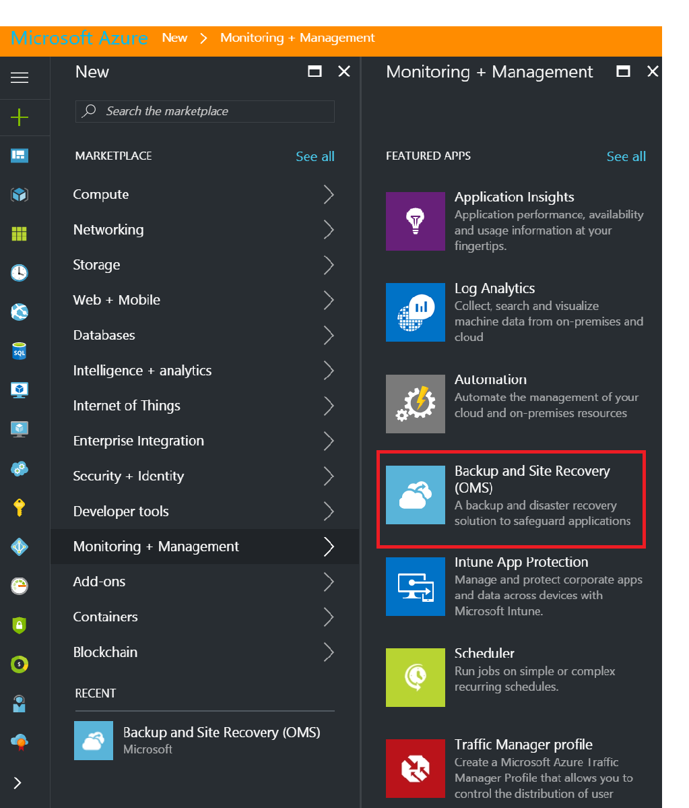

新保管库将显示在“仪表板” > “所有资源”中，以及“恢复服务保管库”边栏选项卡上。

## 选择保护目标

选择要复制的内容以及要复制到的位置。

1. 在“恢复服务保管库”中选择保管库。
2. 在“快速启动”中，单击“Site Recovery” > “准备基础结构” > “保护目标”。

    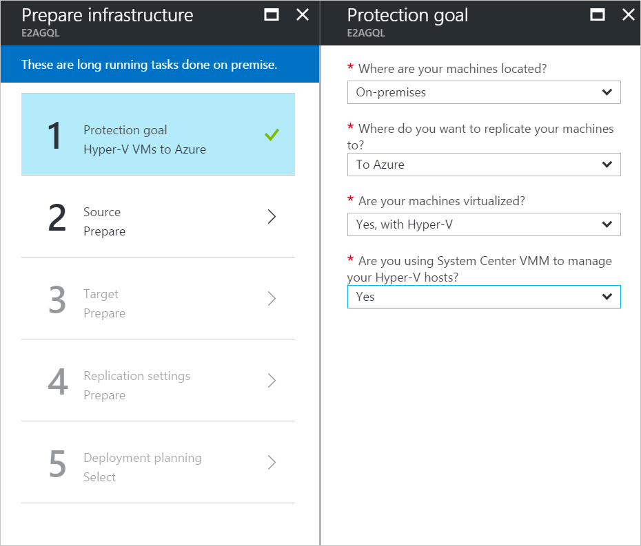
3. 在“保护目标”中选择“到 Azure”，然后选择“是，使用 Hyper-V”。  选择“是”，以确认使用 VMM 来管理 Hyper-V 主机和恢复站点。 。

## 设置源环境

在 VMM 服务器上安装 Azure Site Recovery 提供程序，并在保管库中注册该服务器。 在 Hyper-V 主机上安装 Azure 恢复服务代理。

1. 单击“准备基础结构” > “源”。

    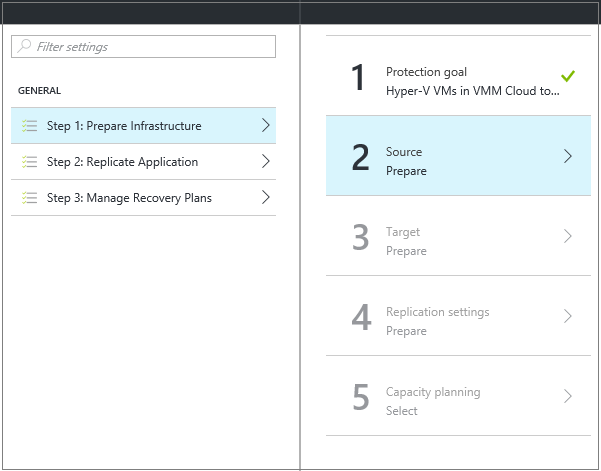

2. 在“准备源”中单击“+VMM”以添加 VMM 服务器。

    

3. 在“添加服务器”中，检查“System Center VMM 服务器”是否出现在“服务器类型”中，以及 VMM 服务器是否符合[先决条件和 URL 要求](#prerequisites)。
4. 下载 Azure Site Recovery 提供程序安装文件。
5. 下载注册密钥。 运行安装程序时需要用到此密钥。 生成的密钥有效期为 5 天。

    

## 在 VMM 服务器上安装提供程序

1. 在 VMM 服务器上运行提供程序安装文件。
2. 在“Microsoft 更新” 中，可以选择进行更新，以便根据 Microsoft 更新策略安装提供程序更新。
3. 在“安装”中接受或修改默认提供程序安装位置，然后单击“安装”。

    
4. 安装完成后，单击“注册”在保管库中注册 VMM 服务器。
5. 在“保管库设置”页中，单击“浏览”以选择保管库密钥文件。 指定 Azure Site Recovery 订阅和保管库名称。

    
6. 在“Internet 连接”中，指定在 VMM 服务器上运行的提供程序如何通过 Internet 连接到站点恢复。

   * 如果希望提供程序直接进行连接，请选择“不使用代理直接连接 Azure Site Recovery”。
   * 如果现有代理要求身份验证，或者想要使用自定义代理，请选择“使用代理服务器连接 Azure Site Recovery”。
   * 如果使用自定义代理，请指定地址、端口和凭据。
   * 如果你使用代理，应事先允许[先决条件](#on-premises-prerequisites)中所述的 URL。
   * 如果你使用自定义代理，则将使用指定的代理凭据自动创建一个 VMM 运行身份帐户 (DRAProxyAccount)。 对代理服务器进行配置以便该帐户可以成功通过身份验证。 可以在 VMM 控制台中修改 VMM 运行身份帐户设置。 在“设置”中，展开“安全性” > “运行方式帐户”，然后修改 DRAProxyAccount 的密码。 你将需要重新启动 VMM 服务以使此设置生效。

     
7. 接受或修改用于保存为数据加密自动生成的 SSL 证书的位置。 如果在 Azure Site Recovery 门户中为受 Azure 保护的云启用数据加密，则会使用此证书。 请确保该证书安全。 运行故障转移到 Azure 时，如果已启用数据加密，需要使用该证书来解密。
8. 在“服务器名称”中，指定一个友好名称以在保管库中标识该 VMM 服务器。 在群集配置中，指定 VMM 群集角色名称。
9. 如果要将 VMM 服务器上所有云的元数据与保管库同步，请启用“同步云元数据”。 此操作在每个服务器上只需执行一次。 如果你不希望同步所有云，可以将此设置保留为未选中状态并在 VMM 控制台中的云属性中分别同步各个云。 单击“注册”  完成此过程。

    
10. 注册随即开始。 注册完成后，服务器将显示在“Site Recovery 基础结构” > “VMM 服务器”中。

## 在 Hyper-V 主机上安装 Azure 恢复服务代理

1. 设置提供程序之后，需要下载 Azure 恢复服务代理的安装文件。 在 VMM 云中的每台 Hyper-V 服务器上运行安装程序。

    
2. 在“先决条件检查”中，单击“下一步”。 将自动安装任何缺少的必备组件。

    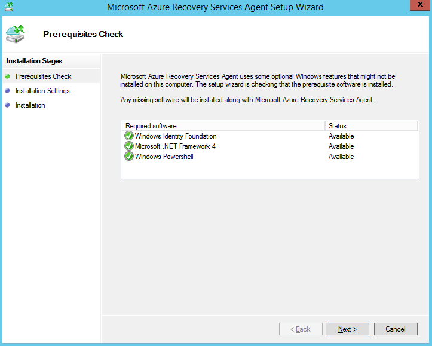
3. 在“安装设置”中，接受或修改安装位置和缓存位置。 可以在至少有 5 GB 可用存储空间的驱动器上配置缓存，但我们建议缓存驱动器有 600 GB 或更多可用空间。 然后单击“安装” 。
4. 安装完成后，单击“关闭”  完成操作。

    

### 命令行安装
可以使用以下命令从命令行安装 Azure 恢复服务代理：

     marsagentinstaller.exe /q /nu

### 设置从 Hyper-V 主机到 Site Recovery 的 Internet 代理访问权限

Hyper-V 主机上运行的恢复服务代理需有权通过 Internet 访问 Azure 才能进行 VM 复制。 如果通过代理访问 Internet，请按如下所示进行设置：

1. 在 Hyper-V 主机上打开 Azure 备份 MMC 管理单元。 默认情况下，Azure 备份的快捷方式位于桌面上或 C:\Program Files\Azure Recovery Services Agent\bin\wabadmin 中。
2. 在管理单元中，单击“更改属性”。
3. 在“代理配置”选项卡上指定代理服务器信息。

    
4. 检查代理是否可以访问 [先决条件](#on-premises-prerequisites)中所述的 URL。

## 设置目标环境
指定要用于复制的 Azure 存储帐户，以及 Azure VM 在故障转移后连接到的 Azure 网络。

1. 单击“准备基础结构” > “目标”，选择你希望在其中创建故障转移虚拟机的订阅和资源组。 选择希望在 Azure 中为故障转移虚拟机使用的部署模型（经典或资源管理）。

    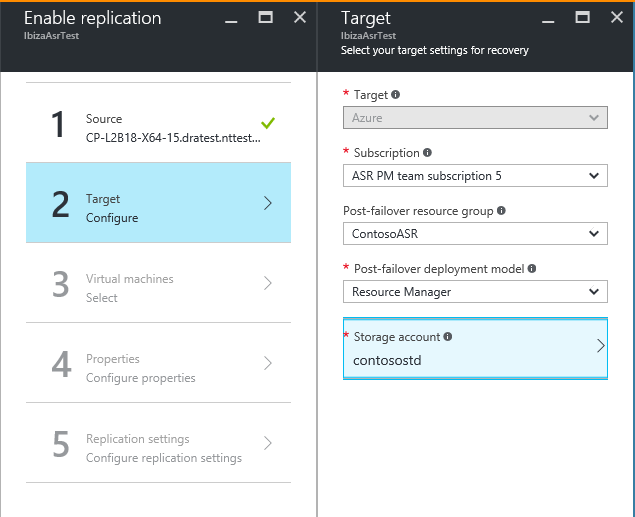

2. Site Recovery 将检查是否有一个或多个兼容的 Azure 存储帐户和网络。

      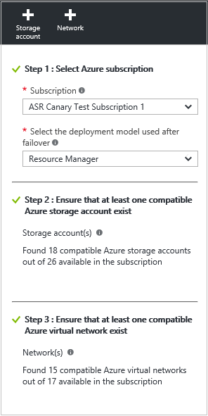

3. 如果尚未创建存储帐户并想使用 Resource Manager 来创建一个，请单击“+存储帐户”以内联方式执行该操作。   在“创建存储帐户”边栏选项卡中，指定帐户名、类型、订阅和位置。 该帐户应位于与恢复服务保管库相同的位置。

   

   * 若要使用经典模型创建存储帐户，请在 Azure 门户预览中执行该操作。 [了解详细信息](../storage/storage-create-storage-account-classic-portal.md)
   * 如果使用高级存储帐户保存复制的数据，请设置其他标准存储帐户来存储复制日志，这些日志将捕获本地数据正在发生的更改。
5. 如果尚未创建 Azure 网络并想使用 Resource Manager 创建一个，请单击“+网络”以内联方式执行该操作。  在“创建虚拟网络”边栏选项卡上，指定网络名称、地址范围、子网详细信息、订阅和位置。 该网络应位于与恢复服务保管库相同的位置。

   

   若要使用经典模型创建网络，请在 Azure 门户预览中执行该操作。 [了解详细信息](../virtual-network/virtual-networks-create-vnet-classic-pportal.md)。

### 配置网络映射

* [阅读](#prepare-for-network-mapping) 网络映射的快速概述。
* 确认 VMM 服务器上的虚拟机已连接到 VM 网络，并且至少创建了一个 Azure 虚拟网络。 可以将多个 VM 网络映射到单个 Azure 网络。

按如下所述配置映射：

1. 在“Site Recovery 基础结构” > “网络映射” > “网络映射”中，单击“+网络映射”图标。

    
2. 在“添加网络映射”中，选择源 VMM 服务器，并选择“Azure”作为目标。
3. 在故障转移后，验证订阅和部署模型。
4. 在“源网络” 中，从 VMM 服务器的关联列表中选择要映射的源本地 VM 网络。
5. 在“目标网络” 中，选择副本 Azure VM 创建后所在的 Azure 网络。 然后，单击“确定” 。

    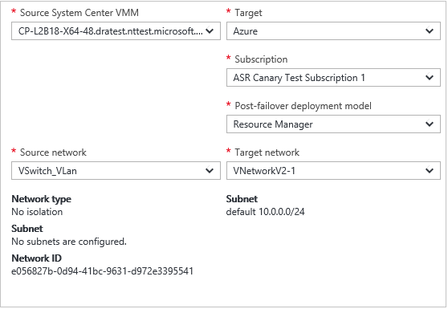

下面是网络映射开始时发生的事情：

* 映射开始时，源 VM 网络上的现有 VM 将连接到目标网络。 进行复制时，连接到源 VM 网络的新 VM 将连接到映射的 Azure 网络。
* 如果修改现有的网络映射，则副本虚拟机将使用新设置进行连接。
* 如果目标网络具有多个子网，并且其中一个子网与源虚拟机所在的子网同名，则在故障转移后副本虚拟机将连接到该目标子网。
* 如果没有具有匹配名称的目标子网，则虚拟机将连接到网络中的第一个子网。

## 配置复制设置
1. 若要创建新的复制策略，请单击“准备基础结构” > “复制设置” > “+创建和关联”。

    
2. 在“创建和关联策略”中指定策略名称。
3. 在“复制频率” 中，指定要在初始复制后复制增量数据的频率（每隔 30 秒、5 或 15 分钟）。

    > [!NOTE]
    >  复制到高级存储时，不支持 30 秒的频率。 该限制取决于高级存储支持的每 blob 快照数 (100)。 [了解详细信息](../storage/storage-premium-storage.md#snapshots-and-copy-blob)

4. 在“恢复点保留期”中，针对每个恢复点指定保留期的时长（以小时为单位）。 受保护的计算机可以恢复到某个时段内的任意时间点。
5. 在“应用一致性快照频率” 中，指定创建包含应用程序一致性快照的恢复点的频率（1-12 小时）。 Hyper-V 使用两种类型的快照 — 标准快照，它提供整个虚拟机的增量快照；与应用程序一致的快照，它生成虚拟机内的应用程序数据的时间点快照。 与应用程序一致的快照使用卷影复制服务 (VSS) 来确保应用程序在拍摄快照时处于一致状态。 请注意，如果你启用了与应用程序一致的快照，它将影响在源虚拟机上运行的应用程序的性能。 请确保你设置的值小于你配置的额外恢复点的数目。
6. 在“初始复制开始时间” 中，指定开始初始复制的时间。 复制通过 Internet 带宽进行，因此你可能需要将它安排在非繁忙时间。
7. 在“加密 Azure 上存储的数据” 中，指定是否加密 Azure 存储空间中的静态数据。 然后，单击“确定” 。

    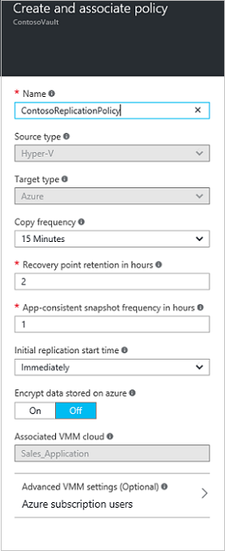
8. 当创建新策略时，该策略自动与 VMM 云关联。 单击 **“确定”**。 可以在“复制”“策略名称”>“关联 VMM 云”中，将其他 VMM 云（及其中的 VM）与此复制策略相关联。

    

## 容量规划

你已经设置了基本基础结构，请考虑容量计划并确定是否需要额外的资源。

站点恢复提供 Capacity Planner 帮助为源环境、Site Recovery 组件、网络和存储分配适当的资源。 可以在快速模式下运行 Planner，以便根据 VM、磁盘和存储的平均数量进行估计，或者在详细模式下运行 Planner，在其中输入工作负荷级别的数据。 开始之前：

* 收集有关复制环境的信息，包括 VM 数、每个 VM 的磁盘数和每个磁盘的存储空间。
* 估计复制数据的每日更改（变动）率。 可以使用 [Hyper-V 副本 Capacity Planner](https://www.microsoft.com/download/details.aspx?id=39057) 来帮助执行此操作。

1. 单击“下载”以下载该工具，然后开始运行。 [阅读](site-recovery-capacity-planner.md)该工具随附的文章。
2. 完成后，请在“是否已运行 Capacity Planner?”中选择“是”。

   

   详细了解如何[控制网络带宽](#network-bandwidth-considerations)

## 启用复制

现在，请按如下所述启用复制：

1. 单击“步骤 2: 复制应用程序” > “源”。 首次启用复制后，请在保管库中单击“+复制”，对其他计算机启用复制。

    
2. 在“源”边栏选项卡中，选择 VMM 服务器和 Hyper-V 主机所在的云。 。

    
3. 在“目标”中，选择订阅、故障转移后的部署模型，以及用于复制数据的存储帐户。

    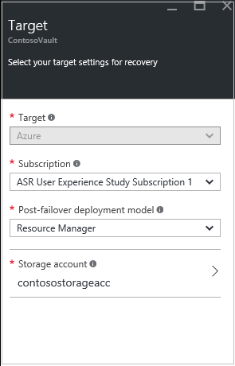
4. 选择要使用的存储帐户。 如果要使用与现有存储帐户不同的存储帐户，可以 [创建一个](#set-up-an-azure-storage-account)。 如果要将高级存储帐户用于复制的数据，需要选择其他标准存储帐户存储复制日志，这些日志将捕获本地数据正在发生的更改。若要使用 Resource Manager 模型创建存储帐户，请单击“新建”。 若要使用经典模型创建存储帐户，请[在 Azure 门户预览中](../storage/storage-create-storage-account-classic-portal.md)执行该操作。 。
5. 选择 Azure VM 在故障转移后创建时所要连接的 Azure 网络和子网。 选择“立即为选定的计算机配置”，将网络设置应用到选择保护的所有计算机。 选择“稍后配置”以选择每个计算机的 Azure 网络。 如果要使用与现有不同的网络，可以[创建一个](#set-up-an-azure-network)。 若要使用 Resource Manager 模型创建网络，请单击“新建”。 若要使用经典模型创建网络，请[在 Azure 门户预览中](../virtual-network/virtual-networks-create-vnet-classic-pportal.md)执行该操作。 选择适用的子网。 。
6. 在“虚拟机” > “选择虚拟机”中，单击并选择要复制的每个计算机。 只能选择可以启用复制的计算机。 。

    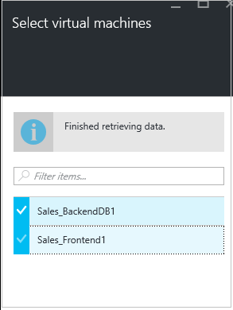

7. 在“属性” > “配置属性”中，选择所选 VM 的操作系统和 OS 磁盘。

    - 验证 Azure VM 名称（目标名称）是否符合 [Azure 虚拟机要求](site-recovery-support-matrix-to-azure.md#failed-over-azure-vm-requirements)。   
    - 默认情况下，为复制选择了 VM 的所有磁盘，但可以通过清除磁盘将其排除。

        - 可能要排除磁盘来减少复制带宽。 例如，可能不需要复制包含临时数据的磁盘，或包含每次重启计算机/应用时刷新的数据（例如 pagefile.sys 或 Microsoft SQL Server tempdb）的磁盘。 取消选中磁盘即可将磁盘从复制中排除。
        - 只能排除基本磁盘。 不能排除 OS 磁盘。
        - 建议不要排除动态磁盘。 Site Recovery 无法识别来宾 VM 内的虚拟硬盘是基本磁盘还是动态磁盘。 如果未排除所有相关动态卷磁盘，则受保护的动态磁盘会在故障转移 VM 时显示为故障磁盘，且无法访问该磁盘上的数据。
        - 启用复制后，无法添加或删除要复制的磁盘。 如果要添加或排除磁盘，需要禁用 VM 保护，然后重启保护。
        - 在 Azure 中手动创建的磁盘不会故障回复。 例如，如果直接在 Azure VM 中故障转移三个磁盘并创建两个，则只会将进行过故障转移的三个磁盘从 Azure 故障回复到 Hyper-V。 不能包括在故障回复过程中或从 Hyper-V 到 Azure 的反向复制过程中手动创建的磁盘。
        - 如果某个应用程序需要有排除的磁盘才能正常运行，则故障转移到 Azure 之后，需要在 Azure 中手动创建该磁盘，以便复制的应用程序可以运行。 或者，可以将 Azure 自动化集成到恢复计划中，以便在故障转移计算机期间创建磁盘。

    单击“确定”保存更改。 可以稍后再设置其他属性。

    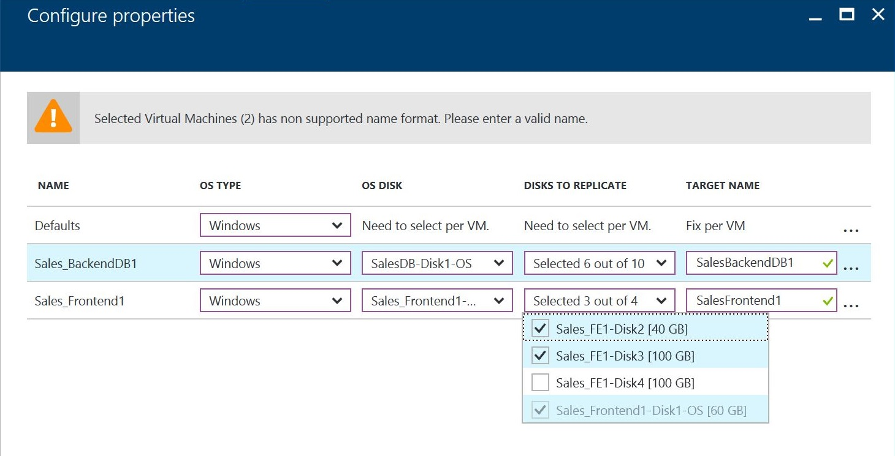

8. 在“复制设置” > “配置复制设置”中，选择要应用于受保护 VM 的复制策略。 。 可以在“复制策略”> 策略名称 >“编辑设置”中修改复制策略。 应用的更改将用于已在复制的计算机和新计算机。

   

可以在“作业” > “Site Recovery 作业”中，跟踪“启用保护”作业的进度。 在“完成保护”作业运行之后，计算机就可以进行故障转移了。

### 查看和管理 VM 属性

建议你验证源计算机的属性。 请记住，Azure VM 名称应符合 [Azure 虚拟机要求](site-recovery-support-matrix-to-azure.md#failed-over-azure-vm-requirements)。

1. 在“受保护的项”中，单击“复制的项”，然后选择计算机以查看其详细信息。

    
2. 在“属性”中，可以查看 VM 的复制和故障转移信息。

    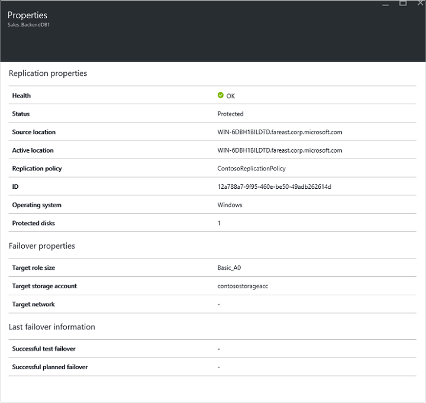
3. 在“计算和网络” > “计算属性”中，可以指定 Azure VM 名称和目标大小。 根据需要修改名称，使其符合 [Azure 要求](site-recovery-support-matrix-to-azure.md#failed-over-azure-vm-requirements)。 还可以查看和修改目标网络、子网以及已分配给 Azure VM 的 IP 地址的相关信息。
请注意：

   * 可以设置目标 IP 地址。 如果未提供地址，故障转移的计算机将使用 DHCP。 如果设置了无法用于故障转移的地址，故障转移将会失败。 如果地址可用于测试故障转移网络，则同一个目标 IP 地址可用于测试故障转移。
   * 网络适配器数目根据你为目标虚拟机指定的大小来确定，如下所述：

     * 如果源计算机上的网络适配器数小于或等于目标计算机大小允许的适配器数，则目标的适配器数将与源相同。
     * 如果源虚拟机的适配器数大于目标大小允许的数目，则使用目标大小允许的最大数目。
     * 例如，如果源计算机有两个网络适配器，而目标计算机大小支持四个，则目标计算机将有两个适配器。 如果源计算机有两个适配器，但支持的目标大小只支持一个，则目标计算机只有一个适配器。     
     * 如果 VM 有多个网络适配器，它们将全部连接到同一个网络。

     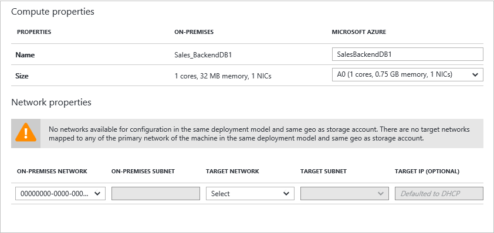
4. 在“磁盘”中，可以看到 VM 上将要复制的操作系统和数据磁盘。

## 测试部署

为了对部署进行测试，你可以针对单个虚拟机或单个恢复计划（其中包含一个或多个虚拟机）运行测试性故障转移。

### 开始之前

 - 如果要在故障转移后使用 RDP 连接到 Azure VM，请了解如何[准备连接](site-recovery-test-failover-to-azure.md#prepare-to-connect-to-azure-vms-after-failover)。
 - 若要全面测试，需要在测试环境中复制 Active Directory 和 DNS。 [了解详细信息](site-recovery-active-directory.md#test-failover-considerations)。

### 运行测试故障转移

1. 若要故障转移单个 VM，请在“复制的项”中，单击“VM”>“+测试故障转移”。
2. 若要故障转移某个恢复计划，请在“恢复计划”中，右键单击该计划 >“测试故障转移”。 若要创建恢复计划，请[遵循这些说明](site-recovery-create-recovery-plans.md)。
3. 在“测试性故障转移”中，选择 Azure VM 在故障转移之后要连接到的 Azure 网络。
4. 单击“确定”开始故障转移。 若要跟踪进度，可单击 VM 打开其属性，或者在“Site Recovery 作业”中选择“测试故障转移”作业。
5. 故障转移完成后，你还应该能够看到副本 Azure 计算机显示在 Azure 门户预览的“虚拟机”中。 应确保 VM 的大小适当、已连接到相应的网络，并且正在运行。
6. 如果已准备好故障转移后的连接，应该能够连接到 Azure VM。
7. 完成后，在恢复计划上单击“清理测试故障转移”。 在“**说明**”中，记录并保存与测试性故障转移相关联的任何观测结果。 这会删除测试故障转移期间创建的虚拟机。

有关更多详细信息，请参阅[测试故障转移到 Azure](site-recovery-test-failover-to-azure.md) 一文。

## 监视部署

下面介绍如何监视 Site Recovery 部署的配置设置、状态和运行状况：

1. 单击保管库名称以访问“概要”仪表板。 在此仪表板中，可以看到 Site Recovery 作业、复制状态、恢复计划、服务器运行状况和事件。  可以自定义“概要”以显示最有用的磁贴和布局，包括其他站点恢复和备份保管库的状态。

    
2. 在“运行状况”中，可以监视本地服务器（VMM 或配置服务器）上的问题和 Site Recovery 在过去 24 小时内引发的事件。
3. 在“复制的项”、“恢复计划”和“站点恢复作业”磁贴中，可以管理和监视复制。 可通过“作业” > “Site Recovery 作业”钻取到不同的作业。

## Azure Site Recovery 提供程序的命令行安装

可通过以下命令行来安装 Azure Site Recovery 提供程序。 此命令可用来将提供程序安装在 Server Core for Windows Server 2012 R2 上。

1. 将提供程序安装文件和注册密钥下载到某个文件夹中。 例如 C:\ASR。
2. 从提升的命令提示符处，运行以下命令提取提供程序安装程序：

            C:\Windows\System32> CD C:\ASR
            C:\ASR> AzureSiteRecoveryProvider.exe /x:. /q
3. 运行以下命令来安装组件：

            C:\ASR> setupdr.exe /i
4. 然后运行以下命令在保管库中注册服务器：

        CD C:\Program Files\Microsoft System Center 2012 R2\Virtual Machine Manager\bin
        C:\Program Files\Microsoft System Center 2012 R2\Virtual Machine Manager\bin\> DRConfigurator.exe /r  /Friendlyname <friendly name of the server> /Credentials <path of the credentials file> /EncryptionEnabled <full file name to save the encryption certificate>       

其中：

* **/Credentials**：用于指定注册密钥文件所在位置的必需参数。  
* **/FriendlyName**：在 Azure Site Recovery 门户中显示的 Hyper-V 主机服务器名称的必需参数。
* * **/EncryptionEnabled**：将 VMM 云中的 Hyper-V VM 复制到 Azure 时使用的可选参数。 指定是否要在 Azure 中加密虚拟机（静态加密）。 请确保该文件的名称具有 **.pfx** 扩展名。 默认情况下，加密已关闭。
* **/proxyAddress**：可选参数，用于指定代理服务器的地址。
* **/proxyport**：可选参数，用于指定代理服务器的端口。
* **/proxyUsername**：可选参数，用于指定代理用户名（如果代理要求身份验证）。
* **/proxyPassword**：可选参数，用于指定密码，以便通过代理服务器进行身份验证（如果代理要求身份验证）。

### 网络带宽注意事项
可以使用 Capacity Planner 工具来计算复制（初始复制，然后是增量复制）所需的带宽。 若要控制复制所用的带宽量，可以使用以下几个选项：

* **限制带宽**：复制到辅助站点的 Hyper-V 流量经过特定的 Hyper-V 主机。 可以在主机服务器上限制带宽。
* **调整带宽**：可以使用几个注册表项来控制用于复制的带宽。

#### 限制带宽
1. 在 Hyper-V 主机服务器上打开“Azure 备份”MMC 管理单元。 默认情况下，Azure 备份的快捷方式位于桌面上或 C:\Program Files\Azure Recovery Services Agent\bin\wabadmin 中。
2. 在管理单元中，单击“更改属性”。
3. 在“限制”选项卡上，选择“为备份操作启用 Internet 带宽使用限制”，然后设置工作时间和非工作时间的限制。 有效范围为 512 Kbps 到 102 Mbps。

    

也可以使用 [Set-OBMachineSetting](https://technet.microsoft.com/library/hh770409.aspx) cmdlet 来设置限制。 下面是一个示例：

    $mon = [System.DayOfWeek]::Monday
    $tue = [System.DayOfWeek]::Tuesday
    Set-OBMachineSetting -WorkDay $mon, $tue -StartWorkHour "9:00:00" -EndWorkHour "18:00:00" -WorkHourBandwidth  (512*1024) -NonWorkHourBandwidth (2048*1024)

**Set-OBMachineSetting -NoThrottle** 表示不需要限制。

#### 影响网络带宽
**UploadThreadsPerVM** 注册表值控制用于磁盘数据传输（初始或增量复制）的线程数。 使用较大的值会增加复制所用的网络带宽。 **DownloadThreadsPerVM** 注册表值指定在故障回复期间用于数据传输的线程数。

1. 在注册表中导航到 **HKEY_LOCAL_MACHINE\SOFTWARE\Microsoft\Microsofte Azure Backup\Replication**。

   * 修改 **UploadThreadsPerVM** 值（如果该项不存在，请创建该项），控制用于磁盘复制的线程数。
   * 修改 **DownloadThreadsPerVM** 值（如果该项不存在，请创建该项），控制用于从 Azure 故障回复流量的线程数。
2. 默认值为 4。 在“过度预配型”网络中，这些注册表项需要更改，不能使用默认值。 最大值为 32。 监视流量以优化值。

## 后续步骤

完成虚拟机的初始复制，并已测试部署后，可以根据需要调用故障转移。 [详细了解](site-recovery-failover.md)不同类型的故障转移，以及如何运行它们。

