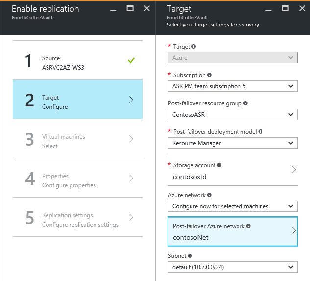
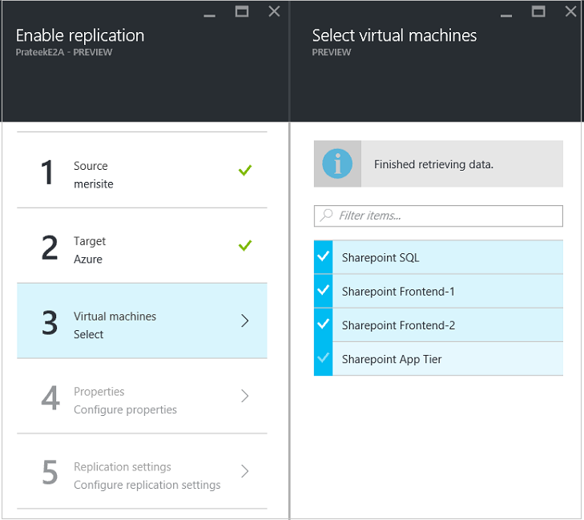
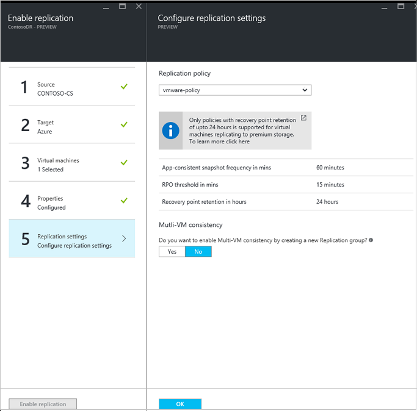

# 步骤 11：启用 VMware 虚拟机到 Azure 的复制

本文介绍如何在 Azure 门户中使用 [Azure Site Recovery](site-recovery-overview.md) 服务启用本地 VMware 虚拟机到 Azure 的复制。

请将评论和问题发布到这篇文章的底部，或者发布到 [Azure 恢复服务论坛](https://social.msdn.microsoft.com/Forums/en-US/home?forum=hypervrecovmgr)。

## 开始之前

- VMware VM 必须已[安装移动服务组件](vmware-walkthrough-install-mobility.md)。 - 如果已为推送安装准备了 VM，那么在启用复制时，进程服务器将自动安装移动服务。
- Azure 用户帐户需要特定[权限](site-recovery-role-based-linked-access-control.md#permissions-required-to-enable-replication-for-new-virtual-machines)才能启用 VM 到 Azure 的复制
- 添加或修改 VM 之后，可能需要 15 分钟或更长时间，更改才会生效并显示在门户中。
- 可在“配置服务器” > “上次联系位置”查看上次发现 VM 的时间。
- 若要添加 VM 而不想等待执行计划的发现，请突出显示配置服务器（不要单击它），然后单击“刷新”。

## 从复制中排除磁盘

默认情况下将复制计算机上的所有磁盘。 可以从复制中排除磁盘。 例如，你可能不想复制包含临时数据，或者每次重启计算机或应用程序时会刷新的数据（例如 pagefile.sys 或 SQL Server tempdb）的磁盘。 [了解详细信息](site-recovery-exclude-disk.md)

## 复制 VM

在开始之前，请观看短片概述

>[!VIDEO https://channel9.msdn.com/Series/Azure-Site-Recovery/VMware-to-Azure-with-ASR-Video3-Protect-VMware-Virtual-Machines/player]

1. 单击“步骤 2: 复制应用程序” > “源”。
2. 在“源”中选择配置服务器。
3. 在“计算机类型”中，选择“虚拟机”。
4. 在“vCenter/vSphere 虚拟机监控程序”中，选择管理 vSphere 主机的 vCenter 服务器，或选择该主机。
5. 选择进程服务器。 如果未创建任何额外的进程服务器，该进程服务器将是配置服务器。 。

    

6. 在“目标”中，选择要创建故障转移 VM 的订阅和资源组。 选择要在 Azure 中用于故障转移 VM 的部署模型（经典或资源管理）。

7. 选择要用于复制数据的 Azure 存储帐户。 如果不想要使用已设置的帐户，可以创建一个新帐户。

8. 选择 Azure VM 在故障转移后创建时所要连接的 Azure 网络和子网。 选择“立即为选定的计算机配置”，将网络设置应用到选择保护的所有计算机。  选择“稍后配置”以选择每个计算机的 Azure 网络。 如果不想使用现有网络，可以创建一个网络。

    
9. 在“虚拟机” > “选择虚拟机”中，单击并选择要复制的每个计算机。 只能选择可以启用复制的计算机。 。

    
10. 在“属性” > “配置属性”中，选择进程服务器在计算机上自动安装移动服务时使用的帐户。
11. 默认情况下会复制所有磁盘。 单击“所有磁盘”并清除所有不想复制的磁盘。 。 可以稍后再设置其他 VM 属性。

    
11. 在“复制设置” > “配置复制设置”中，检查是否选择了正确的复制策略。 如果修改策略，更改将应用到复制计算机和新计算机。
12. 如果要将计算机集合到复制组，请启用“多 VM 一致性”并指定组的名称。 。 请注意：

    * 复制组中的计算机将一起复制，并在故障转移时获得崩溃一致且应用一致的共享恢复点。
    * 我们建议将 VM 和物理服务器集合在一起，使其镜像工作负荷。 启用多 VM 一致性可能会影响工作负荷性能，因此，仅当计算机运行相同的工作负荷并且需要一致性时，才应使用该设置。

    
13. 单击“启用复制”。 可以在“设置” > “作业” > “Site Recovery 作业”中，跟踪“启用保护”作业的进度。 在“完成保护”作业运行之后，计算机就可以进行故障转移了。

## 后续步骤

转到[步骤 12：运行测试故障转移](vmware-walkthrough-test-failover.md)

<!--Update_Description: new articles on site recovery replication from vmware to azure-->