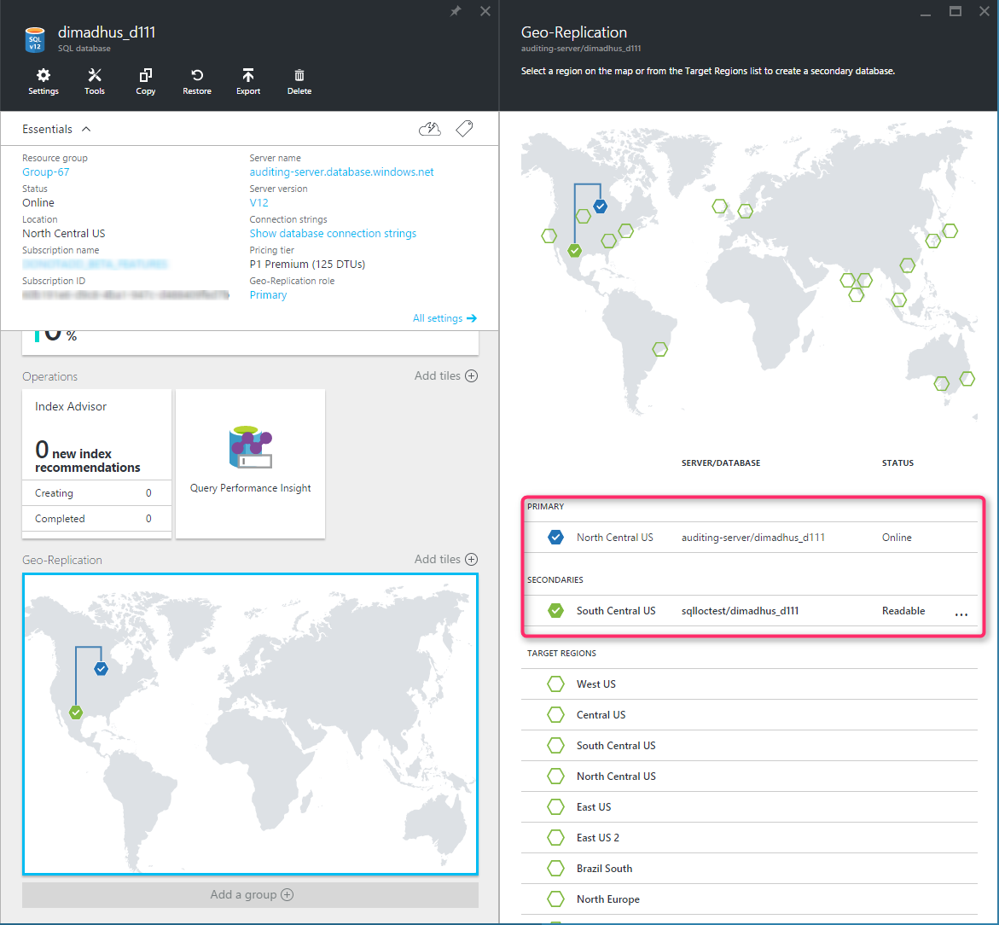

# 使用活动异地复制创建可读辅助数据库

活动异地复制是 Azure SQL 数据库的一项功能，使用此功能可以在相同或不同数据中心（区域）的 SQL 数据库服务器上创建单个数据库的可读辅助数据库。

活动异地复制旨在充当业务连续性解决方案，允许应用程序在发生区域性灾难或大规模中断时执行各个数据库的快速灾难恢复。 如果启用了异地复制，则应用程序可以向其他 Azure 区域中的辅助数据库启动故障转移。 在相同或不同的区域中最多支持四个辅助数据库，并且辅助数据库也可以用于只读访问查询。 故障转移必须由应用程序或用户手动启动。 故障转移后，新的主数据库具有不同的连接终结点。 下图演示了使用活动异地复制的异地冗余云应用程序的典型配置。

> [!IMPORTANT]
> SQL 数据库还支持自动故障转移组。 有关详细信息，请参阅[自动故障转移组](sql-database-auto-failover-group.md)。

如果主数据库因某种原因而出现故障，或者只是需要脱机，则可以启动故障转移到任何辅助数据库的操作。 当将故障转移激活到辅助数据库之一时，所有其他辅助数据库会自动链接到新的主数据库。

可以使用活动异地复制管理服务器或弹性池中单个数据库或一组数据库的复制和故障转移。 可通过以下方式执行此操作：

- [Azure 门户](sql-database-geo-replication-portal.md)
- [PowerShell：单一数据库](scripts/sql-database-setup-geodr-and-failover-database-powershell.md)
- [PowerShell：弹性池](scripts/sql-database-setup-geodr-and-failover-pool-powershell.md)
- [Transact-SQL：单一数据库或弹性池](https://docs.microsoft.com/sql/t-sql/statements/alter-database-azure-sql-database)
- [REST API：单一数据库](https://docs.microsoft.com/rest/api/sql/replicationlinks)

故障转移后，请确保在新的主机上配置服务器和数据库的身份验证要求。 有关详细信息，请参阅 [SQL Database security after disaster recovery](sql-database-geo-replication-security-config.md)（灾难恢复后的 Azure SQL 数据库安全性）。

活动异地复制利用 SQL Server 的 [Always On](https://docs.microsoft.com/sql/database-engine/availability-groups/windows/overview-of-always-on-availability-groups-sql-server) 技术，使用快照隔离以异步方式将主数据库上已提交的事务复制到辅助数据库。 自动故障转移组提供基于活动异地复制的组语义，但使用相同的异步复制机制。 尽管在任意给定时间，辅助数据库可能略微滞后于主数据库，但系统可以保证辅助数据永不包含部分事务。 跨区域冗余使应用程序能够在自然灾害、灾难性人为失误或恶意行为导致整个或部分数据中心永久性数据丢失后得以快速恢复。 [业务连续性概述](sql-database-business-continuity.md)中提供了具体的 RPO 数据。

> [!NOTE]
> 如果两个区域之间存在网络故障，我们会每 10 秒钟重试一次以重新建立连接。
> [!IMPORTANT]
> 若要确保对主数据库所做的关键更改已在故障转移前复制到辅助数据库，可以强制同步，以确保复制关键更改（例如密码更新）。 强制同步会阻止调用线程，直到所有提交的事务得到复制，因此会影响性能。 有关详细信息，请参阅 [sp_wait_for_database_copy_sync](https://docs.microsoft.com/sql/relational-databases/system-stored-procedures/active-geo-replication-sp-wait-for-database-copy-sync)。 若要监视主数据库和地域辅助数据库之间的复制延迟，请参阅 [sys.dm_geo_replication_link_status](https://docs.microsoft.com/sql/relational-databases/system-dynamic-management-views/sys-dm-geo-replication-link-status-azure-sql-database)。

下图显示了配置的活动异地复制示例，其中主数据库位于中国东部区域，辅助数据库位于中国北部区域。

因为辅助数据库是可读的，并且可用于卸载只读工作负荷，如报表作业。 如果使用活动异地复制，则可在主数据库所在的区域中创建辅助数据库，但不会增加应用程序针对灾难性故障的复原能力。 如果使用自动故障转移组，则会始终在不同的区域中创建辅助数据库。

除了灾难恢复外，活动异地复制还可用于以下情况：

- **数据库迁移**：可以使用活动异地复制将数据库在联机情况下从一台服务器迁移到另一台服务器，只需要极少的停机时间。
- **应用程序升级**：可以在应用程序升级期间创建额外的辅助数据库作为故障回复副本。

若要真正实现业务连续性，只需添加数据中心之间的数据库冗余即可，这只是该解决方案的一部分功能。 在发生灾难性故障后，端对端地恢复应用程序（服务）需要恢复构成该服务的所有组件以及所有依赖服务。 这些组件的示例包括客户端软件（例如，使用自定义 JavaScript 的浏览器）、Web 前端、存储和 DNS。 所有组件必须能够弹性应对相同的故障，并在应用程序的恢复时间目标 (RTO) 值内变为可用，这一点非常关键。 因此，需要识别所有依赖服务，并了解它们提供的保证和功能。 然后，必须执行适当的步骤来确保对用户的服务所依赖的服务执行故障转移期间，用户的服务能够正常运行。 有关设计灾难恢复解决方案的详细信息，请参阅[设计使用活动异地复制的灾难恢复云解决方案](sql-database-designing-cloud-solutions-for-disaster-recovery.md)。

## 活动异地复制术语和功能

- **自动异步复制**

 只能通过添加到现有数据库来创建辅助数据库。 辅助数据库可在任何 Azure SQL 数据库服务器中创建。 创建完成之后，使用从主数据库复制的数据填充辅助数据库。 这个过程称为种子设定。 创建辅助数据库并设定其种子后，会自动以异步方式将主数据库的更新复制到辅助数据库。 异步复制是指先在主数据库上提交事务，然后将事务复制到辅助数据库。

- **可读取的辅助数据库**

  应用程序可使用与访问主数据库时所用的相同或不同的安全主体来访问辅助数据库以执行只读操作。 辅助数据库在快照隔离模式下运行，以确保对主数据库的更新的复制（日志重播）不会因辅助数据库上执行的查询操作而延迟。

  > [!NOTE]
  > 如果主数据库上有架构更新，则日志重播会在辅助数据库上延迟。 因为架构更新需要在辅助数据库上有架构锁。

- **计划的故障转移**

  将辅助角色切换为主要角色之前，计划内故障转移在主要数据库与辅助数据库之间执行完全同步。 这可以保证数据不会丢失。 计划内故障转移用于以下方案：(a) 在数据丢失是可以接受的情况下，在生产环境中进行 DR 演练；(b) 将数据库重新定位到另一区域；(c) 缓解服务中断（故障回复）后将数据库恢复到主要区域。

- **未计划的故障转移**

  计划外故障转移或强制故障转移立即将辅助角色切换为主要角色，而不与主要节点进行任何同步。 此操作会导致数据丢失。 在服务中断期间当主要节点不可访问时，计划外故障转移将用作恢复方法。 原始主要节点重新联机后，将在不进行同步的情况下自动重新连接，并成为新的辅助节点。

- **多个可读的辅助数据库**

  可以为每个主要数据库创建最多 4 个辅助数据库。 如果只有一个辅助数据库，一旦它发生故障，应用程序就会遭受更高的风险，直到创建了新的辅助数据库。 如果存在多个辅助数据库，即使其中一个辅助数据库发生故障，应用程序仍会受到保护。 也可使用其他辅助数据库来横向扩展只读工作负荷。

  > [!NOTE]
  > 如果使用活动异地复制生成全球分布的应用程序，并需要在四个以上的区域中提供数据只读访问，则可以创建辅助数据库的辅助数据库（此过程称为链接）。 采用这种方式几乎可以实现数据库复制的无限制缩放。 此外，链接减少了从主数据库进行复制的开销。 随之而来的弊端是增加了大多数辅助数据库上的复制延迟。

- **在弹性池中异地复制数据库**

  每个辅助数据库可单独参与弹性池或根本不在弹性池中。 每个辅助数据库的池选择是单独的，并且不会依赖任何其他辅助数据库的配置（无论是主数据库还是辅助数据库）。 每个弹性池都包含在一个区域内，因此，同一拓扑中的多个辅助数据库永远无法共享弹性池。

- **可配置的辅助数据库计算大小**

  主数据库和辅助数据库都需要有相同的服务层。 另外，强烈建议创建与主数据库具有相同计算大小（DTU 或 vCore）的辅助数据库。 如果辅助数据库的计算大小较低，则会面临复制延迟时间增大、辅助数据库可能不可用等风险，并因此导致在故障转移后丢失大量数据的风险。 因此，发布的 RPO = 5 秒无法保证。 另一个风险是，在故障转移后，在新的主数据库升级到较高的计算大小之前，应用程序的性能将由于新的主数据库缺少计算能力而受影响。 升级时间取决于数据库大小。 此外，当前这类升级要求主数据库和辅助数据库都处于联机状态，因此在中断缓解之前无法完成。 如果决定创建具有较低计算大小的辅助数据库，Azure 门户上的日志 IO 百分比图表提供了一种评估维持复制负荷所需的辅助数据库的最小计算大小的好办法。 例如，如果你的主数据库是 P6 (1000 DTU)，其日志 IO 百分比为 50%，则辅助数据库需要至少为 P4 (500 DTU)。 还可以使用 [sys.resource_stats](https://docs.microsoft.com/sql/relational-databases/system-catalog-views/sys-resource-stats-azure-sql-database) 或 [sys.dm_db_resource_stats](https://docs.microsoft.com/sql/relational-databases/system-dynamic-management-views/sys-dm-db-resource-stats-azure-sql-database) 数据库视图检索日志 IO 数据。  有关 SQL 数据库计算大小的详细信息，请参阅[什么是 SQL 数据库服务层](sql-database-service-tiers.md)。

- **用户控制的故障转移和故障回复**

  应用程序或用户可随时会辅助数据库显式切换到主角色。 在实际服务中断期间，应使用“计划外”选项，这会立即将辅助数据库升级为主数据库。 当出现故障的主数据库恢复并再次可用时，系统会自动将恢复的主数据库标记为辅助数据库并使其与新的主数据库保持最新状态。 由于复制的异步特性，在未计划的故障转移期间，如果主数据库在将最新的更改复制到辅助数据库之前出现故障，则可能会丢失少量数据。 当具有多个辅助数据库的主数据库进行故障转移时，系统自动重新配置复制关系，并将剩余辅助数据库链接到新升级的主数据库，无需任何用户的干预。 导致了故障转移的服务中断得到缓解后，可能需要将应用程序返回到主要区域。 为此，应使用“计划内”选项调用故障转移命令。

- **保持凭据和防火墙规则同步**

  建议对异地复制数据库使用[数据库防火墙规则](sql-database-firewall-configure.md)，以便这些规则可与数据库一起复制，从而确保所有辅助数据库具有与主数据库相同的防火墙规则。 此方法不再需要客户手动配置和维护承载主数据库和辅助数据库的服务器上的防火墙规则。 同样，将[包含的数据库用户](sql-database-manage-logins.md)用于数据访问可确保主数据库和辅助数据库始终具有相同的用户凭据，以便在故障转移期间，不会因登录名和密码不匹配而产生中断。 通过添加 [Azure Active Directory](../active-directory/fundamentals/active-directory-whatis.md)，客户可以管理主数据库和辅助数据库的用户访问权限，且不再需要同时管理数据库中的凭据。

## 升级或降级主数据库

无需断开连接任何辅助数据库，即可将主数据库升级或降级到不同的计算大小（在相同的服务层中，但不在“常规用途”与“业务关键”类型之间）。 升级时，建议先升级辅助数据库，再升级主数据库。 降级时，应反转顺序：先降级主数据库，再降级辅助数据库。 将数据库升级或降级到不同服务层时，将强制执行此建议操作。

> [!NOTE]
> 如果辅助数据库是作为故障转移组配置的一个部分创建的，则我们不建议对辅助数据库进行降级。 这是为了确保激活故障转移后，数据层有足够的容量来处理常规工作负荷。

## 防止丢失关键数据

由于广域网的延迟时间较长，连续复制使用了异步复制机制。 在发生故障时，异步复制会不可避免地丢失某些数据。 但是，某些应用程序可能要求不能有数据丢失。 为了保护这些关键更新，应用程序开发人员可以在提交事务后立即调用 [sp_wait_for_database_copy_sync](https://docs.microsoft.com/sql/relational-databases/system-stored-procedures/active-geo-replication-sp-wait-for-database-copy-sync) 系统过程。 调用 **sp_wait_for_database_copy_sync** 会阻止调用线程，直到将上次提交的事务传输到辅助数据库。 但是，它不会等待传输的事务提交到辅助数据库进行重播。 **sp_wait_for_database_copy_sync** 的范围是一个具体的连续复制链路。 对主数据库具有连接权限的任何用户都可以调用此过程。

> [!NOTE]
> **sp_wait_for_database_copy_sync** 将在故障转移后防止数据丢失，但它不会保证读取访问的完全同步。 **sp_wait_for_database_copy_sync** 过程调用导致的延迟可能会很明显，具体取决于调用时的事务日志大小。

## 以编程方式管理活动异地复制

如上所述，也可以使用 Azure PowerShell 和 REST API 以编程方式管理活动异地复制。 下表描述了可用的命令集。 活动异地复制包括一组用于管理的 Azure 资源管理器 API，其中包括 [Azure SQL 数据库 REST API](https://docs.microsoft.com/rest/api/sql/) 和 [Azure PowerShell cmdlet](https://docs.microsoft.com/powershell/azure/overview)。 这些 API 需要使用资源组，并支持基于角色的安全性 (RBAC)。 有关如何实现访问角色的详细信息，请参阅 [Azure 基于角色的访问控制](../role-based-access-control/overview.md)。

### T-SQL：管理独立数据库和入池数据库的故障转移

> [!IMPORTANT]
> 这些 Transact-SQL 命令仅适用于活动异地复制，不适用于故障转移组。 因此，它们仅支持故障转移组。

| 命令 | 说明 |
| --- | --- |
| [ALTER DATABASE](https://docs.microsoft.com/sql/t-sql/statements/alter-database-transact-sql?view=azuresqldb-current) |使用 ADD SECONDARY ON SERVER 参数为现有数据库创建辅助数据库，并开始数据复制 |
| [ALTER DATABASE](https://docs.microsoft.com/sql/t-sql/statements/alter-database-transact-sql?view=azuresqldb-current) |使用 FAILOVER 或 FORCE_FAILOVER_ALLOW_DATA_LOSS 将辅助数据库切换为主数据库，启动故障转移 |
| [ALTER DATABASE](https://docs.microsoft.com/sql/t-sql/statements/alter-database-transact-sql?view=azuresqldb-current) |使用 REMOVE SECONDARY ON SERVER 终止 SQL 数据库和指定的辅助数据库之间的数据复制。 |
| [sys.geo_replication_links](https://docs.microsoft.com/sql/relational-databases/system-dynamic-management-views/sys-geo-replication-links-azure-sql-database) |返回有关 Azure SQL 数据库服务器上每个数据库的所有现有复制链接的信息。 |
| [sys.dm_geo_replication_link_status](https://docs.microsoft.com/sql/relational-databases/system-dynamic-management-views/sys-dm-geo-replication-link-status-azure-sql-database) |获取有关给定 SQL 数据库的复制链路的上次复制时间、上次复制滞后时间和其他信息。 |
| [sys.dm_operation_status](https://docs.microsoft.com/sql/relational-databases/system-dynamic-management-views/sys-dm-operation-status-azure-sql-database) |显示所有数据库操作的状态，包括复制链接的状态。 |
| [sp_wait_for_database_copy_sync](https://docs.microsoft.com/sql/relational-databases/system-stored-procedures/active-geo-replication-sp-wait-for-database-copy-sync) |使应用程序等待，直到所有提交的事务已复制，并由活动辅助数据库确认。 |
|  | |

### PowerShell：管理独立数据库和入池数据库的故障转移

| Cmdlet | 说明 |
| --- | --- |
| [Get-AzureRmSqlDatabase](https://docs.microsoft.com/powershell/module/azurerm.sql/get-azurermsqldatabase) |获取一个或多个数据库。 |
| [New-AzureRmSqlDatabaseSecondary](https://docs.microsoft.com/powershell/module/azurerm.sql/new-azurermsqldatabasesecondary) |为现有数据库创建辅助数据库，并开始数据复制。 |
| [Set-AzureRmSqlDatabaseSecondary](https://docs.microsoft.com/powershell/module/azurerm.sql/set-azurermsqldatabasesecondary) |将辅助数据库切换为主数据库，启动故障转移。 |
| [Remove-AzureRmSqlDatabaseSecondary](https://docs.microsoft.com/powershell/module/azurerm.sql/remove-azurermsqldatabasesecondary) |终止 SQL 数据库和指定的辅助数据库之间的数据复制。 |
| [Get-AzureRmSqlDatabaseReplicationLink](https://docs.microsoft.com/powershell/module/azurerm.sql/get-azurermsqldatabasereplicationlink) |获取 Azure SQL 数据库和资源组或 SQL Server 之间的异地复制链路。 |
|  | |

> [!IMPORTANT]
> 有关示例脚本，请参阅[配置单一数据库并使用活动异地复制对其进行故障转移](scripts/sql-database-setup-geodr-and-failover-database-powershell.md)和[配置入池数据库并使用活动异地复制对其进行故障转移](scripts/sql-database-setup-geodr-and-failover-pool-powershell.md)。

### REST API：管理独立数据库和入池数据库的故障转移

| API | 说明 |
| --- | --- |
| [创建或更新数据库 (createMode=Restore)](https://docs.microsoft.com/rest/api/sql/databases/createorupdate) |创建、更新或还原主数据库或辅助数据库。 |
| [获取创建或更新数据库状态](https://docs.microsoft.com/rest/api/sql/databases/createorupdate) |返回创建操作过程中的状态。 |
| [将辅助数据库设为主数据库（计划的故障转移）](https://docs.microsoft.com/rest/api/sql/replicationlinks/failover) |通过来自当前主要数据库的故障转移设置辅助数据库。|
| [将辅助数据库设为主数据库（未计划的故障转移）](https://docs.microsoft.com/rest/api/sql/replicationlinks/failoverallowdataloss) |通过来自当前主要数据库的故障转移设置辅助数据库。 此操作可能导致数据丢失。 |
| [获取复制链接](https://docs.microsoft.com/rest/api/sql/replicationlinks/get) |获取异地复制合作关系中给定 SQL 数据库的特定复制链接。 它检索 sys.geo_replication_links 目录视图中可见的信息。 |
| [复制链接 - 按数据库列出](https://docs.microsoft.com/rest/api/sql/replicationlinks/listbydatabase) | 获取异地复制合作关系中给定 SQL 数据库的所有复制链接。 它检索 sys.geo_replication_links 目录视图中可见的信息。 |
| [删除复制链接](https://docs.microsoft.com/rest/api/sql/replicationlinks/delete) | 删除数据库复制链接。 在故障转移期间无法执行。 |
|  | |

## 后续步骤

- 示例脚本请参阅：
  - [配置单一数据库并使用活动异地复制对其进行故障转移](scripts/sql-database-setup-geodr-and-failover-database-powershell.md)
  - [配置入池数据库并使用活动异地复制对其进行故障转移](scripts/sql-database-setup-geodr-and-failover-pool-powershell.md)
- SQL 数据库还支持自动故障转移组。 有关详细信息，请参阅[自动故障转移组](sql-database-auto-failover-group.md)。
- 有关业务连续性概述和应用场景，请参阅[业务连续性概述](sql-database-business-continuity.md)
- 若要了解 Azure SQL 数据库的自动备份，请参阅 [SQL 数据库自动备份](sql-database-automated-backups.md)。
- 若要了解如何使用自动备份进行恢复，请参阅[从服务启动的备份中还原数据库](sql-database-recovery-using-backups.md)。
- 若要了解新主服务器和数据库的身份验证要求，请参阅[灾难恢复后的 SQL 数据库安全性](sql-database-geo-replication-security-config.md)。
