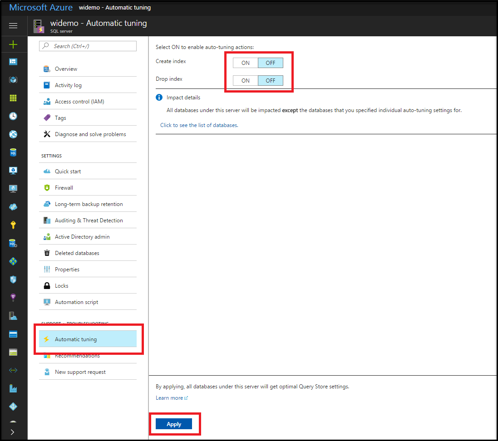

# <a name="enable-automatic-tuning"></a>启用自动优化

Azure SQL 数据库是一种自动托管的数据服务，它会不断监视查询并识别你可以执行的操作，以提高工作负荷的性能。 可以查看建议并手动应用这些建议，或者让 Azure SQL 数据库自动应用纠正措施 - 这称为**自动优化模式**。 可以在服务器或数据库级别启用自动优化。

## <a name="enable-automatic-tuning-on-server"></a>在服务器上启用自动优化
在服务器级别上，可选择从“Azure 默认值”继承自动优化配置，或选择不继承配置。 Azure 默认值启用了 FORCE_LAST_GOOD_PLAN 和 CREATE_INDEX，禁用了 DROP_INDEX。

### <a name="portal"></a>门户
若要在 Azure SQL 数据库服务器上启用自动优化，请在 Azure 门户中导航到该服务器，然后在菜单中选择“自动优化”。 选择要启用的自动优化选项，然后选择“应用”：



服务器上的自动优化选项将应用到服务器上的所有数据库。 默认情况下，所有数据库将从其父服务器继承配置，但可以针对每个数据库单独覆盖或指定此行为。

### <a name="rest-api"></a>REST API
[单击此处，详细了解如何通过 REST API 在服务器级别启用自动优化](https://docs.microsoft.com/rest/api/sql/serverautomatictuning)

## <a name="enable-automatic-tuning-on-database"></a>对数据库启用自动优化

Azure SQL 数据库支持为每个数据库单独指定自动优化配置。 在数据库级别中，可选择从“Azure 默认值”继承自动优化配置，或选择不继承配置。 Azure 默认值启用了 FORCE_LAST_GOOD_PLAN 和 CREATE_INDEX，禁用了 DROP_INDEX。

> [!NOTE]
> 一般的建议是在服务器级别管理自动优化配置，以便可以在每个数据库上自动应用相同的配置设置。 如果某个数据库与同一服务器上的其他数据库不同，请在该数据库中单独配置自动优化。
>

### <a name="portal"></a>门户

若要在单个数据库中启用自动优化，请在 Azure 门户中导航到该数据库，然后选择“自动优化”。 通过选中该选项，可将单个数据库配置为从服务器继承设置，或者可以单独为数据库指定配置。


选择相应的配置后，请单击“应用”。

### <a name="rest-api"></a>REST API
[单击此处，详细了解如何通过 REST API 在单个数据库上启用自动优化](https://docs.microsoft.com/rest/api/sql/databaseautomatictuning)

### <a name="t-sql"></a>T-SQL

要通过 T-SQL 在单个数据库上启用自动优化，请连接至数据库，并执行以下查询：

   ```T-SQL
   ALTER DATABASE current SET AUTOMATIC_TUNING = AUTO | INHERIT | CUSTOM
   ```
   
将自动优化设置为 AUTO 时，会应用 Azure 默认值。 将其设置为 INHERIT 时，会从父服务器继承自动优化配置。 选择 CUSTOM 时，需手动配置自动优化。

要通过 T-SQL 配置单个自动优化选项，请连接至数据库并执行如下所示的查询：

   ```T-SQL
   ALTER DATABASE current SET AUTOMATIC_TUNING (FORCE_LAST_GOOD_PLAN = ON, CREATE_INDEX = DEFAULT, DROP_INDEX = OFF)
   ```
   
将单个自动优化选项设置为 ON 时，数据库所继承的任何设置都将被替代，并会启用优化选项。 将其设置为 OFF 时，数据库所继承的任何设置亦将被替代，并会禁用优化选项。 自动优化选项（指定为 DEFAULT）将从数据库级别自动优化设置中继承配置。  

## <a name="disabled-by-the-system"></a>已被系统禁用
自动优化监视着自身在数据库上进行的一切操作，在某些情况下，它可以判断自身在数据库中无法正常运行。 在此情况下，系统将禁用自动优化。 造成此情况的主要原因是未启用查询数据存储，或在指定数据库中查询数据存储处于只读状态。

## <a name="next-steps"></a>后续步骤
* 请参阅[自动优化文章](sql-database-automatic-tuning.md)，详细了解自动优化以及如何借助它来提高性能。
* 请参阅[性能建议](sql-database-advisor.md)，获取 Azure SQL 数据库性能建议的概述。
* 请参阅[查询性能见解](sql-database-query-performance.md)，了解排名靠前的查询的性能影响。
<!--Update_Description:wording update-->