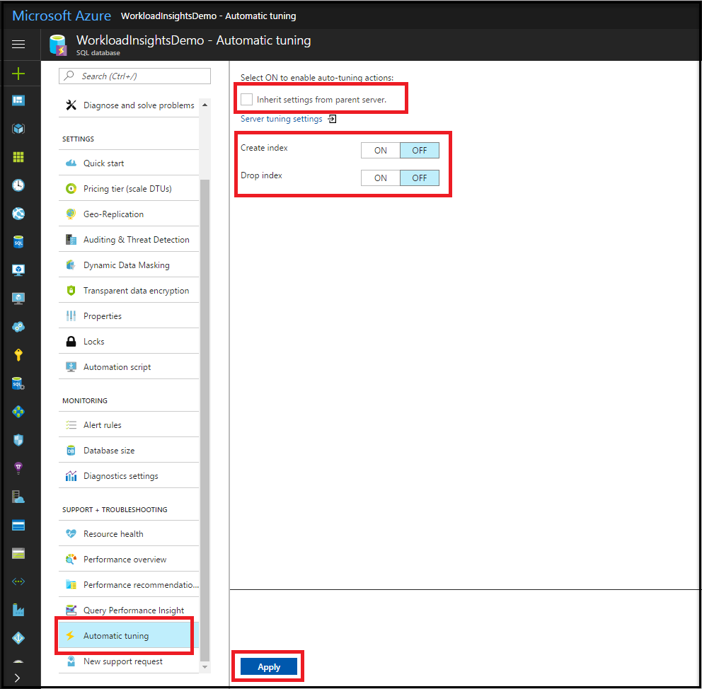

# 启用自动优化

Azure SQL 数据库是一种自动托管的数据服务，它会不断监视查询并识别你可以执行的操作，以提高工作负荷的性能。 可以查看建议并手动应用这些建议，或者让 Azure SQL 数据库自动应用纠正措施 - 这称为**自动优化模式**。 可以在服务器或数据库级别启用自动优化。

## 在服务器上启用自动优化

若要在 Azure SQL 数据库服务器上启用自动优化，请在 Azure 门户中导航到该服务器，然后在菜单中选择“自动优化”。 选择要启用的自动优化选项，然后选择“应用”：

服务器上的自动优化选项将应用到服务器上的所有数据库。 默认情况下，所有数据库将从其父服务器继承配置，但可以针对每个数据库单独覆盖或指定此行为。

## 在数据库上配置自动调优

使用 Azure 门户可以单独在每个数据库中指定自动优化配置。

> [!NOTE]
> 一般的建议是在服务器级别管理自动优化配置，以便可以在每个数据库上自动应用相同的配置设置。 如果某个数据库与同一服务器上的其他数据库不同，请在该数据库中单独配置自动优化。
>

若要在单个数据库中启用自动优化，请在 Azure 门户中导航到该数据库，然后选择“自动优化”。 可以通过选中相应的复选框将单个数据库配置为从父数据库继承设置，或者单独为某个数据库指定配置。

选择相应的配置后，请单击“应用”。

## 后续步骤
* 请参阅[自动优化文章](sql-database-automatic-tuning.md)，详细了解自动优化以及如何借助它来提高性能。
* 请参阅[性能建议](sql-database-advisor.md)，获取 Azure SQL 数据库性能建议的概述。
* 请参阅[查询性能见解](sql-database-query-performance.md)，了解排名靠前的查询的性能影响。