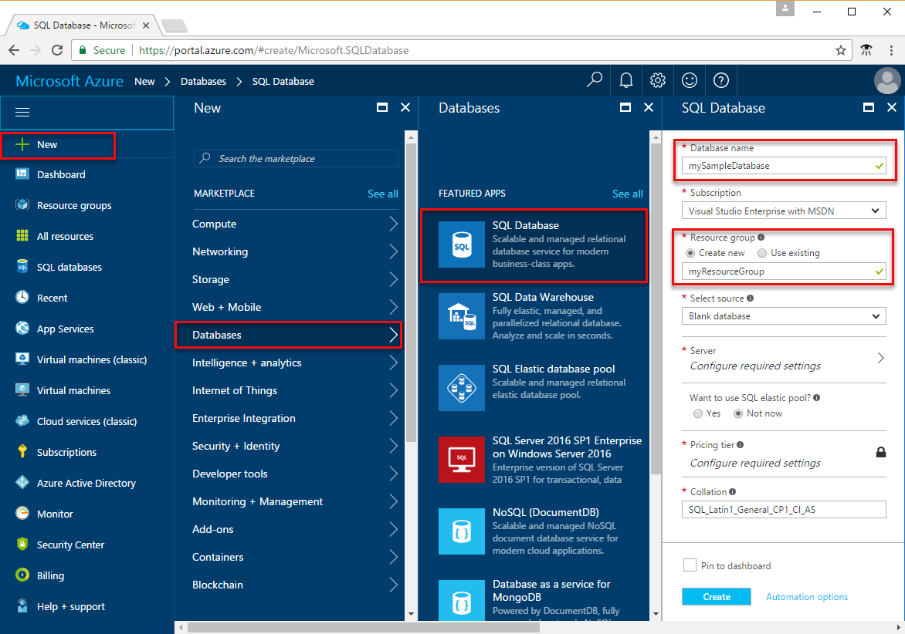
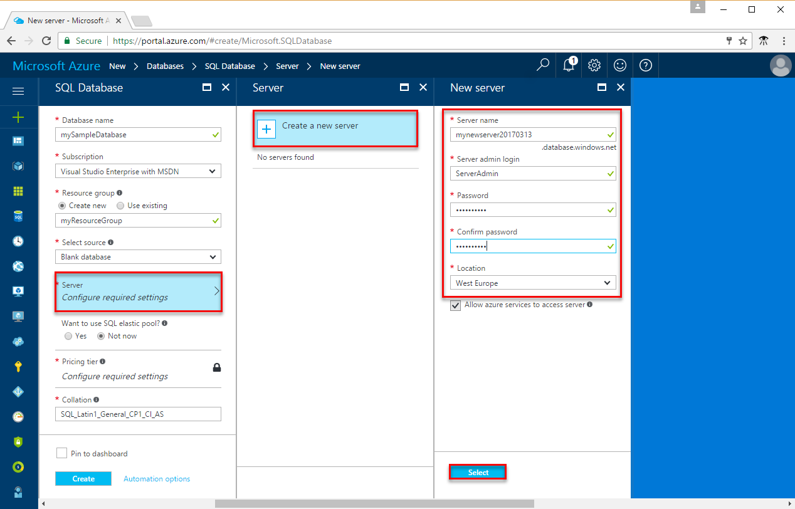
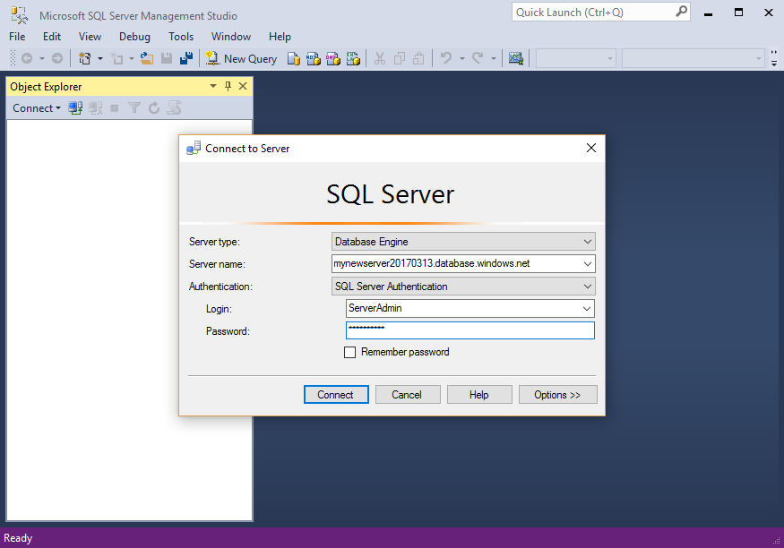
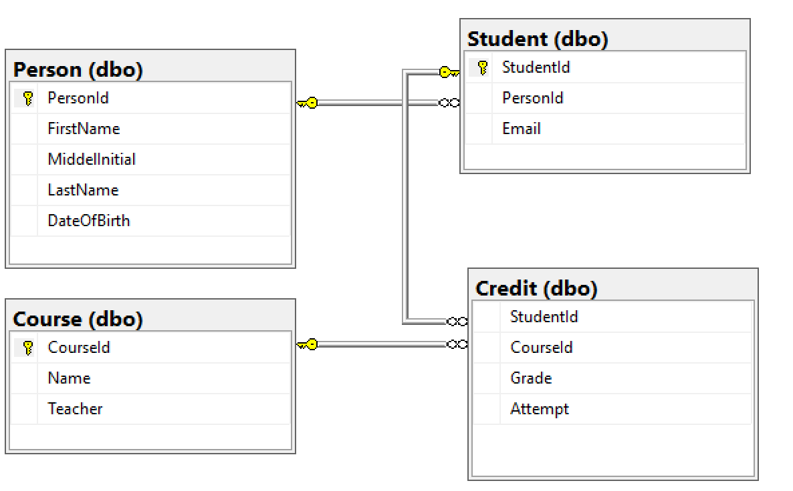
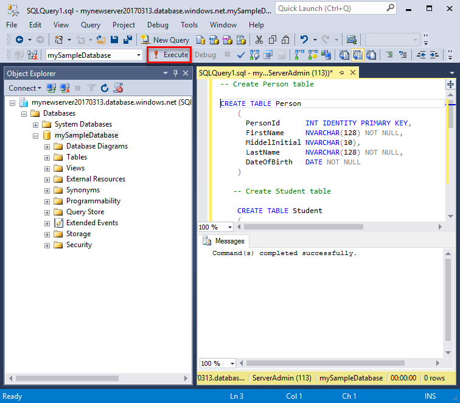
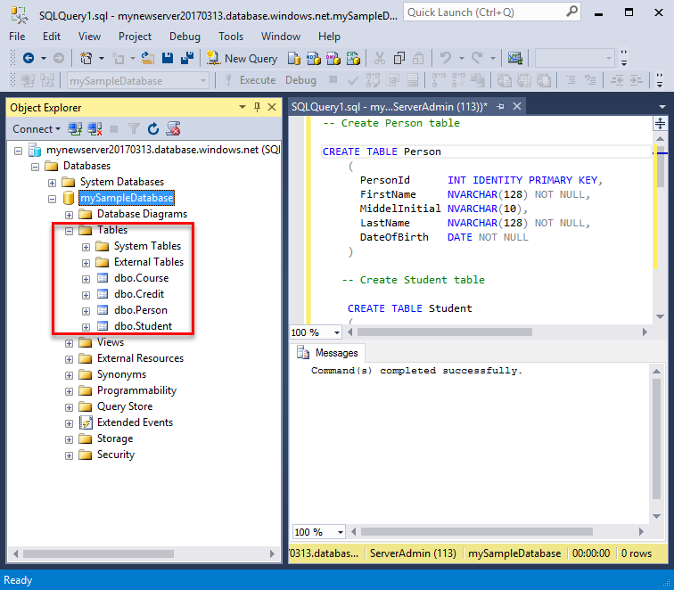

# <a name="design-your-first-azure-sql-database"></a>设计第一个 Azure SQL 数据库

Azure SQL 数据库是 Microsoft 云（“Azure”）中的关系数据库即服务 (DBaaS)。 本教程介绍如何使用 Azure 门户和 [SQL Server Management Studio](https://msdn.microsoft.com/library/ms174173.aspx) (SSMS) 执行以下操作： 

> [!div class="checklist"]
> * 在 Azure 门户中创建数据库
> * 在 Azure 门户中设置服务器级防火墙规则
> * 使用 SSMS 连接到数据库
> * 使用 SSMS 创建表
> * 使用 BCP 大容量加载数据
> * 使用 SSMS 查询这些数据
> * 在 Azure 门户中将数据库还原到之前的[时间点还原](sql-database-recovery-using-backups.md#point-in-time-restore)

如果没有 Azure 订阅，请在开始前[创建一个试用帐户](https://www.azure.cn/pricing/1rmb-trial/)。

## <a name="prerequisites"></a>先决条件

若要完成本教程，请确保已安装：
- 最新版本的 [SQL Server Management Studio](https://msdn.microsoft.com/library/ms174173.aspx) (SSMS)。
- 最新版本的 [BCP 和 SQLCMD](https://www.microsoft.com/download/details.aspx?id=36433)。

## <a name="log-in-to-the-azure-portal"></a>登录到 Azure 门户

登录到 [Azure 门户](https://portal.azure.cn/)。

## <a name="create-a-blank-sql-database"></a>创建空的 SQL 数据库

创建 Azure SQL 数据库时，会使用定义好的一组[计算和存储资源](sql-database-service-tiers.md)。 数据库在 [Azure 资源组](../azure-resource-manager/resource-group-overview.md)和 [Azure SQL 数据库逻辑服务器](sql-database-features.md)中创建。 

按照以下步骤创建空的 SQL 数据库。 

1. 单击 Azure 门户左上角的“新建”按钮。

2. 从“新建”页中选择“数据库”，然后从“新建”页的“SQL 数据库”中选择“创建”。

    

3. 如上图所示，在“SQL 数据库”窗体中填写以下信息：   

   | 设置       | 建议的值 | 说明 | 
   | ------------ | ------------------ | ------------------------------------------------- | 
   | **数据库名称** | mySampleDatabase | 有关有效的数据库名称，请参阅 [Database Identifiers](https://docs.microsoft.com/sql/relational-databases/databases/database-identifiers)（数据库标识符）。 | 
   | **订阅** | 你的订阅  | 有关订阅的详细信息，请参阅[订阅](https://account.windowsazure.cn/Subscriptions)。 |
   | **资源组** | MyResourceGroup | 有关有效的资源组名称，请参阅 [Naming rules and restrictions](https://docs.microsoft.com/azure/architecture/best-practices/naming-conventions)（命名规则和限制）。 |
   | **选择源** | 空白数据库 | 指定应创建空白数据库。 |

4. 单击“服务器”，为新数据库创建并配置新服务器。 使用以下信息填写“新建服务器”窗体： 

   | 设置       | 建议的值 | 说明 | 
   | ------------ | ------------------ | ------------------------------------------------- | 
   | **服务器名称** | 任何全局唯一名称 | 如需有效的服务器名称，请参阅 [Naming rules and restrictions](https://docs.microsoft.com/azure/architecture/best-practices/naming-conventions)（命名规则和限制）。 | 
   | 服务器管理员登录名 | 任何有效的名称 | 如需有效的登录名，请参阅 [Database Identifiers](https://docs.microsoft.com/sql/relational-databases/databases/database-identifiers)（数据库标识符）。|
   | **密码** | 任何有效的密码 | 密码必须至少有八个字符，且必须包含以下类别中的三个类别的字符：大写字符、小写字符、数字以及非字母数字字符。 |
   | **位置** | 任何有效的位置 | 中国东部和中国北部 |

    
    
5. 单击“选择”。

6. 单击“定价层”，指定服务层、DTU 数和存储量。 浏览相关选项，了解适用于每个服务层的 DTU 数和存储量。 

7. 对于本教程，请选择“标准”服务层，然后使用滑块选择“100 DTU (S3)”和“400”GB 存储。

    

8. 若要使用“附加存储”选项，请接受预览版条款。 

   > [!IMPORTANT]
   > \* 超出所包括存储量的存储大小为预览版，需额外付费。 有关详细信息，请参阅 [SQL 数据库定价](https://www.azure.cn/pricing/details/sql-database/)。 
   >

9. 选择服务器层、DTU 数和存储量后，单击“应用”。  

10. 选择空白数据库的“排序规则”（就本教程来说，请使用默认值）。 有关排序规则的详细信息，请参阅 [Collations](https://docs.microsoft.com/sql/t-sql/statements/collations)（排序规则）

11. 完成 SQL 数据库表单后，即可单击“创建”对数据库进行预配。 预配需要数分钟。 

12. 在工具栏上，单击“通知”可监视部署过程。

    

## <a name="create-a-server-level-firewall-rule"></a>创建服务器级防火墙规则

SQL 数据库服务在服务器级别创建一个防火墙。除非创建了防火墙规则来为特定的 IP 地址打开防火墙，否则会阻止外部应用程序和工具连接到服务器或服务器上的任何数据库。 按照以下步骤为客户端 IP 地址创建 [SQL 数据库服务器级防火墙规则](sql-database-firewall-configure.md)，并只允许通过针对你的 IP 地址打开的 SQL 数据库防火墙建立外部连接。 

> [!NOTE]
> 通过端口 1433 进行的 SQL 数据库通信。 如果尝试从企业网络内部进行连接，则该网络的防火墙可能不允许经端口 1433 的出站流量。 如果是这样，则无法连接到 Azure SQL 数据库服务器，除非 IT 部门打开了端口 1433。
>

1. 部署完成后，在左侧菜单中单击“SQL 数据库”，然后在“SQL 数据库”页上单击“mySampleDatabase”。 此时会打开数据库的概览页，显示完全限定的服务器名称（例如 **mynewserver-20170824.database.chinacloudapi.cn**），并且会提供进行进一步配置所需的选项。 

2. 在后续的快速入门中，请复制此完全限定的服务器名称，将其用于连接到服务器及其数据库。 

     

3. 单击工具栏上的“设置服务器防火墙”。 此时会打开 SQL 数据库服务器的“防火墙设置”页。 

     

4. 在工具栏上单击“添加客户端 IP”，将当前的 IP 地址添加到新的防火墙规则。 防火墙规则可以针对单个 IP 地址或一系列 IP 地址打开端口 1433。

5. 单击“保存” 。 此时会针对当前的 IP 地址创建服务器级防火墙规则，在逻辑服务器上打开 端口 1433。

6. 单击“确定”，并关闭“防火墙设置”页。

现在可以使用之前创建的服务器管理员帐户通过 SQL Server Management Studio 或其他所选工具从此 IP 地址连接到 SQL 数据库服务器及其数据库。

> [!IMPORTANT]
> 默认情况下，所有 Azure 服务都允许通过 SQL 数据库防火墙进行访问。 在此页上单击“关”即可对所有 Azure 服务执行禁用操作。

## <a name="sql-server-connection-information"></a>SQL Server 连接信息

在 Azure 门户中获取 Azure SQL 数据库服务器的完全限定服务器名称。 请使用 SQL Server Management Studio 通过完全限定的服务器名称连接到服务器。

1. 登录到 [Azure 门户](https://portal.azure.cn/)。
2. 从左侧菜单中选择“SQL 数据库”，并单击“SQL 数据库”页上的数据库。 
3. 在数据库的“Azure 门户”页的“概要”窗格中，找到并复制“服务器名称”。

   

## <a name="connect-to-the-database-with-ssms"></a>使用 SSMS 连接到数据库

使用 [SQL Server Management Studio](https://docs.microsoft.com/sql/ssms/sql-server-management-studio-ssms) 建立到 Azure SQL 数据库服务器的连接。

1. 打开 SQL Server Management Studio。

2. 在“连接到服务器”对话框中，输入以下信息：

   | 设置       | 建议的值 | 说明 | 
   | ------------ | ------------------ | ------------------------------------------------- | 
   | 服务器类型 | 数据库引擎 | 此值是必需的 |
   | 服务器名称 | 完全限定的服务器名称 | 该名称应类似于：**mynewserver20170824.database.chinacloudapi.cn**。 |
   | 身份验证 | SQL Server 身份验证 | SQL 身份验证是本教程中配置的唯一身份验证类型。 |
   | 登录 | 服务器管理员帐户 | 这是在创建服务器时指定的帐户。 |
   | 密码 | 服务器管理员帐户的密码 | 这是在创建服务器时指定的密码。 |

   

3. 单击“连接到服务器”对话框中的“选项”。 在“连接到数据库”部分输入 **mySampleDatabase**，以连接到此数据库。

     

4. 单击“连接”。 此时会在 SSMS 中打开“对象资源管理器”窗口。 

5. 在对象资源管理器中展开“数据库”，然后展开 **mySampleDatabase**，查看示例数据库中的对象。

     

## <a name="create-tables-in-the-database"></a>在数据库中创建表 

使用 [Transact-SQL](https://docs.microsoft.com/sql/t-sql/language-reference) 创建具有 4 个表格的数据库架构，这些表格是大专院校的学生管理系统的模型：

- 人员
- 课程
- 学生
- 学分，用于为大专院校的学生管理系统建模

以下关系图显示了这些表的相互关系。 其中一些表引用其他表中的列。 例如，Student 表引用 **Person** 表的 **PersonId** 列。 请研究此关系图，了解本教程中各种表的相互关系。 若要深入了解如何创建有效的数据库表，请参阅 [Create effective database tables](https://msdn.microsoft.com/library/cc505842.aspx)（创建有效的数据库表）。 有关如何选择数据类型的信息，请参阅 [Data types](https://docs.microsoft.com/sql/t-sql/data-types/data-types-transact-sql)（数据类型）。

> [!NOTE]
> 还可以使用 [SQL Server Management Studio 中的表设计器](https://msdn.microsoft.com/library/hh272695.aspx)来创建和设计表。 



1. 在“对象资源管理器”中，右键单击“mySampleDatabase”，并单击“新建查询”。 此时会打开一个空白查询窗口，该窗口连接到数据库。

2. 在查询窗口中执行以下查询，在数据库中创建 4 个表： 

   ```sql 
   -- Create Person table

   CREATE TABLE Person
   (
   PersonId   INT IDENTITY PRIMARY KEY,
   FirstName   NVARCHAR(128) NOT NULL,
   MiddelInitial NVARCHAR(10),
   LastName   NVARCHAR(128) NOT NULL,
   DateOfBirth   DATE NOT NULL
   )

   -- Create Student table

   CREATE TABLE Student
   (
   StudentId INT IDENTITY PRIMARY KEY,
   PersonId  INT REFERENCES Person (PersonId),
   Email   NVARCHAR(256)
   )

   -- Create Course table

   CREATE TABLE Course
   (
   CourseId  INT IDENTITY PRIMARY KEY,
   Name   NVARCHAR(50) NOT NULL,
   Teacher   NVARCHAR(256) NOT NULL
   ) 

   -- Create Credit table

   CREATE TABLE Credit
   (
   StudentId   INT REFERENCES Student (StudentId),
   CourseId   INT REFERENCES Course (CourseId),
   Grade   DECIMAL(5,2) CHECK (Grade <= 100.00),
   Attempt   TINYINT,
   CONSTRAINT  [UQ_studentgrades] UNIQUE CLUSTERED
   (
   StudentId, CourseId, Grade, Attempt
   )
   )
   ```

   

3. 展开 SQL Server Management Studio 对象资源管理器中的“表”节点，查看所创建的表。

   

## <a name="load-data-into-the-tables"></a>将数据加载到表

1. 在“下载”文件夹中创建名为 **SampleTableData** 的文件夹，为数据库存储示例数据。 

2. 右键单击以下链接并将它们保存到 **SampleTableData** 文件夹。 

   - [SampleCourseData](https://sqldbtutorial.blob.core.windows.net/tutorials/SampleCourseData)
   - [SamplePersonData](https://sqldbtutorial.blob.core.windows.net/tutorials/SamplePersonData)
   - [SampleStudentData](https://sqldbtutorial.blob.core.windows.net/tutorials/SampleStudentData)
   - [SampleCreditData](https://sqldbtutorial.blob.core.windows.net/tutorials/SampleCreditData)

3. 打开命令提示符窗口并导航到 SampleTableData 文件夹。

4. 执行以下命令，将示例数据插入表，使用环境值替换 **ServerName**、**DatabaseName**、**UserName** 和 **Password** 的值。

   ```bcp
   bcp Course in SampleCourseData -S <ServerName>.database.chinacloudapi.cn -d <DatabaseName> -U <Username> -P <password> -q -c -t ","
   bcp Person in SamplePersonData -S <ServerName>.database.chinacloudapi.cn -d <DatabaseName> -U <Username> -P <password> -q -c -t ","
   bcp Student in SampleStudentData -S <ServerName>.database.chinacloudapi.cn -d <DatabaseName> -U <Username> -P <password> -q -c -t ","
   bcp Credit in SampleCreditData -S <ServerName>.database.chinacloudapi.cn -d <DatabaseName> -U <Username> -P <password> -q -c -t ","
   ```

现已将示例数据加载到了之前创建的表中。

## <a name="query-data"></a>查询数据

执行以下查询，从数据库表中检索信息。 有关写入 SQL 查询的详细信息，请参阅[写入 SQL 查询](https://technet.microsoft.com/library/bb264565.aspx)。 第一个查询将联接所有 4 个表，以查找由“Dominick Pope”授课的班级中分数高于 75% 的所有学生。 第二个查询将联接所有 4 个表，以查找“Noe Coleman”注册过的所有课程。

1. 在 SQL Server Management Studio 查询窗口中，执行以下查询：

   ```sql 
   -- Find the students taught by Dominick Pope who have a grade higher than 75%

   SELECT  person.FirstName,
   person.LastName,
   course.Name,
   credit.Grade
   FROM  Person AS person
   INNER JOIN Student AS student ON person.PersonId = student.PersonId
   INNER JOIN Credit AS credit ON student.StudentId = credit.StudentId
   INNER JOIN Course AS course ON credit.CourseId = course.courseId
   WHERE course.Teacher = 'Dominick Pope' 
   AND Grade > 75
   ```

2. 在 SQL Server Management Studio 查询窗口中，执行以下查询：

   ```sql
   -- Find all the courses in which Noe Coleman has ever enrolled

   SELECT  course.Name,
   course.Teacher,
   credit.Grade
   FROM  Course AS course
   INNER JOIN Credit AS credit ON credit.CourseId = course.CourseId
   INNER JOIN Student AS student ON student.StudentId = credit.StudentId
   INNER JOIN Person AS person ON person.PersonId = student.PersonId
   WHERE person.FirstName = 'Noe'
   AND person.LastName = 'Coleman'
   ```

## <a name="restore-a-database-to-a-previous-point-in-time"></a>将数据库还原到以前的时间点

假设意外删除了某个表。 这是不能轻易还原的内容。 借助 Azure SQL 数据库，可返回到最近 35 天内的任意时间点并将此时间点还原到新的数据库。 可以通过此数据库恢复已删除的数据。 以下步骤将示例数据库还原到添加这些表之前的时间点。

1. 在数据库的“SQL 数据库”页上，单击工具栏上的“还原”。 此时会打开“还原”页。

   

2. 使用必需信息填充“还原”窗体：
    * 数据库名称：提供数据库名称 
    * 时间点：选择“还原”窗体上的“时间点”选项卡 
    * 还原点：选择更改数据库前的时间
    * 目标服务器：还原数据库时不能更改此值 
    * 弹性数据库池：选择“无”  
    * 定价层：选择“20 个 DTU”和“40 GB”的存储。

   

3. 单击“确定”，将数据库[还原到添加这些表之前的时间点](sql-database-recovery-using-backups.md#point-in-time-restore)。 只要数据库在[服务层](sql-database-service-tiers.md)的保留期限内，将数据库还原到不同的时间点就会在与原始数据库相同的服务器中创建一个重复的数据库（到指定的时间点为止）。

## <a name="next-steps"></a>后续步骤 
本教程介绍了基本数据库任务，例如创建数据库和表、负载和查询数据，以及将数据库还原到以前的时间点。 你已了解如何：
> [!div class="checklist"]
> * 创建数据库
> * 设置防火墙规则
> * 使用 [SQL Server Management Studio](https://msdn.microsoft.com/library/ms174173.aspx) (SSMS) 连接到该数据库
> * 创建表
> * 批量加载数据
> * 查询该数据
> * 使用 SQL 数据库的[时间点还原](sql-database-recovery-using-backups.md#point-in-time-restore)功能将数据库还原到上一个时间点

转向下一教程，了解如何使用 Visual Studio 和 C# 设计数据库。

> [!div class="nextstepaction"]
>[设计 Azure SQL 数据库，并使用 C# 和 ADO.NET 进行连接](sql-database-design-first-database-csharp.md)
