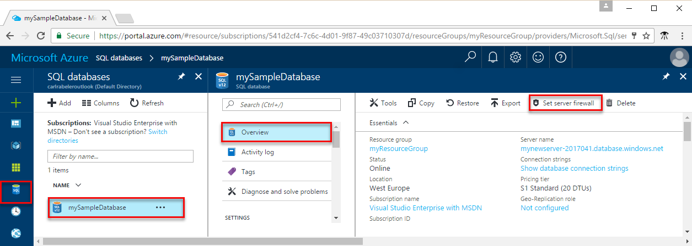

# 使用 Azure 门户为 SQL 数据库创建服务器级防火墙规则

本快速入门介绍如何为 Azure SQL 数据库创建服务器级防火墙规则，使你能够从本地资源连接到该数据库。

## 先决条件

本快速入门从以下快速入门中创建的资源着手：[在 Azure 门户中创建 Azure SQL 数据库](sql-database-get-started-portal.md)

## 登录到 Azure 门户

登录到 [Azure 门户](https://portal.azure.cn/)。

## 创建服务器级防火墙规则

SQL 数据库服务在服务器级别创建一个防火墙。除非创建了防火墙规则来打开防火墙，否则该防火墙会阻止应用程序和工具连接到服务器或服务器上的任何数据库。 对于来自 Azure 外部的 IP 地址的连接，请为特定 IP 地址或地址范围创建防火墙规则。 按照以下步骤为客户端 IP 地址创建 [SQL 数据库服务器级防火墙规则](sql-database-firewall-configure.md)，只允许通过 SQL 数据库防火墙进行外部连接，而该防火墙只对 IP 地址开放。

> [!NOTE]
> 通过端口 1433 进行的 SQL 数据库通信。 如果尝试从企业网络内部进行连接，则该网络的防火墙可能不允许经端口 1433 的出站流量。 如果是这样，则无法连接到 Azure SQL 数据库服务器，除非 IT 部门打开了端口 1433。
>

1. 部署完成后，在左侧菜单中单击“SQL 数据库”，然后在“SQL 数据库”页上单击“mySampleDatabase”。 此时会打开数据库的概览页，显示完全限定的服务器名称（例如 **mynewserver-20170824.database.chinacloudapi.cn**），并且会提供进行进一步配置所需的选项。

2. 在后续的快速入门中，请复制此完全限定的服务器名称，将其用于连接到服务器及其数据库。

   

3. 如上图所示，在工具栏上单击“设置服务器防火墙”。 此时会打开 SQL 数据库服务器的“防火墙设置”页。

   

4. 在工具栏上单击“添加客户端 IP”，将当前的 IP 地址添加到新的防火墙规则。 防火墙规则可以针对单个 IP 地址或一系列 IP 地址打开端口 1433。

5. 单击“保存”。 此时会针对当前的 IP 地址创建服务器级防火墙规则，在逻辑服务器上打开 端口 1433。

6. 单击“确定”，并关闭“防火墙设置”页。

现在可以使用之前创建的服务器管理员帐户通过 SQL Server Management Studio 或其他所选工具从此 IP 地址连接到 SQL 数据库服务器及其数据库。

> [!IMPORTANT]
> 默认情况下，所有 Azure 服务都允许通过 SQL 数据库防火墙进行访问。 在此页上单击“关”即可对所有 Azure 服务执行禁用操作。
>

## 清理资源

若要转到[后续步骤](#next-steps)，以便了解如何使用多种不同的方法连接和查询数据库，请保存这些资源。 但如果希望删除在本快速入门中创建的资源，请执行以下步骤。

1. 在 Azure 门户的左侧菜单中，单击“资源组”，然后单击“myResourceGroup”。
2. 在资源组页上单击“删除”，在文本框中键入 **myResourceGroup**，然后单击“删除”。

## 后续步骤

- 有了数据库以后，即可使用一种偏好的工具或语言进行[连接和查询](sql-database-connect-query.md)，包括
  - [使用 SQL Server Management Studio 连接和查询](sql-database-connect-query-ssms.md)
  - [使用 Azure Data Studio 连接和查询](https://docs.microsoft.com/sql/azure-data-studio/quickstart-sql-database?toc=/azure/sql-database/toc.json)
- 若要了解如何设计第一个数据库、创建表和插入数据，请参阅以下教程之一：
 - [使用 SSMS 设计第一个 Azure SQL 数据库](sql-database-design-first-database.md)
 - [设计 Azure SQL 数据库，并使用 C# 和 ADO.NET 进行连接](sql-database-design-first-database-csharp.md)
