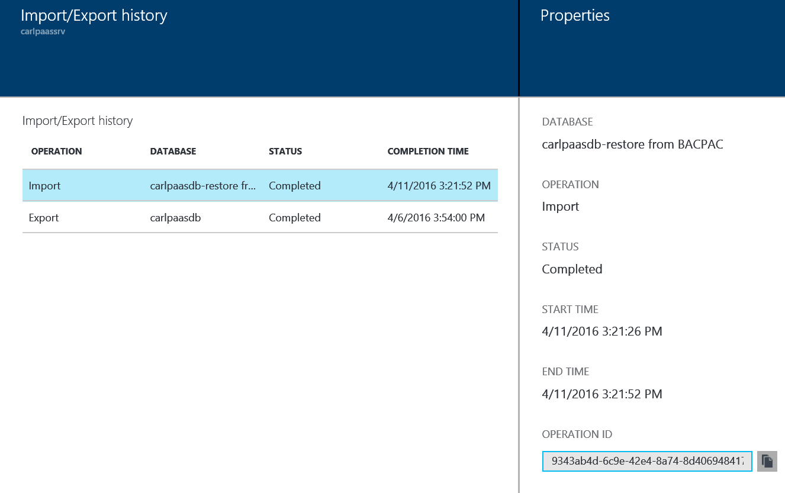

# <a name="import-a-bacpac-file-to-a-new-azure-sql-database"></a>将 BACPAC 文件导入到新的 Azure SQL 数据库

当需要从存档中导入数据库或从另一个平台进行迁移时，可以从 [BACPAC](https://msdn.microsoft.com/library/ee210546.aspx#Anchor_4) 文件导入数据库架构和数据。 BACPAC 文件是一个扩展名为 BACPAC 的 ZIP 文件，它包含来自 SQL Server 数据库的元数据和数据。 可以从 Azure Blob 存储（仅限标准存储）或本地位置中的本地存储导入 BACPAC 文件。 如果要最大程度提高导入速度，建议指定较高的服务层和性能级别（例如 P6），并在成功导入后根据需要向下缩放。 此外，导入后的数据库兼容性级别基于源数据库的兼容性级别。 

> [!IMPORTANT] 
> 将数据库迁移到 Azure SQL 数据库后，可以选择在数据库当前的兼容性级别（对于 AdventureWorks2008R2 数据库为级别 100）或更高的级别运行数据库。 有关在特定兼容级别操作数据库的影响和选项的详细信息，请参阅 [ALTER DATABASE Compatibility Level](https://docs.microsoft.com/sql/t-sql/statements/alter-database-transact-sql-compatibility-level)（更改数据库兼容级别）。 有关与兼容级别相关的其他数据库级别设置的信息，另请参阅 [ALTER DATABASE SCOPED CONFIGURATION](https://docs.microsoft.com/sql/t-sql/statements/alter-database-scoped-configuration-transact-sql)（更改数据库范围的配置）。   >

> [!NOTE]
> 要将 BACPAC 导入到新的数据库，首先必须创建一个 Azure SQL 数据库逻辑服务器。 有关演示如何使用 SQLPackage 将 SQL Server 数据库迁移到 Azure SQL 数据库的教程，请参阅[迁移 SQL Server 数据库](sql-database-migrate-your-sql-server-database.md)
>

## <a name="import-from-a-bacpac-file-using-azure-portal"></a>使用 Azure 门户从 BACPAC 文件导入

本文介绍如何使用 [Azure 门户](https://portal.azure.cn)根据存于 Azure blob 存储中的 BACPAC 文件创建 Azure SQL 数据库。 使用 Azure 门户进行的导入操作仅支持从 Azure blob 存储导入 BACPAC 文件。

若要使用 Azure 门户导入数据库，请打开数据库要关联到的服务器的页面，然后在工具栏上单击“导入”。 指定存储帐户和容器，并选择要导入的 BACPAC 文件。 选择新数据库的大小（通常与源数据库相同）并提供目标 SQL Server 凭据。  

   

若要监视导入操作的进度，请打开包含待导入数据库的逻辑服务器的相应页面。 向下滚动到“操作”，并单击“导入/导出”历史记录。

### <a name="monitor-the-progress-of-an-import-operation"></a>监视导入操作的进度

若要监视导入操作的进度，请打开数据库要导入到其中的逻辑服务器的相应页面。 向下滚动到“操作”，并单击“导入/导出”历史记录。

   

若要验证数据库在服务器上是否处于活动状态，请单击“SQL 数据库”并验证新数据库是否“联机”。

## <a name="import-from-a-bacpac-file-using-sqlpackage"></a>使用 SQLPackage 从 BACPAC 文件导入

若要使用 [SqlPackage](https://msdn.microsoft.com/library/hh550080.aspx) 命令行实用工具导入 SQL 数据库，请参阅[导入参数和属性](https://msdn.microsoft.com/library/hh550080.aspx#Import Parameters and Properties)。 可以使用 SQLPackage 实用工具附带的最新版本的 [SQL Server Management Studio](https://msdn.microsoft.com/library/mt238290.aspx) 和 [SQL Server Data Tools for Visual Studio](https://msdn.microsoft.com/library/mt204009.aspx)，也可以直接从 Microsoft 下载中心下载最新版本的 [SqlPackage](https://www.microsoft.com/download/details.aspx?id=53876)。

在大多数生产环境中，建议使用 SQLPackage 实用工具来实现缩放和性能。 如需 SQL Server 客户顾问团队编写的有关使用 BACPAC 文件进行迁移的博客，请参阅 [Migrating from SQL Server to Azure SQL Database using BACPAC Files](https://blogs.msdn.microsoft.com/sqlcat/2016/10/20/migrating-from-sql-server-to-azure-sql-database-using-bacpac-files/)（使用 BACPAC 文件从 SQL Server 迁移到 Azure SQL 数据库）。

请参阅脚本示例中的以下 SQLPackage 命令，了解如何将 AdventureWorks2008R2 数据库从本地存储导入到 Azure SQL 数据库逻辑服务器（此示例中名为 mynewserver20170403）。 此脚本演示如何创建名为 **myMigratedDatabase** 的新数据库，该数据库的服务层为“高级”，服务目标为“P6”。 根据环境更改这些值。

```cmd
SqlPackage.exe /a:import /tcs:"Data Source=mynewserver20170403.database.chinacloudapi.cn;Initial Catalog=myMigratedDatabase;User Id=ServerAdmin;Password=<change_to_your_password>" /sf:AdventureWorks2008R2.bacpac /p:DatabaseEdition=Premium /p:DatabaseServiceObjective=P6
```

> [!IMPORTANT]
> Azure SQL 数据库逻辑服务器在端口 1433 上进行侦听。 如果尝试在企业防火墙内连接到 Azure SQL 数据库逻辑服务器，则必须在企业防火墙中打开此端口，否则无法成功进行连接。
>

此示例演示如何通过 Active Directory 通用身份验证，使用 SqlPackage.exe 来导入数据库：

```cmd
SqlPackage.exe /a:Import /sf:testExport.bacpac /tdn:NewDacFX /tsn:apptestserver.database.chinacloudapi.cn /ua:True /tid:"apptest.partner.onmschina.cn"
```

## <a name="import-from-a-bacpac-file-using-powershell"></a>使用 PowerShell 从 BACPAC 文件导入

使用 [New-AzureRmSqlDatabaseImport](https://docs.microsoft.com/powershell/module/azurerm.sql/new-azurermsqldatabaseimport) cmdlet 向 Azure SQL 数据库服务提交导入数据库请求。 根据数据库的大小，导入操作可能需要一些时间才能完成。

 ```powershell
 $importRequest = New-AzureRmSqlDatabaseImport -ResourceGroupName "myResourceGroup" `
    -ServerName $servername `
    -DatabaseName "MyImportSample" `
    -DatabaseMaxSizeBytes "262144000" `
    -StorageKeyType "StorageAccessKey" `
    -StorageKey $(Get-AzureRmStorageAccountKey -ResourceGroupName "myResourceGroup" -StorageAccountName $storageaccountname).Value[0] `
    -StorageUri "http://$storageaccountname.blob.core.chinacloudapi.cn/importsample/sample.bacpac" `
    -Edition "Standard" `
    -ServiceObjectiveName "P6" `
    -AdministratorLogin "ServerAdmin" `
    -AdministratorLoginPassword $(ConvertTo-SecureString -String "ASecureP@assw0rd" -AsPlainText -Force)

 ```

若要检查导入请求的状态，请使用 [Get-AzureRmSqlDatabaseImportExportStatus](https://docs.microsoft.com/powershell/module/azurerm.sql/get-azurermsqldatabaseimportexportstatus) cmdlet。 如果在提交请求后立即运行此命令，通常会返回“状态: 正在进行”。 显示“状态: 成功”时，表示导入完毕。

```powershell
$importStatus = Get-AzureRmSqlDatabaseImportExportStatus -OperationStatusLink $importRequest.OperationStatusLink
[Console]::Write("Importing")
while ($importStatus.Status -eq "InProgress")
{
    $importStatus = Get-AzureRmSqlDatabaseImportExportStatus -OperationStatusLink $importRequest.OperationStatusLink
    [Console]::Write(".")
    Start-Sleep -s 10
}
[Console]::WriteLine("")
$importStatus
```

> [!TIP]
有关另一个脚本示例，请参阅[从 BACPAC 文件导入数据库](scripts/sql-database-import-from-bacpac-powershell.md)。

## <a name="next-steps"></a>后续步骤
* 若要了解如何连接到导入的 SQL 数据库并对其进行查询，请参阅[使用 SQL Server Management Studio 连接到 SQL 数据库并执行示例 T-SQL 查询](sql-database-connect-query-ssms.md)。
* 如需 SQL Server 客户顾问团队编写的有关使用 BACPAC 文件进行迁移的博客，请参阅 [Migrating from SQL Server to Azure SQL Database using BACPAC Files](https://blogs.msdn.microsoft.com/sqlcat/2016/10/20/migrating-from-sql-server-to-azure-sql-database-using-bacpac-files/)（使用 BACPAC 文件从 SQL Server 迁移到 Azure SQL 数据库）。
* 有关对于整个 SQL Server 数据库迁移进程（包括性能建议）的讨论，请参阅[将 SQL Server 数据库迁移到 Azure SQL 数据库](sql-database-cloud-migrate.md)。
