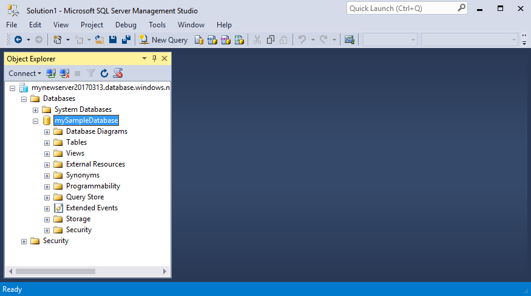

# <a name="migrate-your-sql-server-database-to-azure-sql-database-using-dma"></a>使用 DMA 将 SQL Server 数据库迁移到 Azure SQL 数据库

将 SQL Server 数据库移至 Azure SQL 数据库的单个数据库，与在 Azure 中创建空 SQL 数据库然后使用[数据迁移助手](https://www.microsoft.com/download/details.aspx?id=53595) (DMA) 将数据库导入到 Azure 一样简单。 有关其他迁移选项，请参阅[将数据库迁移到 Azure SQL 数据库](sql-database-cloud-migrate.md)。

> [!IMPORTANT]
> 若要迁移到 Azure SQL 数据库托管实例，请参阅[从 SQL Server 迁移到托管实例](sql-database-managed-instance-migrate.md)

本教程介绍以下内容：

> [!div class="checklist"]
> * 在 Azure 门户中创建空 Azure SQL 数据库（使用新的或现有的 Azure SQL 数据库服务器）
> * 在 Azure 门户中创建服务器级防火墙（如果之前未创建）
> * 使用 [Data Migration Assistant](https://www.microsoft.com/download/details.aspx?id=53595) (DMA) 将 SQL Server 数据库导入空 Azure SQL 数据库 
> * 使用 [SQL Server Management Studio](https://docs.microsoft.com/sql/ssms/download-sql-server-management-studio-ssms) (SSMS) 更改数据库属性。

如果没有 Azure 订阅，可在开始前[创建一个 1 元试用帐户](https://www.azure.cn/pricing/1rmb-trial/)。

## <a name="prerequisites"></a>先决条件

若要完成本教程，请确保已完成了以下先决条件：

- 已安装最新版 [SQL Server Management Studio](https://docs.microsoft.com/sql/ssms/download-sql-server-management-studio-ssms) (SSMS)。  
- 安装最新版本的 [Data Migration Assistant](https://www.microsoft.com/download/details.aspx?id=53595) (DMA)。
- 已被识别并有权访问要迁移的数据库。 本教程在 SQL Server 2008R2 或更高版本的实例上使用 [SQL Server 2008R2 AdventureWorks OLTP 数据库](https://msftdbprodsamples.codeplex.com/releases/view/59211)，但可以使用所选的任何数据库。 若要解决兼容性问题，请使用 [SQL Server Data Tools](https://docs.microsoft.com/sql/ssdt/download-sql-server-data-tools-ssdt)

## <a name="log-in-to-the-azure-portal"></a>登录到 Azure 门户

登录到 [Azure 门户](https://portal.azure.cn/)。

## <a name="create-a-blank-sql-database"></a>创建空的 SQL 数据库

创建 Azure SQL 数据库时，会使用定义好的一组[计算和存储资源](sql-database-service-tiers-dtu.md)。 数据库在 [Azure 资源组](../azure-resource-manager/resource-group-overview.md)和 [Azure SQL 数据库逻辑服务器](sql-database-features.md)中创建。 

按照以下步骤创建空的 SQL 数据库。 

1. 在 Azure 门户的左上角单击“创建资源”。

2. 从“新建”页中选择“数据库”，然后从“新建”页的“SQL 数据库”中选择“创建”。

   

3. 如上图所示，在“SQL 数据库”窗体中填写以下信息：   

   | 设置       | 建议的值 | 说明 | 
   | ------------ | ------------------ | ------------------------------------------------- | 
   | **数据库名称** | mySampleDatabase | 有关有效的数据库名称，请参阅 [Database Identifiers](https://docs.microsoft.com/sql/relational-databases/databases/database-identifiers)（数据库标识符）。 | 
   | **订阅** | 你的订阅  | 有关订阅的详细信息，请参阅[订阅](https://account.windowsazure.cn/Subscriptions)。 |
   | **资源组** | MyResourceGroup | 有关有效的资源组名称，请参阅 [Naming rules and restrictions](https://docs.microsoft.com/azure/architecture/best-practices/naming-conventions)（命名规则和限制）。 |
   | **选择源** | 空白数据库 | 指定应创建空白数据库。 |

4. 单击“服务器”，为新数据库创建并配置新服务器。 使用以下信息填写“新建服务器”窗体： 

   | 设置       | 建议的值 | 说明 | 
   | ------------ | ------------------ | ------------------------------------------------- | 
   | **服务器名称** | 任何全局唯一名称 | 如需有效的服务器名称，请参阅 [Naming rules and restrictions](https://docs.microsoft.com/azure/architecture/best-practices/naming-conventions)（命名规则和限制）。 | 
   | 服务器管理员登录名 | 任何有效的名称 | 有关有效的登录名，请参阅 [Database Identifiers](https://docs.microsoft.com/sql/relational-databases/databases/database-identifiers)（数据库标识符）。|
   | **密码** | 任何有效的密码 | 密码必须至少有八个字符，且必须包含以下类别中的三个类别的字符：大写字符、小写字符、数字以及非字母数字字符。 |
   | **位置** | 任何有效的位置 | 中国东部、中国东部 2、中国北部、中国北部 2 |

   

5. 单击“选择”。

6. 单击“定价层”，指定服务层、DTU 数和存储量。 浏览相关选项，了解适用于每个服务层的 DTU 数和存储量。 

7. 对于本教程，请选择“标准”服务层，然后使用滑块选择“100 DTU (S3)”和“400”GB 存储。

   

8. 若要使用“附加存储”选项，请接受预览版条款。 

   > [!IMPORTANT]
   > \* 超出所包括存储量的存储大小为预览版，需额外付费。 有关详细信息，请参阅 [SQL 数据库定价](https://www.azure.cn/pricing/details/sql-database/)。 
   >

9. 选择服务器层、DTU 数和存储量后，单击“应用”。  

10. 选择空白数据库的“排序规则”（就本教程来说，请使用默认值）。 有关排序规则的详细信息，请参阅 [Collations](https://docs.microsoft.com/sql/t-sql/statements/collations)（排序规则）

11. 完成 SQL 数据库表单后，即可单击“创建”对数据库进行预配。 预配需要数分钟。 

12. 在工具栏上，单击“通知”可监视部署过程。
    
     

## <a name="create-a-server-level-firewall-rule"></a>创建服务器级防火墙规则

SQL 数据库服务在服务器级别创建一个防火墙。除非创建了防火墙规则来为特定的 IP 地址打开防火墙，否则会阻止外部应用程序和工具连接到服务器或服务器上的任何数据库。 按照以下步骤为客户端 IP 地址创建 [SQL 数据库服务器级防火墙规则](sql-database-firewall-configure.md)，并只允许通过针对你的 IP 地址打开的 SQL 数据库防火墙建立外部连接。 

> [!NOTE]
> 通过端口 1433 进行的 SQL 数据库通信。 如果尝试从企业网络内部进行连接，则该网络的防火墙可能不允许经端口 1433 的出站流量。 如果是这样，则无法连接到 Azure SQL 数据库服务器，除非 IT 部门打开了端口 1433。
>

1. 部署完成后，在左侧菜单中单击“SQL 数据库”，然后在“SQL 数据库”页上单击“mySampleDatabase”。 此时会打开数据库的概览页，显示完全限定的服务器名称（例如 **mynewserver-20170824.database.chinacloudapi.cn**），并且会提供进行进一步配置所需的选项。 

2. 在后续的快速入门中，请复制此完全限定的服务器名称，将其用于连接到服务器及其数据库。 

    

3. 单击工具栏上的“设置服务器防火墙”。 此时会打开 SQL 数据库服务器的“防火墙设置”页。 

    

4. 在工具栏上单击“添加客户端 IP”，将当前的 IP 地址添加到新的防火墙规则。 防火墙规则可以针对单个 IP 地址或一系列 IP 地址打开端口 1433。

5. 单击“保存” 。 此时会针对当前的 IP 地址创建服务器级防火墙规则，在逻辑服务器上打开 端口 1433。

6. 单击“确定”，然后关闭“防火墙设置”页。

现在可使用之前步骤中创建的服务器管理员帐户，通过使用 SQL Server Management Studio、Data Migration Assistant，或所选的任意其他工具从此 IP 地址连接到 SQL 数据库服务器及其数据库。

> [!IMPORTANT]
> 默认情况下，所有 Azure 服务都允许通过 SQL 数据库防火墙进行访问。 在此页上单击“关”即可对所有 Azure 服务执行禁用操作。

## <a name="sql-server-connection-information"></a>SQL Server 连接信息

在 Azure 门户中获取 Azure SQL 数据库服务器的完全限定服务器名称。 使用完全限定的服务器名，并使用客户端工具（包括 Data Migration Assistance 和 SQL Server Management Studio）连接到 Azure SQL 服务器。

1. 登录到 [Azure 门户](https://portal.azure.cn/)。
2. 从左侧菜单中选择“SQL 数据库”，并单击“SQL 数据库”页上的数据库。 
3. 在数据库的“Azure 门户”页的“概要”窗格中，找到并复制“服务器名称”。

   

## <a name="migrate-your-database"></a>迁移数据库

按照以下步骤使用 [Data Migration Assistant](https://www.microsoft.com/download/details.aspx?id=53595) 来评估数据库迁移到 Azure SQL 数据库的准备情况，并完成迁移。

1. 打开 **Data Migration Assistant**。 可以在连接到 SQL Server 实例（包含计划迁移的数据库）和连接到 Internet 的任何计算机上运行 DMA。 无需在托管要迁移的 SQL Server 实例的计算机上安装它。 上一步骤中创建的防火墙规则必须用于运行 Data Migration Assistant 的计算机。

     

2. 在左侧菜单中，单击“+ 新建”创建“评估”项目。 填入所需值，然后单击“创建”：

   | 设置      | 建议的值 | 说明 | 
   | ------------ | ------------------ | ------------------------------------------------- | 
   | 项目类型 | 迁移 | 选择是评估迁移的数据库还是将迁移作为同一工作流的一部分进行评估 |
   |项目名称|迁移教程| 描述性名称 |
   |源服务器类型| SQL Server | 这是当前唯一支持的源 |
   |目标服务器类型| Azure SQL 数据库| 选项包括：Azure SQL 数据库、SQL Server、Azure 虚拟机上的 SQL Server |
   |迁移范围| 架构和数据| 选项包括：架构和数据、仅架构、仅数据 |
   
   

3.  在“选择源”页上，填写所需值，然后单击“连接”：

    | 设置      | 建议的值 | 说明 | 
    | ------------ | ------------------ | ------------------------------------------------- | 
    | 服务器名称 | 你的服务器名称或 IP 地址 | 你的服务器名称或 IP 地址 |
    | 身份验证类型 | 首选身份验证类型| 选项：Windows 身份验证、SQL Server 身份验证、Active Directory 集成身份验证、Active Directory 密码身份验证 |
    | 用户名 | 登录名 | 登录时必须具有“CONTROL SERVER”权限 |
    | 密码| 你的密码 | 你的密码 |
    | 连接属性| 选择适合环境的“加密连接”和“信任服务器证书”。 | 选择适合服务器连接的属性 |

    

5. 从源服务器选择一个要迁移到 Azure SQL 数据库的单一数据库，然后单击“下一步”。 对于本教程，只有一个单一数据库。

6. 在“选择目标”页上，填写所需值，然后单击“连接”：

    | 设置      | 建议的值 | 说明 | 
    | ------------ | ------------------ | ------------------------------------------------- | 
    | 服务器名称 | 完全限定的 Azure 数据库服务器名称 | 上一步骤中的完全限定的 Azure 数据库服务器名称 |
    | 身份验证类型 | SQL Server 身份验证 | 本教程编写时 SQL Server 身份验证是唯一的选择，但是 Azure SQL 数据库也支持 Active Directory 集成身份验证和 Active Directory 密码身份验证 |
    | 用户名 | 登录名 | 登录时必须具有对源数据库的“CONTROL DATABASE”权限 |
    | 密码| 你的密码 | 你的密码 |
    | 连接属性| 选择适合环境的“加密连接”和“信任服务器证书”。 | 选择适合服务器连接的属性 |

    

7. 从上一步骤中创建的目标服务器中选择数据库，然后单击“下一步”开始源数据库架构评估过程。 对于本教程，只有一个单一数据库。 请注意，此数据库的兼容级别设为 140，这是 Azure SQL 数据库中所有新数据库的默认兼容级别。

   > [!IMPORTANT] 
   > 在将数据库迁移到 Azure SQL 数据库后，出于后向兼容性的目的，可选择在特定兼容级别操作数据库。 有关在特定兼容级别操作数据库的影响和选项的详细信息，请参阅 [ALTER DATABASE Compatibility Level](https://docs.microsoft.com/sql/t-sql/statements/alter-database-transact-sql-compatibility-level)（更改数据库兼容级别）。 有关与兼容级别相关的其他数据库级别设置的信息，另请参阅 [ALTER DATABASE SCOPED CONFIGURATION](https://docs.microsoft.com/sql/t-sql/statements/alter-database-scoped-configuration-transact-sql)（更改数据库范围的配置）。
   >

8. 在源数据库架构评估进程完成后，在“选择对象”页上，评审为迁移选的对象和包含问题的对象。 例如，评审 dbo.uspSearchCandidateResumes 对象，了解其是否存在 SERVERPROPERTY('LCID') 行为更改，以及评审 HumanResourcesJobCandidate 对象，了解是否存在全文搜索更改。 

   > [!IMPORTANT] 
   > 迁移源数据库时，可能需要在迁移后（有些情况下，在迁移前）修改数据库或/和应用程序，具体取决于数据库设计和应用程序设计。 有关可能影响迁移的 Transact-SQL 差异的信息，请参阅[解析迁移到 SQL 数据库期间的 Transact-SQL 差异](sql-database-transact-sql-information.md)。

     

9. 单击“生成 SQL 脚本”以在源数据库中生成架构对象脚本。 
10. 查看生成的脚本，然后按需单击“下一问题”，查看标识的评估问题和建议。 例如，对于全文搜索，升级时的建议是利用全文搜索功能测试应用程序。 可按需保存或复制脚本。

     

11. 单击“部署架构”并监视架构迁移进程。

     

12. 架构迁移完成后，查看有关错误的结果，如果没有错误，单击“迁移数据”。
13. 在“选择表格”页上，查看为迁移选择的表格，然后单击“开始数据迁移”。

     

14. 监视迁移进程。

     

## <a name="connect-to-the-database-with-ssms"></a>使用 SSMS 连接到数据库

使用 [SQL Server Management Studio](https://docs.microsoft.com/sql/ssms/sql-server-management-studio-ssms) 建立到 Azure SQL 数据库服务器的连接。

1. 打开 SQL Server Management Studio。

2. 在“连接到服务器”对话框中，输入以下信息：

   | 设置       | 建议的值 | 说明 | 
   | ------------ | ------------------ | ------------------------------------------------- | 
   | 服务器类型 | 数据库引擎 | 此值是必需的 |
   | 服务器名称 | 完全限定的服务器名称 | 该名称应类似于：**mynewserver20170824.database.chinacloudapi.cn**。 |
   | 身份验证 | SQL Server 身份验证 | SQL 身份验证是本教程中配置的唯一身份验证类型。 |
   | 登录 | 服务器管理员帐户 | 这是在创建服务器时指定的帐户。 |
   | 密码 | 服务器管理员帐户的密码 | 这是在创建服务器时指定的密码。 |

   

3. 单击“连接到服务器”对话框中的“选项”。 在“连接到数据库”部分输入 **mySampleDatabase**，以连接到此数据库。

     

4. 单击“连接” 。 此时会在 SSMS 中打开“对象资源管理器”窗口。 

5. 在对象资源管理器中展开“数据库”，然后展开 **mySampleDatabase**，查看示例数据库中的对象。

     

## <a name="change-database-properties"></a>更改数据库属性

可以使用 SQL Server Management Studio 更改服务层、性能级别和兼容级别。 在导入阶段，我们建议导入到更高性能层数据库，以便获得最佳性能。但在导入后，可降低级别以节省资金，直到准备好积极使用导入的数据库为止。 更改兼容性级别可能有助于提高性能和访问 Azure SQL 数据库服务的最新功能。 迁移较旧的数据库时，其数据库兼容性级别将保持在与要导入的数据库兼容的最低支持级别。 有关详细信息，请参阅[在 Azure SQL 数据库中使用兼容性级别 130 改进查询性能](sql-database-compatibility-level-query-performance-130.md)。

1. 在“对象资源管理器”中，右键单击“mySampleDatabase”，然后单击“新建查询”。 此时会打开一个连接到数据库的查询窗口。

2. 执行以下命令将服务层设置为“标准”，将性能级别设置为“S1”。

    ```sql
    ALTER DATABASE mySampleDatabase 
    MODIFY 
        (
        EDITION = 'Standard'
        , MAXSIZE = 250 GB
        , SERVICE_OBJECTIVE = 'S1'
    );
    ```

## <a name="next-steps"></a>后续步骤 
本教程介绍了：

> * 在 Azure 门户中创建空 Azure SQL 数据库 
> * 在 Azure 门户中创建服务器级防火墙 
> * 使用 [Data Migration Assistant](https://www.microsoft.com/download/details.aspx?id=53595) (DMA) 将 SQL Server 数据库导入空 Azure SQL 数据库 
> * 使用 [SQL Server Management Studio](https://docs.microsoft.com/sql/ssms/download-sql-server-management-studio-ssms) (SSMS) 更改数据库属性。

请转到下一教程，了解如何保护数据库。

> [!div class="nextstepaction"]
> [保护 Azure SQL 数据库](sql-database-security-tutorial.md)。


