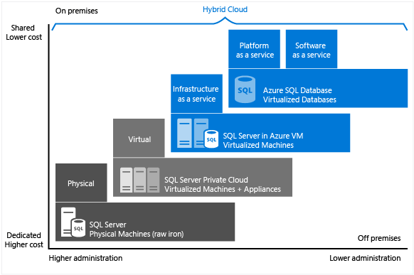

# 选择云 SQL Server 选项：Azure SQL (PaaS) 数据库或 Azure VM 上的 SQL Server (IaaS)
Azure 有两个选项可用于在 Azure 中托管 SQL Server 工作负荷：

* [Azure SQL 数据库](https://www.azure.cn/home/features/sql-database/)：云的本机 SQL 数据库，也称为平台即服务 (PaaS) 数据库或数据库即服务 (DBaaS)，它已针对软件即服务 (SaaS) 应用开发进行优化。 Azure SQL 数据库与大多数 SQL Server 功能兼容。
* [Azure 虚拟机上的 SQL Server](https://www.azure.cn/home/features/virtual-machines/#virtual-machine-SQLserver)：在 Azure 上运行的云中 Microsoft Azure 虚拟机 (VM) 上安装并托管的 SQL Server，也称为基础结构即服务 (IaaS)。
  Azure 虚拟机上的 SQL Server 针对迁移现有 SQL Server 应用程序进行了优化。 可以使用 SQL Server 的所有版本。 它完全与 SQL Server 兼容，可用于托管任意数量的数据库，以及执行跨数据库事务。 它提供对 SQL Server 和 Winodws 的完全控制权。

了解每个选项如何配合 Microsoft 数据平台一起运行，并在匹配适合业务要求的选项时获得帮助。 无论以节省成本为优先考虑，还是将精简管理视为第一要素，本文都会帮助你确定哪种方法能够满足你最重视的业务要求。

## Microsoft 的数据平台
在 Azure 与本地 SQL Server 数据库的任何介绍中，要了解的要点之一是可以同时使用两者。 Azure 数据平台利用 SQL Server 技术，使其可在跨本地物理计算机、私有云环境、第三方托管的私有云环境和公有云中使用。 使用 Azure 虚拟机上的 SQL Server，可以通过本地和云托管部署的组合来满足独特的多样化业务需求，并同时在这些环境中使用相同的服务器产品、开发工具和专业知识组合。

   

如图所示，每个产品可根据你在基础结构（X 轴）中所拥有的管理级别，以及数据库级别合并与自动化（Y 轴）所达到的成本效益程度等特征进行分类。

设计应用程序时，可以使用四个基本选项来托管属于应用程序一部分的 SQL Server：

* 非虚拟化物理机上的 SQL Server
* 本地虚拟机中的 SQL Server（私有云）
* Azure 虚拟机中的 SQL Server（Microsoft 公有云）
* Azure SQL 数据库（Microsoft 公有云）

以下部分介绍 Microsoft 公有云中的 SQL Server：Azure SQL 数据库和 Azure VM 上的 SQL Server。 此外，将探讨常见的业务动机，判断哪一个选项最适合应用程序。

## Azure SQL 数据库和 Azure VM 中的 SQL Server 详述
**Azure SQL 数据库**是托管在 Azure 云中的关系数据库即服务 (DBaaS)，属于“软件即服务 (SaaS)”和“平台即服务 (PaaS)”行业类别。 [SQL 数据库](sql-database-technical-overview.md)构建在 Microsoft 所拥有、托管及维护的标准化硬件和软件基础之上。 使用 SQL 数据库，可以使用内置的特性和功能在服务上直接进行开发。 使用 SQL 数据库时，可以即用即付，并使用向上或向外缩放选项获得更强大的功能且不会中断服务。

**Azure 虚拟机 (VM) 上的 SQL Server** 属于*基础结构即服务 (IaaS)* 行业类别，可让你在云中的虚拟机上运行 SQL Server。 与 SQL 数据库一样，它构建在 Microsoft 所拥有、托管及维护的标准化硬件基础之上。 使用 VM 上的 SQL Server 时，既可使用 SQL Server 映像中已包含的 SQL Server 许可证即付即用，也可方便地使用现有的许可证。 还可以根据需要轻松扩展/缩减以及暂停/恢复 VM。

通常，这两个 SQL 选项已针对不同的用途进行了优化：

* **Azure SQL 数据库**经过优化，可将预配和管理许多数据库的整体成本降到最低。 由于无需管理任何虚拟机、操作系统或数据库软件，因此可以持续降低管理成本。 用户不必管理升级、高可用性或[备份](sql-database-automated-backups.md)。 一般而言，Azure SQL 数据库可以大幅增加由单个 IT 或开发资源管理的数据库数目。
* **Azure VM 上运行的 SQL Server** 已针对将现有应用程序迁移到 Azure 或将现有本地应用程序扩展到混合部署中的云进行了优化。 此外，可以使用虚拟机中的 SQL Server 开发和测试传统 SQL Server 应用程序。 有了 Azure VM 上的 SQL server，即拥有了专用 SQL Server 实例和基于云的 VM 的完全管理权限。 当组织拥有可用来维护虚拟机的 IT 资源时，此选项是最佳选择。 使用这些功能可以构建高度定制的系统，解决应用程序的具体性能与可用性要求。

下表汇总了 SQL 数据库和 Azure VM 中 SQL Server 的主要特征：

| **最适用于：** | **Azure SQL 数据库** | **Azure 虚拟机中的 SQL Server** |
| --- | --- | --- |
|  |开发与营销阶段有时间限制的新式云设计应用程序。 |需要快速迁移到云，而仅需少量更改的现有应用程序。 想要快速完成开发和测试方案，但又不想购买本地 SQL Server 非生产硬件。 |
|  | 需要内置高可用性、灾难恢复和数据库升级的团队。 |可以配置和管理高可用性、灾难恢复与 SQL Server 修补的团队。 提供的某些自动化功能大大简化了这些任务。 | |
|  | 不想要管理基础操作系统和配置设置的团队。 |需要一个具有完全管理权限的自定义环境。 | |
|  | 最大为 4 TB 或更大的可使用扩展模式进行[水平或垂直分区](sql-database-elastic-scale-introduction.md#horizontal-and-vertical-scaling)的数据库。 |具有高达 64 TB 存储空间的 SQL Server 实例。 实例可以支持所需数量的数据库。 | |
|  | | |
| **资源：** |不想要利用 IT 资源来配置和管理基础结构，而想要专注于应用程序层。 |可将某些 IT 资源用于配置和管理。 提供的某些自动化功能大大简化了这些任务。 |
| **总拥有成本：** |消除硬件成本并减少管理成本。 |消除硬件成本。 |
| **业务连续性：** |除了内置的容错基础结构功能以外，Azure SQL 数据库还提供可提高业务连续性的功能，例如[自动备份](sql-database-automated-backups.md)、[时间点还原](sql-database-recovery-using-backups.md#point-in-time-restore)、[异地还原](sql-database-recovery-using-backups.md#geo-restore)和[活动异地复制](sql-database-geo-replication-overview.md)。 有关详细信息，请参阅 [SQL 数据库业务连续性概述](sql-database-business-continuity.md)。 |Azure VM 上的 SQL Server 允许设置高可用性和灾难恢复解决方案，以满足数据库的具体需求。 因此，可以构建针对应用程序高度优化的系统。 可以按需求自行测试并运行故障转移。 有关详细信息，请参阅 [《High Availability and Disaster Recovery for SQL Server on Azure Virtual Machines》](../virtual-machines/windows/sql/virtual-machines-windows-sql-high-availability-dr.md)（Azure 虚拟机中 SQL Server 的高可用性和灾难恢复）。 |
| **混合云：** |本地应用程序可以访问 Azure SQL 数据库中的数据。 |借助 Azure VN 上的 SQL Server，应用程序可以一部分在云中运行，一部分在本地运行。 例如，可以通过 [Azure 虚拟网络](../virtual-network/virtual-networks-overview.md)，将本地网络和 Active Directory 域扩展到云中。 此外，可以使用 [Azure 中的 SQL Server 数据文件功能](http://msdn.microsoft.com/library/dn385720.aspx)，将本地数据文件存储在 Azure 存储中。 有关详细信息，请参阅 [SQL Server 2014 混合云简介](http://msdn.microsoft.com/library/dn606154.aspx)。 |
|  | 作为订阅服务器支持使用 [SQL Server 事务复制](https://msdn.microsoft.com/library/mt589530.aspx)来复制数据。 |完全支持使用 [SQL Server 事务复制](https://msdn.microsoft.com/library/mt589530.aspx)、[AlwaysOn 可用性组](../virtual-machines/windows/sql/virtual-machines-windows-sql-high-availability-dr.md)、集成服务和日志传送来复制数据。 此外，完全支持传统的 SQL Server 备份 | |
|  | | |

## 选择 Azure SQL 数据库或 Azure VM 上的 SQL Server 时的业务动机
### 成本
无论是现金不足的新公司，或是在预算有限的情况下运作的已成立公司的小组，有限资金经常是决定数据库托管方式的主要考虑因素。 本部分先讲解 Azure 中有关以下两个关系数据库选项的计费和许可基本概念：SQL 数据库和 Azure VM 中的 SQL Server。 此外，还介绍如何计算应用程序总成本。

#### 计费和许可基础概念
**SQL 数据库** 以服务形式出售给客户，不附带许可证。  [Azure VM 上的 SQL Server](../virtual-machines/windows/sql/virtual-machines-windows-sql-server-iaas-overview.md) 销售时附带按分钟付费的许可证。 客户也可以使用现有的许可证。  

目前，我们在多个服务层中提供 **SQL 数据库**，并根据你选择的服务层和性能级别，以固定费率向你收取每小时费用。 此外，需要对固定的 [数据传输速率](https://www.azure.cn/pricing/details/data-transfer/)的 Internet 传出流量付费。 基本、标准和高级服务层旨在以多个性能级别提供可预测的性能，以满足应用程序的高峰要求。 可以在服务层和性能级别之间进行更改，以满足应用程序的不同吞吐量需求。 如果数据库具有高事务量且必须支持许多并发用户，我们建议使用高级服务层。 有关目前支持的服务层的最新信息，请参阅 [Azure SQL 数据库服务层](sql-database-service-tiers.md)。 还可以创建[弹性池](sql-database-elastic-pool.md)，在数据库实例之间共享性能资源。

使用 **Azure SQL 数据库**，Microsoft 自动配置、修补和升级数据库软件，从而降低管理成本。 此外，它的[内置备份](sql-database-automated-backups.md)功能可帮助你大幅降低成本，尤其是当你拥有大量的数据库时。

在 **Azure VM 上的 SQL Server** 中，可以使用平台提供的 SQL Server 映像（附带许可证），也可以引入自己的 SQL Server 许可证。 所有受支持的 SQL Server 版本（2008R2、2012、2014、2016）和特别版（开发人员版、Express 版、Web 版、Standard 版、Enterprise 版）都可用。 此外，映像的自带许可版本 (BYOL) 也可用。 使用 Azure 提供的映像时，营运成本取决于所选的 VM 大小以及 SQL Server 版本。 无论 VM 大小或 SQL Server 版本为何，都需要支付 SQL Server 和 Windows Server 的每分钟许可成本，以及 VM 磁盘的 Azure 存储成本。 每分钟计费选项可让你随时使用 SQL Server，而无需另外购买 SQL Server 许可证。 如果在 Azure 中使用自己的 SQL Server 许可证，则只需支付 Windows Server 和存储成本。 有关自带许可证的详细信息，请参阅 [Azure 上通过软件保障实现的许可移动性](https://www.azure.cn/pricing/license-mobility/)。

#### 计算应用程序总成本
开始使用云平台时，运行应用程序的成本包括开发和管理成本，以及公有云平台服务成本。

以下是针对在 SQL 数据库和 Azure VM 中的 SQL Server 上运行的应用程序的详细成本计算方法：

**使用 Azure SQL 数据库时：**

*应用程序总成本 = 大幅降低的管理成本 + 软件开发成本 + SQL 数据库服务成本*

**使用 Azure VM 上的 SQL Server 时：**

*应用程序总成本 = 降到最低的软件开发成本 + 管理成本 + SQL Server 与 Windows Server 许可成本 + Azure 存储成本*

有关定价的详细信息，请参阅以下资源：

* [SQL 数据库定价](https://www.azure.cn/pricing/details/sql-database/)
* [SQL](https://www.azure.cn/pricing/details/virtual-machines/#sql) 和 [Windows](https://www.azure.cn/pricing/details/virtual-machines/#windows) 的[虚拟机定价](https://www.azure.cn/pricing/details/virtual-machines/)
* [Azure 价格计算器](https://www.azure.cn/pricing/calculator/)

> [!NOTE]
> SQL Server 上有一小部分的功能不适用于或不可用于 SQL 数据库。 有关详细信息，请参阅 [SQL 数据库功能](sql-database-features.md)和 [SQL 数据库 Transact-SQL 信息](sql-database-transact-sql-information.md)。 如果要将现有的 SQL Server 解决方案迁移到云中，请参阅[将 SQL Server 数据库迁移到 Azure SQL 数据库](sql-database-cloud-migrate.md)。 当将现有的本地 SQL Server 应用程序迁移到 SQL 数据库时，建议更新应用程序以利用云服务提供的功能。 例如，可以考虑使用 [Azure Web 应用服务](https://www.azure.cn/home/features/app-service/web-apps/)或 [Azure 云服务](https://www.azure.cn/home/features/cloud-services/)来托管应用层，以提高成本效益。
> 
> 

### 管理
对许多企业来说，决定过渡到到云服务的关键在于降低管理复杂度。 使用 **SQL 数据库**，Microsoft 可以管理底层硬件。 Microsoft 可以自动复制所有数据以提供高可用性，配置及升级数据库软件，管理负载均衡，并在发生服务器故障时执行透明的故障转移。 用户可以继续管理数据库，但不再需要管理数据库引擎、服务器操作系统或硬件。  可以继续管理的项目示例包括数据库和登录、索引和查询优化，以及审核和安全性。

使用 **Azure VM 上的 SQL Server**，可以完全掌控操作系统和 SQL Server 实例配置。 使用 VM，可以决定何时更新/升级操作系统与数据库软件，以及何时安装任何其他软件（例如防病毒软件）。 提供的某些自动化功能可以大大简化修补、备份和高可用性。 此外，还可以控制 VM 的大小、磁盘数目及其存储配置。 Azure 允许根据需要更改 VM 的大小。 有关信息，请参阅 [Azure 的虚拟机和云服务大小](../virtual-machines/windows/sizes.md)。 

### 服务级别协议 (SLA)
对于许多 IT 部门而言，达到服务级别协议 (SLA) 规定的正常运行时间义务是首要任务。 本部分会说明 SLA 对每个数据库托管选项代表的含义。

对于 **SQL 数据库**基本、标准和高级服务层，Azure 提供 99.99% 的可用性 SLA。 有关最新信息，请参阅[服务级别协议](https://www.azure.cn/support/sla/sql-data/)。 有关 SQL 数据库服务层和支持的业务连续性计划的最新信息，请参阅[服务层](sql-database-service-tiers.md)。

对于 Azure VM 上运行的 SQL Server，Azure 提供 99.95% 的可用性 SLA（仅涵盖虚拟机）。 此 SLA 不涵盖 VM 上运行的进程（例如 SQL Server），并且要求你在可用性集中托管至少两个 VM 实例。 有关最新信息，请参阅 [VM SLA](https://www.azure.cn/support/sla/virtual-machines/)。 为了在 VM 中实现数据库高可用性 (HA)，应在 SQL Server 中配置一个受支持的高可用性选项，例如 [AlwaysOn 可用性组](http://blogs.technet.com/b/dataplatforminsider/archive/2014/08/25/sql-server-alwayson-offering-in-microsoft-azure-portal-gallery.aspx)。 使用支持的高可用性选项不会提供更多 SLA，但使用户能够实现 >99.99% 的数据库可用性。

### 面市时间
**SQL 数据库**是云式应用程序的理想解决方案。 此选项提供类似于编程 DBA 的功能，非常适合云架构师和开发人员，因为它能降低管理基础操作系统和数据库的需求。 例如，可以使用 [REST API](http://msdn.microsoft.com/library/azure/dn505719.aspx) 和 [PowerShell Cmdlet](http://msdn.microsoft.com/library/mt740629.aspx) 来自动化和管理数千个数据库的管理操作。 [弹性池](sql-database-elastic-pool.md)等功能可让你将重点放在应用程序层上，更快地将解决方案推向市场。

**Azure VM 上运行的 SQL Server** 是理想选择。 此外，如果想要依现状将现有的本地应用程序和数据库迁移到 Azure，则它也是一个不错的选择。 由于无需更改呈现、应用程序和数据层，重新架构现有解决方案时可节省时间和预算。 相反地，可以将重点放在将所有解决方案迁移到 Azure，并执行 Azure 平台可能需要的某些性能优化。 有关详细信息，请参阅 [Azure 虚拟机上 SQL Server 的性能最佳做法](../virtual-machines/windows/sql/virtual-machines-windows-sql-performance.md)。

## 摘要
本文探讨了 SQL 数据库和 Azure 虚拟机 (VM) 上的 SQL Server，并讨论了可能会影响决策的常见业务动机。 以下是供你考虑的建议摘要：

对于以下情况，请选择 **Azure SQL 数据库** ：

* 打算构建全新的基于云的应用程序，以便利用云服务提供的成本节省和性能优化。 此方法提供全面管理云服务的优势，有助于加速产品面市，并提供长期的成本效益。
* 想要让 Microsoft 在数据库上运行常见管理操作，因而数据库需要更高的可用性 SLA。

对于以下情况，请选择 **Azure VM 上的 SQL Server** ：

* 有想要迁移或扩展到云中的现有本地应用程序，或者如果要构建大于 4 TB 的企业应用程序。 此方法的优点是提供 100% SQL 兼容性、大型数据库的容量、SQL Server 和 Windows 的完整控制权以及本地的安全通道。 此方法可以降低开发和修改现有应用程序的成本。
* 有现有的 IT 资源，最终可以拥有修补、备份和数据库高可用性。 请注意，某些自动化功能可大幅简化这些操作。 

## 后续步骤
* 若要开始使用 SQL 数据库，请参阅[第一个 Azure SQL 数据库](sql-database-get-started-portal.md)。
* 请参阅 [《SQL Database pricing》](https://www.azure.cn/pricing/details/sql-database/)（SQL 数据库定价）。
* 若要在 Azure VM 上开始使用 SQL Server，请参阅[在 Azure 中预配 SQL Server 虚拟机](../virtual-machines/windows/sql/virtual-machines-windows-portal-sql-server-provision.md)。