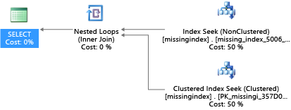

# <a name="manual-tune-query-performance-in-azure-sql-database"></a>手动优化 Azure SQL 数据库中的查询性能

如果你确定遇到了与 SQL 数据库相关的性能问题，则以下文章可为你提供帮助：

- 优化应用程序，应用某些可以提高性能的最佳做法。
- 通过更改索引和查询来优化数据库，以便更有效地处理数据。

本文假定你已完成了 Azure SQL 数据库[数据库顾问建议](sql-database-advisor.md)和 Azure SQL 数据库[自动优化建议](sql-database-automatic-tuning.md)。 它还假定你已查看了[监视和优化概述](sql-database-monitor-tune-overview.md)以及与性能问题故障排除相关的文章。 此外，本文还假定你没有 CPU 资源，与运行相关的性能问题可以通过提升计算大小或服务层级来向数据库提供更多资源来解决。

## <a name="tune-your-application"></a>优化应用程序

在传统的本地 SQL Server 中，进行初始容量规划的过程经常与在生产中运行应用程序的过程分离。 首先购买硬件和产品许可证，然后进行性能优化。 使用 Azure SQL 数据库时，最好是交替完成应用程序的运行和优化过程。 使用按需支付容量的模型，可以优化应用程序以使用目前所需的最少资源，而不是靠推测应用程序的未来增长计划过度预配硬件（这通常是不正确的做法）。 有些客户可能选择不优化应用程序，而是选择过度配置硬件资源。 如果不想在繁忙时段更改关键应用程序，不妨使用此方法。 但是，在使用 Azure SQL 数据库中的服务层级时，优化应用程序可以使资源需求降至最低并减少每月的费用。

### <a name="application-characteristics"></a>应用程序特征

尽管 Azure SQL 数据库服务层级旨在提高应用程序的性能稳定性和可预测性，但一些最佳做法可以帮助你优化应用程序，以便更好地利用某一计算大小的资源。 虽然许多应用程序只需通过切换到更大的计算大小或服务层级便会显著提升性能，但某些应用程序需要进一步优化，才能受益于更高级别的服务。 若要提高性能，可考虑对具有以下特征的应用程序进行额外的优化：

- **因“闲聊”行为而性能变慢的应用程序**

  “健谈”应用程序会过多地进行易受网络延迟影响的数据访问操作。 可能需要修改这些类型的应用程序，减少对 SQL 数据库的数据访问操作的数量。 例如，可使用将即席查询成批处理或将查询移至存储过程等方法，提高应用程序性能。 有关详细信息，请参阅 [批处理查询](#batch-queries)。

- **具有不受整台计算机支持的密集型工作负荷的数据库**

   超过最高“高级”计算大小的资源的数据库可能受益于横向扩展工作负荷。 有关详细信息，请参阅[跨数据库分片](#cross-database-sharding)和[功能分区](#functional-partitioning)。

- **具有非最优查询的应用程序**

  没有很好优化查询的应用程序（尤其是数据访问层中的那些应用程序），则可能不会受益于更大的计算大小。 其中包括缺少 WHERE 子句、缺少索引或统计信息过时的查询。 标准查询性能优化技术能够为这些应用程序带来好处。 有关详细信息，请参阅[缺少索引](#identifying-and-adding-missing-indexes)和[查询优化和提示](#query-tuning-and-hinting)。

- **具有非最优数据访问设计的应用程序**

   选择较大的计算大小可能无法为存在固有数据访问并发问题（例如死锁）的应用程序带来好处。 考虑使用 Azure 缓存服务或其他缓存技术将数据缓存在客户端，减少与 Azure SQL 数据库之间的往返次数。 请参阅 [应用程序层缓存](#application-tier-caching)。

## <a name="tune-your-database"></a>优化数据库

在本节中，我们将了解一些用于优化 Azure SQL 数据库的技术，以获取应用程序的最佳性能，并以尽可能小的计算大小运行。 有些方法可与传统的 SQL Server 优化最佳实践搭配使用，但有些方法专用于 Azure SQL 数据库。 在某些情况下，可通过检查数据库使用的资源找到要进一步优化的区域，扩展传统的 SQL Server 方法，使这些方法也可在 Azure SQL 数据库中使用。

### <a name="identifying-and-adding-missing-indexes"></a>识别和添加缺失的索引

OLTP 数据库性能有一个常见问题与物理数据库设计有关。 设计和交付数据库架构时，经常不进行规模（负载或数据卷）测试。 遗憾的是，在规模较小时，查询计划的性能可能尚可接受，但面对生产级数据卷时，性能就会大幅降低。 此问题最常见的原因是缺乏相应的索引，无法满足筛选器的要求或查询中的其他限制。 缺少索引经常导致表扫描，而此时索引搜寻即可满足要求。

在此示例中，所选查询计划在使用搜寻即可满足要求的情况下使用了扫描：

```sql
DROP TABLE dbo.missingindex;
CREATE TABLE dbo.missingindex (col1 INT IDENTITY PRIMARY KEY, col2 INT);
DECLARE @a int = 0;
SET NOCOUNT ON;
BEGIN TRANSACTION
    WHILE @a < 20000
    BEGIN
        INSERT INTO dbo.missingindex(col2) VALUES (@a);
        SET @a += 1;
    END
    COMMIT TRANSACTION;
    GO
SELECT m1.col1
    FROM dbo.missingindex m1 INNER JOIN dbo.missingindex m2 ON(m1.col1=m2.col1)
    WHERE m1.col2 = 4;
```


Azure SQL 数据库可用于查找和修复常见的索引缺失情况。 Azure SQL 数据库内置的 DMV 将查找其中索引会大幅降低运行查询的估算成本的查询编译。 在查询执行期间，SQL 数据库跟踪每个查询计划的执行频率，以及跟踪执行查询计划与想象其中存在该索引的查询计划之间的估算差距。 可以使用这些 DMV 迅速推测出哪些物理数据库设计更改可能减少数据库的总工作负荷成本及其真实工作负荷。

此查询可用于评估可能缺少的索引：

```sql
SELECT
   CONVERT (varchar, getdate(), 126) AS runtime
   , mig.index_group_handle
   , mid.index_handle
   , CONVERT (decimal (28,1), migs.avg_total_user_cost * migs.avg_user_impact *
        (migs.user_seeks + migs.user_scans)) AS improvement_measure
   , 'CREATE INDEX missing_index_' + CONVERT (varchar, mig.index_group_handle) + '_' +
        CONVERT (varchar, mid.index_handle) + ' ON ' + mid.statement + '
        (' + ISNULL (mid.equality_columns,'')
        + CASE WHEN mid.equality_columns IS NOT NULL
        AND mid.inequality_columns IS NOT NULL
        THEN ',' ELSE '' END + ISNULL (mid.inequality_columns, '') + ')'
        + ISNULL (' INCLUDE (' + mid.included_columns + ')', '') AS create_index_statement
   , migs.*
   , mid.database_id
   , mid.[object_id]
FROM sys.dm_db_missing_index_groups AS mig
   INNER JOIN sys.dm_db_missing_index_group_stats AS migs
      ON migs.group_handle = mig.index_group_handle
   INNER JOIN sys.dm_db_missing_index_details AS mid
      ON mig.index_handle = mid.index_handle
 ORDER BY migs.avg_total_user_cost * migs.avg_user_impact * (migs.user_seeks + migs.user_scans) DESC
```

在此示例中，查询生成了以下建议：

```sql
CREATE INDEX missing_index_5006_5005 ON [dbo].[missingindex] ([col2])  
```

创建建议以后，同一 SELECT 语句会选取另一计划，使用搜寻而非扫描，从而提高计划执行效率：



重要见解是共享商用系统的 IO 容量会比专用服务器计算机的容量受到更多限制。 客观上鼓励将不必要 IO 降至最低，最大限度地在 Azure SQL 数据库服务层级的每个计算大小 DTU 范围内利用系统。 选择适当的物理数据库设计方式可显著缩短单个查询的延迟、提高按缩放单元处理的并发请求的吞吐量，以及将满足查询所需的成本降至最低。 有关缺少索引 DMV 的详细信息，请参阅 [sys.dm_db_missing_index_details](https://msdn.microsoft.com/library/ms345434.aspx)。

### <a name="query-tuning-and-hinting"></a>查询优化和提示

Azure SQL 数据库中的查询优化器与传统的 SQL Server 查询优化器相似。 有关优化查询和了解查询优化器的推理模型限制的最佳实践大多也适用于 Azure SQL 数据库。 如果优化 Azure SQL 数据库中的查询，则可能获得额外的优势：降低总体资源需求。 与未经优化的同等应用程序相比，应用程序可能能够以更低的成本运行，因为它可用更小的计算大小运行。

在 SQL Server 中常见的一个示例（也适用于 Azure SQL 数据库）是查询优化器如何“探查”参数。 在编译期间，查询优化器会计算参数的当前值，确定其是否能够生成更优化的查询计划。 尽管与不使用已知参数值进行编译的计划相比，此策略通常能够生成速度明显更快的查询计划，但目前在 SQL Server 和 Azure SQL 数据库中的使用效果仍欠佳。 有时不探查参数，有时探查参数，但对于工作负荷中的整套参数值而言，生成的计划并非最佳。 Microsoft 提供查询提示（指令），让用户可以更谨慎地指定意图并取代参数探查的默认行为。 通常情况下，如果使用提示，则可纠正默认的 SQL Server 或 Azure SQL 数据库行为对于给定客户工作负荷不完善的情况。

下一个示例演示查询处理器如何生成对于性能和资源要求并非最佳的计划。 此示例还表明，如果使用查询提示，则可缩短 SQL 数据库的查询运行时间并降低资源要求：

```sql
DROP TABLE psptest1;
CREATE TABLE psptest1(col1 int primary key identity, col2 int, col3 binary(200));
DECLARE @a int = 0;
SET NOCOUNT ON;
BEGIN TRANSACTION
   WHILE @a < 20000
   BEGIN
     INSERT INTO psptest1(col2) values (1);
     INSERT INTO psptest1(col2) values (@a);
     SET @a += 1;
   END
   COMMIT TRANSACTION
   CREATE INDEX i1 on psptest1(col2);
GO

CREATE PROCEDURE psp1 (@param1 int)
   AS
   BEGIN
      INSERT INTO t1 SELECT * FROM psptest1
      WHERE col2 = @param1
      ORDER BY col2;
    END
    GO

CREATE PROCEDURE psp2 (@param2 int)
   AS
   BEGIN
      INSERT INTO t1 SELECT * FROM psptest1 WHERE col2 = @param2
      ORDER BY col2
      OPTION (OPTIMIZE FOR (@param2 UNKNOWN))
   END
   GO

CREATE TABLE t1 (col1 int primary key, col2 int, col3 binary(200));
GO
```

该设置代码创建一个其数据分布处于偏斜状态的表。 最佳查询计划随所选参数的不同而不同。 遗憾的是，计划缓存行为并非始终根据最常用参数值来重新编译查询。 因此，即使另一个计划平均而言可能是更好的计划选择，也可以缓存非最佳计划并将其用于多个值。 然后，查询计划会创建两个几乎相同的存储过程，唯一区别是其中一个有特殊的查询提示。

```sql
-- Prime Procedure Cache with scan plan
EXEC psp1 @param1=1;
TRUNCATE TABLE t1;

-- Iterate multiple times to show the performance difference
DECLARE @i int = 0;
WHILE @i < 1000
   BEGIN
      EXEC psp1 @param1=2;
      TRUNCATE TABLE t1;
      SET @i += 1;
    END
```

建议至少等待 10 分钟，再开始示例的第 2 部分，以便在所得的遥测数据中有不同结果。

```sql
EXEC psp2 @param2=1;
TRUNCATE TABLE t1;

DECLARE @i int = 0;
    WHILE @i < 1000
    BEGIN
        EXEC psp2 @param2=2;
        TRUNCATE TABLE t1;
        SET @i += 1;
    END
```

本例的每个部分均尝试将某个参数化插入语句运行 1,000 次（以产生可用作测试数据集的足够的负载）。 当执行存储过程时，查询处理器在其首次编译期间检查传递给过程的参数值（参数“探查”）。 处理器会缓存生成的计划，将其用于以后的调用，即使参数值不同也是如此。 可能无法在所有情况下均使用最佳计划。 有时，用户需要引导优化器选取更适合普通情况而非首次编译查询时的特定情况的计划。 在此示例中，初始计划会生成一个“扫描”计划，后者会读取所有行以查找与参数匹配的每个值：


由于我们用值 1 执行该过程，因此所得的计划对于值 1 为最佳，但对于表中的所有其他值并非最佳。 如果随机选取每个计划，结果可能不如所愿，因为计划的执行速度可能较慢，所用资源可能较多。

如果运行测试时将 `SET STATISTICS IO` 设置为 `ON`，则会在后台完成此示例中的逻辑扫描工作。 可以看到计划完成了 1,148 次读取（如果平均仅返回一行，此读取效率并不高）：


本例的第二部分使用查询提示告知优化器在编译过程中使用某个特定值。 在本示例中，它强制查询处理器忽略作为参数传递的值，而采用 `UNKNOWN`。 这是指在表中的出现频率为平均频率的值（忽略偏斜情况）。 所得的计划是一个基于搜寻的计划，平均而言，它比此示例第 1 部分中的计划速度更快且使用资源更少：


可以查看 **sys.resource_stats** 表的影响（执行测试的时间与数据填充表的时间之间有延迟）。 对于本例，会在 22:25:00 时间范围内执行第 1 部分，在 22:35:00 执行第 2 部分。 越早时间范围使用的资源比越晚时间范围要多（因计划效率提高）。

```sql
SELECT TOP 1000 *
FROM sys.resource_stats
WHERE database_name = 'resource1'
ORDER BY start_time DESC
```


> [!NOTE]
> 虽然此示例特意选择了较小的卷，但非最佳参数的影响仍很大，对于较大的数据库尤为如此。 这种区别在极端情况下对于快速情况和慢速情况可在数秒和数小时之间。

可检查 **sys.resource_stats**，以确定测试使用的资源多于还是少于另一个测试。 在比较数据时，请使测试相隔一定时间，以使其不会在 **sys.resource_stats** 视图中的同一 5 分钟时间范围内重合。 本练习的目标是将使用的资源总量降至最低，而非将峰值资源降至最低。 一般而言，优化一段产生延迟的代码也会减少资源消耗。 请确保对应用程序所做的更改是必需的，且这些更改不会对那些可能会在应用程序中使用查询提示的人的客户体验造成负面影响。

如果工作负荷由一组重复的查询组成，则捕获并验证所做计划选择的最优性通常很有意义，因为这样做会使托管数据库所需的资源大小单位降至最低。 对其进行验证后，应偶尔重新检查计划，以帮助你确保其未降级。 可以详细了解[查询提示 (TRANSACT-SQL)](https://msdn.microsoft.com/library/ms181714.aspx)。

### <a name="cross-database-sharding"></a>跨数据库分片

由于 Azure SQL 数据库在商品硬件上运行，因此单一数据库的容量限制低于传统的本地 SQL Server 安装。 在数据库操作超出 Azure SQL 数据库中单一数据库的限制时，一些客户使用分片技术将这些操作分摊到多个数据库上。 在 Azure SQL 数据库上使用分片技术的大多数客户将单个维度的数据拆分到多个数据库上。 对于该方法，需了解 OLTP 应用程序执行的事务经常仅适用于架构中的一行或少数几行。

> [!NOTE]
> SQL 数据库现在提供一个库来帮助分片。 有关详细信息，请参阅[弹性数据库客户端库概述](sql-database-elastic-database-client-library.md)。

例如，如果数据库包含客户名称、订单和订单明细（如 SQL Server 附带的传统示例 Northwind 数据库），则可通过将客户与相关订单及订单明细集中在一起，将这些数据拆分到多个数据库中。 可以保证客户的数据保留在单一数据库中。 应用程序将不同的客户拆分到多个数据库上，实际上就是将负载分散在多个数据库上。 通过分片，客户不仅可以避免达到最大数据库大小限制，而且 Azure SQL 数据库还能够处理明显大于不同计算大小限制的工作负荷，前提是每个数据库适合其 DTU。

数据库分片不会减少解决方案的聚合资源容量，但在支持跨多个数据库的极大型解决方案时很有效。 每个数据库可以使用不同的计算大小来运行，以支持非常大的、资源要求高的“有效”数据库。

### <a name="functional-partitioning"></a>功能分区

SQL Server 用户经常将许多功能集中在单一数据库内。 例如，如果应用程序包含管理商店库存的逻辑，则该数据库可能包含与库存、跟踪采购订单、存储过程、管理月末报告的索引视图或具体化视图关联的逻辑。 此方法可轻松管理数据库，进行备份之类的操作，但也要求用户调整硬件大小以处理应用程序所有功能的峰值负载。

如果在 Azure SQL 数据库中使用横向扩展体系结构，则可将应用程序的不同功能拆分到不同的数据库中。 每个应用程序均可使用此方法独立缩放。 随着应用程序变得更加繁忙（并且数据库负载不断增长），管理员可针对应用程序中的每项功能选择单独的计算大小。 在限制范围内，使用此体系结构时，由于负载分散在多个计算机上，因此应用程序的规模可超出单个商用计算机的处理能力。

### <a name="batch-queries"></a>批处理查询

对于以大量、频繁的即席查询形式访问数据的应用程序，在应用程序层与 Azure SQL 数据库层之间的网络通信上花费了大量响应时间。 即使在应用程序与 Azure SQL 数据库同处一个数据中心时，大量数据访问操作也可能会增大二者之间的网络延迟。 要减少进行数据访问操作所需的网络往返，可考虑使用相应选项，要么批处理即席查询，要么将其编译为存储过程。 如果将即席查询分批，可将多个查询作为一个大批次在一次行程中发送到 Azure SQL 数据库。 将即席查询编入存储过程可获得与分批相同的结果。 使用存储过程还有一个好处，即可以有更多的机会将查询计划缓存在 Azure SQL 数据库中，以便再次使用存储过程。

某些应用程序频繁写入。 有时，通过考虑如何统一批处理写入，可以减少数据库上的总 IO 负载。 通常，这与在存储过程和即席批处理中使用显式事务代替自动提交事务一样简单。 有关各种可用方法的评估，请参阅 [Azure 中 SQL 数据库应用程序的批处理技术](sql-database-use-batching-to-improve-performance.md)。 使用自己的工作负荷进行实验，找到正确的批处理模型。 请务必了解，模型的事务一致性保证可能略有不同。 要找到将资源用量降至最低的正确工作负荷，需要找到一致性与性能折中的正确组合。

### <a name="application-tier-caching"></a>应用程序层缓存

某些数据库应用程序的工作负荷包含大量的读取操作。 缓存层可减少数据库上的负载，还有可能降低支持使用 Azure SQL 数据库的数据库所需的计算大小。 通过 [Azure Redis 缓存](https://www.azure.cn/home/features/redis-cache/)，如果有一个读取作业繁重的工作负荷，可以读取数据一次（或者也许可以按应用层计算机读取一次，具体取决于其配置方式），然后将该数据存储在 SQL 数据库外部。 这样可降低数据库负载（CPU 和读取 IO），但对于事务一致性有影响，因为从缓存读取的数据可能与数据库中数据不同步。 虽然许多应用程序可接受一定程度的不一致，但并非所有工作负荷都是这样。 应该先完全了解任何应用程序要求，再实施应用程序层缓存策略。

## <a name="next-steps"></a>后续步骤

- 有关基于 DTU 的服务层级的详细信息，请参阅[基于 DTU 的购买模型](sql-database-service-tiers-dtu.md)。
- 有关基于 vCore 的服务层级的详细信息，请参阅[基于 vCore 的购买模型](sql-database-service-tiers-vcore.md)。
- 有关弹性池的详细信息，请参阅[什么是 Azure 弹性池？](sql-database-elastic-pool.md)
- 有关性能和弹性池的信息，请参阅[何时考虑弹性池](sql-database-elastic-pool-guidance.md)