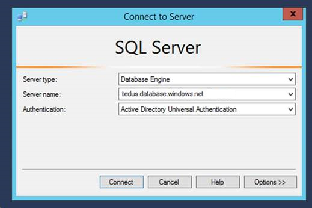

# 对 Azure SQL 数据库和 Azure SQL 数据仓库使用多重 AAD 身份验证（SSMS 支持 MFA）
Azure SQL 数据库和 Azure SQL 数据仓库支持使用 Active Directory 通用身份验证  ，从 SQL Server Management Studio (SSMS) 进行连接。 本文讨论了各种身份验证选项之间的差异，以及与使用通用身份验证相关的限制。 

**下载最新 SSMS** - 在客户端计算机上，从[下载 SQL Server Management Studio (SSMS)](https://msdn.microsoft.com/library/mt238290.aspx) 下载最新版本的 SSMS。 

对于本文中讨论的所有功能，请至少使用 2017 年 7 月的版本 17.2。  最新的连接对话框应与下图类似：
 
    

## 五个身份验证选项  

Active Directory 通用身份验证支持两种非交互式身份验证方法：
    - `Active Directory - Password` 身份验证
    - `Active Directory - Integrated` 身份验证

非交互式身份验证模型也有两种，它们可用于许多不同的应用程序（ADO.NET、JDCB、ODC 等）中。 这两种方法绝对不会产生弹出式对话框： 
- `Active Directory - Password` 
- `Active Directory - Integrated` 

同时支持 Azure 多重身份验证 (MFA) 的交互式方法是： 
- `Active Directory - Universal with MFA` 

Azure MFA 可帮助保护对数据和应用程序的访问，同时满足用户对简单登录过程的需求。 它利用一系列简单的验证选项（电话、短信、含有 PIN 码的智能卡或移动应用通知）提供强身份验证，用户可以根据自己的偏好选择所用的方法。 配合使用 Azure AD 和交互式 MFA 时会出现用于验证的弹出式对话框。

有关多重身份验证的说明，请参阅[多重身份验证](../active-directory/authentication/multi-factor-authentication.md)。
有关配置步骤，请参阅[配置 SQL Server Management Studio 的 Azure SQL 数据库多重身份验证](sql-database-ssms-mfa-authentication-configure.md)。

### Azure AD 域名称或租户 ID 参数   

从 [SSMS 版本 17](https://docs.microsoft.com/sql/ssms/download-sql-server-management-studio-ssms) 开始，以来宾用户身份从其他 Azure Active Directory 导入到当前 Active Directory 的用户在连接时可提供 Azure AD 域名或租户 ID。 来宾用户包括从其他 Azure AD、Microsoft 帐户（如 outlook.com、hotmail.com、live.com）或其他帐户（如 gmail.com）邀请的用户。 此信息使“Active Directory - 通用且具有 MFA 身份验证”  可以识别正确的身份验证机构。 此选项也是支持 outlook.com、hotmail.com、live.com 等 Microsoft 帐户 (MSA) 或非 MSA 帐户的必需选项。 所有要使用通用身份验证进行身份验证的用户必须输入其 Azure AD 域名或租户 ID。 此参数表示 Azure 服务器当前链接的 Azure AD 域名/租户ID。 例如，如果 Azure Server 与 Azure AD 域 `contosotest.onmicrosoft.com`（其中用户 `joe@contosodev.onmicrosoft.com` 托管为从 Azure AD 域 `contosodev.onmicrosoft.com` 导入的用户）相关联，则需用于对此用户进行身份验证的域名为 `contosotest.onmicrosoft.com`。 如果用户是链接到 Azure 服务器的 Azure AD 的本机用户，并且不是 MSA 帐户，则无需提供域名或租户 ID。 若要输入参数（从 SSMS 版本 17.2 开始），请在“连接到数据库”  对话框中，完成该对话框，选择“Active Directory - 通用且具有 MFA”  身份验证，单击“选项”  ，完成“用户名”  框，然后单击“连接属性”  选项卡。选中“AD 域名或租户 ID”  框，然后提供身份验证机构，如域名 (**contosotest.onmicrosoft.com**) 或租户 ID 的 GUID。  
   

如果运行的是 SSMS 18.x 或更高版本，则来宾用户不再需要 AD 域名或租户 ID，因为 18.x 或更高版本会自动识别它。

   

## SQL 数据库和 SQL 数据仓库的 Active Directory 通用身份验证限制
- SSMS 和 SqlPackage.exe 是目前唯一通过 Active Directory 通用身份验证针对 MFA 启用的工具。
- SSMS 版本 17.2 支持使用具有 MFA 的通用身份验证进行多用户并发访问。 版本 17.0 和 17.1 将使用通用身份验证的 SSMS 实例的登录名限制到单个 Azure Active Directory 帐户。 若要以另一个 Azure AD 帐户登录，则必须使用另一个 SSMS 实例。 （此限制仅限于 Active Directory 通用身份验证；如果使用 Active Directory 密码验证、Active Directory 集成身份验证或 SQL Server 身份验证，可以登录到不同的服务器）。
- 对于对象资源管理器、查询编辑器和查询存储可视化效果，SSMS 支持 Active Directory 通用身份验证。
- SSMS 版本 17.2 为导出/提取/部署数据数据库提供 DacFx 向导支持。 在特定用户使用通用身份验证通过初始身份验证对话框进行了身份验证之后，DacFx 向导的工作方式与针对所有其他身份验证方法的方式相同。
- SSMS 表设计器不支持通用身份验证。
- 除了必须使用支持的 SSMS 版本，Active Directory 通用身份验证没有其他软件需求。  
- 通用身份验证的 Active Directory 身份验证库 (ADAL) 版本已更新到最新的 ADAL.dll 3.13.9 可用发行版。 请参阅 [Active Directory 身份验证库 3.14.1](https://www.nuget.org/packages/Microsoft.IdentityModel.Clients.ActiveDirectory/)。  

## 后续步骤

- 有关配置步骤，请参阅[配置 SQL Server Management Studio 的 Azure SQL 数据库多重身份验证](sql-database-ssms-mfa-authentication-configure.md)。
- 授予其他人对数据库的访问权限：[SQL 数据库身份验证和授权：授予访问权限](sql-database-manage-logins.md)  
- 确保其他人可以通过防火墙进行连接：[使用 Azure 门户配置 Azure SQL 数据库服务器级防火墙规则](sql-database-configure-firewall-settings.md)  
- [使用 SQL 数据库或 SQL 数据仓库配置和管理 Azure Active Directory 身份验证](sql-database-aad-authentication-configure.md)  
- [Microsoft SQL Server Data-Tier Application Framework (17.0.0 GA)](https://www.microsoft.com/download/details.aspx?id=55088)  
- [SQLPackage.exe](https://docs.microsoft.com/sql/tools/sqlpackage)  
- [将 BACPAC 文件导入到新的 Azure SQL 数据库](../sql-database/sql-database-import.md)  
- [将 Azure SQL 数据库导出到 BACPAC 文件](../sql-database/sql-database-export.md)  
- C# 接口 [IUniversalAuthProvider 接口](https://msdn.microsoft.com/library/microsoft.sqlserver.dac.iuniversalauthprovider.aspx)  
- 使用 **Active Directory - 通用且具有 MFA** 进行身份验证时，可以使用以 [SSMS 17.3](https://docs.microsoft.com/sql/ssms/download-sql-server-management-studio-ssms) 开头的 ADAL 跟踪。 在默认关闭的情况下，可在“ADAL 输出窗口跟踪级别”**中，** 使用“Azure 云”  的“Azure 服务”  下方“选项”  菜单中的“工具”  ，打开 ADAL 跟踪，然后在“视图”  菜单中启用“输出”  。 选择“Azure Active Directory 选项”  时，可在输出窗口中使用跟踪。  
