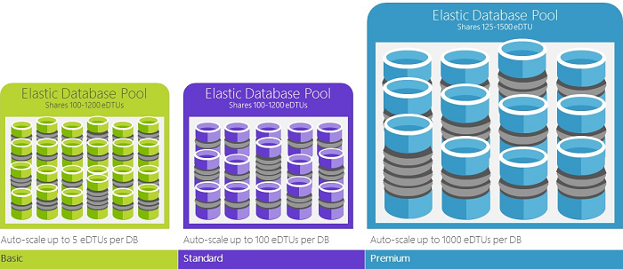

# 什么是 Azure SQL 数据库服务？

SQL 数据库是 Azure 中通用的关系型数据库托管服务，支持关系数据、JSON、空间和 XML 等结构。 SQL 数据库在以下两个不同的购买模型中实现动态可扩展性能：基于 vCore 的购买模型和基于 DTU 的购买模型。 SQL 数据库还提供[列存储索引](https://docs.microsoft.com/sql/relational-databases/indexes/columnstore-indexes-overview)（用于极端分析和报告）和[内存中 OLTP](sql-database-in-memory.md)（用于极端事务处理）等选项，可以无缝地处理 SQL 代码库的所有修补和更新，不需考虑底层基础结构的所有管理。 

> [!NOTE]
> 有关 Azure SQL 数据库术语词汇表，请参阅 [SQL 数据库术语词汇表](sql-database-glossary-terms.md)

Azure SQL 数据库提供下述适用于 Azure SQL 数据库的部署选项：

- [单一数据库](sql-database-single-database.md)，它自己的资源集通过 SQL 数据库服务器进行托管。 单一数据库类似于 SQL Server 中的[包含的数据库](https://docs.microsoft.com/sql/relational-databases/databases/contained-databases)。
- [弹性池](sql-database-elastic-pool.md)，即数据库集合，其中共用资源集通过 SQL 数据库服务器进行托管。 可以将单一数据库移入或移出弹性池。

SQL 数据库与 [Microsoft SQL Server 数据库引擎](https://docs.microsoft.com/sql/sql-server/sql-server-technical-documentation)共享其代码库。 利用 Microsoft 的云优先策略，首先将 SQL Server 的最新功能发布到 SQL 数据库，然后再发布到 SQL Server 本身。 此方法可为你提供 SQL Server 的最新功能，这些新功能已经过数百万个数据库的测试且无任何修补或升级开销。 

> [!IMPORTANT]
> 若要了解 SQL 数据库与 SQL Server 的功能差异，以及不同 Azure SQL 数据库部署选项的区别，请参阅 [SQL 功能](sql-database-features.md)。

SQL 数据库通过多个资源类型、服务层和计算大小提供可预测的、动态可缩放的性能，主要表现在：无停机时间、内置智能优化、全局可伸缩性和可用性，以及高级安全选项 - 一切几乎不用人工管理。 凭借这些功能，客户可将注意力集中在如何快速进行应用开发、加快推向市场，而无需将宝贵的时间和资源投入在管理虚拟机和基础结构上。 SQL 数据库服务目前在世界各地有 38 个数据中心，且有更多数据中心定期上线，因此你可以在附近的数据中心运行数据库。

## 可缩放的性能和池

- 使用单一数据库，每个数据库相互隔离且可移植，每个数据库都有自己有保证的计算、内存和存储资源量。 SQL 数据库提供各种满足不同需求的计算、内存和存储资源，并支持纵向和横向动态[扩展单一数据库资源](sql-database-single-database-scale.md)。
- 使用弹性池，可以新建数据库，也可以将单一数据库移到资源池中，以最大限度地使用资源和节省资金，并且还能纵向和横向动态[扩展弹性池资源](sql-database-elastic-pool-scale.md)。

可以在小型单一数据库中生成第一个应用程序，每月的“常规用途”服务层费用很低。然后，可以根据解决方案的需要，随时手动或以编程方式将服务层更改为“业务关键”服务层。 可在不给应用或客户造成停机的情况下调整性能。 动态可伸缩性可让数据库以透明方式响应快速变化的资源要求，使用户只需为用到的资源付费。

动态可伸缩性不同于自动缩放。 自动缩放是指服务根据条件自动缩放，而动态可伸缩性允许在无停机时间的情况下进行手动缩放。 单个数据库支持手动动态可伸缩性，但不支持自动缩放。 若要获得更多*自动*体验，请考虑使用弹性池，它允许数据库根据各个数据库需求共享池中的资源。 但是，有一些脚本可帮助自动执行单个数据库的可伸缩性。 有关示例，请参阅[使用 PowerShell 监视和缩放单个数据库](scripts/sql-database-monitor-and-scale-database-powershell.md)。

### 购买模型、服务层、计算大小和存储量

SQL 数据库提供以下两种购买模型：

- [基于 DTU 的购买模型](sql-database-service-tiers-dtu.md)：混合提供三个服务层中的计算、内存和 IO 资源，以支持轻型到重型数据库工作负载。 每个层中的不同计算大小提供这些资源的不同组合，你可以向其添加更多的存储资源。
- [基于 vCore 的购买模型](sql-database-service-tiers-vcore.md)允许选择 vCore 数、内存容量，以及存储的容量和速度。 基于 vCore 的购买模型还允许使用[适用于 SQL Server 的 Azure 混合权益](https://azure.cn/pricing/hybrid-benefit/)来节省成本。 有关 Azure 混合权益的详细信息，请参阅[常见问题解答](#sql-database-frequently-asked-questions-faq)。

  > [!IMPORTANT]
  > 适用于单一数据库的[超大规模服务层](sql-database-service-tier-hyperscale.md)目前以公共预览版提供。 尚不建议在超大规模数据库中运行任何生产工作负载。 无法将超大规模数据库更新为其他服务层。 出于测试目的，建议创建当前数据库的副本，并将副本更新为超大规模服务层。

### 弹性池可以最大化资源利用率

许多业务和应用程序只要能够创建单一数据库并按需调高或调低性能即可，尤其是当使用模式相对容易预测时。 但如果有无法预测的使用模式，则管理成本和业务模式就会变得相当困难。 [弹性池](sql-database-elastic-pool.md)旨在解决此问题。 概念很简单。 可以向池而不是单个数据库分配性能资源，并且仅需为池的总体性能资源付费，而无需为单一数据库的性能付费。

   

使用弹性池时，不需要在资源需求波动时担心如何上下调节数据库性能。 入池的数据库可根据需要使用弹性池的性能资源。 入池的数据库会使用该池，但不会超出其限制，因此即使单个数据库的使用情况仍不可预测，成本也仍是可预测的。 此外，可以[向池添加和删除数据库](sql-database-elastic-pool-manage-portal.md)，将应用从少量数据库扩展到数千个，而一切费用不会超出所控制的预算范围。 还可以控制池中数据库可用的资源量上限与下限，确保池中不会有任何数据库使用所有的池资源，每个入池数据库的可用资源量都有最低保障。 

脚本可以帮助监视和缩放弹性池。 有关示例，请参阅[使用 PowerShell 在 Azure SQL 数据库中监视和缩放 SQL 弹性池](scripts/sql-database-monitor-and-scale-pool-powershell.md)

> [!IMPORTANT]
> 托管实例不支持弹性池。

### 混合使用单一数据库与入池数据库

可将单一数据库与弹性池混合使用，快速轻松地更改单一数据库和弹性池的服务层来适应自己的情况。 凭借 Azure 的功能和作用范围，可将其他 Azure 服务与 SQL 数据库搭配使用以满足独特的应用设计需求，提高成本和资源效益，发掘新的商机。

### 集中监视和警报功能

将[内置的性能监视](sql-database-performance.md)和[警报](sql-database-insights-alerts-portal.md)工具与性能等级组合使用。 使用这些工具，可以根据当前需求或项目性能的需求，快速评估调高或调低性能产生的影响。 此外，SQL 数据库可[发出指标和诊断日志](sql-database-metrics-diag-logging.md)，以便更轻松地监视。 可配置 SQL 数据库，将资源使用情况、辅助角色和会话以及连接性存储到以下 Azure 资源之一：

- **Azure 存储**：用于低价存档大量遥测
- **Azure 事件中心**：用于将 SQL 数据库遥测与自定义监视解决方案或热门管道集成
- **Azure Monitor 日志**：用于具有报告、警报和缓解功能的内置监视解决方案。

    

## 可用性功能

Azure 行业领先的 99.99% 可用性服务级别协议 [(SLA)](https://azure.cn/support/legal/sla/)（由 Microsoft 管理的数据中心的全球网络提供支持），有助于保持应用全天候运行。 Azure 平台完全管理每个 Azure SQL 数据库，保证不会丢失数据并保证高百分比的数据可用性。 Azure 会自动处理修补、备份、复制、故障检测；基础的潜在硬件、软件或网络故障；部署 bug 修复、故障转移、数据库升级和其他维护任务。 标准可用性是通过将计算层与存储层相隔离来实现的。 高级可用性的实现方式是将计算和存储层集成到单个节点以提高性能，然后藉此实施类似于 Always On 可用性组的技术。 有关 Azure SQL 数据库的高可用性功能的完整讨论，请参阅 [SQL 数据库可用性](sql-database-high-availability.md)。 此外，SQL 数据库还提供内置[业务连续性和全局可伸缩性](sql-database-business-continuity.md)功能，包括：

- **[自动备份](sql-database-automated-backups.md)**：

  SQL 数据库自动执行 Azure SQL 数据库的完整备份、差异备份和事务日志备份，以便能够还原到任何时间点。 对于单一数据库和入池数据库，可以将 SQL 数据库配置为，将完整数据库备份存储到 Azure 存储，以供长期备份保留。 对于托管实例，还可以执行仅复制备份，以供长期备份保留。

- **[时间点还原](sql-database-recovery-using-backups.md)**：

  所有 SQL 数据库部署选项都支持恢复到任何 Azure SQL 数据库的自动备份保留期内的任何时间点。
- **[活动异地复制](sql-database-active-geo-replication.md)**：

  使用单一数据库和入池数据库，可以在同一或全球分布式 Azure 数据中心内配置至多 4 个可读辅助数据库。  例如，如果有一个 SaaS 应用程序，其中的目录数据库包含大量并发只读事务，请使用活动异地复制来启用全局读取缩放并删除主数据库上因读取工作负荷产生的瓶颈。
- **[自动故障转移组](sql-database-auto-failover-group.md)**：

  通过所有 SQL 数据库部署选项，可使用故障转移组实现全球范围内的高可用性和负载均衡，包括大量数据库和弹性池的透明异地复制和故障转移。 通过故障转移组，可以最小管理开销创建全球分布式 SaaS 应用程序，将所有复杂监视、路由和故障转移业务流程都留给 SQL 数据库。

## 内置智能

使用 SQL 数据库，可获得内置智能，帮助大幅降低运行和管理数据库的成本，并将应用程序的性能和安全性最大化。 通过全天候运行数以百万计的客户工作负荷，SQL 数据库收集和处理大量遥测数据，同时完全尊重幕后客户的隐私。 各种算法正在不间断计算遥测数据，以便服务可以了解并适应应用程序。 基于这一分析，该服务会提出针对特定工作负荷的性能改进建议。

### 自动性能监视和优化

SQL 数据库提供针对需要监视的查询的详细见解。 SQL 数据库会学习用户的数据库模式，使用户能够根据工作负荷调整数据库架构。 SQL 数据库[提供性能优化建议](sql-database-advisor.md)，可在其中查看并应用优化操作。

然而，持续监视数据库是一项艰巨且乏味的任务，尤其是在处理多个数据库时。 [Intelligent Insights](sql-database-intelligent-insights.md) 通过大规模地自动监视 SQL 数据库性能并就性能下降问题发出通知来为你完成此作业，它确定问题的根本原因并在可能的情况下提供性能改进建议。

可能无法高效管理大量数据库，即使使用 SQL 数据库和 Azure 门户提供的所有可用工具和报表也一样。 可考虑使用[自动优化](sql-database-automatic-tuning.md)将某些监视和优化操作委派给 SQL 数据库，而不是手动监视和优化数据库。 SQL 数据库自动应用建议、测试，并验证每个优化操作，确保性能持续提升。 这样一来，SQL 数据库将以受控且安全的方式自动适应工作负荷。 自动优化是指在每次优化操作前后仔细监视和比较数据库性能，如果性能未得到提升，则还原优化操作。

[SQL 数据库可从两个方面进行自动优化](sql-database-automatic-tuning.md)：

- **自动索引管理**：标识应在数据库中添加的索引以及应删除的索引。
- **自动计划更正**：标识有问题的计划并修复 SQL 计划性能问题（即将推出，已在 SQL Server 2017 中提供）。

### 自适应查询处理

我们还将向 SQL 数据库添加[自适应查询处理](https://docs.microsoft.com/sql/relational-databases/performance/intelligent-query-processing)系列功能，包括交错执行多语句表值函数，批处理模式内存授予反馈和批处理模式自适应联接。 每个自适应查询处理功能均应用类似的“学习和适应”技巧，帮助进一步解决与历史上棘手的查询优化问题相关的性能问题。

## 高级安全性和符合性

SQL 数据库提供一系列[内置安全性和符合性功能](sql-database-security-overview.md)，帮助应用程序满足各种安全性和符合性要求。

### 高级威胁防护

高级数据安全是高级 SQL 安全功能的统一包。 它包括发现敏感数据并分类、管理数据库漏洞以及检测可能对数据库造成威胁的异常活动的功能。 它提供用于启用和管理这些功能的一个转到位置。

- [数据发现和分类](sql-database-data-discovery-and-classification.md)：

  此功能（目前为预览版）提供内置于 Azure SQL 数据库的功能，可用于发现、分类、标记和保护数据库中的敏感数据。 它可用于直观查看数据库分类状态，以及跟踪对数据库内和其边界外的敏感数据的访问。
- [漏洞评估](sql-vulnerability-assessment.md)：

  此服务可以发现、跟踪和帮助补救潜在的数据库漏洞。 它可直观查看安全状态，包括解决安全问题的可操作步骤，并可加强数据库的防御工事。
- [威胁检测](sql-database-threat-detection.md)：

  此功能可检测异常活动，这些活动表示异常和可能有害的数据库访问或使用尝试。 它不断监视数据库的可疑活动，并针对潜在漏洞、SQL 注入攻击和异常数据库访问模式提供即时的安全警报。 威胁检测警报提供可疑活动的详细信息，并建议如何调查和缓解威胁。

### 符合性和安全性审核

[审核](sql-database-auditing.md)可跟踪数据库事件，并将事件写入 Azure 存储帐户中的审核日志。 审核可帮助你一直保持遵从法规、了解数据库活动，以及深入了解可以指明业务考量因素或疑似安全违规的偏差和异常。

### 数据加密

SQL 数据库可以保护数据。对于动态数据，它使用[传输层安全性](https://support.microsoft.com/kb/3135244)提供加密；对于静态数据，它使用[透明数据加密](https://docs.microsoft.com/sql/relational-databases/security/encryption/transparent-data-encryption-azure-sql)提供加密；对于使用中的数据，它使用 [Always Encrypted](https://docs.microsoft.com/sql/relational-databases/security/encryption/always-encrypted-database-engine) 提供加密。

### Azure Active Directory 集成和多重身份验证

通过 SQL 数据库，可使用 [Azure Active Directory 集成](sql-database-aad-authentication.md)集中管理数据库用户和其他 Microsoft 服务的身份。 此功能简化了权限管理，增强了安全性。 Azure Active Directory 支持[多重身份验证](sql-database-ssms-mfa-authentication.md) (MFA)，以便在支持单一登录过程的同时提高数据和应用程序安全性。

### 符合性认证

SQL 数据库参与定期审核，并已针对多个符合性标准进行验证。 有关详细信息，请转到 [Azure 信任中心](https://www.trustcenter.cn/)。

## 易于使用的工具

SQL 数据库让应用程序的构建和维护更加轻松、高效。 SQL 数据库让你能够专注于自己的专长：生成优秀的应用。 可使用已有工具和技能在 SQL 数据库进行管理和开发。

- **[Azure 门户](https://portal.azure.cn/)**：

  用于管理所有 Azure 服务的基于 Web 的应用程序
- **[SQL Server Management Studio](https://docs.microsoft.com/sql/ssms/download-sql-server-management-studio-ssms)**：

  用于管理任何 SQL 基础结构（从 SQL Server 到 SQL 数据库，不一而足）的免费可下载客户端应用程序。
- **[Visual Studio 中的 SQL Server Data Tools](https://docs.microsoft.com/sql/ssdt/download-sql-server-data-tools-ssdt)**：

  用于开发 SQL Server 关系数据库、Azure SQL 数据库、Integration Services 包、Analysis Services 数据模型和 Reporting Services 报表的免费可下载客户端应用程序。
- **[Visual Studio Code](https://code.visualstudio.com/docs)**：

  一种可免费下载的开源代码编辑器，适用于 Windows、macOS 和 Linux，并支持各种扩展，其中包括 [mssql 扩展](https://aka.ms/mssql-marketplace)（用于查询 Microsoft SQL Server、Azure SQL 数据库和 SQL 数据仓库）。

SQL 数据库支持在 MacOS、Linux 和 Windows 上使用 Python、Java、Node.js、PHP、 Ruby 和 .NET 生成应用程序。 SQL 数据库和 SQL Server 支持相同的[连接库](sql-database-libraries.md)。

## SQL 数据库常见问题解答 (FAQ)

### SQL 数据库的最新版本是多少

SQL 数据库的最新版本为 V12。 版本 V11 已停用。

### 我可以控制修补故障的时间吗

否。 如果在应用中[使用重试逻辑](sql-database-develop-overview.md#resiliency)，则修补通常不会产生明显影响。 有关如何为 Azure SQL 数据库上的计划内维护事件做好准备的详细信息，请参阅[规划 Azure SQL 数据库中的 Azure 维护事件](sql-database-planned-maintenance.md)。

### Azure 混合权益问题

#### 面向 SQL Server 的 Azure 混合权益是否具有双倍使用权利

我们为客户提供 180 天的许可证双倍使用权利，以确保无缝运行迁移。 在 180 天期限过后，SQL Server 许可证只能在云中的 SQL 数据库内使用，并且在本地和云中都没有双倍使用权利。

#### 面向 SQL Server 的 Azure 混合权益与许可证移动性有何区别

目前，我们为 SQL Server 客户提供软件保障许可证移动性权益，以便将其许可证重新分配到第三方共享服务器。 可对 Azure IaaS 和 AWS EC2 使用此权益。
与许可证移动性相比，面向 SQL Server 的 Azure 混合权益的区别主要体现在两个方面：

- 提供经济权益，以便将高度虚拟化的工作负荷转移到 Azure。 对于高度虚拟化的应用程序，如果 SQL EE 客户在本地拥有一个核心，则他们可以在 Azure 的常规用途 SKU 中获得 4 个核心。 许可证移动性不允许使用任何特殊成本权益将虚拟化工作负荷转移到云中。

#### 面向 SQL Server 的 Azure 混合权益的特殊权利有哪些

SQL 数据库客户将获得与面向 SQL Server 的 Azure 混合权益相关的以下权利：

|许可证足迹|面向 SQL Server 的 Azure 混合权益可带来哪些好处？|
|---|---|
|具有 SA 的 SQL Server Enterprise Edition 核心客户|<li>可以根据“常规用途”或“业务关键”SKU 支付基准费率</li> <li>1 个本地核心 =“常规用途”SKU 中的 4 个核心</li> <li>1 个本地核心 =“业务关键”SKU 中的 1 个核心</li>|
|具有 SA 的 SQL Server Standard Edition 核心客户|<li>只能根据“常规用途”SKU 支付基准费率</li> <li>1 个本地核心 =“常规用途”SKU 中的 1 个核心</li>|
|||

## 后续步骤

- 有关单一数据库和弹性池的成本比较与计算器，请参阅[定价页](https://www.azure.cn/pricing/details/sql-database/)。
- 请参阅这些快速入门，以便尽快入门：

  - [在 Azure 门户中创建 SQL 数据库](sql-database-single-database-get-started.md)  
  - [使用 Azure CLI 创建 SQL 数据库](sql-database-get-started-cli.md)
  - [使用 PowerShell 创建 SQL 数据库](sql-database-get-started-powershell.md)

- 如需一组 Azure CLI 和 PowerShell 的示例，请参阅：
  - [适用于 SQL 数据库的 Azure CLI 示例](sql-database-cli-samples.md)
  - [适用于 SQL 数据库的 Azure PowerShell 示例](sql-database-powershell-samples.md)
