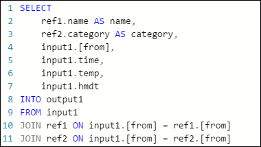
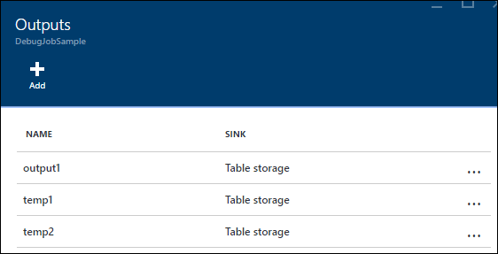

# 使用 SELECT INTO 语句调试查询

在实时数据处理中，掌握查询过程中数据的状态是十分有用的。 由于可以多次读取 Azure 流分析作业的输入或步骤，因此可以编写额外的 SELECT INTO 语句。 这样做会将中间数据输出至存储，并允许你检查数据的正确性，就如调试程序时的监视变量一样。

## 使用 SELECT INTO 检查数据流

下列 Azure 流分析作业中的示例查询具有一个流输入、两个引用数据输入和一个向 Azure 表存储的输出。 查询联接数据中心和两个引用 Blob 中的数据，以获取名称和类别信息：

请注意，虽然作业正在运行，但在输出中未生成任何事件。 在“监视”磁贴上，可以看见输入正在生成数据，但不知道 JOIN 的哪个步骤导致所有事件被删除。

在此情况下，可添加几个额外的 SELECT INTO 语句，用于“记录”中间 JOIN 结果，以及从输入中读取的数据。

此示例中添加了两个新的“临时输出”。 可任意选择你喜欢的接收器。 此处使用 Azure 存储作为示例：

然后，可以重写查询，如下所示：

现在再次启动作业，并运行数分钟。 查询 temp1 和 temp2 通过 Visual Studio 云资源管理器生成下列各表：

**temp1 表**

**temp2 表**

可以看到，temp1 和 temp2 都拥有数据，且 temp2 中正确填充了名称列。 但是，由于输出中没有数据，因此存在问题：

通过数据采样，几乎可以确定此问题与第二个 JOIN 有关。 可以从 Blob 下载并查看引用数据：

可以看到，此引用数据中的 GUID 的格式与 temp2 中 [来自] 列的格式不同。 这就是数据无法按预期到达 output1 的原因。

可以修复数据格式，将其上传至引用 Blob，然后再重新尝试：

此时，输出中的数据按预期格式化和填充。

## 获取帮助

如需进一步的帮助，请尝试我们的 [Azure 流分析论坛](https://social.msdn.microsoft.com/Forums/home?forum=AzureStreamAnalytics)。

## 后续步骤

* [Azure 流分析简介](stream-analytics-introduction.md)
* [Azure 流分析入门](stream-analytics-get-started.md)
* [缩放 Azure 流分析作业](stream-analytics-scale-jobs.md)
* [Azure 流分析查询语言参考](https://msdn.microsoft.com/library/azure/dn834998.aspx)
* [Azure 流分析管理 REST API 参考](https://msdn.microsoft.com/library/azure/dn835031.aspx)
