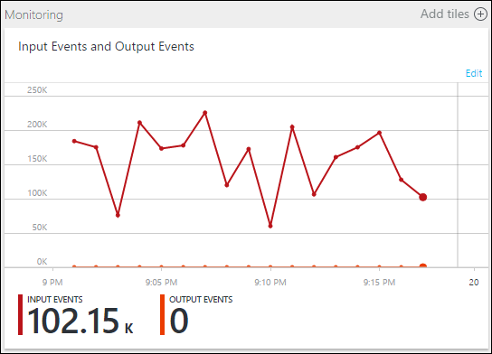
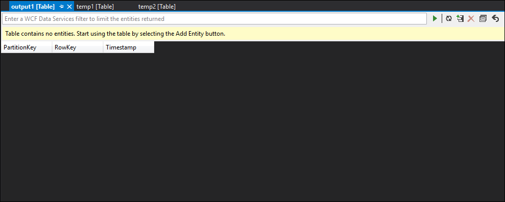

# Azure 流分析查询的故障排除

本文介绍开发流分析查询的常见问题以及如何进行故障排除。

## 查询未生成预期输出 
1.  通过本地测试检查错误：
    - 在“查询”选项卡上，选择“测试”   。 使用下载的示例数据[测试查询](stream-analytics-test-query.md)。 检查并尝试修正所有错误。   
    - 还可以使用适用于 Visual Studio 的流分析工具[直接针对实时输入测试查询](stream-analytics-live-data-local-testing.md)。

2.  如果使用了 [Timestamp By  ](https://msdn.microsoft.com/library/azure/mt573293.aspx)，请验证事件的时间戳是否大于[作业开始时间](stream-analytics-out-of-order-and-late-events.md)。

3.  避免常犯的错误，例如：
    - 查询中的一个 [WHERE  ](https://msdn.microsoft.com/library/azure/dn835048.aspx) 子句筛选掉了所有事件，从而阻止生成输出。
    - [CAST  ](https://msdn.microsoft.com/azure/stream-analytics/reference/cast-azure-stream-analytics) 函数失败，导致作业失败。 为了避免类型强制转换失败，请改用 [TRY_CAST  ](https://msdn.microsoft.com/azure/stream-analytics/reference/try-cast-azure-stream-analytics)。
    - 使用窗口函数时，请等待整个窗口持续时间完成，以查看查询中的输出。
    - 事件的时间戳要先于作业开始时间，因此事件将被删除。

4.  确保按预期方式配置事件排序策略。 转到“设置”，选择“[事件排序](stream-analytics-out-of-order-and-late-events.md)”   。 使用“测试”  按钮测试查询时，不会  应用此策略。 这是在浏览器中测试与在生产中运行作业之间的一个差别。 

5. 使用审核和诊断日志进行调试：
    - 使用[审核日志](../azure-resource-manager/resource-group-audit.md)，并进行筛选以识别和调试错误。
    - 使用[作业诊断日志](stream-analytics-job-diagnostic-logs.md)识别和调试错误。

## 作业消耗过多的流单元
确保利用 Azure 流分析中的并行化。 可以学习通过配置输入分区和调整分析查询定义来[使用查询并行化对流分析作业进行缩放](stream-analytics-parallelization.md)。

## 逐步调试查询

在实时数据处理中，掌握查询过程中数据的状态是十分有用的。 由于可以多次读取 Azure 流分析作业的输入或步骤，因此可以编写额外的 SELECT INTO 语句。 这样做会将中间数据输出至存储，并允许你检查数据的正确性，就如调试程序时的监视变量一样  。

下列 Azure 流分析作业中的示例查询具有一个流输入、两个引用数据输入和一个向 Azure 表存储的输出。 查询联接数据中心和两个引用 Blob 中的数据，以获取名称和类别信息：

请注意，虽然作业正在运行，但在输出中未生成任何事件。 在“监视”  磁贴上，可以看见输入正在生成数据，但不知道 JOIN 的哪个步骤导致所有事件被删除  。

 
在此情况下，可添加几个额外的 SELECT INTO 语句，用于“记录”中间 JOIN 结果，以及从输入中读取的数据。

此示例中添加了两个新的“临时输出”。 可任意选择你喜欢的接收器。 此处使用 Azure 存储作为示例：

然后，可以重写查询，如下所示：

现在再次启动作业，并运行数分钟。 查询 temp1 和 temp2 通过 Visual Studio 云资源管理器生成下列各表：

**temp1 表**

**temp2 表**

可以看到，temp1 和 temp2 都拥有数据，且 temp2 中正确填充了名称列。 但是，由于输出中没有数据，因此存在问题：

通过数据采样，几乎可以确定此问题与第二个 JOIN 有关。 可以从 Blob 下载并查看引用数据：

可以看到，此引用数据中的 GUID 的格式与 temp2 中 [来自] 列的格式不同。 这就是数据无法按预期到达 output1 的原因。

可以修复数据格式，将其上传至引用 Blob，然后再重新尝试：

此时，输出中的数据按预期格式化和填充。

## 获取帮助

如需进一步的帮助，请尝试我们的 [Azure 流分析论坛](https://www.azure.cn/support/contact/)。

## 后续步骤

* [Azure 流分析简介](stream-analytics-introduction.md)
* [Azure 流分析入门](stream-analytics-real-time-fraud-detection.md)
* [缩放 Azure 流分析作业](stream-analytics-scale-jobs.md)
* [Azure 流分析查询语言参考](https://msdn.microsoft.com/library/azure/dn834998.aspx)
* [Azure 流分析管理 REST API 参考](https://msdn.microsoft.com/library/azure/dn835031.aspx)