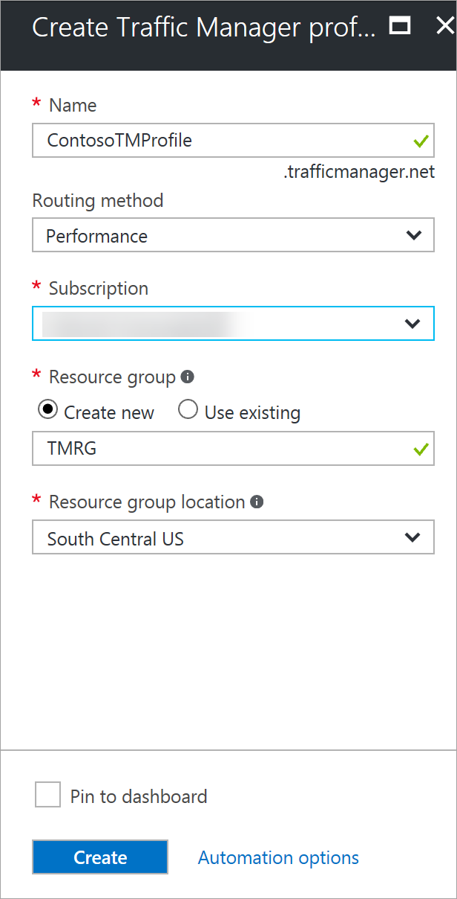
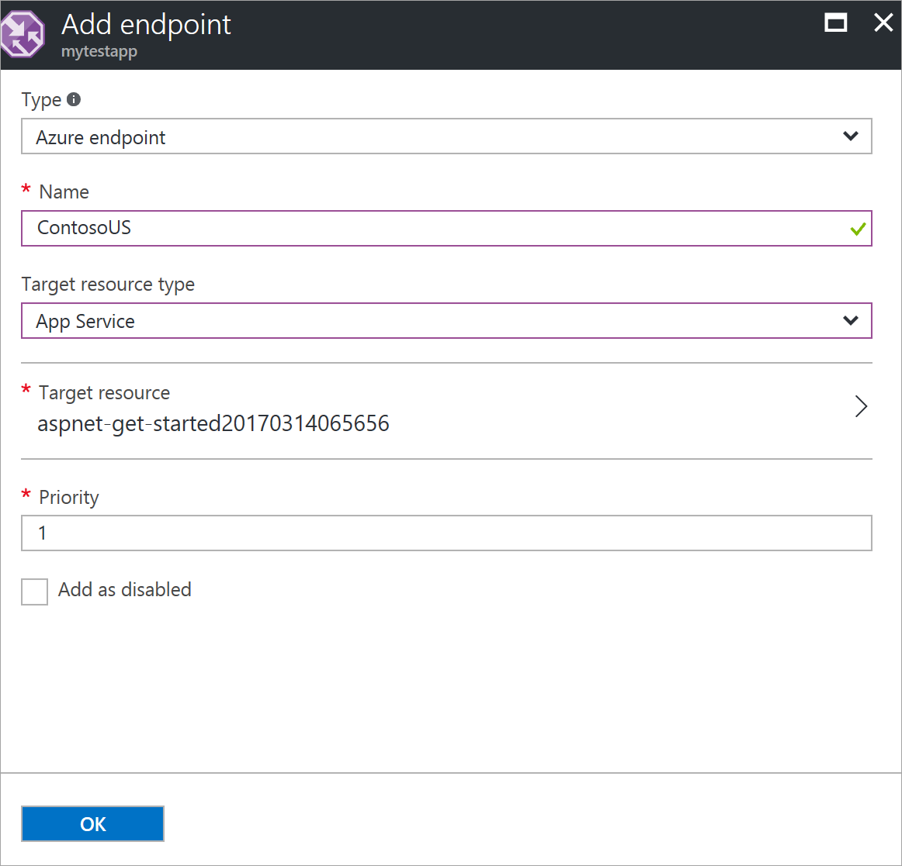

# 创建流量管理器配置文件

本文介绍如何创建“优先级”路由类型的配置文件以将用户路由到两个 Azure Web 应用终结点。 通过使用“优先级”路由类型，所有流量将路由到第一个终结点，而第二个终结点将保留为备份。 因此，如果第一个终结点处于不正常状态，则可以将用户路由到第二个终结点。

在本文中，两个以前创建的 Azure Web 应用终结点将关联到这个新创建的流量管理器配置文件。 若要详细了解如何创建 Azure Web 应用终结点，请访问[“Azure Web 应用文档”页](/app-service-web/)。 可以添加任何具有 DNS 名称且可通过公共 Internet 访问的终结点，例如，我们将使用 Azure Web 应用终结点。

### 创建流量管理器配置文件
1. 在浏览器中，登录 [Azure 门户](http://portal.azure.cn)。 如果还没有帐户，可注册 [1 个月期限的试用版](https://www.azure.cn/pricing/1rmb-trial/)。 
2. 在“中心”菜单上，单击“新建” > “网络” > “全部查看”，单击“流量管理器配置文件”，打开“创建流量管理器配置文件”边栏选项卡，然后单击“创建”。
3. 在“创建流量管理器配置文件”边栏选项卡上，按如下所示完成输入：
    1. 在**名称**中，提供配置文件的名称。 此名称必须在 trafficmanager.cn 区域中唯一，并将生成 DNS 名称 (\<name\>.trafficmanager.cn)，该名称用于访问流量管理器配置文件。
    2. 在**路由方法**中，选择“优先级”路由方法。
    3. 在**订阅**中，选择要创建此配置文件的订阅
    4. 在**资源组**中，创建新的资源组，以在其下放置此配置文件。
    5. 在**资源组位置**中，选择资源组的位置。 此设置指的是资源组的位置，对将全局部署的流量管理器配置文件没有影响。
    6. 单击“创建” 。
    7. 流量管理器配置文件的全局部署完成后，它将在相应的资源组中作为资源之一列出。

## 添加流量管理器终结点

1. 在门户的搜索栏中，搜索在前面部分中创建的**流量管理器配置文件**名称，然后在显示的结果中单击该流量管理器配置文件。
2. 在“流量管理器配置文件”边栏选项卡的“设置”部分中，单击“终结点”。
3. 在显示的“终结点”边栏选项卡中，单击“添加”。
4. 在“添加终结点”边栏选项卡中，按如下所示完成输入：
    1. 对于**类型**，单击“Azure 终结点”。
    2. 提供要用于识别此终结点的**名称**。
    3. 对于**目标资源类型**，单击“应用服务”。
    4. 对于**目标资源**，单击“选择应用服务”以显示同一订阅下的 Web 应用列表。 在显示的“资源”边栏选项卡中，选取要添加为第一个终结点的应用服务。
    5. 对于**优先级**，选为 **1**。 如果此终结点处于正常状态，这会导致所有流量转到此终结点。
    6. 使“添加为已禁用”保持未选中状态。
    7. 单击 **“确定”**
5.    对于下一个 Azure Web 应用终结点重复步骤 3 和步骤 4。 确保添加该终结点时将其**优先级**值设为 **2**。
6.    添加完这两个终结点后，这两个终结点将显示在“流量管理器配置文件”边栏选项卡中，并且其监视状态为“联机”。

## 使用流量管理器配置文件
1.    在门户的搜索栏中，搜索在前面部分中创建的**流量管理器配置文件**名称。 在显示的结果中，单击流量管理器配置文件。
2. 在“流量管理器配置文件”边栏选项卡中，单击“概述”。
3. “流量管理器配置文件”边栏选项卡会显示新建的流量管理器配置文件的 DNS 名称。 任何客户端（例如，通过使用 Web 浏览器导航到客户端）均可使用此名称来路由到由路由类型确定的相应终结点。 在这种情况下，所有请求均会路由到第一个终结点，如果流量管理器检测到其处于不正常状态，则流量会自动故障转移到下一终结点。

## 删除流量管理器配置文件
当不再需要时，删除资源组和已创建的流量管理器配置文件。 为此，请从“流量管理器配置文件”边栏选项卡中选择该资源组，然后单击“删除”。

## 后续步骤

- 详细了解[路由类型](traffic-manager-routing-methods.md)。
- 详细了解[终结点类型](traffic-manager-endpoint-types.md)。
- 详细了解[终结点监视](traffic-manager-monitoring.md)。
