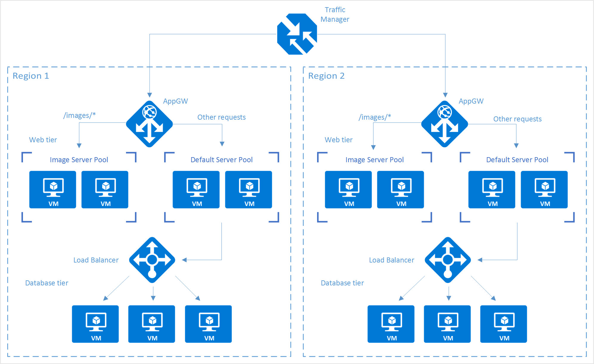
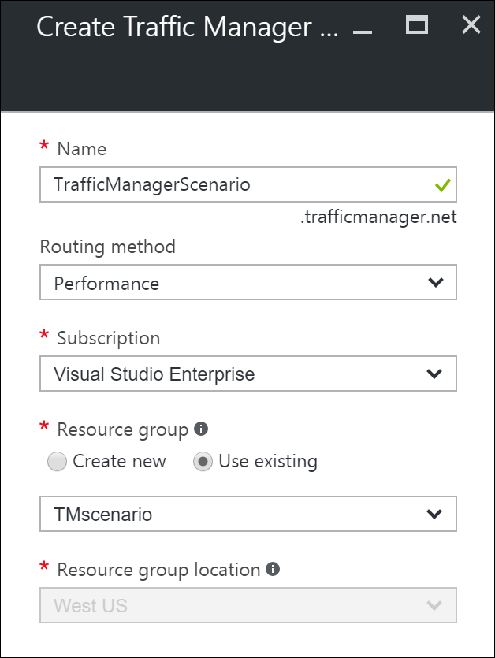
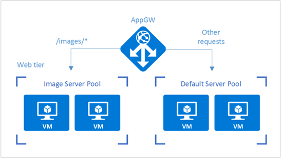
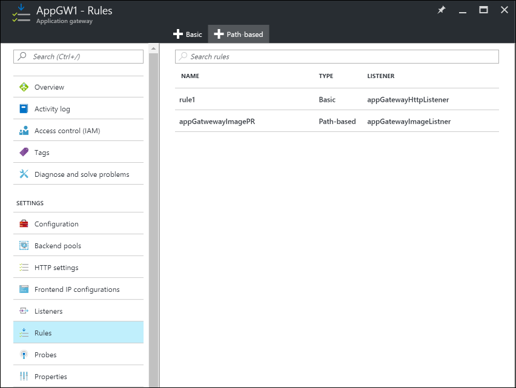
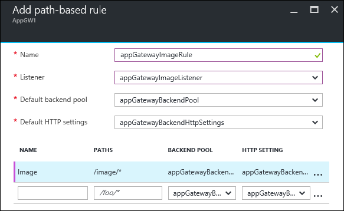
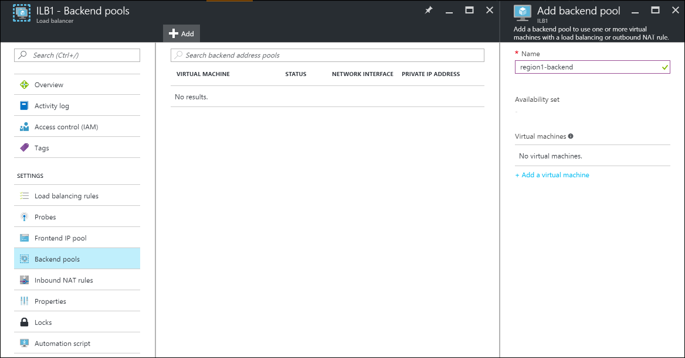
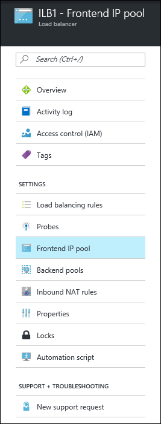

# 在 Azure 中使用负载均衡服务

## 介绍

Azure 提供多种服务用于管理网络流量的分发和负载均衡方式。可以单独使用这些服务，或者根据需要结合使用这些服务提供的方法来构建优化解决方案。

在本教程中，我们首先定义一个客户用例，探讨如何使用以下 Azure 负载均衡产品组合实现更稳健、更高效的解决方案：流量管理器、应用程序网关和负载均衡器。然后，逐步说明如何创建一种地理冗余的、可将流量分发到 VM 且有助于管理各类请求的部署。

从概念上讲，其中的每个服务在负载均衡层次结构中都扮演着不同的角色。

* **流量管理器**提供全局 DNS 负载均衡。它将查找传入的 DNS 请求，并根据客户选择的路由策略使用正常的终结点进行响应。路由方法选项包括：
  * 性能路由 - 根据延迟将请求者发送到最近的终结点。
  * 优先级路由 - 将所有流量定向到一个终结点，其他终结点作为备份。
  * 加权轮循机制路由 - 根据分配给每个终结点的权重进行流量分布。

  客户端直接连接到该终结点。当某个终结点运行不正常时，Azure 流量管理器可以检测到这种状态，然后将客户端重定向到另一个正常的实例。请参阅 [Azure 流量管理器文档](./traffic-manager-overview.md)，了解有关该服务的详细信息。
* **应用程序网关**以服务形式提供应用程序传送控制器 (ADC)，借此为应用程序提供许多第 7 层负载均衡功能。客户可以用它将 CPU 密集型 SSL 终止卸载到应用程序网关，优化 Web 场工作效率。其他第 7 层路由功能包括传入流量的轮循机制分布、基于 Cookie 的会话相关性、基于 URL 路径的路由，以及在单个应用程序网关后托管多个网站的功能。可以将应用程序网关配置为面向 Internet 的网关、仅限内部访问的网关或二者合一的网关。应用程序网关完全受 Azure 管理，可缩放且高度可用。它提供丰富的诊断和日志记录功能以改进可管理性。
* **负载均衡器**是 Azure SDN 堆栈的组成部分，为所有 UDP 和 TCP 协议提供高性能、低延迟的第 4 层负载均衡服务。它管理入站和出站连接。可以配置公共和内部负载均衡终结点，定义规则将入站连接映射到后端池目标，并在其中包含 TCP 和 HTTP 运行状况探测选项来管理服务的可用性。

## 方案

本示例方案使用一个简单的网站，该网站提供两种类型的内容：图像和动态呈现的网页。此网站必须在地理上冗余，应从最靠近用户的位置（延迟最低的位置）为用户提供服务。应用程序开发人员决定通过一个专用的 VM 池（不同于 Web 场中的其他池）来提供与模式 /images/* 匹配的所有 URL。

此外，提供动态内容的默认 VM 池需要与高可用性群集上托管的后端数据库通信。整个部署是通过 Azure Resource Manager 设置的。

使用流量管理器、应用程序网关和负载均衡器，可以在此网站中实现以下设计目标：

* **多地冗余**：如果一个区域出现故障，流量管理器会将流量无缝路由到最近的区域，无需应用程序所有者做出任何干预。
* **降低延迟**：由于流量管理器自动将客户定向到最近的区域，因此在请求网页内容时，客户遇到的延迟较低。
* **独立的可伸缩性**：由于是根据内容类型隔离 Web 应用程序工作负荷，应用程序所有者可以独立伸缩请求工作负荷。应用程序网关确保根据指定的规则以及应用程序的运行状况将流量路由到适当的池。
* **内部负载均衡**：由于是在高可用性群集的前面部署负载均衡器，因此只会向应用程序公开数据库的活动终结点和正常终结点。此外，数据库管理员可以独立于前端应用程序在群集之间分散主动和被动副本，从而优化工作负荷。负载均衡器提供与高可用性群集的连接，确保只有正常的数据库接收连接请求。

下图显示了此方案的体系结构：

  

> [!NOTE]
> 此示例只是 Azure 提供的负载均衡服务的众多可能配置之一。可以根据负载均衡需求混合搭配使用流量管理器、应用程序网关和负载均衡器。例如，如果不需要 SSL 卸载或第 7 层处理，则可以使用负载均衡器来代替应用程序网关。

## 设置负载均衡堆栈

### 步骤 1：创建流量管理器配置文件

1. 在 Azure 门户预览中，单击“新建”，然后在应用商店中搜索“流量管理器配置文件”。
2. 在“创建流量管理器配置文件”边栏选项卡中，输入以下基本信息：

  * **名称**：为流量管理器配置文件提供 DNS 前缀名称。
  * **路由方法**：选择流量路由方法策略。有关这些方法的详细信息，请参阅[关于流量管理器流量路由方法](./traffic-manager-routing-methods.md)。
  * **订阅**：选择包含配置文件的订阅。
  * **资源组**：选择包含配置文件的资源组。可以是新的或现有的资源组。
  * **资源组位置**：流量管理器服务是全局服务，不绑定到某个位置。但是，用户必须指定组的区域，其中驻留了与流量管理器配置文件关联的元数据。此位置不影响配置文件的运行时可用性。

3. 单击“创建”生成流量管理器配置文件。

    

### 步骤 2：创建应用程序网关

1. 在 Azure 门户预览的左窗格中，单击“新建”>“网络”>“应用程序网关”。
2. 输入有关应用程序网关的下述基本信息：

  * **名称** - 应用程序网关的名称。
  * **SKU 大小** - 应用程序网关的大小，可用选项包括：小型、中型和大型。
  * **实例计数**：实例的数目，其值介于 2 到 10 之间。
  * **资源组**：包含应用程序网关的资源组。可以是现有资源组，也可以是新的资源组。
  * **位置** - 应用程序网关的区域，与资源组的位置相同。位置很重要，因为虚拟网络和公共 IP 必须与网关位于同一位置。
3. 单击“确定”。
4. 定义应用程序网关的虚拟网络、子网、前端 IP 和侦听器配置。在本方案中，前端 IP 地址是**公共**地址，因此稍后可将它作为终结点添加到流量管理器配置文件中。
5. 使用以下选项之一配置侦听器：
    * 如果使用 HTTP，则无须进行任何配置。单击 **“确定”** 。
    * 如果使用 HTTPS，则需进一步配置。请参阅[创建应用程序网关](../application-gateway/application-gateway-create-gateway-portal.md)，从第 9 步开始。完成配置以后，单击“确定”。

#### 为应用程序网关配置 URL 路由

选择后端池时，使用基于路径的规则配置的应用程序网关采用请求 URL 加轮循机制分配法的路径模式。在此方案中，我们将添加基于路径的规则，将包含“/images/*”的任何 URL 定向到映像服务器池。如需详细了解如何为应用程序网关配置基于 URL 路径的路由，请参阅[为应用程序网关创建基于路径的规则](../application-gateway/application-gateway-create-url-route-portal.md)。

  

1. 从资源组转到在前面部分创建的应用程序网关实例。
2. 在“设置”下面选择“后端池”，然后选择“添加”，添加要与 Web 层后端池关联的 VM。
3. 在“添加后端池”边栏选项卡中，输入后端池的名称，以及驻留在池中的计算机的所有 IP 地址。在此方案中，我们将连接虚拟机的两个后端服务器池。

    

4. 在应用程序网关的“设置”下面选择“规则”，然后单击“基于路径”按钮添加规则。

    

5. 在“添加基于路径的规则”边栏选项卡中，提供以下信息来配置规则。

    基本设置：

    + **名称**：可在门户中访问的规则的友好名称。
    + **侦听器**：是用于规则的侦听器。
    + **默认后端池**：默认规则使用的后端池。
    + **默认 HTTP 设置**：默认规则使用的 HTTP 设置。

    基于路径的规则：

    + **名称**：基于路径的规则的友好名称。
    + **路径**：用于转发流量的路径规则。
    + **后端池**：要在此规则中使用的后端池。
    + **HTTP 设置**：要在此规则中使用的 HTTP 设置。

    > [!IMPORTANT]
    > 路径：有效的路径必须以“/”开头。只允许在末尾使用通配符“\*”。有效示例包括 /xyz、/xyz\* 或 /xyz/\*。

      

### 步骤 3：将应用程序网关添加到流量管理器终结点

在此方案中，流量管理器将连接到驻留在不同区域的应用程序网关（在前面步骤中配置）。配置应用程序网关后，下一步是将它们连接到流量管理器配置文件。

1. 打开流量管理器配置文件。若要执行此操作，请在资源组中查看，或者在“所有资源”中搜索流量管理器配置文件的名称。
2. 在左窗格中选择“终结点”，然后单击“添加”添加终结点。

    

3. 在“添加终结点”边栏选项卡中输入以下信息，创建一个终结点：

  * **类型**：选择要进行负载均衡的终结点的类型。在此方案中，请选择“Azure 终结点”，因为我们会将其连接到以前配置的应用程序网关实例。
  * **名称**：输入终结点的名称。
  * **目标资源类型** ：选择“公共 IP 地址”，然后在“目标资源”下选择以前配置的应用程序网关的公共 IP。

      

4. 现在可以通过使用流量管理器配置文件的 DNS（在本示例中为 TrafficManagerScenario.trafficmanager.cn）访问设置，对设置进行测试。测试设置时，可以重新发送请求、打开/关闭在不同区域中创建的 VM 和 Web 服务器，以及更改流量管理器配置文件设置。

### 步骤 4：创建负载均衡器

在此方案中，负载均衡器将连接从 Web 层分发到高可用性群集中的数据库。

如果高可用性数据库群集使用 SQL Server AlwaysOn，请参阅[配置一个或多个 Always On 可用性组侦听器](../virtual-machines/virtual-machines-windows-portal-sql-ps-alwayson-int-listener.md)了解分步说明。

有关配置内部负载均衡器的详细信息，请参阅[在 Azure 门户预览中创建内部负载均衡器](../load-balancer/load-balancer-get-started-ilb-arm-portal.md)。

1. 在 Azure 门户预览的左窗格中，单击“新建”>“网络”>“负载均衡器”。
2. 在“创建负载均衡器”边栏选项卡中，为负载均衡器选择一个名称。
3. 将“类型”设置为“内部”，然后选择负载均衡器要驻留到的相应虚拟网络和子网。
4. 在“IP 地址分配”下面，选择“动态”或“静态”。
5. 在“资源组”下面，选择负载均衡器的资源组。
6. 在“位置”下面，为负载均衡器选择适当的区域。
7. 单击“创建”生成负载均衡器。

#### 将后端数据库层连接到负载均衡器

1. 在资源组中，找到在前面步骤中创建的负载均衡器。
2. 在“设置”下面，单击“后端池”，然后单击“添加”添加后端池。

    

3. 在“添加后端池”边栏选项卡中，输入后端池的名称。
4. 项后端池添加单独的计算机或可用性集。

#### 配置探测

1. 在负载均衡器的“设置”下面选择“探测”，然后单击“添加”添加探测。

   

2. 在“添加探测”边栏选项卡中，输入探测的名称。
3. 选择探测的**协议**。对于数据库，可能需要使用 TCP 探测而不是 HTTP 探测。若要了解有关负载均衡器探测的详细信息，请参阅[了解负载均衡器探测](../load-balancer/load-balancer-custom-probe-overview.md)。
4. 输入访问探测时使用的数据库**端口**。
5. 在“间隔”下面，指定探测应用程序的频率。
6. 在“不正常阈值”下面，指定在将后端 VM 视为不正常之前，探测必须连续失败多少次。
7. 单击“确定”创建探测。

#### 配置负载均衡规则

1. 在负载均衡器的“设置”下面选择“负载均衡规则”，然后单击“添加”创建规则。
2. 在“添加负载均衡规则”边栏选项卡中，输入负载均衡规则的**名称**。
3. 选择“负载均衡器的前端 IP 地址”、“协议”和“端口”。
4. 在“后端端口”下面，指定要在后端池中使用的端口。
5. 选择在前面步骤中创建的、要将规则应用到其中的**后端池**和**探测**。
6. 在“会话持久性”下面，选择会话的保存方式。
7. 在“空闲超时”下面，指定经过几分钟后发生空闲超时。
8. 在“浮动 IP”下选择“已禁用”或“已启用”。
9. 单击“确定”创建规则。

### 步骤 5：将 Web 层 VM 连接到负载均衡器

现在，已在 Web 层 VM 上运行的应用程序中配置了 IP 地址和负载均衡器前端端口，可建立任何数据库连接。此配置特定于这些 VM 上运行的应用程序。若要配置目标 IP 地址和端口，请参阅应用程序文档。若要查找前端的 IP 地址，请在 Azure 门户预览中转到“负载均衡器设置”边栏选项卡上的前端 IP 池。

  

## 后续步骤

* [流量管理器概述](./traffic-manager-overview.md)
* [应用程序网关概述](../application-gateway/application-gateway-introduction.md)
* [Azure Load Balancer 概述](../load-balancer/load-balancer-overview.md)

<!---HONumber=Mooncake_1226_2016-->